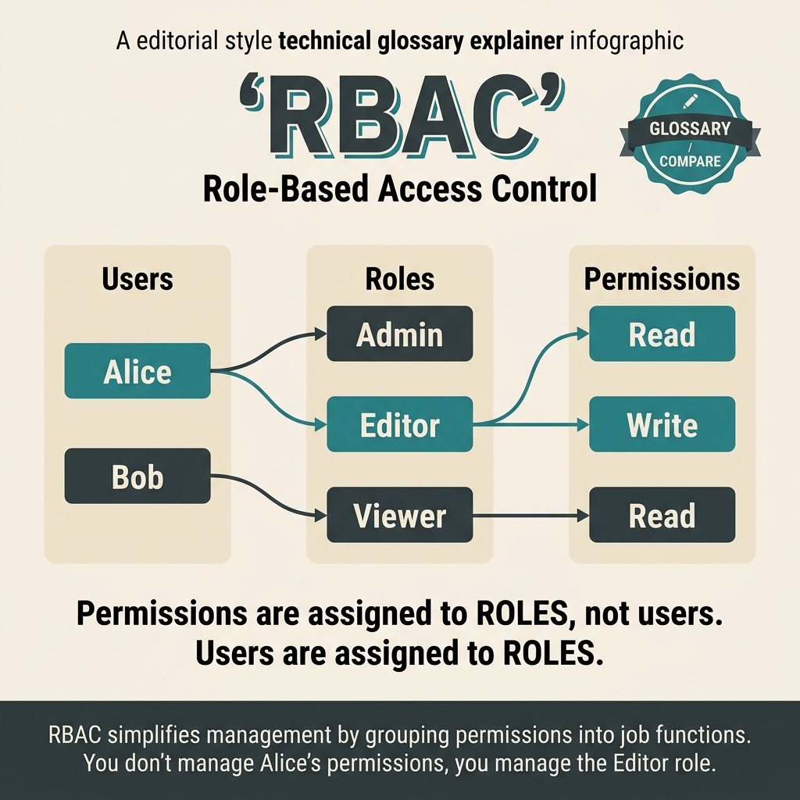

<!-- tags: glossary, reference, security-access-control, rbac -->
# RBAC

> An authorization model where users or workloads receive permissions through intermediate roles, rather than assigning each permission directly to each actor.

| Aspect | Detail |
| --- | --- |
| **Concept** | An authorization model where users or workloads receive permissions through intermediate roles, rather than assigning each permission directly to each actor. |
| **Audience** | Backend engineer, security engineer, reviewer |
| **Primary style** | Glossary term |
| **Entry point** | Use when the number of actors is larger than the number of responsibility types and the team needs an authz model that is easy to read, review, and audit. |

📅 Created: 2026-03-30 · 🔄 Updated: 2026-04-11 · ⏱️ 8 min read

---

## 1. DEFINE

Picture this: when the system was small, granting permissions per person seemed easy. Then the exception list started growing: this person can view report A, that person can edit B, another group can export C. After a few months, nobody can tell who has what permissions. The moment a role becomes the necessary intermediary layer is exactly the boundary of **RBAC**.

**RBAC** is a Role-Based Access Control model where actors receive permissions through roles that represent a stable set of responsibilities.

| Variant | Description |
| --- | --- |
| Flat RBAC | Users are assigned directly to roles; roles contain permissions. |
| Hierarchical RBAC | Roles inherit from other roles to reduce permission duplication. |
| Scoped RBAC | Roles carry scope such as tenant, project, or domain. |

| Approach | Time | Space | When to choose |
| --- | --- | --- | --- |
| Direct role mapping | O(roles per actor) | O(role assignments) | When the domain is simple and permissions are fairly stable. |
| Hierarchical roles | O(role graph) | O(role hierarchy) | When multiple roles overlap in capabilities. |
| Role + scope metadata | O(role + scope checks) | O(scope assignments) | When boundaries per tenant/project are needed. |

Core insight:

> RBAC trades flexibility for readability. It delivers the most value when job responsibilities repeat and policy needs to be easy to audit.

### 1.1 Invariants & Failure Modes

Roles must reflect real responsibilities — not exception history. The biggest failure mode is role explosion or roles becoming a disguised ACL, making policy both rigid and confusing.

---

## 2. CONTEXT

**Who uses it**: Backend engineer, security engineer, reviewer

**When**: Use when the number of actors is larger than the number of responsibility types and the team needs an authz model that is easy to read, review, and audit.

**Purpose**: RBAC trades flexibility for readability. It delivers the most value when job responsibilities repeat and policy needs to be easy to audit.

**In the ecosystem**:
- RBAC differs from direct user-permission ACLs; the role is the abstraction layer in between.
- RBAC differs from ABAC; ABAC is stronger when permissions depend on runtime context.
- RBAC does not natively handle rules like ownership, time windows, or device posture if those conditions change continuously.

---

Role-based access — that much is clear. But how do you handle role explosion, nested roles, and when to choose RBAC vs ABAC?

## 3. EXAMPLES

RBAC surfaces most clearly when every new permission creates a new role and you already have 200, when an engineer needs "admin for project A but viewer for project B" and RBAC cannot model it, or when quarterly role assignment reviews take two weeks. The examples below place the pattern in exactly those moments.

### Example 1: Basic — Group permissions by responsibility instead of by person

> **Goal**: Reduce the number of permission assignments the team must reason about manually.
> **Approach**: Create roles that reflect job responsibilities, then assign actors to those roles.
> **Example**: A support agent can view and reply to tickets; a finance analyst can read and export financial reports.
> **Complexity**: Basic


*Figure: Permissions flow through roles, not directly to actors. This intermediary layer makes policy auditable and reduces the combinatorial explosion of user-permission pairs.*

```yaml
roles:
  support_agent:
    permissions: [ticket.read, ticket.reply]
  finance_analyst:
    permissions: [invoice.read, report.export]
```

**Takeaway**: The basic level of RBAC is turning policy into a role catalog that can be read.

### Example 2: Intermediate — Separate scope from role name

> **Goal**: Prevent roles from exploding per tenant, project, or branch.
> **Approach**: Keep roles stable; move the scope of effect to assignment metadata.
> **Example**: `project_admin` in project A does not mean admin in project B.
> **Complexity**: Intermediate

```yaml
assignment:
  actor: alice
  role: project_admin
  scope: project_A
check: role + scope
```

> **Why?** If scope lives inside the role name, the number of roles grows geometrically and becomes unmanageable. Separating scope preserves RBAC's clean advantage while still providing the necessary boundary.

**Takeaway**: At the intermediate level, good RBAC is responsibility in the role, context in the assignment.

### Example 3: Advanced — Know when RBAC is no longer expressive enough

> **Goal**: Do not force every dynamic rule into a static role model.
> **Approach**: Use RBAC for baseline access; shift runtime rules to ABAC when context is what decides.
> **Example**: Approving large payments is only allowed when the business unit matches and it is during working hours.
> **Complexity**: Advanced

```yaml
access_stack:
  baseline: rbac
  dynamic_rule:
    requires:
      - business_unit_match
      - working_hours
  escalation: abac
```

> **Why?** Every exception stuffed into a role makes the role less of a "role." At some point, the model needs real context instead of more roles.

**Takeaway**: At the advanced level, RBAC should stand at the baseline layer — not become the dumping ground for every runtime condition.

---

## 4. COMPARE




*Figure: RBAC locked as an auditable baseline — roles for stable responsibilities, scope separated from role names, and a clear boundary for when runtime context starts exceeding this model's expressive power.*

RBAC is useful when the team wants to view permissions by responsibility group rather than by individual. The visual adds an important point: RBAC only retains value when roles still reflect real responsibilities and have not been turned into exception lists disguised as governance.

### Level 1

```text
actor
  -> is assigned to a role
  -> role carries permissions
  -> request is allowed if the role has that capability
```

*Figure: Level 1 shows permissions do not flow directly from the actor — they pass through the intermediary role layer.*

### Level 2

```text
many users share the same responsibility?
  -> RBAC makes sense
too many exceptions per role?
  -> reconsider scope or shift to ABAC
```

*Figure: Level 2 helps recognize when RBAC is a good baseline and when it starts overloading.*

### Easy to confuse or cross the boundary

| # | Severity | Mistake | Consequence | Fix |
| --- | --- | --- | --- | --- |
| 1 | 🔴 Fatal | Roles reflect exception history instead of real responsibilities | Policy is hard to audit, easy to over-grant | Reset roles by responsibility |
| 2 | 🟡 Common | Stuffing scope into role names | Role explosion | Separate scope into assignment or metadata |
| 3 | 🟡 Common | Forcing dynamic rules into RBAC | Model is both rigid and confusing | Use ABAC for runtime context |
| 4 | 🔵 Minor | Naming roles vaguely like `staff2`, `super_user` | Reviews are hard to reason about | Name roles by capability or responsibility |

### Quick scan

| If you encounter | What to do |
| --- | --- |
| Many actors sharing the same responsibility | RBAC is usually a good baseline |
| Roles exploding per project/tenant | Separate scope from roles |
| Rules depend on runtime context | Look at ABAC |

---

## 5. REF

| Resource | Type | Link | Notes |
| --- | --- | --- | --- |
| NIST RBAC Library | Official | https://csrc.nist.gov/projects/role-based-access-control | Foundation for RBAC model |
| OWASP Authorization Cheat Sheet | Reference | https://cheatsheetseries.owasp.org/cheatsheets/Authorization_Cheat_Sheet.html | Practical checklist for authz design |
| Open Policy Agent Docs | Reference | https://www.openpolicyagent.org/docs/latest/ | Useful when dynamic rules need to be separated from roles |

---

## 6. RECOMMEND

After RBAC locks the baseline permissions, the next question is whether exceptions should go to scope or to a more context-rich model.

| Expand to | When | Why | File/Link |
| --- | --- | --- | --- |
| ABAC | When roles start exploding due to owner, tenant, time, device posture | This is the most natural adjacent concept | [ABAC](./04-abac.md) |
| Zero Trust | When you want to place RBAC within a larger trust model | Authorization is just one layer in the access stack | [Zero Trust](./02-zero-trust.md) |
| Topic hub | When you need to return to the overall taxonomy | Keep the cluster context | [Security & Access Control](./README.md) |

Back to those 200 roles at the beginning — role explosion because every use case created a new role. Now you know: role hierarchy, permission inheritance, and periodic access review. RBAC is simple but needs governance. Without governance, it becomes a role graveyard.

**Links**: [← Previous](./02-zero-trust.md) · [→ Next](./04-abac.md)
