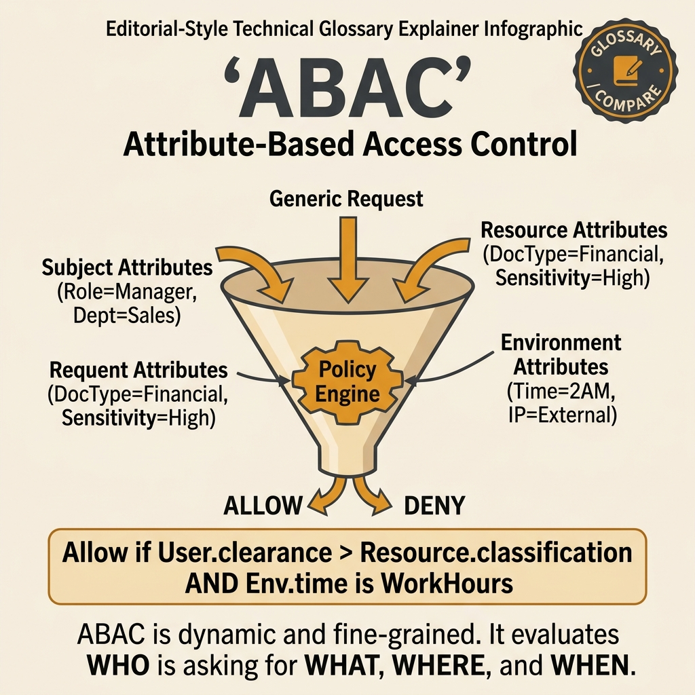

<!-- tags: glossary, reference, security-access-control, abac -->
# ABAC

> An authorization model that evaluates attributes of the subject, resource, action, and environment so the decision is made based on the current context of the request.

| Aspect | Detail |
| --- | --- |
| **Concept** | An authorization model that evaluates attributes of the subject, resource, action, and environment so the decision is made based on the current context of the request. |
| **Audience** | Security engineer, backend engineer, platform engineer |
| **Primary style** | Glossary term |
| **Entry point** | Use when access depends on owner, tenant, amount, time, device posture, or other runtime context. |

📅 Created: 2026-03-30 · 🔄 Updated: 2026-04-11 · ⏱️ 8 min read

---

## 1. DEFINE

Picture this: RBAC works beautifully for stable responsibilities. But the moment policy starts looking like "if this person is a manager, the document belongs to this tenant, the amount exceeds that threshold, and it is during business hours," every new role only solves a small corner of the problem. That is the moment **ABAC** appears.

**ABAC** is an Attribute-Based Access Control model where the access decision is computed from multiple attributes of the actor, the resource, the action, and the request environment.

| Variant | Description |
| --- | --- |
| Subject-resource ABAC | Based on attributes of the actor and resource. |
| Context-aware ABAC | Adds time, location, device posture, or risk score. |
| Policy-engine ABAC | Separates rules into an engine for better testing, auditing, and governance. |

| Approach | Time | Space | When to choose |
| --- | --- | --- | --- |
| Inline attribute checks | O(attribute eval) | O(request context) | When the system is small and rules are few. |
| Central policy engine | O(policy eval + context fetch) | O(policy + input state) | When governance and explainability are needed. |
| Hybrid RBAC + ABAC | O(role + attribute eval) | O(role + attribute state) | When you want to keep a baseline role but add context. |

Core insight:

> ABAC is not stronger than RBAC in a "more advanced" sense. It is stronger specifically for problems where context — not role membership — is what decides access.

### 1.1 Invariants & Failure Modes

Attribute vocabulary must be clear, provenance must be clear, and decisions must be explainable. The biggest failure mode is jumping into ABAC before the team agrees on which attributes are the source of truth — making policy flexible but nobody trusts the inputs.

---

## 2. CONTEXT

**Who uses it**: Security engineer, backend engineer, platform engineer

**When**: Use when access depends on owner, tenant, amount, time, device posture, or other runtime context.

**Purpose**: ABAC is not stronger than RBAC in a "more advanced" sense. It is stronger specifically for problems where context is what decides access.

**In the ecosystem**:
- ABAC differs from RBAC: RBAC asks what role the actor belongs to; ABAC asks what attributes the current request has.
- ABAC does not magically produce trustworthy data; wrong source-of-truth attributes produce wrong decisions.
- ABAC does not replace strong identity; it uses identity as one input to policy.

---

Attribute-based access — that much is clear. But how do you write ABAC policies, what is the performance overhead, and when is ABAC overkill?

## 3. EXAMPLES

ABAC surfaces most clearly when you need "user from VN, role manager, during business hours, on a managed device" and RBAC cannot model it, when the policy engine evaluates 50 attributes per request, or when policy conflicts cause unexpected denials. The examples below place the pattern in exactly those moments.

### Example 1: Basic — Add ownership and tenant context without role explosion

> **Goal**: Handle owner/tenant rules without creating a new role for every variant.
> **Approach**: Feed subject and resource attributes into the policy input.
> **Example**: A user can only edit documents they created within the same tenant.
> **Complexity**: Basic


*Figure: The access decision is not routed through a single role. Instead, subject, resource, action, and environment attributes are evaluated together by the policy engine.*

```yaml
policy_input:
  subject:
    user_id: u1
    tenant: t1
  resource:
    owner_id: u1
    tenant: t1
  action: document.update
decision: allow_if_owner_and_same_tenant
```

**Takeaway**: The basic level of ABAC typically starts with ownership and tenant checks.

### Example 2: Intermediate — Let runtime context directly affect access

> **Goal**: Do not let the same static permission apply across every context.
> **Approach**: Add time, device posture, amount, or risk score to the input.
> **Example**: Approving a large payout is only allowed when the device is compliant and it is during business hours.
> **Complexity**: Intermediate

```yaml
policy_input:
  subject:
    role: finance_manager
  resource:
    amount: 250000000
  environment:
    device_posture: compliant
    local_time: business_hours
decision: allow_if_all_conditions_match
```

> **Why?** When risk changes with context, static permissions will be too wide sometimes and too narrow other times. ABAC lets the system make decisions closer to the actual situation.

**Takeaway**: At the intermediate level, ABAC is the way to bring runtime context into allow/deny.

### Example 3: Advanced — Maintain explainability for flexible policy

> **Goal**: Do not let policy become so powerful that nobody can debug why a request was denied.
> **Approach**: Version the attribute catalog, log reason codes, and test policy before publishing.
> **Example**: The policy engine returns `deny_reason: device_not_compliant` for a blocked request.
> **Complexity**: Advanced

```yaml
policy_governance:
  attribute_catalog: versioned
  decision_logs: include_reason_codes
  test_matrix: required_before_publish
```

> **Why?** ABAC's strength is flexibility; its weakness is also flexibility. Without governance, policy becomes a black box nobody dares to touch.

**Takeaway**: At the advanced level, ABAC survives thanks to explainability and governance.

---

## 4. COMPARE




*Figure: ABAC positioned around its core problem — contextual policy: which attributes feed the decision, which attributes are trustworthy, and when flexibility starts becoming chaos.*

ABAC only delivers value when context is truly what decides permissions. The visual emphasizes attribute provenance, explainability, and the boundary with RBAC to prevent policy from becoming a black box.

### Level 1

```text
subject + resource + action + environment
  -> evaluate policy
  -> allow or deny
```

*Figure: Level 1 shows the decision does not pass through a single role — it passes through the full context of the request.*

### Level 2

```text
RBAC cannot express the exceptions?
  -> add runtime attributes
attribute vocabulary is vague?
  -> ABAC becomes a dangerous black box
```

*Figure: Level 2 reminds that ABAC is only good when attributes have meaning, have a source of truth, and can be explained.*

### Easy to confuse or cross the boundary

| # | Severity | Mistake | Consequence | Fix |
| --- | --- | --- | --- | --- |
| 1 | 🔴 Fatal | Attributes have no clear source of truth | Decisions are wrong and very hard to trace | Lock down provenance for each attribute |
| 2 | 🟡 Common | Using ABAC for every rule even when RBAC is sufficient | Policy is overkill and hard to review | Keep RBAC for baseline, ABAC for real context |
| 3 | 🟡 Common | Not logging policy decision reasons | Debugging denied requests is painful | Add reason codes |
| 4 | 🔵 Minor | Naming attributes vaguely without a catalog | Rules are hard to reuse | Version the vocabulary |

### Quick scan

| If you encounter | What to do |
| --- | --- |
| Rules depend on owner, tenant, or context | Think ABAC |
| Policy decisions are hard to explain | Add reason codes and an attribute catalog |
| Roles are exploding due to exceptions | Use hybrid RBAC + ABAC |

---

## 5. REF

| Resource | Type | Link | Notes |
| --- | --- | --- | --- |
| NIST Guide to ABAC | Official | https://www.nist.gov/publications/guide-attribute-based-access-control-abac-definition-and-considerations-1 | Foundation for ABAC |
| OWASP Authorization Cheat Sheet | Reference | https://cheatsheetseries.owasp.org/cheatsheets/Authorization_Cheat_Sheet.html | Practical checklist for authz |
| Open Policy Agent Docs | Reference | https://www.openpolicyagent.org/docs/latest/ | Popular policy engine example |

---

## 6. RECOMMEND

After ABAC enters the picture, the next question is usually: which baseline should still be handled by roles, and which tokens/claims feed the policy inputs.

| Expand to | When | Why | File/Link |
| --- | --- | --- | --- |
| RBAC | When you need to compare with a simpler model | RBAC is the adjacent baseline | [RBAC](./03-rbac.md) |
| JWT | When policy reads claims from a token | Claims are often part of ABAC input | [JWT](./06-jwt.md) |
| Topic hub | When you need to return to the big picture | Keep the cluster taxonomy | [Security & Access Control](./README.md) |

Back to that "VN, manager, business hours, managed device" at the beginning — RBAC would need a role for every combination. Now you know: ABAC evaluates attributes at runtime without pre-defining roles. Powerful for complex access control, but harder to test and audit.

**Links**: [← Previous](./03-rbac.md) · [→ Next](./05-oauth-2-oidc.md)
