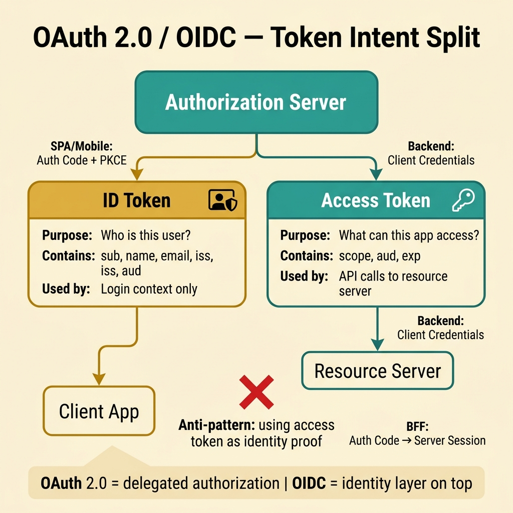
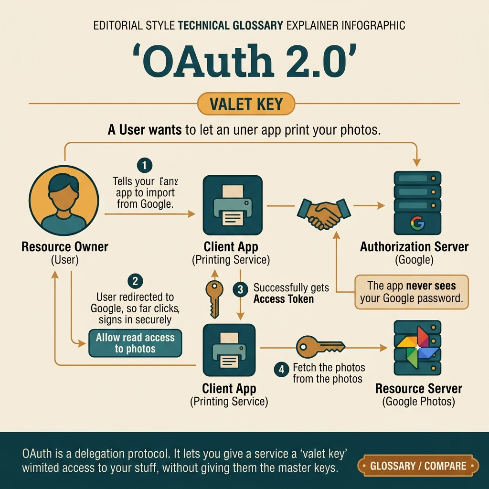

<!-- tags: glossary, reference, security-access-control, oauth-2-oidc -->
# OAuth 2.0 / OIDC

> A protocol family where OAuth 2.0 solves delegated authorization while OpenID Connect adds an identity layer and user claims on top of that flow.

| Aspect | Detail |
| --- | --- |
| **Concept** | A protocol family where OAuth 2.0 solves delegated authorization while OpenID Connect adds an identity layer and user claims on top of that flow. |
| **Audience** | Backend engineer, frontend engineer, security engineer |
| **Primary style** | Glossary term |
| **Entry point** | Use when the app needs login, delegated API calls on behalf of a user, or needs to separate the authorization server from the resource server. |

📅 Created: 2026-03-30 · 🔄 Updated: 2026-04-11 · ⏱️ 8 min read

---

## 1. DEFINE

Picture this: many teams say "use OAuth for login," then a few sprints later start confusing access tokens with ID tokens, confusing audiences, and confusing session semantics. The root of this mess is two different problems being crammed into one phrase. **OAuth 2.0** is about delegating access to resources. **OIDC** is about user identity on the same foundation. That is the boundary to lock down early.

**OAuth 2.0 / OIDC** is a protocol family where OAuth 2.0 handles delegated authorization, while OpenID Connect places a standardized authentication/identity layer on top of that flow.

| Variant | Description |
| --- | --- |
| OAuth authorization only | Focuses on access tokens and resource access. |
| OIDC login flow | Adds ID tokens, user info, and identity semantics. |
| Machine-to-machine OAuth | Client credentials for services with no end user. |

| Approach | Time | Space | When to choose |
| --- | --- | --- | --- |
| OAuth only | O(token exchange) | O(token state) | When only delegated API access is needed. |
| OAuth + OIDC | O(auth code + token exchange) | O(token + session context) | When login and API access are both needed. |
| BFF session bridge | O(auth code + session issuance) | O(server session state) | When the browser should not hold sensitive tokens for long. |

Core insight:

> OAuth 2.0 answers "which resources can this app call," while OIDC additionally answers "who is this user."

### 1.1 Invariants & Failure Modes

Tokens must have a clear audience, client flows must match trust boundaries, and the storage model must match the client type. The most common failure mode is using an access token as generic identity proof for every consumer.

---

## 2. CONTEXT

**Who uses it**: Backend engineer, frontend engineer, security engineer

**When**: Use when the app needs login, delegated API calls on behalf of a user, or needs to separate the authorization server from the resource server.

**Purpose**: OAuth 2.0 answers "which resources can this app call," while OIDC additionally answers "who is this user."

**In the ecosystem**:
- OAuth 2.0 is not an authentication protocol by itself, even though it often appears in login flows.
- OIDC is built on OAuth 2.0 but adds standardized ID tokens and identity claims.
- JWT is not synonymous with OAuth/OIDC; JWT is just a token format that can be used within this protocol family.

---

Delegated authorization — that much is clear. But which OAuth flow for which use case, what does OIDC add, and how about token management?

## 3. EXAMPLES

OAuth2/OIDC surfaces most clearly when "Login with Google" needs to be implemented, when an access token expires but the refresh token gets stolen, or when a team confuses OAuth2 (authorization) with authentication and a security gap appears. The examples below place the pattern in exactly those moments.

### Example 1: Basic — Separate the identity token from the access token

> **Goal**: Prevent the team from using one token for every purpose.
> **Approach**: Clearly document which token is for login context and which is for API access.
> **Example**: An SPA needs to know who the user is and simultaneously needs to call the Orders API.
> **Complexity**: Basic



*Figure: The authorization server issues two distinct tokens — ID token for identity context and access token for API delegation. Confusing the two is the most common OAuth/OIDC mistake.*

```yaml
token_intent:
  id_token: login_identity_context
  access_token: delegated_api_access
  anti_pattern: use_access_token_as_generic_login_proof
```

**Takeaway**: The basic level of OAuth/OIDC is separating delegated access from identity semantics.

### Example 2: Intermediate — Choose the right flow for the right client

> **Goal**: Prevent browser, mobile, and backend service from all using the same flow from an old tutorial.
> **Approach**: Map the client type to auth code + PKCE, client credentials, or BFF session bridge.
> **Example**: Browser app uses auth code + PKCE; backend service uses client credentials.
> **Complexity**: Intermediate

```yaml
client_flows:
  spa: authorization_code_pkce
  mobile_app: authorization_code_pkce
  backend_service: client_credentials
  bff: authorization_code_then_session
```

> **Why?** Each client has a different trust boundary. Choosing the wrong flow pushes secrets where the client cannot keep them or pushes refresh tokens into a boundary that is too weak.

**Takeaway**: At the intermediate level, flow selection is the primary security decision of OAuth/OIDC.

### Example 3: Advanced — Manage tokens as a complete lifecycle

> **Goal**: Prevent tokens from being used with the wrong audience, living too long, or sitting in the wrong place.
> **Approach**: Lock down short TTLs, explicit audiences, refresh strategies, and appropriate storage.
> **Example**: BFF keeps refresh tokens server-side; the browser only holds a short-lived session cookie.
> **Complexity**: Advanced

```yaml
token_lifecycle:
  access_token_ttl: short
  refresh_token_storage: server_side_only
  audience_boundaries: explicit
  id_token_usage: login_context_only
```

> **Why?** The hardest problem in OAuth/OIDC is not getting a token. The hardest problem is keeping the token for the right purpose, in the right place, and for the right duration.

**Takeaway**: At the advanced level, OAuth/OIDC succeeds when token semantics and the storage model are designed as a disciplined lifecycle.

---

## 4. COMPARE




*Figure: Clearly separating delegated access from identity semantics, then forcing the client flow and token storage to match the actual trust boundary of each client type.*

OAuth/OIDC gets confusing when the team only remembers "having a token is enough." The visual forces a return to the right questions: which token is being issued for what purpose, which client is holding it, and which boundary bears the consequences if that intent is mixed.

### Level 1

```text
browser/app
  -> authorization server
  -> receives tokens
  -> access token used to call APIs
  -> id token used to represent login identity
```

*Figure: Level 1 clearly separates the token for resource access from the token for identity context.*

### Level 2

```text
need delegated API access only?
  -> OAuth 2.0
need user identity semantics too?
  -> add OIDC
client is browser/mobile/backend?
  -> flow and storage model will differ
```

*Figure: Level 2 forces the team to choose the protocol lane by intent and the trust boundary of the client.*

### Easy to confuse or cross the boundary

| # | Severity | Mistake | Consequence | Fix |
| --- | --- | --- | --- | --- |
| 1 | 🔴 Fatal | Using access token as generic identity proof | Identity confusion and wrong audience validation | Clearly separate ID token and access token |
| 2 | 🟡 Common | Choosing flow from an old tutorial instead of by client type | Token leakage or wrong secret handling | Map flow by the client's trust boundary |
| 3 | 🟡 Common | Pushing refresh token into weak browser storage | Large blast radius on XSS/exfiltration | Prefer BFF or server-side refresh handling |
| 4 | 🔵 Minor | Mentioning OAuth/OIDC without documenting token intent | Design doc is vague, review is hard | Document which token does what |

### Quick scan

| If you encounter | What to do |
| --- | --- |
| Need delegated API access | Think OAuth 2.0 |
| Need user identity semantics for login | Add OIDC |
| Token being used for the wrong purpose | Revisit token intent and audience |

---

## 5. REF

| Resource | Type | Link | Notes |
| --- | --- | --- | --- |
| OAuth 2.0 RFC 6749 | Official | https://datatracker.ietf.org/doc/html/rfc6749 | The original RFC for OAuth 2.0 |
| OpenID Connect Core 1.0 | Official | https://openid.net/specs/openid-connect-core-1_0.html | The standard spec for OIDC |
| OAuth 2.0 for Browser-Based Apps | Official | https://datatracker.ietf.org/doc/html/rfc8252 | Useful for flow selection on public clients |

---

## 6. RECOMMEND

After locking down the login/delegation flow, the next question is usually how the token format and key material are being managed.

| Expand to | When | Why | File/Link |
| --- | --- | --- | --- |
| JWT | When you want to understand token payload, signature, and the statelessness trade-off | This is the closest adjacent artifact | [JWT](./06-jwt.md) |
| Secret Management | When client secrets or signing keys need to be kept safe | A correct protocol does not save a weak secret lifecycle | [Secret Management](./07-secret-management.md) |
| Topic hub | When you need to return to the overall taxonomy | Keep the big picture of the cluster | [Security & Access Control](./README.md) |

Back to that Login with Google at the beginning — OAuth2 or OIDC, confused. Now you know: OAuth2 = authorization delegation, OIDC = identity verification. Use Authorization Code flow for web, PKCE for SPA/mobile. The implicit flow is deprecated.

**Links**: [← Previous](./04-abac.md) · [→ Next](./06-jwt.md)
