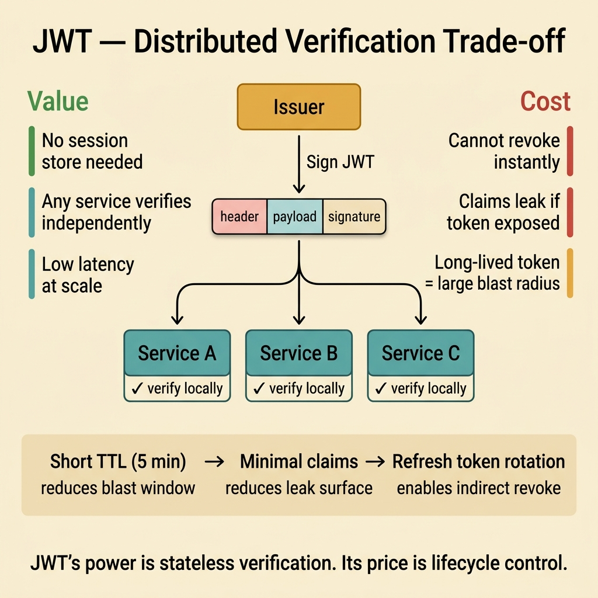

<!-- tags: glossary, reference, security-access-control, jwt -->
# JWT

> A self-contained token format carrying claims and a signature, allowing consumers to verify a payload without querying a session store on every request.

| Aspect | Detail |
| --- | --- |
| **Concept** | A self-contained token format carrying claims and a signature, allowing consumers to verify a payload without querying a session store on every request. |
| **Audience** | Backend engineer, frontend engineer, security reviewer |
| **Primary style** | Glossary term |
| **Entry point** | Use when the team needs to discuss self-contained tokens, claims, signatures, and the trade-off between distributed verification and revocation control. |

📅 Created: 2026-03-30 · 🔄 Updated: 2026-04-11 · ⏱️ 8 min read

---

## 1. DEFINE

Picture this: JWT is very attractive in design sessions because it sounds like it solves everything at once — every service can read it, no session store needed, claims flow downstream. Then one day an account needs emergency lockout, or a token leaks and stays alive for hours, and the team discovers the real cost of that convenience. **JWT** is a format, not a promise that auth will be easy.

**JWT** is a self-contained token format carrying claims and a signature, typically used to convey identity or authorization context across service boundaries.

| Variant | Description |
| --- | --- |
| Signed JWT (JWS) | Token carries a signature to guarantee integrity. |
| Encrypted JWT (JWE) | Token payload is encrypted to reduce information exposure. |
| Access-token JWT | JWT used as an access token at API or service boundaries. |

| Approach | Time | Space | When to choose |
| --- | --- | --- | --- |
| Opaque token + introspection | O(introspection call) | O(server-side token state) | When strong revocation/control is needed. |
| Short-lived JWT | O(signature verify) | O(claim size) | When fast verification at many services is needed. |
| JWT + session bridge | O(signature verify + optional session lookup) | O(session metadata) | When the browser should not hold authority for long. |

Core insight:

> JWT's value is distributed verification. Its cost is revocation and lifecycle control.

### 1.1 Invariants & Failure Modes

Consumers must verify issuer, audience, expiry, and claim semantics — not just the signature. The most common failure mode is stuffing too many permissions into a long-lived token and considering "it's signed" as sufficient security.

---

## 2. CONTEXT

**Who uses it**: Backend engineer, frontend engineer, security reviewer

**When**: Use when the team needs to discuss self-contained tokens, claims, signatures, and the trade-off between distributed verification and revocation control.

**Purpose**: JWT's value is distributed verification. Its cost is revocation and lifecycle control.

**In the ecosystem**:
- JWT is not synonymous with OAuth/OIDC; it can appear in those flows, but by itself it is just a token format.
- JWT differs from session cookies; sessions rely on server-side state, while JWT leans toward self-contained claims.
- A valid signature does not mean every claim is trusted the same way by every consumer.

---

Token with claims — that much is clear. But JWT vs opaque token, how to handle revocation, and what about oversized JWTs?

## 3. EXAMPLES

JWT surfaces most clearly when a token carries user info without querying the DB on every request, when a JWT is stolen and cannot be revoked because it is stateless, or when the payload grows too large from stuffing too many claims. The examples below place the pattern in exactly those moments.

### Example 1: Basic — Validate the token as a complete contract

> **Goal**: Do not accept a token just because the signature is valid.
> **Approach**: Verify issuer, audience, expiry, and required claims.
> **Example**: The API gateway only accepts tokens where `aud=api://orders` and `iss` matches the auth server.
> **Complexity**: Basic



*Figure: JWT enables every downstream service to verify independently — no session store round-trip. But that same statelessness makes instant revocation impossible. The trade-off must be designed, not discovered.*

```yaml
jwt_validation:
  verify_signature: true
  verify_issuer: https://auth.example.com
  verify_audience: api://orders
  verify_expiry: true
```

**Takeaway**: The basic level of JWT is validating the full token contract.

### Example 2: Intermediate — Reduce blast radius with short TTL and minimal claims

> **Goal**: If a token leaks, the scope and duration of harm should be as small as possible.
> **Approach**: Use a short TTL, narrow scope, and include only the claims downstream truly needs.
> **Example**: A 5-minute access token carrying only `sub`, `aud`, `exp`, `scope`.
> **Complexity**: Intermediate

```yaml
jwt_budget:
  ttl: 5m
  claims:
    - sub
    - aud
    - exp
    - scope
  avoid:
    - full_profile
    - internal_flags
```

**Takeaway**: At the intermediate level, a good JWT is a short, narrow, purpose-clear token.

### Example 3: Advanced — Know when not to use JWT

> **Goal**: Do not force a distributed token model where strong revocation and central control are essential.
> **Approach**: Compare the need for distributed verification against the need for revocation, permission changes, and real-time observation.
> **Example**: A sensitive admin console prefers server-side sessions or opaque tokens.
> **Complexity**: Advanced

```yaml
token_strategy:
  use_jwt_when: low_latency_distributed_verification_needed
  use_opaque_when: strong_revocation_needed
  browser_sensitive_flow: prefer_server_side_session
```

> **Why?** JWT's strength is not needing to query the auth server constantly. For the same reason, it is weaker at centralized revocation and control.

**Takeaway**: At the advanced level, the decision to use JWT or not is a lifecycle decision — not just a format choice.

---

## 4. COMPARE


*Figure: JWT positioned at its core trade-off: fast distributed verification, but harder revocation and control if the token lives long and claims are too broad.*

JWT is attractive because any service can verify it independently. The visual pulls focus to the real cost: lifecycle control, blast radius, and full token contract validation — not just checking the signature.

### Level 1

```text
issuer signs the token
  -> client presents the token
  -> service verifies signature and claims
  -> service accepts if audience, expiry, issuer all match
```

*Figure: Level 1 shows that the signature is only half the problem; claim validation is what determines whether the token is within boundary.*

### Level 2

```text
need low-latency distributed verification?
  -> JWT is a better fit
need instant revocation and central control?
  -> opaque token or session model is usually more appropriate
```

*Figure: Level 2 places JWT in its trade-off rather than treating it as the default best choice for every auth flow.*

### Easy to confuse or cross the boundary

| # | Severity | Mistake | Consequence | Fix |
| --- | --- | --- | --- | --- |
| 1 | 🔴 Fatal | Only verifying signature, skipping issuer/audience/expiry | Wrong-boundary tokens get accepted | Validate the full token contract |
| 2 | 🟡 Common | Stuffing too many sensitive claims into the token | Information leakage and increased coupling | Reduce claim set to the minimum needed |
| 3 | 🟡 Common | Using long-lived JWT in browser storage | Large blast radius when the token leaks | Short TTL or use BFF/session bridge |
| 4 | 🔵 Minor | Calling every token in the system a JWT | Design discussion becomes vague | Document token type and purpose explicitly |

### Quick scan

| If you encounter | What to do |
| --- | --- |
| Need self-contained signed claims | JWT is a candidate |
| Need strong revocation and central control | Consider opaque token or session |
| Token is too long with too many claims | Reduce blast radius first |

---

## 5. REF

| Resource | Type | Link | Notes |
| --- | --- | --- | --- |
| JWT RFC 7519 | Official | https://datatracker.ietf.org/doc/html/rfc7519 | The standard spec for JWT |
| OWASP JSON Web Token Cheat Sheet | Reference | https://cheatsheetseries.owasp.org/cheatsheets/JSON_Web_Token_for_Java_Cheat_Sheet.html | Practical security checklist |
| OAuth 2.0 Security Best Current Practice | Official | https://datatracker.ietf.org/doc/html/draft-ietf-oauth-security-topics | Places JWT in the OAuth stack's threat model |

---

## 6. RECOMMEND

After JWT is positioned correctly, the next question is which protocol flow it sits in and how its signing key is being managed.

| Expand to | When | Why | File/Link |
| --- | --- | --- | --- |
| OAuth 2.0 / OIDC | When JWT appears in login or API flows | The token format alone does not explain protocol semantics | [OAuth 2.0 / OIDC](./05-oauth-2-oidc.md) |
| Secret Management | When signing keys need to be kept safe and rotated | A correct format does not save a weak key lifecycle | [Secret Management](./07-secret-management.md) |
| RBAC / ABAC | When claims are mapped to permissions | Tokens do not replace a policy model | [RBAC](./03-rbac.md), [ABAC](./04-abac.md) |

Back to that stolen token at the beginning — it could not be revoked because it was stateless. Now you know: short-lived access tokens (5–15 minutes) + refresh token rotation. Revoke the refresh token; the access token expires on its own. Trade-off: latency vs revocability window.

**Links**: [← Previous](./05-oauth-2-oidc.md) · [→ Next](./07-secret-management.md)
