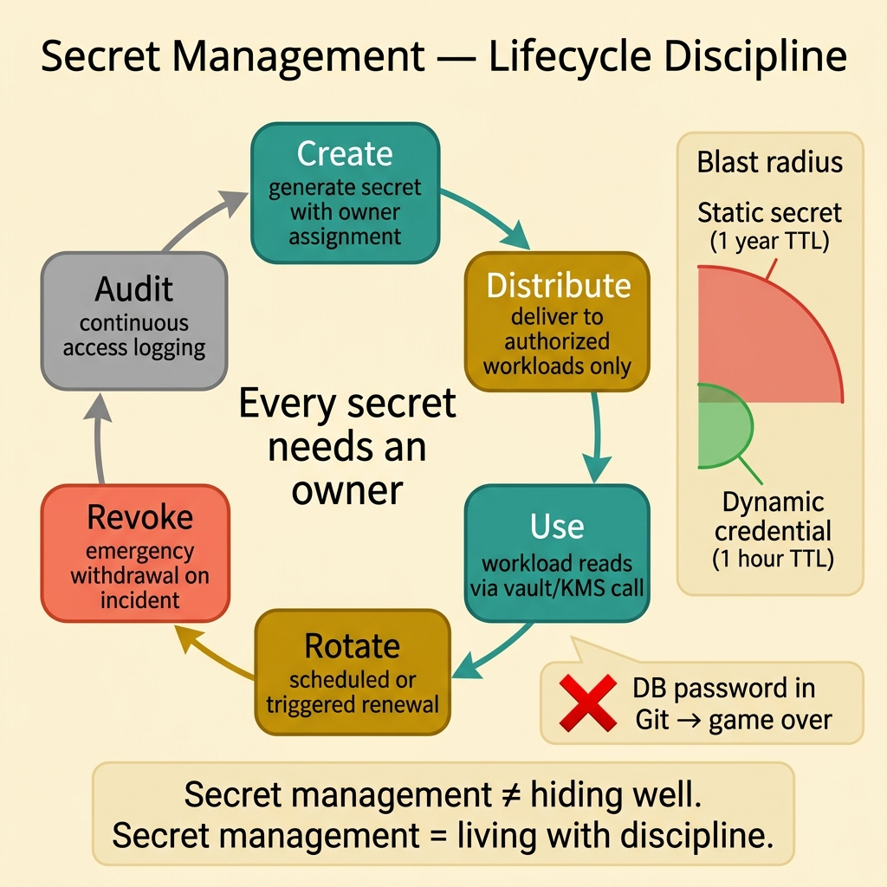
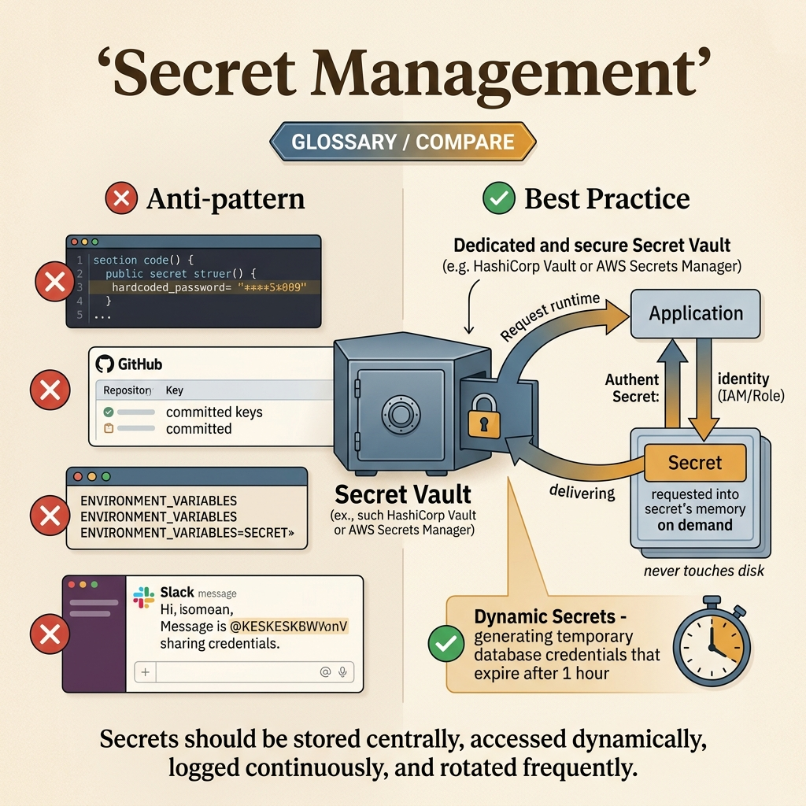

<!-- tags: glossary, reference, security-access-control, secret-management -->
# Secret Management

> The set of practices for managing secrets and key material through a full lifecycle: creation, distribution, usage, rotation, revocation, and audit.

| Aspect | Detail |
| --- | --- |
| **Concept** | The set of practices for managing secrets and key material through a full lifecycle: creation, distribution, usage, rotation, revocation, and audit. |
| **Audience** | Platform engineer, security engineer, backend engineer |
| **Primary style** | Glossary term |
| **Entry point** | Use when the team needs to discuss the lifecycle of API keys, DB credentials, signing keys, or certificate secrets — not just where to store them. |

📅 Created: 2026-03-30 · 🔄 Updated: 2026-04-11 · ⏱️ 8 min read

---

## 1. DEFINE

Picture this: a secret sitting in an environment variable can still be extremely dangerous. It may have no owner, no rotation date, nobody knows which services are reading it, and when it leaks nobody knows where to change it first. The real problem is not "which file to hide it in." The problem is that the credential is living an uncontrolled life. That is the boundary of **Secret Management**.

**Secret Management** is the set of practices for storing, distributing, rotating, revoking, and auditing secrets such as API keys, passwords, signing keys, and certificate material.

| Variant | Description |
| --- | --- |
| Static secrets | Long-lived credentials rotated on a schedule or manually. |
| Dynamic secrets | Credentials issued temporarily via lease or session. |
| Managed key material | Keys managed by a KMS, vault, or control plane. |

| Approach | Time | Space | When to choose |
| --- | --- | --- | --- |
| Environment variables only | O(secret read) | O(secret count) | When the system is small and basic hygiene is in place. |
| Central secret manager | O(secret fetch/lease) | O(secret metadata) | When audit, ownership, and access control need to be clearer. |
| Dynamic ephemeral credentials | O(issue + renew) | O(lease state) | When you want to reduce blast radius if a secret is exposed. |

Core insight:

> Secret management is not a problem of "hiding well." It is a problem of "living with discipline."

### 1.1 Invariants & Failure Modes

Every secret must have an owner, clear readers, a clear TTL/rotation plan, and an audit trail. The biggest failure mode is pushing a secret into an env var and calling it done — then when it leaks, there is no inventory to work from.

---

## 2. CONTEXT

**Who uses it**: Platform engineer, security engineer, backend engineer

**When**: Use when the team needs to discuss the lifecycle of API keys, DB credentials, signing keys, or certificate secrets — not just where to store them.

**Purpose**: Secret management is not a problem of "hiding well." It is a problem of "living with discipline."

**In the ecosystem**:
- Secret management differs from config management; secrets have different sensitivity and rotation needs than regular config.
- Secret management differs from IAM policy; IAM decides who can read a secret, but does not replace the secret lifecycle.
- Secret management is directly related to JWT signing keys, client secrets, DB credentials, and certificate material.

---

Centralized secret management — that much is clear. But how does automatic rotation work, how do you detect secret leaks, and Vault vs cloud-native?

## 3. EXAMPLES

Secret management surfaces most clearly when a DB password is hardcoded and pushed to Git, when rotating a secret takes three days because ten services share it, or when an environment variable containing a secret gets exposed in container logs. The examples below place the pattern in exactly those moments.

### Example 1: Basic — Have an inventory and owner for every secret

> **Goal**: Do not let the team be blind when a rotation or leak investigation is needed.
> **Approach**: Build an inventory of secrets, owners, and storage locations.
> **Example**: JWT signing key, DB password, and third-party API key each have a specific owner.
> **Complexity**: Basic



*Figure: Secret management is a continuous lifecycle — create, distribute, rotate, revoke, audit — not a one-time "hide it somewhere" action. Every secret must have an owner and a rotation plan.*

```yaml
secret_inventory:
  jwt_signing_key:
    owner: auth-platform
    storage: kms_or_vault
  db_password:
    owner: data-platform
    storage: secret_manager
```

**Takeaway**: The basic level of secret management is knowing which secrets you have and who is responsible for them.

### Example 2: Intermediate — Manage access boundaries and rotation cadence

> **Goal**: Do not let secrets live too long or be read by too many workloads.
> **Approach**: Lock down readers, rotation cadence, and emergency revocation for each secret.
> **Example**: Only `auth-service` reads the private signing key; the key rotates every 30 days.
> **Complexity**: Intermediate

```yaml
secret_policy:
  secret: jwt_signing_key
  readers:
    - auth-service
  rotation: every_30_days
  emergency_revoke: supported
```

**Takeaway**: At the intermediate level, secret management is reader boundaries + rotation policy.

### Example 3: Advanced — Prioritize short-lived credentials and full audit trails

> **Goal**: If a secret is exposed, the attack window must be short and there must be a trail to trace.
> **Approach**: Use dynamic credentials, short lease TTLs, and mandatory access logs.
> **Example**: A service receives DB credentials with a 1-hour TTL instead of a static password that lives for a year.
> **Complexity**: Advanced

```yaml
dynamic_secret_model:
  credential_ttl: 1h
  renew_before_expiry: true
  access_logs: mandatory
  revoke_on_incident: immediate
```

**Takeaway**: At the advanced level, good secret management reduces credential lifetime and increases observability of credential usage.

---

## 4. COMPARE




*Figure: Secret Management positioned at its core lifecycle discipline: create, distribute, rotate, revoke, and audit — rather than just asking "where to hide secrets."*

Secret management's strength is making credentials live with discipline. The visual intentionally emphasizes ownership, reader boundaries, and blast-radius control so the article is not pulled into a narrow "use Vault or env var" story.

### Level 1

```text
secret is created
  -> stored in a controlled location
  -> authorized workloads read it
  -> rotated or revoked when due or when an incident occurs
```

*Figure: Level 1 shows a secret is a continuous lifecycle, not a static file.*

### Level 2

```text
what if the secret leaks?
  -> which owner handles it
  -> which readers are affected
  -> can it be rotated/revoked quickly
```

*Figure: Level 2 turns secret management into a blast-radius reduction problem instead of a "where to hide" problem.*

### Easy to confuse or cross the boundary

| # | Severity | Mistake | Consequence | Fix |
| --- | --- | --- | --- | --- |
| 1 | 🔴 Fatal | Committing secrets to a repo or long-lived artifact | Direct credential leak | Separate secrets from source and rotate immediately if exposed |
| 2 | 🟡 Common | No inventory and no owner | Nobody knows who must rotate during an incident | Build a clear catalog of secrets and owners |
| 3 | 🟡 Common | Static secrets living too long | Large blast radius when exposed | Reduce TTL or rotate on a schedule |
| 4 | 🔵 Minor | Not auditing access | Incident investigation is blind | Enable access logs on the secret manager/KMS |

### Quick scan

| If you encounter | What to do |
| --- | --- |
| Secret sitting in a repo or env without an owner | Build an inventory immediately |
| No idea when rotation is due | Add cadence and an emergency revoke plan |
| Worried about an exposed secret living too long | Reduce TTL and prefer dynamic credentials |

---

## 5. REF

| Resource | Type | Link | Notes |
| --- | --- | --- | --- |
| OWASP Secrets Management Cheat Sheet | Reference | https://cheatsheetseries.owasp.org/cheatsheets/Secrets_Management_Cheat_Sheet.html | Practical checklist for secret lifecycle |
| HashiCorp Vault Docs | Official | https://developer.hashicorp.com/vault/docs | Popular source for dynamic secrets and lease model |
| AWS Secrets Manager Best Practices | Reference | https://docs.aws.amazon.com/secretsmanager/latest/userguide/best-practices.html | Example of managed secret lifecycle in the cloud |

---

## 6. RECOMMEND

After the secret lifecycle is positioned correctly, the next question is usually which token or protocol depends on that key material.

| Expand to | When | Why | File/Link |
| --- | --- | --- | --- |
| JWT | When the secret is a signing or verification key for tokens | This is the adjacent artifact directly dependent on secret lifecycle | [JWT](./06-jwt.md) |
| OAuth 2.0 / OIDC | When the secret is a client secret or auth server key material | The protocol lane usually sits next to the secret lane | [OAuth 2.0 / OIDC](./05-oauth-2-oidc.md) |
| Topic hub | When you need to return to the big picture | Keep the cluster taxonomy | [Security & Access Control](./README.md) |

Back to that DB password in code at the beginning — pushed to Git, public repo, game over. Now you know: centralized vault, auto-rotation, audit logs, least privilege. Secrets never belong in code. Never.

**Links**: [← Previous](./06-jwt.md) · [→ Next](./08-cors.md)
