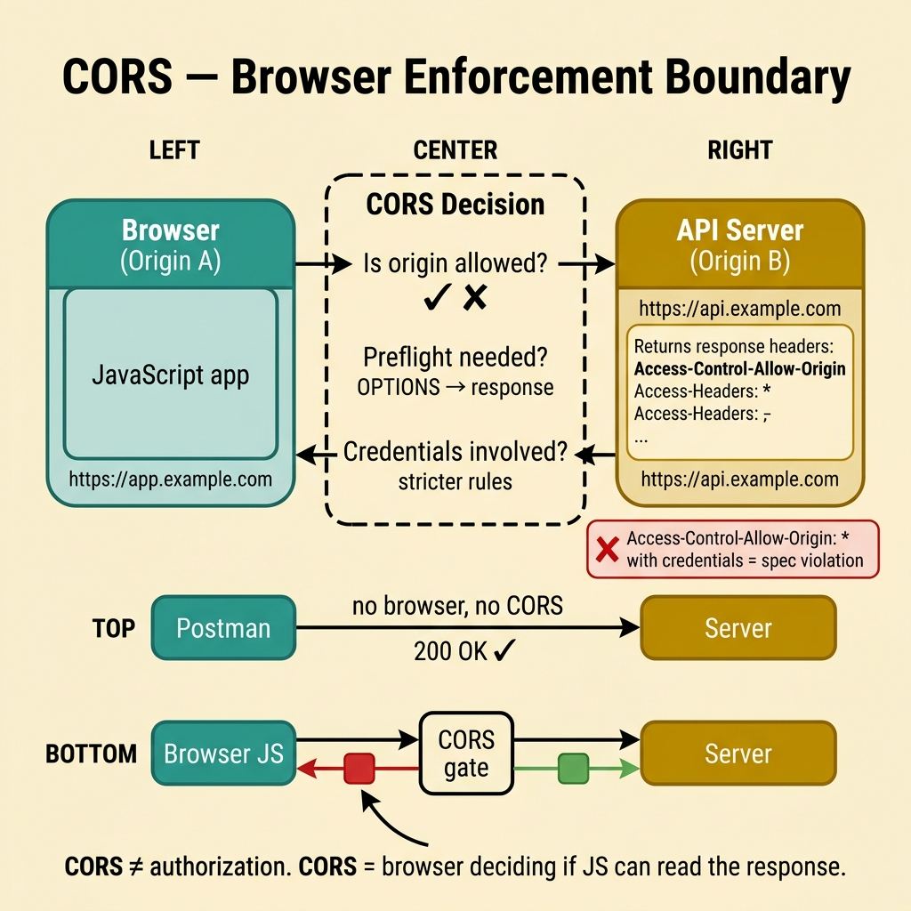

<!-- tags: glossary, reference, security-access-control, cors -->
# CORS

> A browser-enforced mechanism that decides whether JavaScript from one origin is allowed to read responses from another origin.

| Aspect | Detail |
| --- | --- |
| **Concept** | A browser-enforced mechanism that decides whether JavaScript from one origin is allowed to read responses from another origin. |
| **Audience** | Frontend engineer, backend engineer, API engineer |
| **Primary style** | Glossary term |
| **Entry point** | Use when a browser client calls an API cross-origin and the team needs to clearly separate browser policy from server authentication/authorization. |

📅 Created: 2026-03-30 · 🔄 Updated: 2026-04-11 · ⏱️ 8 min read

---

## 1. DEFINE

Picture this: Postman calls the API and returns 200 beautifully, backend logs show no auth error, but the frontend still says "blocked." This is when CORS is most often misunderstood as an auth bug. In reality, the browser is making its own separate decision: does it allow JavaScript at this origin to read a response from that other origin? That is the boundary of **CORS**.

**CORS** is a browser-enforced mechanism that decides whether JavaScript from one origin can access responses from another origin, based on response headers and preflight negotiation.

| Variant | Description |
| --- | --- |
| Simple CORS request | Browser sends the request directly if it qualifies as a simple request. |
| Preflighted request | Browser sends an `OPTIONS` request first to ask policy for more sensitive methods/headers. |
| Credentialed CORS | Cross-origin request carrying cookies/credentials with stricter constraints. |

| Approach | Time | Space | When to choose |
| --- | --- | --- | --- |
| Exact origin allowlist | O(origin match) | O(allowlist size) | When the number of trusted origins is small and fixed. |
| Environment-based policy | O(origin match + env rules) | O(policy metadata) | When dev/staging/prod have different origins. |
| Gateway-managed CORS | O(gateway check) | O(route policy) | When multiple services need a consistent policy. |

Core insight:

> CORS does not decide whether the user has business-level permission. CORS decides whether the browser exposes the response to JavaScript.

### 1.1 Invariants & Failure Modes

The origin allowlist must be clear, the credentials policy must be clear, and route sensitivity must be respected. The most common failure mode is opening a wildcard too wide "just to make it work," then expanding the attack surface while still not fixing the actual bug.

---

## 2. CONTEXT

**Who uses it**: Frontend engineer, backend engineer, API engineer

**When**: Use when a browser client calls an API cross-origin and the team needs to clearly separate browser policy from server authentication/authorization.

**Purpose**: CORS does not decide whether the user has business-level permission. CORS decides whether the browser exposes the response to JavaScript.

**In the ecosystem**:
- CORS differs from authentication/authorization; a request can be correctly authenticated but still be blocked by the browser.
- CORS is a browser concern; server-to-server calls are not subject to this enforcement.
- Allowing broad CORS does not replace CSRF protection, session hardening, or authz policy.

---

Cross-origin requests — that much is clear. But how does CORS differ from CSP, how dangerous is a wildcard origin, and what about preflight requests?

## 3. EXAMPLES

CORS surfaces most clearly when a frontend dev sees a "CORS error" and asks backend to fix it, when `Access-Control-Allow-Origin: *` is set on a production API, or when preflight OPTIONS requests add latency to every call. The examples below place the pattern in exactly those moments.

### Example 1: Basic — Separate browser policy from business authorization

> **Goal**: Do not debug CORS as an authorization bug.
> **Approach**: Determine whether the request fails in the browser policy or fails at business permission.
> **Example**: Postman succeeds, browser is blocked because `Access-Control-Allow-Origin` is missing.
> **Complexity**: Basic



*Figure: CORS is enforced by the browser, not by the server. A request can be authenticated and authorized at the server level but still blocked by the browser's cross-origin policy. This separation is the #1 source of CORS debugging confusion.*

```yaml
diagnosis:
  postman_call: success
  browser_call: blocked_before_response_visible
  likely_issue: cors_policy
```

**Takeaway**: The basic level of CORS is knowing you are fixing a browser policy boundary — not a business permission.

### Example 2: Intermediate — Design the allowlist and credentials correctly

> **Goal**: Do not use a wildcard carelessly, especially when cookies or credentials are involved.
> **Approach**: Allow only the exact origins, methods, and headers that are truly needed.
> **Example**: `https://admin.example.com` calls a session-based API, so `*` must not be used.
> **Complexity**: Intermediate

```yaml
cors_policy:
  allowed_origins:
    - https://admin.example.com
  allow_credentials: true
  allowed_methods:
    - GET
    - POST
    - PATCH
  allowed_headers:
    - Content-Type
    - X-Request-ID
```

**Takeaway**: At the intermediate level, good CORS is an exact allowlist + clear credentials policy.

### Example 3: Advanced — Centralize policy while respecting route sensitivity

> **Goal**: Keep policy consistent across multiple services without flattening every API into the same rule.
> **Approach**: Set defaults at the gateway and override per route group with intent.
> **Example**: Public docs API allows broader origins; admin routes allow only one internal origin.
> **Complexity**: Advanced

```yaml
gateway_cors:
  defaults:
    allowed_origins:
      - https://app.example.com
  route_overrides:
    /public/docs:
      - https://docs.example.com
    /admin/*:
      - https://admin.example.com
```

**Takeaway**: At the advanced level, CORS should be managed as part of API surface governance.

---

## 4. COMPARE


*Figure: CORS locked to its browser boundary: which origin can read the response, when preflight occurs, and why a wildcard is usually "make it work" rather than real policy.*

CORS is very often debugged as an auth bug. The visual pushes focus to the right place: browser exposure policy, credentials rules, and allowlist ownership — separating it from business authorization.

### Level 1

```text
browser app at origin A
  -> calls API at origin B
  -> browser reads response headers
  -> only exposes response to JavaScript if policy matches
```

*Figure: Level 1 shows the browser is the entity enforcing CORS — not the application code.*

### Level 2

```text
custom headers or credentials?
  -> browser sends OPTIONS preflight
  -> server/gateway returns policy
  -> actual request continues only if preflight passes
```

*Figure: Level 2 reminds that many CORS bugs happen before the main request the app is investigating even fires.*

### Easy to confuse or cross the boundary

| # | Severity | Mistake | Consequence | Fix |
| --- | --- | --- | --- | --- |
| 1 | 🔴 Fatal | Setting `Access-Control-Allow-Origin: *` indiscriminately | Cross-origin surface opens too wide | Only allow exact origins that are needed |
| 2 | 🟡 Common | Confusing CORS with an authorization bug | Fixing the wrong layer, extended debugging | Separate browser policy from business permission |
| 3 | 🟡 Common | Using wildcard with credentials | Policy violates spec or does not work as expected | Use explicit origins when credentials are involved |
| 4 | 🔵 Minor | Distributing CORS config with no owner | Policy drift, every route has a different rule | Centralize at the gateway or shared middleware |

### Quick scan

| If you encounter | What to do |
| --- | --- |
| Postman works but browser fails | Think CORS first |
| Cookies or credentials going cross-origin | Use exact origin, never `*` |
| Multiple services each configuring headers differently | Move policy to a shared gateway/middleware |

---

## 5. REF

| Resource | Type | Link | Notes |
| --- | --- | --- | --- |
| MDN CORS Guide | Official | https://developer.mozilla.org/en-US/docs/Web/HTTP/CORS | The most readable source for browser behavior and preflight |
| Fetch Standard | Official | https://fetch.spec.whatwg.org/ | The foundational spec for fetch/CORS semantics |
| OWASP CORS Misconfiguration | Reference | https://owasp.org/www-community/attacks/CORS_OriginHeaderScrutiny | Common security cases when CORS is misconfigured |

---

## 6. RECOMMEND

After locking the browser boundary clearly, the next question is usually which auth flow goes through the browser and which credentials participate in that request.

| Expand to | When | Why | File/Link |
| --- | --- | --- | --- |
| OAuth 2.0 / OIDC | When the browser auth flow is tied to login/token handling | Browser boundary and auth flow often collide | [OAuth 2.0 / OIDC](./05-oauth-2-oidc.md) |
| JWT | When the browser is presenting an access token | CORS does not replace token semantics | [JWT](./06-jwt.md) |
| Topic hub | When you need to return to the overall taxonomy | Keep the big picture of the cluster | [Security & Access Control](./README.md) |

Back to that CORS error at the beginning — frontend dev frustrated, backend adds `*`. Now you know: whitelist specific origins, credential mode requires an explicit origin (no wildcard), cache preflight with `Access-Control-Max-Age`. CORS is a gate, not an obstacle.

**Links**: [← Previous](./07-secret-management.md) · [→ Next](./README.md)
