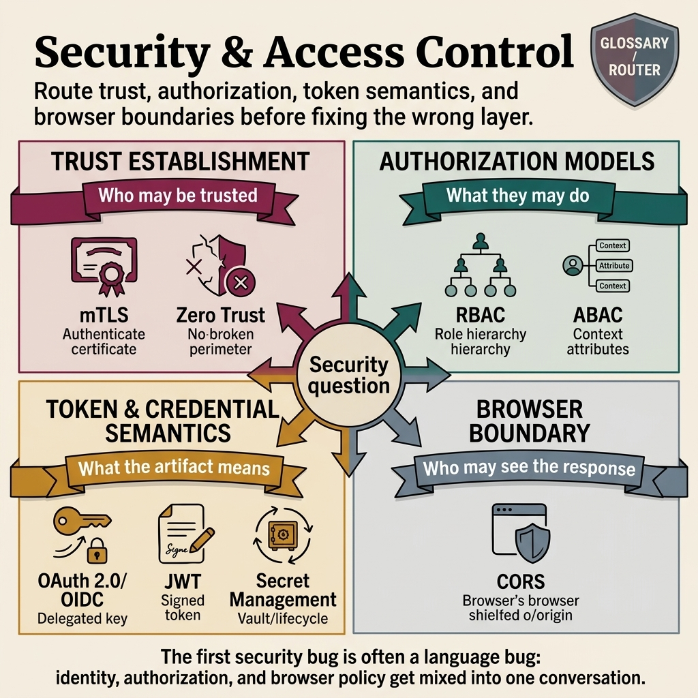

<!-- tags: glossary, reference, security-access-control, overview -->
# Security & Access Control

> A cluster of terms that helps teams answer three different questions that are constantly blended together: who do we trust, what permission logic do we apply, and which boundary enforces that rule.

| Aspect | Detail |
| --- | --- |
| **Concept** | A cluster of terms that helps teams answer three different questions that are constantly blended together: who do we trust, what permission logic do we apply, and which boundary enforces that rule. |
| **Audience** | Backend engineer, security reviewer, platform engineer |
| **Primary style** | Glossary hub router |
| **Entry point** | Open when the team is debating auth, tokens, roles, browser policy, or secrets but has not yet locked the actual layer of the problem. |

📅 Created: 2026-03-30 · 🔄 Updated: 2026-04-11 · ⏱️ 7 min read

---

## 1. DEFINE

Picture this: in a real security bug, the team rarely lacks technical skill. What they usually lack is boundary clarity. One person says "re-authenticate," another says "add a role," a third fixes `Access-Control-Allow-Origin`, while the actual incident started because a secret leaked or a token was being used with the wrong audience. This README exists to route those conversations to the right lane before someone fixes the wrong layer.

**Security & Access Control** is a cluster of terms covering trust establishment, authorization models, token/credential semantics, and browser/control-surface policy.

| Variant | Description |
| --- | --- |
| Trust establishment | `mTLS` and `Zero Trust` answer who is trusted and based on what evidence. |
| Authorization models | `RBAC` and `ABAC` answer, once identity is established, what permission logic applies. |
| Token and credential semantics | `OAuth 2.0 / OIDC`, `JWT`, and `Secret Management` answer what tokens/secrets are for and how they live. |
| Browser and edge controls | `CORS` answers whether the browser is allowed to expose a response to JavaScript from another origin. |

| Approach | Time | Space | When to choose |
| --- | --- | --- | --- |
| Route by trust question | O(1) route | O(1) | When the issue is about handshake, perimeter, or internal trust. |
| Route by permission logic | O(1) route | O(1) | When identity exists but the team has not locked the permission model. |
| Route by artifact/boundary | O(1) route | O(1) | When the debate revolves around tokens, secrets, or browser policy. |

Core insight:

> Many security bugs live far too long simply because the team uses the same word to discuss three different layers: identity, authorization, and control surface.

### 1.1 Signals & Boundaries

- If the question is "is this caller really a legitimate workload," start with `mTLS`.
- If the question is "should internal network still be trusted by default," start with `Zero Trust`.
- If the question is "should permissions be named by role or by context," open `RBAC` and `ABAC`.
- If the question is "is this token for login or for API calls," open `OAuth 2.0 / OIDC` and `JWT`.
- If the question is "where is this key stored, how long does it live, who can read it," open `Secret Management`.
- If only the browser fails while curl/Postman works, open `CORS`.

### Coverage Map

| Entry | Role | Notes |
| --- | --- | --- |
| [mTLS](01-mtls.md) | Trust at connection layer | Locks the question of which workload can open a channel |
| [Zero Trust](02-zero-trust.md) | Trust philosophy | Locks the question of why "inside" is no longer sufficient proof |
| [RBAC](03-rbac.md) | Baseline authz model | Locks the question of whether permissions follow stable responsibilities |
| [ABAC](04-abac.md) | Context-rich authz model | Locks the question of whether runtime context determines permissions |
| [OAuth 2.0 / OIDC](05-oauth-2-oidc.md) | Login/delegation protocol family | Locks the boundary between delegated access and identity |
| [JWT](06-jwt.md) | Token format semantics | Locks the trade-off between statelessness and control |
| [Secret Management](07-secret-management.md) | Credential lifecycle | Locks the idea that a secret is a lifecycle, not just a storage location |
| [CORS](08-cors.md) | Browser policy | Locks the boundary between browser rules and business authorization |

---

## 2. VISUAL




*Figure: Router map clearly separating the four conversation layers that are easily blended: trust establishment, authorization model, token or credential semantics, and browser boundary.*

This hub is most useful when used as a router for reviews and incidents: before discussing tools or tokens, lock the correct layer of the security question that is actually slipping.

### Level 1

```text
Question starts with...
  "Who do we trust?"           -> trust establishment
  "What is allowed?"           -> authorization model
  "What proof is being carried?" -> token / secret semantics
  "Can the browser expose it?" -> browser control surface
```

*Figure: Level 1 separates security conversations by the actual question type — not by familiar buzzwords.*

### Level 2

```text
If the symptom is...                                   Open which file first
-------------------------------------------            ------------------------------------------
Internal workload should not be trusted by default     Zero Trust
Need to authenticate service-to-service on the channel mTLS
Roles are exploding due to exceptions                  ABAC
Login and token semantics are being mixed              OAuth 2.0 / OIDC
Token is signed but revocation is very hard            JWT
Secret sits in env with no owner                       Secret Management
Postman works but the browser fails                    CORS
```

*Figure: Level 2 routes by actual operational symptoms, because the same word "auth" can lead to four different lanes.*

---

## 3. CODE

This hub should be used as a worksheet for diagnosing the correct lane before proposing a solution.

### Problem 1: Basic — Name the correct problem layer before fixing

> **Goal**: Eliminate most cross-layer arguments in security reviews.
> **Approach**: Force every issue to be named as trust, authz, token/secret, or browser policy.
> **Example**: "Browser is blocked" must not enter the RBAC lane; "internal service needs identity" must not enter the CORS lane.
> **Complexity**: Basic

```yaml
triage_router:
  trust_question:
    - 01-mtls.md
    - 02-zero-trust.md
  authorization_question:
    - 03-rbac.md
    - 04-abac.md
  token_or_secret_question:
    - 05-oauth-2-oidc.md
    - 06-jwt.md
    - 07-secret-management.md
  browser_question:
    - 08-cors.md
```

**Takeaway**: Security discussions improve dramatically when the team locks the correct lane before choosing the correct tool.

### Problem 2: Intermediate — Read the cluster following the trust flow logic

> **Goal**: Help readers see the relationships between terms instead of learning them in isolation.
> **Approach**: Move from trust foundation → authorization → artifacts and control surfaces.
> **Example**: A reviewer needs to reset their mental model to audit a new auth architecture.
> **Complexity**: Intermediate

```yaml
learning_path:
  establish_trust:
    - 01-mtls.md
    - 02-zero-trust.md
  decide_permissions:
    - 03-rbac.md
    - 04-abac.md
  carry_identity_and_credentials:
    - 05-oauth-2-oidc.md
    - 06-jwt.md
    - 07-secret-management.md
  enforce_browser_boundary:
    - 08-cors.md
```

> **Why?** Identity without policy is insufficient. Policy without token semantics easily crosses boundaries. Browser rules read as authz easily get fixed in the wrong place.

**Takeaway**: At the intermediate level, this hub becomes a logic map of the entire access stack.

### Problem 3: Advanced — Use the hub as a vocabulary contract for the team

> **Goal**: Keep ADRs, incident write-ups, reviews, and runbooks speaking the same language.
> **Approach**: Every security proposal must state which lane it is changing and why the other lanes are not the root cause.
> **Example**: A reviewer blocks a PR "adding JWT for better security" because the real issue lies in secret rotation.
> **Complexity**: Advanced

```yaml
review_gate:
  require:
    - issue_lane_named_explicitly
    - boundary_of_control_named
    - adjacent_lane_ruled_out
  reject_if:
    - "using token terminology to discuss an authz model"
    - "using browser policy to discuss business permission"
    - "using a trust primitive to replace authorization"
```

> **Why?** Shared vocabulary is a soft control. If the language is wrong, the architecture follows.

**Takeaway**: At the advanced level, this hub is a glossary contract for the entire team — not just a summary page.

---

## 4. PITFALLS

By this point the topic cluster is fairly clear. The most common slippage is applying the right name but at the wrong depth or across the wrong boundary.

| # | Severity | Mistake | Consequence | Fix |
| --- | --- | --- | --- | --- |
| 1 | 🔴 Fatal | Blending identity, authorization, and browser policy into one conversation | Fixing the wrong layer, opening a new attack surface | Route the issue through this hub first |
| 2 | 🟡 Common | Choosing a term by familiar keyword instead of by symptom | Reading the right file but crossing the wrong boundary | Start with the actual operational question |
| 3 | 🟡 Common | Jumping straight to protocol/token before locking trust and policy | Auth stack has the right tool but the wrong model | Follow the cluster's learning path |
| 4 | 🔵 Minor | Reading terms in isolation without cluster relationships | Fragmented mental model | Return to this README to re-route |

---

## 5. REF

| Resource | Type | Link | Notes |
| --- | --- | --- | --- |
| OWASP Cheat Sheet Series | Reference | https://cheatsheetseries.owasp.org/ | Practical foundation for many lanes in this cluster |
| NIST SP 800-207 | Official | https://csrc.nist.gov/pubs/sp/800/207/final | Systems-level view for trust and access |
| OpenID Connect Core | Official | https://openid.net/specs/openid-connect-core-1_0.html | Source of truth for the protocol/identity lane |

---

## 6. RECOMMEND

After locking the lane, the next step is to move to the adjacent term in the same trust flow — not to jump to a word that sounds "more secure."

| Expand to | When | Why | File/Link |
| --- | --- | --- | --- |
| mTLS | When the issue is machine identity and connection channel | This is the most concrete trust primitive in the cluster | [mTLS](./01-mtls.md) |
| RBAC | When identity exists but permission logic is not decided | This is the baseline authz model to compare with ABAC | [RBAC](./03-rbac.md) |
| OAuth 2.0 / OIDC | When the app is mixing login and delegated access | This is the most appropriate entry point for the token/protocol lane | [OAuth 2.0 / OIDC](./05-oauth-2-oidc.md) |

---

## 7. QUICK REF

| If you encounter | Open |
| --- | --- |
| Need to authenticate service-to-service on the channel | [mTLS](./01-mtls.md) |
| Internal network is no longer trustworthy enough | [Zero Trust](./02-zero-trust.md) |
| Roles are exploding due to exceptions | [ABAC](./04-abac.md) |
| Login and token semantics are being mixed | [OAuth 2.0 / OIDC](./05-oauth-2-oidc.md) |
| Token is signed but revoke/control is still hard | [JWT](./06-jwt.md) |
| Secret has no owner or rotation | [Secret Management](./07-secret-management.md) |
| Postman works but browser fails | [CORS](./08-cors.md) |

**Links**: [← Previous](../README.md) · [→ Next](./01-mtls.md)
