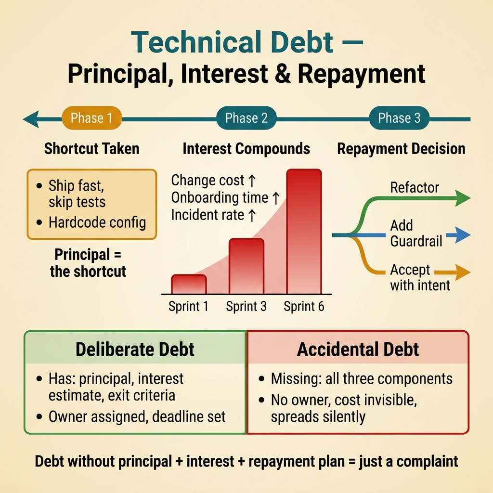
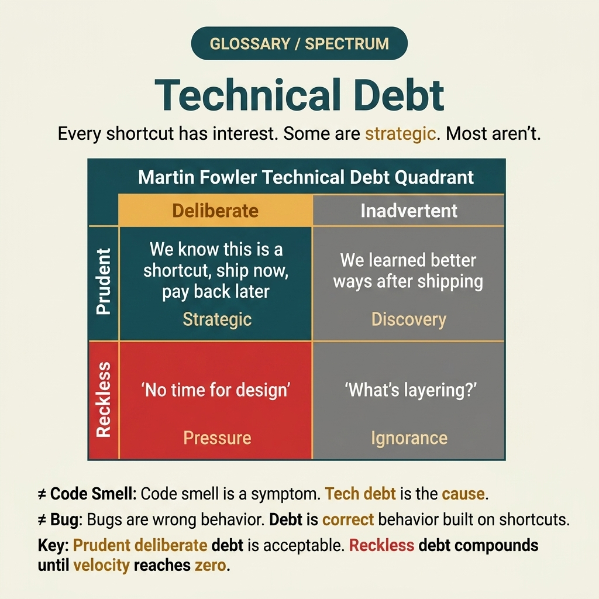

<!-- tags: glossary, reference, software-engineering-fundamentals, technical-debt -->
# Technical Debt

> The accumulated cost of shortcuts taken in code and architecture — a "debt" that must eventually be repaid through refactoring, hardening, or process changes.

| Aspect | Detail |
| --- | --- |
| **Concept** | The accumulated cost of shortcuts taken in code and architecture — a "debt" that must eventually be repaid through refactoring, hardening, or process changes. |
| **Audience** | Reviewer, tech lead, developer who needs to use this term within the correct boundary |
| **Primary style** | Glossary term |
| **Entry point** | Use when the concept of **Technical Debt** needs to be named correctly in a review, ADR, or incident note. |

📅 Created: 2026-03-30 · 🔄 Updated: 2026-04-11 · ⏱️ 5 min read

---

## 1. DEFINE

You are in the middle of a code review or writing an ADR. Someone says: "this is **Technical Debt**." If the room understands that word in three different ways, the discussion will drift away from the actual technical problem. This glossary term exists to lock the boundary before the team decides whether to refactor, accept a trade-off, or change policy.

**Technical Debt** is the accumulated cost of shortcuts taken in code and architecture — a "debt" that must eventually be repaid through refactoring, hardening, or process changes.

Bugs, feature gaps, and refactoring tasks are not synonymous with technical debt.

| Variant | Description |
| --- | --- |
| Deliberate Debt | A shortcut taken intentionally to meet a deadline, with an accepted obligation to pay it back later. |
| Accidental Debt | Lack of knowledge or missing guardrails causes code quality to degrade unintentionally. |
| Interest-bearing Debt | Initially small debt that causes change cost and incident rates to increase over time. |

| Approach | Time | Space | When to choose |
| --- | --- | --- | --- |
| Debt log | O(1) | O(1) | When vague observations need to become backlog items with an owner and due date. |
| Refactor slice by slice | Per scope | Per scope | When debt should be paid down gradually without stopping delivery. |
| Guardrail first | O(1) | O(1) | When debt recurs because the process is weaker than any single code file. |

Core insight:

> Technical debt is only useful as a term when it identifies a specific principal, interest, and repayment decision; otherwise it is just a polite way of saying "the code feels bad."

### 1.1 Invariants & Failure Modes

A good glossary term must maintain these invariants:
- Technical Debt must refer to the same class of phenomena or decision in all related documents;
- the term must be accompanied by evidence, not just a feeling;
- Technical Debt must lead to a clear next action: continue reviewing, refactor, harden, or accept intentionally.

The most common failure mode is labeling everything "technical debt" with no owner, no deadline, and no root cause. At that point the team neither fixes the system nor legitimately accepts the state — they just rationalize poor quality with a term that sounds reasonable.

---

## 2. CONTEXT

**Who uses it**: Reviewer, tech lead, developer who needs to use this term within the correct boundary

**When**: Use when the concept of **Technical Debt** needs to be named correctly in a review, ADR, or incident note.

**Purpose**: Technical debt is only useful as a term when it identifies a specific principal, interest, and repayment decision; otherwise it is just a polite way of saying "the code feels bad."

**In the ecosystem**:
When using the term **Technical Debt**, always attach it to a specific boundary: module, review workflow, runtime signal, or operational policy. Without a boundary, the reader hears a buzzword rather than a decision aid.

---

Everyone knows about technical debt. But when is debt a deliberate investment, when is it an accident, and how do you measure whether the debt is growing?

## 3. EXAMPLES

Technical debt surfaces most clearly when the team says "just ship it and fix later" but never goes back, when every new feature takes twice as long because legacy code is tangled, or when onboarding a new dev takes three weeks instead of three days. The examples below place the pattern in exactly those moments.

### Example 1: Basic — Label technical debt in a PR to avoid emotional arguments

> **Goal**: Create a short note so the entire team uses **Technical Debt** with the same meaning in a PR or review.
> **Approach**: Use a structured YAML note to force the term to come with a summary, boundary, and next step instead of a bare buzzword.
> **Example**: A reviewer wants to say "this is Technical Debt" without leaving an opinionated comment.
> **Complexity**: Basic — turn vocabulary into a clear artifact before deeper debate.



*Figure: Technical debt mirrors financial debt — a principal (the shortcut), compounding interest (rising change cost), and a repayment decision (refactor, harden, or accept). Debt without these three components is just a complaint.*

```yaml
term: 01-technical-debt
title: "Technical Debt"
decision_context: "PR or design review needs to name Technical Debt correctly to lock the boundary before further debate."
use_when:
  - "Need to lock the meaning of the term before the team debates further"
  - "Want to attach the term to a specific technical boundary"
not_when:
  - "Actual impact or relevant boundary has not been identified yet"
summary: "The accumulated cost of shortcuts taken in code and architecture — debt that must eventually be repaid through refactoring, hardening, or process changes."
next_step: "Open adjacent terms if Technical Debt needs to be distinguished from similar concepts."
```

**Why?** Even as a basic example, the structured note is valuable because it forces the writer to prove they are actually talking about **Technical Debt**, not a vague feeling of discomfort. Simply forcing boundary and next step into writing eliminates a great deal of noise in discussions.

**Takeaway**: When Technical Debt comes with a clear artifact, reviews focus on changeability and real boundaries instead of stopping at engineering slogans.

### Example 2: Intermediate — Separate technical debt from bugs and feature requests in the backlog

> **Goal**: Distinguish **Technical Debt** from similar concepts so the backlog or design notes do not mix different types of work.
> **Approach**: Use a small review checklist to ask the right questions about boundary, evidence, and impact before accepting the term.
> **Example**: The team is about to create a ticket or ADR comment and needs to know which term should be the primary vocabulary.
> **Complexity**: Intermediate — trade-offs and risk classification require clearer mechanism explanation.

```yaml
review_question: "Is this actually Technical Debt or just a symptom that looks similar?"
boundary:
  system_area: "service / module / runtime / review comment"
  observable_impact:
    - "change cost"
    - "design clarity"
    - "operational behavior"
comparison:
  this_term: "Technical Debt"
  often_confused_with: "Bugs, feature gaps, and refactoring tasks are not synonymous with technical debt."
decision:
  keep_term: true
  evidence_required:
    - "state the specific phenomenon"
    - "state the decision or risk affected"
    - "state the follow-up action if needed"
```

**Why?** This checklist forces the team to move from symptoms to mechanisms. Without comparing boundaries and evidence, a term like **Technical Debt** easily gets misused: sometimes to describe a root cause, sometimes to describe a consequence, sometimes as a purely emotional label.

**Takeaway**: The intermediate value of Technical Debt is helping tickets, reviews, and ADRs correctly classify the type of debt or hygiene that needs to be addressed first.

### Example 3: Advanced — Turn technical debt into policy instead of a slogan

> **Goal**: Elevate **Technical Debt** from shared vocabulary into a lightweight guardrail in the engineering workflow.
> **Approach**: Write a policy/checklist so that anyone using the term must identify the boundary, impact, and next action.
> **Example**: Apply to PR templates, ADR templates, or incident postmortems so the term is not used in the wrong context.
> **Complexity**: Advanced — moving from a personal note to team- or module-level governance.

```yaml
policy:
  glossary_term: "Technical Debt"
  trigger:
    - "PR review repeats the same type of comment"
    - "ADR needs to lock vocabulary to prevent misunderstanding"
    - "incident postmortem needs to distinguish the correct cause"
  owner: "tech lead or reviewer responsible for that boundary"
  checklist:
    - "State the term"
    - "State the boundary"
    - "State the impact"
    - "State the next action"
  reject_if:
    - "term is used as a buzzword"
    - "no evidence or corresponding system behavior"
```

**Why?** A term only truly lives within a team when it becomes part of the workflow — not just individual memory. This small policy turns **Technical Debt** into a language contract: anyone using the term must prove they are pointing at the same class of decision or risk.

**Takeaway**: At the advanced level, Technical Debt only has value when it can coordinate the order of debt repayment and the level of accepted risk — rather than becoming a generic complaint.

---

## 4. COMPARE




*Figure: The position of technical debt between symptom, payoff, and repayment decision — rather than just between familiar-sounding words.*

Technical debt sounds like "bad code." Not exactly: debt is a story about change cost and compounding interest, while a code smell is merely a symptom that is easier to spot on the surface.

### Level 1

```text
Rush release -> accept a shortcut at one boundary -> backlog with an owner for repayment -> later refactor or add a guardrail.
```
*Figure: Level 1 places the term **Technical Debt** into a simple decision flow so beginners know when to use this term instead of speaking vaguely.*

### Level 2

```text
If encountering...                         What signal identifies Technical Debt correctly
-----------------------------------------  ---------------------------------------------------------
Vague comment about Technical Debt          Find the specific boundary: module, policy, runtime, or related workflow
A similar term appears                      Compare Technical Debt's invariant with the easily confused concept
Need to choose an action after mentioning   Decide whether to refactor, harden, measure more, or accept the trade-off
Deliberate debt has principal + interest + exit criteria; accidental debt usually has none of those three, so cost spreads and is harder to see.
```
*Figure: Level 2 helps experienced readers see that a glossary term is not just a definition — it is a decision router for choosing the correct next action.*

### Easy to confuse or cross the boundary

| # | Severity | Mistake | Consequence | Fix |
| --- | --- | --- | --- | --- |
| 1 | 🔴 Fatal | Using **Technical Debt** as a buzzword without a boundary | Team says the same word but argues about three different issues | Always state the module, workflow, or runtime behavior the term points to |
| 2 | 🟡 Common | Mixing **Technical Debt** with similar concepts | Tickets, ADRs, or reviews get misclassified | Add a comparison line in the note or README hub before expanding scope |
| 3 | 🟡 Common | Naming the term without a next action | Glossary becomes a decorative dictionary, not a decision aid | Accompany with an action: measure more, refactor, harden, create policy, or accept trade-off |
| 4 | 🔵 Minor | Deep-linking the term without linking back to the topic hub | Reader understands the term in isolation, hard to place in a learning path | Keep the README topic and adjacent concepts in RECOMMEND / navigation at the end |

### Quick scan

| If you encounter | What to do |
| --- | --- |
| Someone uses **Technical Debt** too generically | Ask for boundary, impact, and next action before agreeing to keep the term |
| Need to deep-link quickly in a review | Link directly to this glossary file, then connect through the topic hub for broader context |
| Team is mixing up several similar terms | Open the topic hub to compare adjacent concepts before creating a ticket or ADR |

---

## 5. REF

| Resource | Type | Link | Notes |
| --- | --- | --- | --- |
| Martin Fowler | Blog | https://martinfowler.com/ | Strong source for vocabulary on design, refactoring, and architecture debt. |
| Refactoring.Guru | Reference | https://refactoring.guru/ | Useful when comparing glossary terms with similar patterns or smells. |
| The Twelve-Factor App | Official | https://12factor.net/ | Good source of truth for terms leaning toward runtime and deploy hygiene. |

---

## 6. RECOMMEND

Technical debt answers the question "why is velocity declining even though team size is constant?" The next question: what symptoms reveal the debt, and how do you pay it back?

| Expand to | When to read next | Why | File/Link |
| --- | --- | --- | --- |
| Topic hub | When **Technical Debt** needs to be placed in a larger learning path | Avoid understanding the term as an island separated from the taxonomy | [Software Engineering Fundamentals](./README.md) |
| Previous concept | When you need to return to the preceding term for boundary comparison | Useful if the discussion is sliding between two similar terms | [README](./README.md) |
| Next concept | When the current term typically leads to an adjacent decision or pattern | Helps read continuously along the concept chain of the topic | [Refactoring](./02-refactoring.md) |

Back to that "just ship it" at the beginning — six months later every feature takes twice as long. Now you know: debt is not bad if it is deliberate and has a repayment plan. What is bad is when the team does not know it is in debt, and compound interest silently eats all velocity.

**Links**: [← Previous](./README.md) · [→ Next](./02-refactoring.md)
