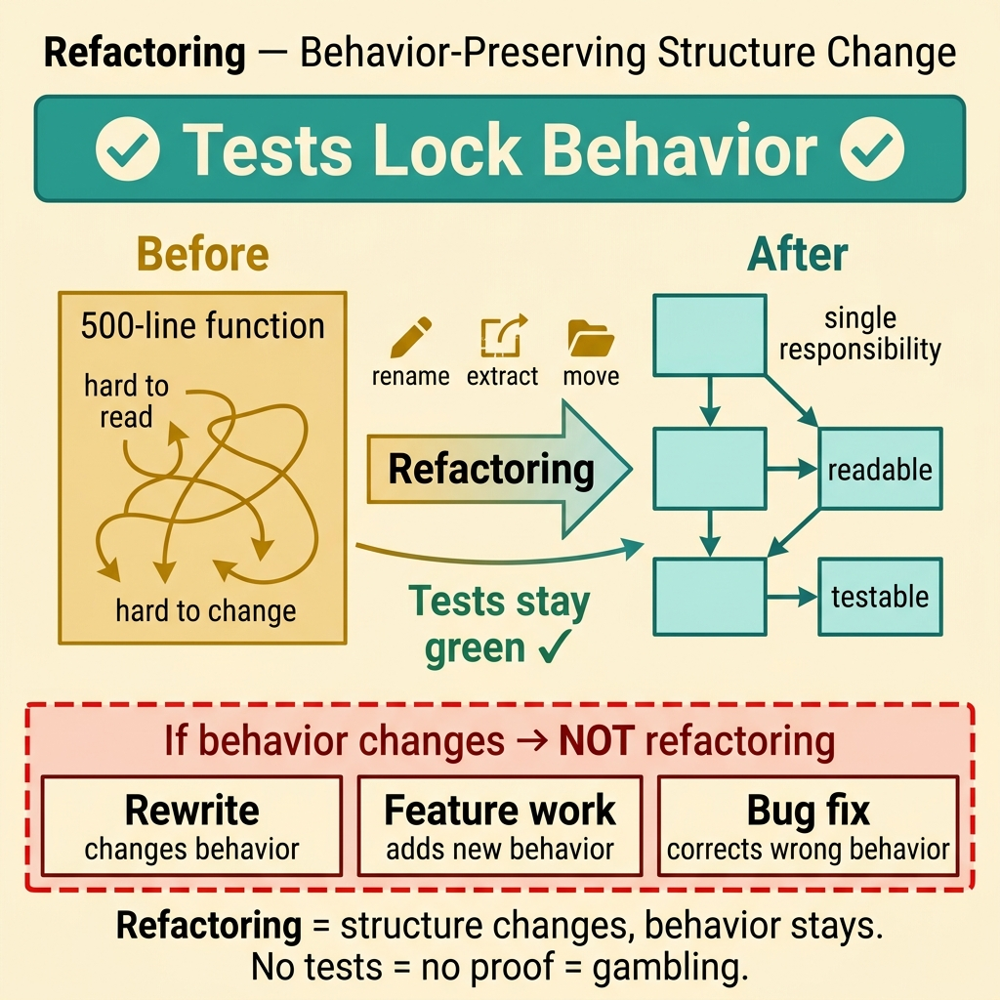
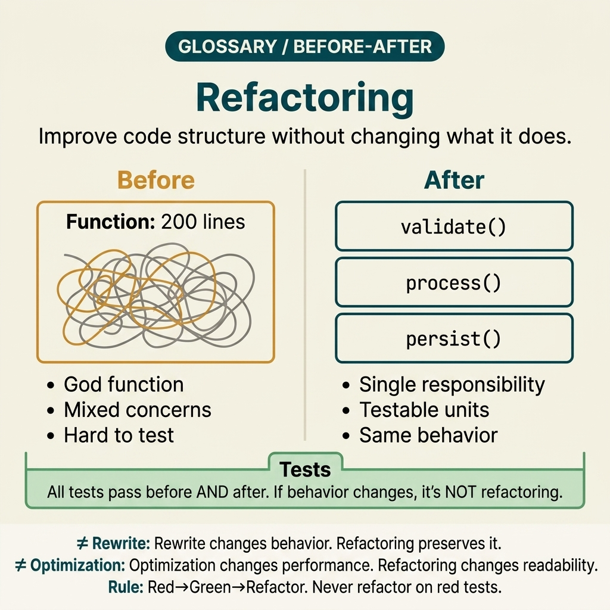

<!-- tags: glossary, reference, software-engineering-fundamentals, refactoring -->
# Refactoring

> The process of improving the internal structure of code without changing its externally observable behavior.

| Aspect | Detail |
| --- | --- |
| **Concept** | The process of improving the internal structure of code without changing its externally observable behavior. |
| **Audience** | Reviewer, tech lead, developer who needs to use this term within the correct boundary |
| **Primary style** | Glossary term |
| **Entry point** | Use when the concept of **Refactoring** needs to be named correctly in a review, ADR, or incident note. |

📅 Created: 2026-03-30 · 🔄 Updated: 2026-04-04 · ⏱️ 5 min read

---

## 1. DEFINE

You are in the middle of a code review or writing an ADR. Someone says: "this is **Refactoring**." If the room understands that word in three different ways, the discussion will drift away from the actual technical problem. This glossary term exists to lock the boundary before the team decides whether to refactor, accept a trade-off, or change policy.

**Refactoring** is the process of improving the internal structure of code without changing its externally observable behavior.

Refactoring is not a rewrite, nor is it adding a feature. It only changes internal structure while the observable behavior stays the same.

| Variant | Description |
| --- | --- |
| Micro-refactoring | Rename, extract function, move method — small changes within a single short commit. |
| Structural Refactoring | Change module boundaries, extract interfaces, change dependency direction. |
| Preparatory Refactoring | Clean up before adding a new feature so the feature code does not pile on top of old structure. |

| Approach | Time | Space | When to choose |
| --- | --- | --- | --- |
| Characterization tests first | Per test scope | Per suite | When current behavior is not locked by tests and regression is a concern. |
| Boy-scout cleanup | O(1) | O(1) | When you only want to improve the code you are already touching without expanding scope. |
| Strangler refactor | Per boundary | Per boundary | When the module is too large and needs to gradually migrate behind a new abstraction. |

Core insight:

> Refactoring succeeds when the structure improves but users, API consumers, and behavioral tests see no difference. If behavior changes, that is feature work or a bug fix — no longer pure refactoring.

### 1.1 Invariants & Failure Modes

A good glossary term must maintain these invariants:
- Refactoring must refer to the same class of phenomena or decision in all related documents;
- the term must be accompanied by evidence, not just a feeling;
- Refactoring must lead to a clear next action: continue reviewing, refactor, harden, or accept intentionally.

Refactoring fails most often when scope slides into "might as well change behavior too," or when the team has no characterization tests and loses the ability to prove the change is safe.

---

## 2. CONTEXT

**Who uses it**: Reviewer, tech lead, developer who needs to use this term within the correct boundary

**When**: Use when the concept of **Refactoring** needs to be named correctly in a review, ADR, or incident note.

**Purpose**: Refactoring succeeds when the structure improves but users, API consumers, and behavioral tests see no difference. If behavior changes, that is feature work or a bug fix — no longer pure refactoring.

**In the ecosystem**:
When using the term **Refactoring**, always attach it to a specific boundary: module, review workflow, runtime signal, or operational policy. Without a boundary, the reader hears a buzzword rather than a decision aid.

---

Improving code without changing behavior — that much is clear. But when to refactor, how far to go, and how to prove the refactor broke nothing?

## 3. EXAMPLES

Refactoring surfaces most clearly when a 500-line function makes every change terrifying, when renaming a variable causes CI to break 20 tests, or when the team wants to refactor but the PM asks "what feature comes out of this?" The examples below place the pattern in exactly those moments.

### Example 1: Basic — Lock behavior before refactoring a large function

> **Goal**: Create a short note so the entire team uses **Refactoring** with the same meaning in a PR or review.
> **Approach**: Use a structured YAML note to force the term to come with a summary, boundary, and next step instead of a bare buzzword.
> **Example**: A reviewer wants to say "this is Refactoring" without leaving an opinionated comment.
> **Complexity**: Basic — turn vocabulary into a clear artifact before deeper debate.



*Figure: Refactoring is only valid when tests lock the current behavior first. The internal structure changes, but external contracts (API, tests, user expectations) remain identical. If behavior changes, it is feature work or a bug fix.*

```yaml
term: 02-refactoring
title: "Refactoring"
decision_context: "PR or design review needs to name Refactoring correctly to lock the boundary before further debate."
use_when:
  - "Need to lock the meaning of the term before the team debates further"
  - "Want to attach the term to a specific technical boundary"
not_when:
  - "Actual impact or relevant boundary has not been identified yet"
summary: "The process of improving the internal structure of code without changing its externally observable behavior."
next_step: "Open adjacent terms if Refactoring needs to be distinguished from similar concepts."
```

**Why?** Even as a basic example, the structured note is valuable because it forces the writer to prove they are actually talking about **Refactoring**, not a vague feeling of discomfort. Simply forcing boundary and next step into writing eliminates a great deal of noise in discussions.

**Takeaway**: When Refactoring comes with a clear artifact, reviews focus on changeability and real boundaries instead of stopping at engineering slogans.

### Example 2: Intermediate — Separate refactoring from the feature branch

> **Goal**: Distinguish **Refactoring** from similar concepts so the backlog or design notes do not mix different types of work.
> **Approach**: Use a small review checklist to ask the right questions about boundary, evidence, and impact before accepting the term.
> **Example**: The team is about to create a ticket or ADR comment and needs to know which term should be the primary vocabulary.
> **Complexity**: Intermediate — trade-offs and risk classification require clearer mechanism explanation.

```yaml
review_question: "Is this actually Refactoring or just a symptom that looks similar?"
boundary:
  system_area: "service / module / runtime / review comment"
  observable_impact:
    - "change cost"
    - "design clarity"
    - "operational behavior"
comparison:
  this_term: "Refactoring"
  often_confused_with: "Refactoring is not a rewrite, nor is it adding a feature. It only changes internal structure while observable behavior stays the same."
decision:
  keep_term: true
  evidence_required:
    - "state the specific phenomenon"
    - "state the decision or risk affected"
    - "state the follow-up action if needed"
```

**Why?** This checklist forces the team to move from symptoms to mechanisms. Without comparing boundaries and evidence, a term like **Refactoring** easily gets misused: sometimes to describe a root cause, sometimes to describe a consequence, sometimes as a purely emotional label.

**Takeaway**: The intermediate value of Refactoring is helping tickets, reviews, and ADRs correctly classify the type of debt or hygiene that needs to be addressed first.

### Example 3: Advanced — Refactor a boundary without breaking external contracts

> **Goal**: Elevate **Refactoring** from shared vocabulary into a lightweight guardrail in the engineering workflow.
> **Approach**: Write a policy/checklist so that anyone using the term must identify the boundary, impact, and next action.
> **Example**: Apply to PR templates, ADR templates, or incident postmortems so the term is not used in the wrong context.
> **Complexity**: Advanced — moving from a personal note to team- or module-level governance.

```yaml
policy:
  glossary_term: "Refactoring"
  trigger:
    - "PR review repeats the same type of comment"
    - "ADR needs to lock vocabulary to prevent misunderstanding"
    - "incident postmortem needs to distinguish the correct cause"
  owner: "tech lead or reviewer responsible for that boundary"
  checklist:
    - "State the term"
    - "State the boundary"
    - "State the impact"
    - "State the next action"
  reject_if:
    - "term is used as a buzzword"
    - "no evidence or corresponding system behavior"
```

**Why?** A term only truly lives within a team when it becomes part of the workflow — not just individual memory. This small policy turns **Refactoring** into a language contract: anyone using the term must prove they are pointing at the same class of decision or risk.

**Takeaway**: At the advanced level, Refactoring is a change-risk management decision to keep the codebase evolving — not just making it look prettier.

---

## 4. COMPARE




*Figure: The position of refactoring between technical debt, code smell, and rewrite.*

Refactoring sounds like a small rewrite. Not exactly: refactoring preserves behavior, while a rewrite changes behavior. Refactoring is safe because tests protect it; a rewrite is risky because equivalence must be proven.

### Level 1

```text
Current behavior locked by tests -> rename/extract function -> green tests -> readability improves.
```
*Figure: Level 1 places the term **Refactoring** into a simple decision flow so beginners know when to use this term instead of speaking vaguely.*

### Level 2

```text
If encountering...                         What signal identifies Refactoring correctly
-----------------------------------------  ---------------------------------------------------------
Vague comment about Refactoring             Find the specific boundary: module, policy, runtime, or related workflow
A similar term appears                      Compare Refactoring's invariant with the easily confused concept
Need to choose an action after mentioning   Decide whether to refactor, harden, measure more, or accept the trade-off
A good refactoring chain goes from local cleanup to boundary change; each step must prove behavior invariant before moving to the next.
```
*Figure: Level 2 helps experienced readers see that a glossary term is not just a definition — it is a decision router for choosing the correct next action.*

### Easy to confuse or cross the boundary

| # | Severity | Mistake | Consequence | Fix |
| --- | --- | --- | --- | --- |
| 1 | 🔴 Fatal | Using **Refactoring** as a buzzword without a boundary | Team says the same word but argues about three different issues | Always state the module, workflow, or runtime behavior the term points to |
| 2 | 🟡 Common | Mixing **Refactoring** with similar concepts | Tickets, ADRs, or reviews get misclassified | Add a comparison line in the note or README hub before expanding scope |
| 3 | 🟡 Common | Naming the term without a next action | Glossary becomes a decorative dictionary, not a decision aid | Accompany with an action: measure more, refactor, harden, create policy, or accept trade-off |
| 4 | 🔵 Minor | Deep-linking the term without linking back to the topic hub | Reader understands the term in isolation, hard to place in a learning path | Keep the README topic and adjacent concepts in RECOMMEND / navigation at the end |

### Quick scan

| If you encounter | What to do |
| --- | --- |
| Someone uses **Refactoring** too generically | Ask for boundary, impact, and next action before agreeing to keep the term |
| Need to deep-link quickly in a review | Link directly to this glossary file, then connect through the topic hub for broader context |
| Team is mixing up several similar terms | Open the topic hub to compare adjacent concepts before creating a ticket or ADR |

---

## 5. REF

| Resource | Type | Link | Notes |
| --- | --- | --- | --- |
| Martin Fowler | Blog | https://martinfowler.com/ | Strong source for vocabulary on design, refactoring, and architecture debt. |
| Refactoring.Guru | Reference | https://refactoring.guru/ | Useful when comparing glossary terms with similar patterns or smells. |
| The Twelve-Factor App | Official | https://12factor.net/ | Good source of truth for terms leaning toward runtime and deploy hygiene. |

---

## 6. RECOMMEND

Refactoring answers the question "the code is hard to read and hard to change, but it still works correctly." The next question: what symptoms reveal the need, and what tool enforces code style?

| Expand to | When to read next | Why | File/Link |
| --- | --- | --- | --- |
| Topic hub | When **Refactoring** needs to be placed in a larger learning path | Avoid understanding the term as an island separated from the taxonomy | [Software Engineering Fundamentals](./README.md) |
| Previous concept | When you need to return to the preceding term for boundary comparison | Useful if the discussion is sliding between two similar terms | [Technical Debt](./01-technical-debt.md) |
| Next concept | When the current term typically leads to an adjacent decision or pattern | Helps read continuously along the concept chain of the topic | [Code Smell](./03-code-smell.md) |

Back to that 500-line function at the beginning — every change was terrifying. Now you know: refactoring is not a luxury. It is the only way to keep code maintainable without a rewrite. But you need enough test coverage — otherwise refactoring is just gambling.

**Links**: [← Previous](./01-technical-debt.md) · [→ Next](./03-code-smell.md)
