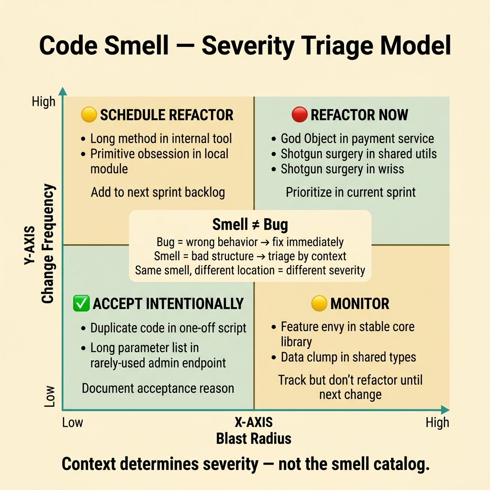
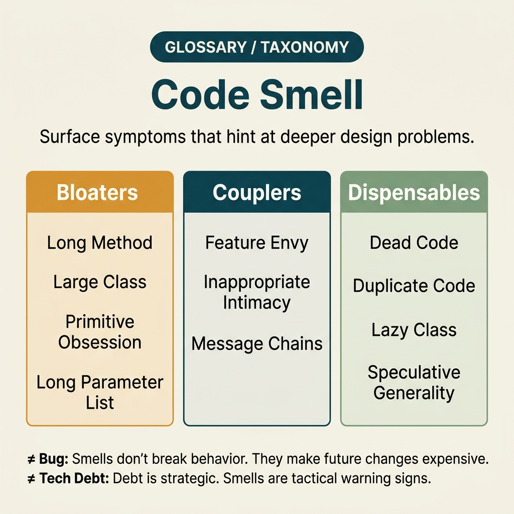

<!-- tags: glossary, reference, software-engineering-fundamentals, code-smell -->
# Code Smell

> A signal that code has poor structure, is hard to maintain, or carries hidden risk — even though it may not be an immediate bug.

| Aspect | Detail |
| --- | --- |
| **Concept** | A signal that code has poor structure, is hard to maintain, or carries hidden risk — even though it may not be an immediate bug. |
| **Audience** | Reviewer, tech lead, developer who needs to use this term within the correct boundary |
| **Primary style** | Glossary term |
| **Entry point** | Use when the concept of **Code Smell** needs to be named correctly in a review, ADR, or incident note. |

📅 Created: 2026-03-30 · 🔄 Updated: 2026-04-18 · ⏱️ 5 min read

---

## 1. DEFINE

You are in the middle of a code review or writing an ADR. Someone says: "this is a **Code Smell**." If the room understands that word in three different ways, the discussion will drift away from the actual technical problem. This glossary term exists to lock the boundary before the team decides whether to refactor, accept a trade-off, or change policy.

**Code Smell** is a signal that code has poor structure, is hard to maintain, or carries hidden risk — even though it may not be an immediate bug.

A code smell is a warning signal, not a proven bug. It indicates that further investigation is warranted, but is not sufficient to conclude the system is wrong.

| Variant | Description |
| --- | --- |
| Long Method | A function that does too much and hides important decision points. |
| Primitive Obsession | Using raw strings/ints for domain concepts instead of meaningful types. |
| Shotgun Surgery | A small change requires touching too many files or similar branch logic. |

| Approach | Time | Space | When to choose |
| --- | --- | --- | --- |
| Review heuristic | O(n) | O(1) | When you want to detect smells early via PR before they become incidents. |
| Change-cost trace | Per history | Per history | When the smell manifests through change cost rather than code style. |
| Refactor-on-proof | Per scope | Per scope | When you only fix smells after proving they cause real friction. |

Core insight:

> Code smell is useful because it directs attention to maintainability risk before bugs occur. Its value lies in predicting the cost of change, not in "policing code morality."

### 1.1 Invariants & Failure Modes

A good glossary term must maintain these invariants:
- Code Smell must refer to the same class of phenomena or decision in all related documents;
- the term must be accompanied by evidence, not just a feeling;
- Code Smell must lead to a clear next action: continue reviewing, refactor, harden, or accept intentionally.

The common failure mode is turning code smell into a formal checklist. When that happens, the team only fixes surface-level syntax while the root causes — coupling, duplication, or vague boundaries — remain untouched.

---

## 2. CONTEXT

**Who uses it**: Reviewer, tech lead, developer who needs to use this term within the correct boundary

**When**: Use when the concept of **Code Smell** needs to be named correctly in a review, ADR, or incident note.

**Purpose**: Code smell is useful because it directs attention to maintainability risk before bugs occur. Its value lies in predicting the cost of change, not in "policing code morality."

**In the ecosystem**:
When using the term **Code Smell**, always attach it to a specific boundary: module, review workflow, runtime signal, or operational policy. Without a boundary, the reader hears a buzzword rather than a decision aid.

---

Signs of bad code are clear. But which smells deserve immediate action, which are acceptable, and who decides?

## 3. EXAMPLES

Code smell surfaces most clearly when a function takes 8 parameters, when a class does 5 different things, or when a new developer cannot understand what the code does despite having comments. The examples below place the pattern in exactly those moments.

### Example 1: Basic — Record a code smell in review without turning the review into a battle

> **Goal**: Create a short note so the entire team uses **Code Smell** with the same meaning in a PR or review.
> **Approach**: Use a structured YAML note to force the term to come with a summary, boundary, and next step instead of a bare buzzword.
> **Example**: A reviewer wants to say "this is a Code Smell" without leaving an opinionated comment.
> **Complexity**: Basic — turn vocabulary into a clear artifact before deeper debate.



*Figure: Code smells are not equal in severity. A smell in throwaway code is acceptable; the same smell in a hot path or shared abstraction is dangerous. This triage model evaluates smells along two axes: change frequency (how often does this code change?) and blast radius (how many consumers depend on it?). High-frequency + high-blast-radius smells demand immediate refactoring; low-frequency + low-blast-radius smells can be accepted intentionally.*

```yaml
term: 03-code-smell
title: "Code Smell"
decision_context: "PR or design review needs to name Code Smell correctly to lock the boundary before further debate."
use_when:
  - "Need to lock the meaning of the term before the team debates further"
  - "Want to attach the term to a specific technical boundary"
not_when:
  - "Actual impact or relevant boundary has not been identified yet"
summary: "A signal that code has poor structure, is hard to maintain, or carries hidden risk — even though it may not be an immediate bug."
next_step: "Open adjacent terms if Code Smell needs to be distinguished from similar concepts."
```

**Why?** Even as a basic example, the structured note is valuable because it forces the writer to prove they are actually talking about **Code Smell**, not a vague feeling of discomfort. Simply forcing boundary and next step into writing eliminates a great deal of noise in discussions.

**Takeaway**: When Code Smell comes with a clear artifact, reviews focus on changeability and real boundaries instead of stopping at engineering slogans.

### Example 2: Intermediate — Classify which smells need immediate action vs. temporary acceptance

> **Goal**: Distinguish **Code Smell** from similar concepts so the backlog or design notes do not mix different types of work.
> **Approach**: Use a small review checklist to ask the right questions about boundary, evidence, and impact before accepting the term.
> **Example**: The team is about to create a ticket or ADR comment and needs to know which term should be the primary vocabulary.
> **Complexity**: Intermediate — trade-offs and risk classification require clearer mechanism explanation.

```yaml
review_question: "Is this actually a Code Smell or just a symptom that looks similar?"
boundary:
  system_area: "service / module / runtime / review comment"
  observable_impact:
    - "change cost"
    - "design clarity"
    - "operational behavior"
comparison:
  this_term: "Code Smell"
  often_confused_with: "A code smell is a warning signal, not a proven bug. It indicates that further investigation is warranted, but is not sufficient to conclude the system is wrong."
decision:
  keep_term: true
  evidence_required:
    - "state the specific phenomenon"
    - "state the decision or risk affected"
    - "state the follow-up action if needed"
```

**Why?** This checklist forces the team to move from symptoms to mechanisms. Without comparing boundaries and evidence, a term like **Code Smell** easily gets misused: sometimes to describe a root cause, sometimes to describe a consequence, sometimes as a purely emotional label.

**Takeaway**: The intermediate value of Code Smell is helping tickets, reviews, and ADRs correctly classify the type of debt or hygiene that needs to be addressed first.

### Example 3: Advanced — Connect code smell to a concrete refactoring plan

> **Goal**: Elevate **Code Smell** from shared vocabulary into a lightweight guardrail in the engineering workflow.
> **Approach**: Write a policy/checklist so that anyone using the term must identify the boundary, impact, and next action.
> **Example**: Apply to PR templates, ADR templates, or incident postmortems so the term is not used in the wrong context.
> **Complexity**: Advanced — moving from a personal note to team- or module-level governance.

```yaml
policy:
  glossary_term: "Code Smell"
  trigger:
    - "PR review repeats the same type of comment"
    - "ADR needs to lock vocabulary to prevent misunderstanding"
    - "incident postmortem needs to distinguish the correct cause"
  owner: "tech lead or reviewer responsible for that boundary"
  checklist:
    - "State the term"
    - "State the boundary"
    - "State the impact"
    - "State the next action"
  reject_if:
    - "term is used as a buzzword"
    - "no evidence or corresponding system behavior"
```

**Why?** A term only truly lives within a team when it becomes part of the workflow — not just individual memory. This small policy turns **Code Smell** into a language contract: anyone using the term must prove they are pointing at the same class of decision or risk.

**Takeaway**: At the advanced level, Code Smell is a signal for questioning the design forces behind the code — not an accusation list where whoever has better taste wins.

---

## 4. COMPARE




*Figure: The position of code smell between technical debt, refactoring, and linter rules.*

Code smell sounds like a bug. It is not: a smell is code that runs correctly but is hard to maintain. A bug is wrong behavior; a smell is bad structure. Smells do not crash production, but they slow down every subsequent change.

### Level 1

```text
Smell -> investigate impact -> decide to refactor or accept intentionally.
```
*Figure: Level 1 places the term **Code Smell** into a simple decision flow so beginners know when to use this term instead of speaking vaguely.*

### Level 2

```text
If encountering...                                  What signal identifies Code Smell correctly
-----------------------------------------            ---------------------------------------------------------
Vague comment about Code Smell                        Find the specific boundary: module, policy, runtime, or related workflow
A similar term appears                                Compare Code Smell's invariant with the easily confused concept
Need to choose an action after mentioning it          Decide whether to refactor, harden, measure more, or accept the trade-off
The same smell can be harmless in throwaway code but very dangerous in a hot path or shared abstraction; context determines severity.
```
*Figure: Level 2 helps experienced readers see that a glossary term is not just a definition — it is a decision router for choosing the correct next action.*

### Easy to confuse or cross the boundary

| # | Severity | Mistake | Consequence | Fix |
| --- | --- | --- | --- | --- |
| 1 | 🔴 Fatal | Using **Code Smell** as a buzzword without a boundary | Team says the same word but argues about three different issues | Always state the module, workflow, or runtime behavior the term points to |
| 2 | 🟡 Common | Mixing **Code Smell** with similar concepts | Tickets, ADRs, or reviews get misclassified | Add a comparison line in the note or README hub before expanding scope |
| 3 | 🟡 Common | Naming the term without a next action | Glossary becomes a decorative dictionary, not a decision aid | Accompany with an action: measure more, refactor, harden, create policy, or accept trade-off |
| 4 | 🔵 Minor | Deep-linking the term without linking back to the topic hub | Reader understands the term in isolation, hard to place in a learning path | Keep the README topic and adjacent concepts in RECOMMEND / navigation at the end |

### Quick scan

| If you encounter | What to do |
| --- | --- |
| Someone uses **Code Smell** too generically | Ask for boundary, impact, and next action before agreeing to keep the term |
| Need to deep-link quickly in a review | Link directly to this glossary file, then connect through the topic hub for broader context |
| Team is mixing up several similar terms | Open the topic hub to compare adjacent concepts before creating a ticket or ADR |

---

## 5. REF

| Resource | Type | Link | Notes |
| --- | --- | --- | --- |
| Martin Fowler | Blog | https://martinfowler.com/ | Strong source for vocabulary on design, refactoring, and architecture debt. |
| Refactoring.Guru | Reference | https://refactoring.guru/ | Useful when comparing glossary terms with similar patterns or smells. |
| The Twelve-Factor App | Official | https://12factor.net/ | Good source of truth for terms leaning toward runtime and deploy hygiene. |

---

## 6. RECOMMEND

Code smell answers the question "the code works correctly but why does every fix take forever?" The next question: what tools fix smells, and which tools catch them automatically?

| Expand to | When to read next | Why | File/Link |
| --- | --- | --- | --- |
| Topic hub | When **Code Smell** needs to be placed in a larger learning path | Avoid understanding the term as an island separated from the taxonomy | [Software Engineering Fundamentals](./README.md) |
| Previous concept | When you need to return to the preceding term for boundary comparison | Useful if the discussion is sliding between two similar terms | [Refactoring](./02-refactoring.md) |
| Next concept | When the current term typically leads to an adjacent decision or pattern | Helps read continuously along the concept chain of the topic | [Linter / Formatter](./04-linter-formatter.md) |

Back to that 8-parameter function at the beginning — it runs correctly but every change requires re-reading everything. Now you know: a smell is not a bug, but it is a leading indicator of future bugs. Catch early, fix small — far cheaper than letting it compound.

**Links**: [← Previous](./02-refactoring.md) · [→ Next](./04-linter-formatter.md)
