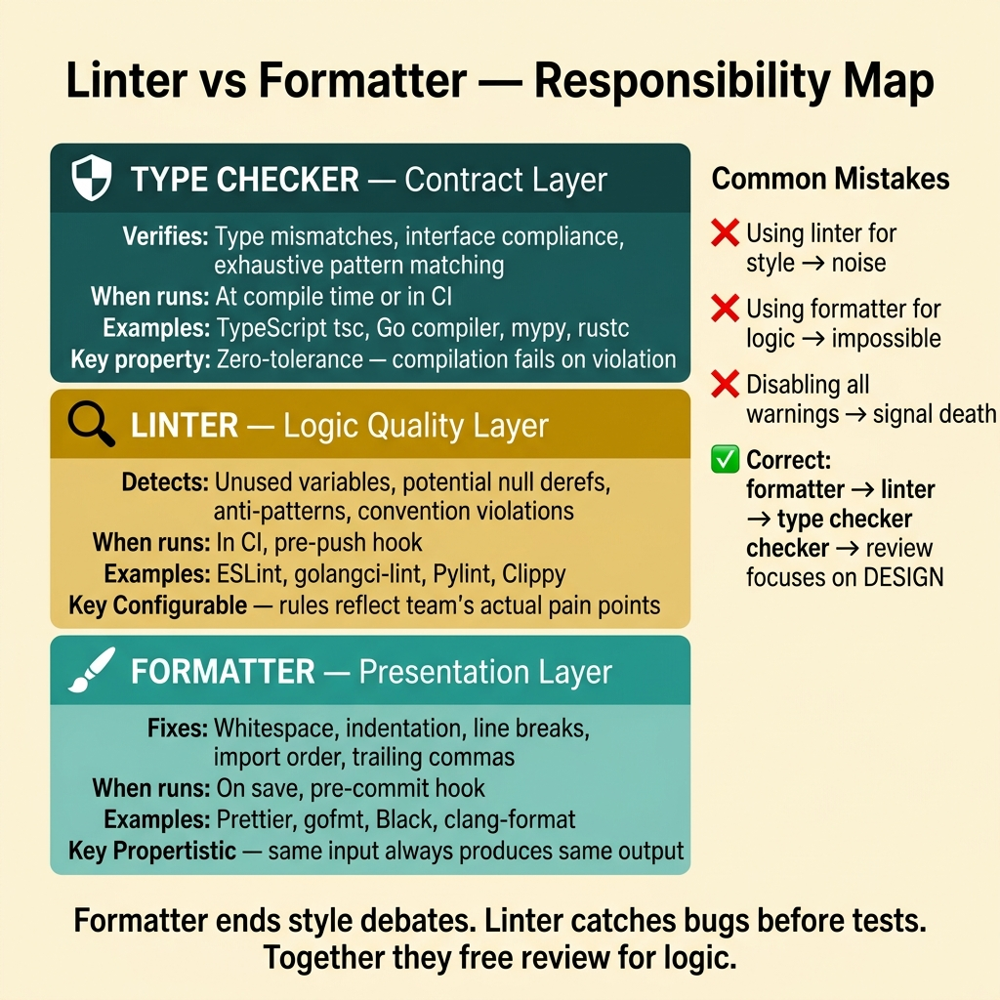
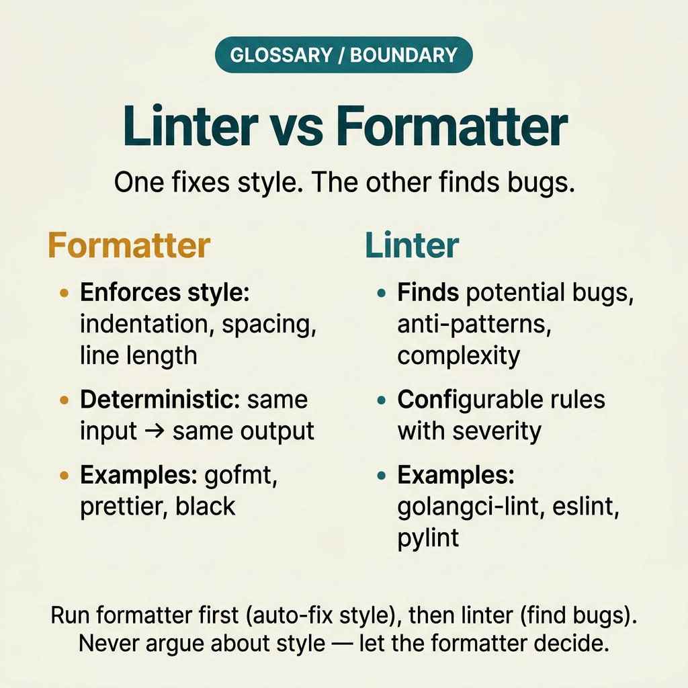

<!-- tags: glossary, reference, software-engineering-fundamentals, linter-formatter -->
# Linter / Formatter

> A toolset that detects style issues, consistency problems, and some static errors; formatters standardize presentation while linters focus on rules and anti-patterns.

| Aspect | Detail |
| --- | --- |
| **Concept** | A toolset that detects style issues, consistency problems, and some static errors; formatters standardize presentation while linters focus on rules and anti-patterns. |
| **Audience** | Reviewer, tech lead, developer who needs to use this term within the correct boundary |
| **Primary style** | Glossary term |
| **Entry point** | Use when the concept of **Linter / Formatter** needs to be named correctly in a review, ADR, or incident note. |

📅 Created: 2026-03-30 · 🔄 Updated: 2026-04-18 · ⏱️ 5 min read

---

## 1. DEFINE

You are in the middle of a code review or writing an ADR. Someone says: "we need a **Linter / Formatter**." If the room understands that word in three different ways, the discussion will drift away from the actual technical problem. This glossary term exists to lock the boundary before the team decides whether to refactor, accept a trade-off, or change policy.

**Linter / Formatter** is a toolset that detects style issues, consistency problems, and some static errors; formatters standardize presentation while linters focus on rules and anti-patterns.

Formatters fix how code is presented; linters warn about error-prone patterns or convention violations. These two complement each other — they do not replace each other.

| Variant | Description |
| --- | --- |
| Formatter | Standardizes whitespace, line breaks, import order, and presentation style. |
| Linter | Detects anti-patterns, rule violations, maintainability issues, or static bugs. |
| Type Checker | Adds a layer of contract verification that formatters and linters cannot provide. |

| Approach | Time | Space | When to choose |
| --- | --- | --- | --- |
| Format-on-save | O(file) | O(1) | When you want to eliminate style arguments from code review. |
| Lint-in-CI | Per project | Per ruleset | When you need consistent rules that fail early before merge. |
| Scoped rule exceptions | O(1) | O(1) | When there is a legitimate use case to disable a rule in a narrow boundary. |

Core insight:

> Formatters and linters deliver the greatest value when they turn recurring arguments into automated guardrails. If reviews still debate indent and import order, the tooling system has not done its job.

### 1.1 Invariants & Failure Modes

A good glossary term must maintain these invariants:
- Linter / Formatter must refer to the same class of phenomena or decision in all related documents;
- the term must be accompanied by evidence, not just a feeling;
- Linter / Formatter must lead to a clear next action: continue reviewing, refactor, harden, or accept intentionally.

The failure mode is cramming too many rules unrelated to real pain points. When that happens, the linter becomes a source of noise and developers learn to ignore warnings instead of trusting the signal.

---

## 2. CONTEXT

**Who uses it**: Reviewer, tech lead, developer who needs to use this term within the correct boundary

**When**: Use when the concept of **Linter / Formatter** needs to be named correctly in a review, ADR, or incident note.

**Purpose**: Formatters and linters deliver the greatest value when they turn recurring arguments into automated guardrails. If reviews still debate indent and import order, the tooling system has not done its job.

**In the ecosystem**:
When using the term **Linter / Formatter**, always attach it to a specific boundary: module, review workflow, runtime signal, or operational policy. Without a boundary, the reader hears a buzzword rather than a decision aid.

---

Automatic style enforcement is clear. But where does a linter differ from a formatter, which rules should be on by default, and when do custom rules become overhead?

## 3. EXAMPLES

Linters and formatters surface most clearly when a PR review spends 30 minutes arguing tabs vs spaces, when a linter catches a null dereference before any test runs, or when the team disables all warnings because there are too many. The examples below place the pattern in exactly those moments.

### Example 1: Basic — Add a formatter to the workflow to clear review noise

> **Goal**: Create a short note so the entire team uses **Linter / Formatter** with the same meaning in a PR or review.
> **Approach**: Use a structured YAML note to force the term to come with a summary, boundary, and next step instead of a bare buzzword.
> **Example**: A reviewer wants to say "we need a Linter / Formatter here" without leaving an opinionated comment.
> **Complexity**: Basic — turn vocabulary into a clear artifact before deeper debate.



*Figure: Formatters and linters serve different layers. Formatters handle presentation — whitespace, indentation, line breaks, import order — the "how it looks" layer. Linters handle logic quality — unused variables, potential null dereferences, anti-patterns, convention violations — the "how it behaves" layer. Type checkers add a third layer on top: contract correctness. Confusing these layers leads to either style noise in reviews or missed bugs in CI.*

```yaml
term: 04-linter-formatter
title: "Linter / Formatter"
decision_context: "PR or design review needs to name Linter / Formatter correctly to lock the boundary before further debate."
use_when:
  - "Need to lock the meaning of the term before the team debates further"
  - "Want to attach the term to a specific technical boundary"
not_when:
  - "Actual impact or relevant boundary has not been identified yet"
summary: "A toolset that detects style issues, consistency problems, and some static errors; formatters standardize presentation while linters focus on rules and anti-patterns."
next_step: "Open adjacent terms if Linter / Formatter needs to be distinguished from similar concepts."
```

**Why?** Even as a basic example, the structured note is valuable because it forces the writer to prove they are actually talking about **Linter / Formatter**, not a vague feeling of discomfort. Simply forcing boundary and next step into writing eliminates a great deal of noise in discussions.

**Takeaway**: When Linter / Formatter comes with a clear artifact, reviews focus on changeability and real boundaries instead of stopping at engineering slogans.

### Example 2: Intermediate — Design a linter ruleset with low noise but accurate bug-prone pattern detection

> **Goal**: Distinguish **Linter / Formatter** from similar concepts so the backlog or design notes do not mix different types of work.
> **Approach**: Use a small review checklist to ask the right questions about boundary, evidence, and impact before accepting the term.
> **Example**: The team is about to create a ticket or ADR comment and needs to know which term should be the primary vocabulary.
> **Complexity**: Intermediate — trade-offs and risk classification require clearer mechanism explanation.

```yaml
review_question: "Is this actually a Linter / Formatter issue or just a symptom that looks similar?"
boundary:
  system_area: "service / module / runtime / review comment"
  observable_impact:
    - "change cost"
    - "design clarity"
    - "operational behavior"
comparison:
  this_term: "Linter / Formatter"
  often_confused_with: "Formatters fix how code is presented; linters warn about error-prone patterns or convention violations. These two complement each other — they do not replace each other."
decision:
  keep_term: true
  evidence_required:
    - "state the specific phenomenon"
    - "state the decision or risk affected"
    - "state the follow-up action if needed"
```

**Why?** This checklist forces the team to move from symptoms to mechanisms. Without comparing boundaries and evidence, a term like **Linter / Formatter** easily gets misused: sometimes to describe a root cause, sometimes to describe a consequence, sometimes as a purely emotional label.

**Takeaway**: The intermediate value of Linter / Formatter is helping tickets, reviews, and ADRs correctly classify the type of debt or hygiene that needs to be addressed first.

### Example 3: Advanced — Manage rule exceptions without breaking overall consistency

> **Goal**: Elevate **Linter / Formatter** from shared vocabulary into a lightweight guardrail in the engineering workflow.
> **Approach**: Write a policy/checklist so that anyone using the term must identify the boundary, impact, and next action.
> **Example**: Apply to PR templates, ADR templates, or incident postmortems so the term is not used in the wrong context.
> **Complexity**: Advanced — moving from a personal note to team- or module-level governance.

```yaml
policy:
  glossary_term: "Linter / Formatter"
  trigger:
    - "PR review repeats the same type of comment"
    - "ADR needs to lock vocabulary to prevent misunderstanding"
    - "incident postmortem needs to distinguish the correct cause"
  owner: "tech lead or reviewer responsible for that boundary"
  checklist:
    - "State the term"
    - "State the boundary"
    - "State the impact"
    - "State the next action"
  reject_if:
    - "term is used as a buzzword"
    - "no evidence or corresponding system behavior"
```

**Why?** A term only truly lives within a team when it becomes part of the workflow — not just individual memory. This small policy turns **Linter / Formatter** into a language contract: anyone using the term must prove they are pointing at the same class of decision or risk.

**Takeaway**: At the advanced level, Linter and Formatter are guardrails for team consistency — not a repository for every expectation about code quality.

---

## 4. COMPARE




*Figure: The position of linter/formatter between code smell, CI gates, and code review.*

Linter sounds like formatter. They are not the same: a formatter only fixes format (indent, spacing); a linter analyzes logic (unused vars, potential bugs). One "arranges nicely," the other "catches errors."

### Level 1

```text
Editor save -> formatter runs -> clean diff -> review focuses on logic.
```
*Figure: Level 1 places the term **Linter / Formatter** into a simple decision flow so beginners know when to use this term instead of speaking vaguely.*

### Level 2

```text
If encountering...                                  What signal identifies Linter / Formatter correctly
-----------------------------------------            ---------------------------------------------------------
Vague comment about Linter / Formatter                Find the specific boundary: module, policy, runtime, or related workflow
A similar term appears                                Compare Linter / Formatter's invariant with the easily confused concept
Need to choose an action after mentioning it          Decide whether to refactor, harden, measure more, or accept the trade-off
A good linter must distinguish between rules that protect against real bugs and purely stylistic rules; mixing the two makes the signal lose weight.
```
*Figure: Level 2 helps experienced readers see that a glossary term is not just a definition — it is a decision router for choosing the correct next action.*

### Easy to confuse or cross the boundary

| # | Severity | Mistake | Consequence | Fix |
| --- | --- | --- | --- | --- |
| 1 | 🔴 Fatal | Using **Linter / Formatter** as a buzzword without a boundary | Team says the same word but argues about three different issues | Always state the module, workflow, or runtime behavior the term points to |
| 2 | 🟡 Common | Mixing **Linter / Formatter** with similar concepts | Tickets, ADRs, or reviews get misclassified | Add a comparison line in the note or README hub before expanding scope |
| 3 | 🟡 Common | Naming the term without a next action | Glossary becomes a decorative dictionary, not a decision aid | Accompany with an action: measure more, refactor, harden, create policy, or accept trade-off |
| 4 | 🔵 Minor | Deep-linking the term without linking back to the topic hub | Reader understands the term in isolation, hard to place in a learning path | Keep the README topic and adjacent concepts in RECOMMEND / navigation at the end |

### Quick scan

| If you encounter | What to do |
| --- | --- |
| Someone uses **Linter / Formatter** too generically | Ask for boundary, impact, and next action before agreeing to keep the term |
| Need to deep-link quickly in a review | Link directly to this glossary file, then connect through the topic hub for broader context |
| Team is mixing up several similar terms | Open the topic hub to compare adjacent concepts before creating a ticket or ADR |

---

## 5. REF

| Resource | Type | Link | Notes |
| --- | --- | --- | --- |
| Martin Fowler | Blog | https://martinfowler.com/ | Strong source for vocabulary on design, refactoring, and architecture debt. |
| Refactoring.Guru | Reference | https://refactoring.guru/ | Useful when comparing glossary terms with similar patterns or smells. |
| The Twelve-Factor App | Official | https://12factor.net/ | Good source of truth for terms leaning toward runtime and deploy hygiene. |

---

## 6. RECOMMEND

Linter/Formatter answers the question "code style arguments dominating code review." The next question: which design principles guide code structure, and how does DI pattern work?

| Expand to | When to read next | Why | File/Link |
| --- | --- | --- | --- |
| Topic hub | When **Linter / Formatter** needs to be placed in a larger learning path | Avoid understanding the term as an island separated from the taxonomy | [Software Engineering Fundamentals](./README.md) |
| Previous concept | When you need to return to the preceding term for boundary comparison | Useful if the discussion is sliding between two similar terms | [Code Smell](./03-code-smell.md) |
| Next concept | When the current term typically leads to an adjacent decision or pattern | Helps read continuously along the concept chain of the topic | [Dependency Injection](./05-dependency-injection.md) |

Back to that PR review at the beginning — 30 minutes arguing tabs vs spaces. Now you know: formatters end style arguments, linters catch bugs before tests run. Enable both in CI and code review focuses exclusively on logic and design.

**Links**: [← Previous](./03-code-smell.md) · [→ Next](./05-dependency-injection.md)
