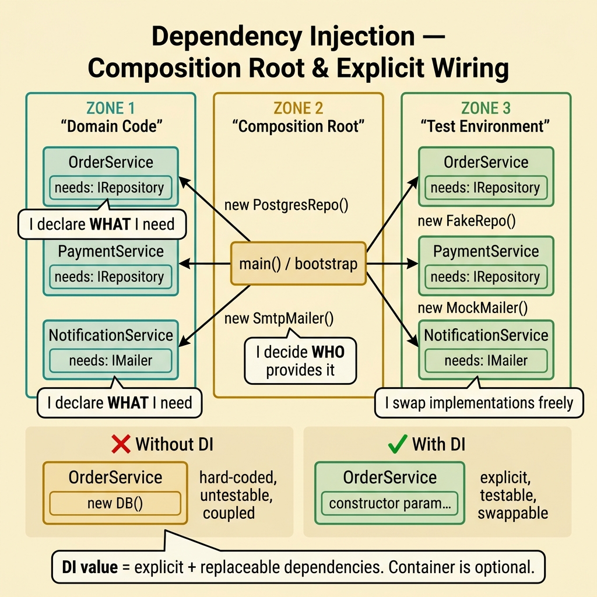
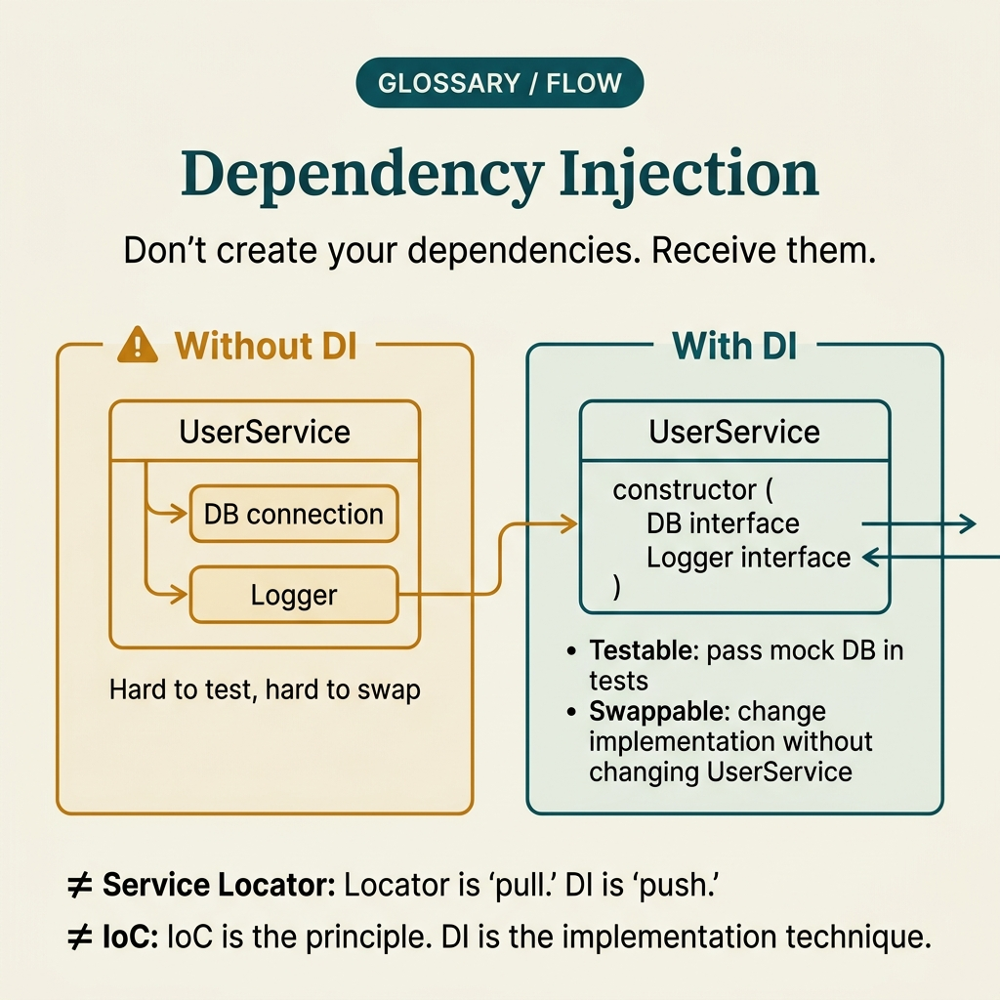

<!-- tags: glossary, reference, software-engineering-fundamentals, dependency-injection -->
# Dependency Injection

> A technique for supplying dependencies from outside a component instead of having the component create them internally — reducing coupling and improving testability.

| Aspect | Detail |
| --- | --- |
| **Concept** | A technique for supplying dependencies from outside a component instead of having the component create them internally — reducing coupling and improving testability. |
| **Audience** | Reviewer, tech lead, developer who needs to use this term within the correct boundary |
| **Primary style** | Glossary term |
| **Entry point** | Use when the concept of **Dependency Injection** needs to be named correctly in a review, ADR, or incident note. |

📅 Created: 2026-03-30 · 🔄 Updated: 2026-04-11 · ⏱️ 5 min read

---

## 1. DEFINE

You are in the middle of a code review or writing an ADR. Someone says: "this is **Dependency Injection**." If the room understands that word in three different ways, the discussion will drift away from the actual technical problem. This glossary term exists to lock the boundary before the team decides whether to refactor, accept a trade-off, or change policy.

**Dependency Injection** is a technique for supplying dependencies from outside a component instead of having the component create them internally — reducing coupling and improving testability.

Dependency Injection is a specific technique for providing dependencies from the outside; Inversion of Control is broader and describes who holds the orchestration flow.

| Variant | Description |
| --- | --- |
| Constructor Injection | Inject via constructor so that the dependency is mandatory and visible at creation time. |
| Parameter Injection | Inject into a method/function call for a dependency needed only on a specific path. |
| Provider/Container Injection | Use a container or factory to resolve the dependency graph at the composition root. |

| Approach | Time | Space | When to choose |
| --- | --- | --- | --- |
| Manual wiring | O(n) | O(n) | When the app is small or the composition root must be extremely explicit. |
| Container-managed DI | Per graph | Per graph | When the project is large and needs lifecycle/override/conditional binding. |
| Interface-first injection | O(1) | O(1) | When reducing coupling and enabling testing via fakes/mocks/stubs is the priority. |

Core insight:

> The value of DI does not come from the container — it comes from making dependencies explicit and replaceable. If a class still instantiates dependencies internally, any claim about testability is superficial.

### 1.1 Invariants & Failure Modes

A good glossary term must maintain these invariants:
- Dependency Injection must refer to the same class of phenomena or decision in all related documents;
- the term must be accompanied by evidence, not just a feeling;
- Dependency Injection must lead to a clear next action: continue reviewing, refactor, harden, or accept intentionally.

The failure mode is turning DI into ceremony: interfaces for everything, container magic everywhere, but the business boundary remains unclear. At that point the team has more abstractions but no more clarity.

---

## 2. CONTEXT

**Who uses it**: Reviewer, tech lead, developer who needs to use this term within the correct boundary

**When**: Use when the concept of **Dependency Injection** needs to be named correctly in a review, ADR, or incident note.

**Purpose**: The value of DI does not come from the container — it comes from making dependencies explicit and replaceable. If a class still instantiates dependencies internally, any claim about testability is superficial.

**In the ecosystem**:
When using the term **Dependency Injection**, always attach it to a specific boundary: module, review workflow, runtime signal, or operational policy. Without a boundary, the reader hears a buzzword rather than a decision aid.

---

Injecting dependencies from outside is clear. But is a DI container necessary, does too many layers of DI become over-engineering, and when is constructor injection enough?

## 3. EXAMPLES

DI surfaces most clearly when a service creates a DB connection directly inside itself and tests require a real database, when swapping an implementation takes three days because of hard-coded dependencies, or when the DI container has 200 bindings and nobody understands the graph. The examples below place the pattern in exactly those moments.

### Example 1: Basic — Stop instantiating dependencies directly inside the service

> **Goal**: Create a short note so the entire team uses **Dependency Injection** with the same meaning in a PR or review.
> **Approach**: Use a structured YAML note to force the term to come with a summary, boundary, and next step instead of a bare buzzword.
> **Example**: A reviewer wants to say "this is Dependency Injection" without leaving an opinionated comment.
> **Complexity**: Basic — turn vocabulary into a clear artifact before deeper debate.



*Figure: DI works by moving the "who creates what" decision to a composition root. Domain code declares what it needs; the root decides which implementation to supply. The boundary between "declare" and "resolve" is where testability lives.*

```yaml
term: 05-dependency-injection
title: "Dependency Injection"
decision_context: "PR or design review needs to name Dependency Injection correctly to lock the boundary before further debate."
use_when:
  - "Need to lock the meaning of the term before the team debates further"
  - "Want to attach the term to a specific technical boundary"
not_when:
  - "Actual impact or relevant boundary has not been identified yet"
summary: "A technique for supplying dependencies from outside a component instead of having the component create them internally — reducing coupling and improving testability."
next_step: "Open adjacent terms if Dependency Injection needs to be distinguished from similar concepts."
```

**Why?** Even as a basic example, the structured note is valuable because it forces the writer to prove they are actually talking about **Dependency Injection**, not a vague feeling of discomfort. Simply forcing boundary and next step into writing eliminates a great deal of noise in discussions.

**Takeaway**: When Dependency Injection comes with a clear artifact, reviews focus on changeability and real boundaries instead of stopping at engineering slogans.

### Example 2: Intermediate — Separate wiring from business logic for easier testing

> **Goal**: Distinguish **Dependency Injection** from similar concepts so the backlog or design notes do not mix different types of work.
> **Approach**: Use a small review checklist to ask the right questions about boundary, evidence, and impact before accepting the term.
> **Example**: The team is about to create a ticket or ADR comment and needs to know which term should be the primary vocabulary.
> **Complexity**: Intermediate — trade-offs and risk classification require clearer mechanism explanation.

```yaml
review_question: "Is this actually Dependency Injection or just a symptom that looks similar?"
boundary:
  system_area: "service / module / runtime / review comment"
  observable_impact:
    - "change cost"
    - "design clarity"
    - "operational behavior"
comparison:
  this_term: "Dependency Injection"
  often_confused_with: "Dependency Injection is a specific technique for providing dependencies from the outside; Inversion of Control is broader and describes who holds the orchestration flow."
decision:
  keep_term: true
  evidence_required:
    - "state the specific phenomenon"
    - "state the decision or risk affected"
    - "state the follow-up action if needed"
```

**Why?** This checklist forces the team to move from symptoms to mechanisms. Without comparing boundaries and evidence, a term like **Dependency Injection** easily gets misused: sometimes to describe a root cause, sometimes to describe a consequence, sometimes as a purely emotional label.

**Takeaway**: The intermediate value of Dependency Injection is helping tickets, reviews, and ADRs correctly classify the type of debt or hygiene that needs to be addressed first.

### Example 3: Advanced — Keep DI explicit as the application grows

> **Goal**: Elevate **Dependency Injection** from shared vocabulary into a lightweight guardrail in the engineering workflow.
> **Approach**: Write a policy/checklist so that anyone using the term must identify the boundary, impact, and next action.
> **Example**: Apply to PR templates, ADR templates, or incident postmortems so the term is not used in the wrong context.
> **Complexity**: Advanced — moving from a personal note to team- or module-level governance.

```yaml
policy:
  glossary_term: "Dependency Injection"
  trigger:
    - "PR review repeats the same type of comment"
    - "ADR needs to lock vocabulary to prevent misunderstanding"
    - "incident postmortem needs to distinguish the correct cause"
  owner: "tech lead or reviewer responsible for that boundary"
  checklist:
    - "State the term"
    - "State the boundary"
    - "State the impact"
    - "State the next action"
  reject_if:
    - "term is used as a buzzword"
    - "no evidence or corresponding system behavior"
```

**Why?** A term only truly lives within a team when it becomes part of the workflow — not just individual memory. This small policy turns **Dependency Injection** into a language contract: anyone using the term must prove they are pointing at the same class of decision or risk.

**Takeaway**: At the advanced level, Dependency Injection is a tool for controlling dependency direction and test seams — not a tedious ceremony dictated by a framework.

---

## 4. COMPARE




*Figure: The position of DI between wiring decisions, broader control principles, and container ceremony.*

DI sounds like IoC. Close, but the real confusion lies at the boundary: IoC is a broad principle about who holds orchestration control, while DI is a specific decision about how dependencies are delivered to a component.

### Level 1

```text
Composition root creates dependency -> component receives dependency via constructor -> tests swap fakes easily.
```
*Figure: Level 1 places the term **Dependency Injection** into a simple decision flow so beginners know when to use this term instead of speaking vaguely.*

### Level 2

```text
If encountering...                              What signal identifies Dependency Injection correctly
-----------------------------------------        ---------------------------------------------------------
Vague comment about Dependency Injection          Find the specific boundary: module, policy, runtime, or related workflow
A similar term appears                            Compare DI's invariant with the easily confused concept
Need to choose an action after mentioning DI      Decide whether to refactor, harden, measure more, or accept the trade-off
Good DI pushes the "which implementation" decision to the composition root; domain code only states what capability it needs, not how it is provided.
```
*Figure: Level 2 helps experienced readers see that a glossary term is not just a definition — it is a decision router for choosing the correct next action.*

### Easy to confuse or cross the boundary

| # | Severity | Mistake | Consequence | Fix |
| --- | --- | --- | --- | --- |
| 1 | 🔴 Fatal | Using **Dependency Injection** as a buzzword without a boundary | Team says the same word but argues about three different issues | Always state the module, workflow, or runtime behavior the term points to |
| 2 | 🟡 Common | Mixing **Dependency Injection** with similar concepts | Tickets, ADRs, or reviews get misclassified | Add a comparison line in the note or README hub before expanding scope |
| 3 | 🟡 Common | Naming the term without a next action | Glossary becomes a decorative dictionary, not a decision aid | Accompany with an action: measure more, refactor, harden, create policy, or accept trade-off |
| 4 | 🔵 Minor | Deep-linking the term without linking back to the topic hub | Reader understands the term in isolation, hard to place in a learning path | Keep the README topic and adjacent concepts in RECOMMEND / navigation at the end |

### Quick scan

| If you encounter | What to do |
| --- | --- |
| Someone uses **Dependency Injection** too generically | Ask for boundary, impact, and next action before agreeing to keep the term |
| Need to deep-link quickly in a review | Link directly to this glossary file, then connect through the topic hub for broader context |
| Team is mixing up several similar terms | Open the topic hub to compare adjacent concepts before creating a ticket or ADR |

---

## 5. REF

| Resource | Type | Link | Notes |
| --- | --- | --- | --- |
| Martin Fowler | Blog | https://martinfowler.com/ | Strong source for vocabulary on design, refactoring, and architecture debt. |
| Refactoring.Guru | Reference | https://refactoring.guru/ | Useful when comparing glossary terms with similar patterns or smells. |
| The Twelve-Factor App | Official | https://12factor.net/ | Good source of truth for terms leaning toward runtime and deploy hygiene. |

---

## 6. RECOMMEND

DI answers the question "the service cannot be tested because dependencies are hard-coded." The next question: what does the broader IoC principle look like, and which architecture applies DI thoroughly?

| Expand to | When to read next | Why | File/Link |
| --- | --- | --- | --- |
| Topic hub | When **Dependency Injection** needs to be placed in a larger learning path | Avoid understanding the term as an island separated from the taxonomy | [Software Engineering Fundamentals](./README.md) |
| Previous concept | When you need to return to the preceding term for boundary comparison | Useful if the discussion is sliding between two similar terms | [Linter / Formatter](./04-linter-formatter.md) |
| Next concept | When the current term typically leads to an adjacent decision or pattern | Helps read continuously along the concept chain of the topic | [Inversion of Control](./06-inversion-of-control.md) |

Back to that service creating a DB connection directly at the beginning — tests required a real DB, swapping implementations took three days. Now you know: inject from outside, tests can mock, implementations can swap. Constructor injection is enough for 90% of cases.

**Links**: [← Previous](./04-linter-formatter.md) · [→ Next](./06-inversion-of-control.md)
