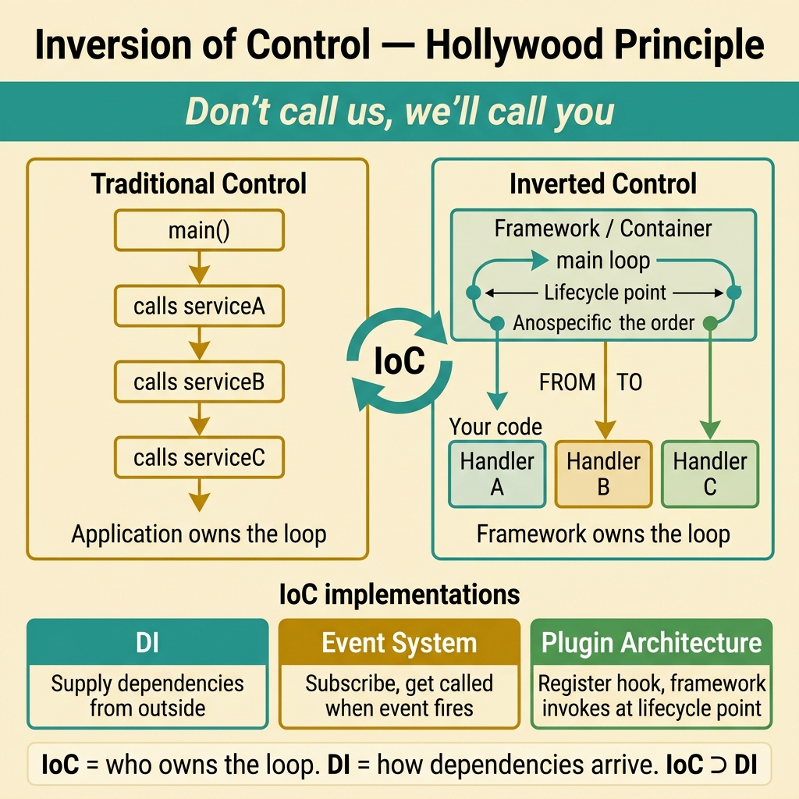
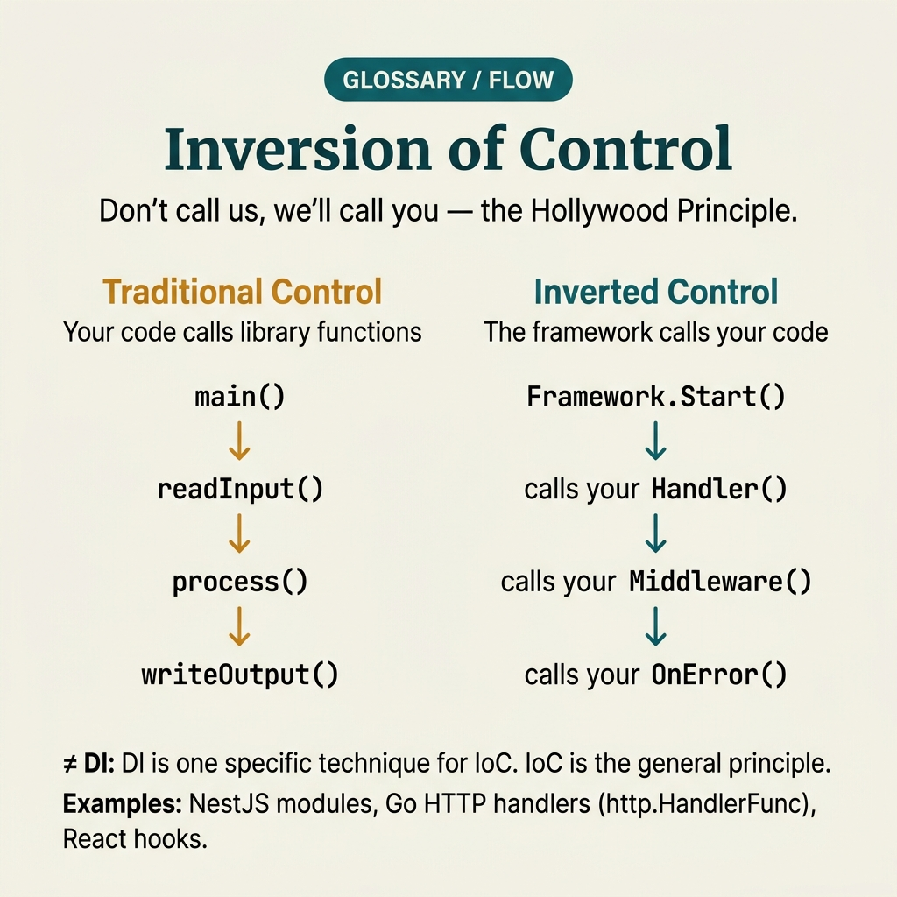

<!-- tags: glossary, reference, software-engineering-fundamentals, inversion-of-control -->
# Inversion of Control

> A principle where the framework or container holds orchestration of the main flow while application code only supplies the logic to be executed.

| Aspect | Detail |
| --- | --- |
| **Concept** | A principle where the framework or container holds orchestration of the main flow while application code only supplies the logic to be executed. |
| **Audience** | Reviewer, tech lead, developer who needs to use this term within the correct boundary |
| **Primary style** | Glossary term |
| **Entry point** | Use when the concept of **Inversion of Control** needs to be named correctly in a review, ADR, or incident note. |

📅 Created: 2026-03-30 · 🔄 Updated: 2026-04-04 · ⏱️ 5 min read

---

## 1. DEFINE

You are in the middle of a code review or writing an ADR. Someone says: "this is **Inversion of Control**." If the room understands that word in three different ways, the discussion will drift away from the actual technical problem. This glossary term exists to lock the boundary before the team decides whether to refactor, accept a trade-off, or change policy.

**Inversion of Control** is a principle where the framework or container holds orchestration of the main flow while application code only supplies the logic to be executed.

IoC is the general principle — "the framework calls your code" — while DI is one popular implementation technique for realizing that principle.

| Variant | Description |
| --- | --- |
| Framework Callback | The framework owns the main loop and calls your handlers at the correct lifecycle point. |
| Container-managed Lifecycle | The container creates objects, injects dependencies, manages scope, and handles teardown. |
| Event-driven IoC | Components subscribe to callbacks/events instead of polling or calling directly. |

| Approach | Time | Space | When to choose |
| --- | --- | --- | --- |
| Lifecycle mapping | O(1) | O(1) | When you need to understand exactly where the framework calls your code. |
| Explicit composition root | O(n) | O(n) | When you want IoC but need visibility into the object graph. |
| Callback boundary audit | Per hook count | O(1) | When debugging hidden side effects produced by framework magic. |

Core insight:

> IoC reverses the direction of control: you no longer proactively call everything via your own main loop; the framework or container decides when your code executes. What matters is knowing where that boundary lies.

### 1.1 Invariants & Failure Modes

A good glossary term must maintain these invariants:
- Inversion of Control must refer to the same class of phenomena or decision in all related documents;
- the term must be accompanied by evidence, not just a feeling;
- Inversion of Control must lead to a clear next action: continue reviewing, refactor, harden, or accept intentionally.

The failure mode is confusing "convenient framework" with "transparent framework." When too much behavior is hidden inside hooks and callbacks, the team loses the ability to reason because nobody knows who is calling what and when.

---

## 2. CONTEXT

**Who uses it**: Reviewer, tech lead, developer who needs to use this term within the correct boundary

**When**: Use when the concept of **Inversion of Control** needs to be named correctly in a review, ADR, or incident note.

**Purpose**: IoC reverses the direction of control: you no longer proactively call everything via your own main loop; the framework or container decides when your code executes. What matters is knowing where that boundary lies.

**In the ecosystem**:
When using the term **Inversion of Control**, always attach it to a specific boundary: module, review workflow, runtime signal, or operational policy. Without a boundary, the reader hears a buzzword rather than a decision aid.

---

Reversing the direction of control is clear. But how does IoC differ from DI, is a framework-based IoC necessary, and when does IoC become magic?

## 3. EXAMPLES

IoC surfaces most clearly when code calls the framework instead of the framework calling code, when a plugin system allows extension without modifying core, or when a new developer does not understand "who calls this function" because the control flow has been inverted. The examples below place the pattern in exactly those moments.

### Example 1: Basic — Identify where the framework is orchestrating the flow instead of application code

> **Goal**: Create a short note so the entire team uses **Inversion of Control** with the same meaning in a PR or review.
> **Approach**: Use a structured YAML note to force the term to come with a summary, boundary, and next step instead of a bare buzzword.
> **Example**: A reviewer wants to say "this is Inversion of Control" without leaving an opinionated comment.
> **Complexity**: Basic — turn vocabulary into a clear artifact before deeper debate.



*Figure: IoC follows the "Hollywood Principle" — don't call us, we'll call you. The framework owns the main loop and lifecycle; your code registers handlers that get invoked at predetermined points. The critical question is always: where does the boundary between framework control and your code actually sit?*

```yaml
term: 06-inversion-of-control
title: "Inversion of Control"
decision_context: "PR or design review needs to name Inversion of Control correctly to lock the boundary before further debate."
use_when:
  - "Need to lock the meaning of the term before the team debates further"
  - "Want to attach the term to a specific technical boundary"
not_when:
  - "Actual impact or relevant boundary has not been identified yet"
summary: "A principle where the framework or container holds orchestration of the main flow while application code only supplies the logic to be executed."
next_step: "Open adjacent terms if Inversion of Control needs to be distinguished from similar concepts."
```

**Why?** Even as a basic example, the structured note is valuable because it forces the writer to prove they are actually talking about **Inversion of Control**, not a vague feeling of discomfort. Simply forcing boundary and next step into writing eliminates a great deal of noise in discussions.

**Takeaway**: When Inversion of Control comes with a clear artifact, reviews focus on changeability and real boundaries instead of stopping at engineering slogans.

### Example 2: Intermediate — Separate the IoC principle from the DI technique in design discussions

> **Goal**: Distinguish **Inversion of Control** from similar concepts so the backlog or design notes do not mix different types of work.
> **Approach**: Use a small review checklist to ask the right questions about boundary, evidence, and impact before accepting the term.
> **Example**: The team is about to create a ticket or ADR comment and needs to know which term should be the primary vocabulary.
> **Complexity**: Intermediate — trade-offs and risk classification require clearer mechanism explanation.

```yaml
review_question: "Is this actually Inversion of Control or just a symptom that looks similar?"
boundary:
  system_area: "service / module / runtime / review comment"
  observable_impact:
    - "change cost"
    - "design clarity"
    - "operational behavior"
comparison:
  this_term: "Inversion of Control"
  often_confused_with: "IoC is the general principle — the framework calls your code — while DI is one popular implementation technique for realizing that principle."
decision:
  keep_term: true
  evidence_required:
    - "state the specific phenomenon"
    - "state the decision or risk affected"
    - "state the follow-up action if needed"
```

**Why?** This checklist forces the team to move from symptoms to mechanisms. Without comparing boundaries and evidence, a term like **Inversion of Control** easily gets misused: sometimes to describe a root cause, sometimes to describe a consequence, sometimes as a purely emotional label.

**Takeaway**: The intermediate value of Inversion of Control is helping tickets, reviews, and ADRs correctly classify the type of debt or hygiene that needs to be addressed first.

### Example 3: Advanced — Reduce framework magic through explicit boundary audits

> **Goal**: Elevate **Inversion of Control** from shared vocabulary into a lightweight guardrail in the engineering workflow.
> **Approach**: Write a policy/checklist so that anyone using the term must identify the boundary, impact, and next action.
> **Example**: Apply to PR templates, ADR templates, or incident postmortems so the term is not used in the wrong context.
> **Complexity**: Advanced — moving from a personal note to team- or module-level governance.

```yaml
policy:
  glossary_term: "Inversion of Control"
  trigger:
    - "PR review repeats the same type of comment"
    - "ADR needs to lock vocabulary to prevent misunderstanding"
    - "incident postmortem needs to distinguish the correct cause"
  owner: "tech lead or reviewer responsible for that boundary"
  checklist:
    - "State the term"
    - "State the boundary"
    - "State the impact"
    - "State the next action"
  reject_if:
    - "term is used as a buzzword"
    - "no evidence or corresponding system behavior"
```

**Why?** A term only truly lives within a team when it becomes part of the workflow — not just individual memory. This small policy turns **Inversion of Control** into a language contract: anyone using the term must prove they are pointing at the same class of decision or risk.

**Takeaway**: At the advanced level, Inversion of Control is a way to hand orchestration authority to the right infrastructure layer — not a layer of unexplainable magic.

---

## 4. COMPARE




*Figure: The position of IoC between DI, service locator, and the Hollywood Principle.*

IoC sounds like DI. Not exactly: IoC is a design principle (the framework calls your code, not the other way around), while DI is just one implementation of IoC. Event-driven architectures and plugin systems are also IoC.

### Level 1

```text
App registers handler -> framework receives request -> framework calls handler at the predetermined lifecycle point.
```
*Figure: Level 1 places the term **Inversion of Control** into a simple decision flow so beginners know when to use this term instead of speaking vaguely.*

### Level 2

```text
If encountering...                              What signal identifies Inversion of Control correctly
-----------------------------------------        ---------------------------------------------------------
Vague comment about Inversion of Control          Find the specific boundary: module, policy, runtime, or related workflow
A similar term appears                            Compare IoC's invariant with the easily confused concept
Need to choose an action after mentioning IoC     Decide whether to refactor, harden, measure more, or accept the trade-off
As IoC grows stronger, convenience increases but local reasoning decreases; documentation and boundary audits must compensate for lost visibility.
```
*Figure: Level 2 helps experienced readers see that a glossary term is not just a definition — it is a decision router for choosing the correct next action.*

### Easy to confuse or cross the boundary

| # | Severity | Mistake | Consequence | Fix |
| --- | --- | --- | --- | --- |
| 1 | 🔴 Fatal | Using **Inversion of Control** as a buzzword without a boundary | Team says the same word but argues about three different issues | Always state the module, workflow, or runtime behavior the term points to |
| 2 | 🟡 Common | Mixing **Inversion of Control** with similar concepts | Tickets, ADRs, or reviews get misclassified | Add a comparison line in the note or README hub before expanding scope |
| 3 | 🟡 Common | Naming the term without a next action | Glossary becomes a decorative dictionary, not a decision aid | Accompany with an action: measure more, refactor, harden, create policy, or accept trade-off |
| 4 | 🔵 Minor | Deep-linking the term without linking back to the topic hub | Reader understands the term in isolation, hard to place in a learning path | Keep the README topic and adjacent concepts in RECOMMEND / navigation at the end |

### Quick scan

| If you encounter | What to do |
| --- | --- |
| Someone uses **Inversion of Control** too generically | Ask for boundary, impact, and next action before agreeing to keep the term |
| Need to deep-link quickly in a review | Link directly to this glossary file, then connect through the topic hub for broader context |
| Team is mixing up several similar terms | Open the topic hub to compare adjacent concepts before creating a ticket or ADR |

---

## 5. REF

| Resource | Type | Link | Notes |
| --- | --- | --- | --- |
| Martin Fowler | Blog | https://martinfowler.com/ | Strong source for vocabulary on design, refactoring, and architecture debt. |
| Refactoring.Guru | Reference | https://refactoring.guru/ | Useful when comparing glossary terms with similar patterns or smells. |
| The Twelve-Factor App | Official | https://12factor.net/ | Good source of truth for terms leaning toward runtime and deploy hygiene. |

---

## 6. RECOMMEND

IoC answers the question "the code is tightly coupled to a specific flow." The next question: which architecture applies IoC thoroughly, and how does DI fit in concretely?

| Expand to | When to read next | Why | File/Link |
| --- | --- | --- | --- |
| Topic hub | When **Inversion of Control** needs to be placed in a larger learning path | Avoid understanding the term as an island separated from the taxonomy | [Software Engineering Fundamentals](./README.md) |
| Previous concept | When you need to return to the preceding term for boundary comparison | Useful if the discussion is sliding between two similar terms | [Dependency Injection](./05-dependency-injection.md) |
| Next concept | When the current term typically leads to an adjacent decision or pattern | Helps read continuously along the concept chain of the topic | [Hexagonal Architecture](./07-hexagonal-architecture.md) |

Back to that "who calls this function" at the beginning — the control flow was inverted, the new developer was confused. Now you know: IoC trades control for flexibility. Used correctly, code becomes extensible without modifying core. Used incorrectly, code becomes magic that makes everyone cry when debugging.

**Links**: [← Previous](./05-dependency-injection.md) · [→ Next](./07-hexagonal-architecture.md)
