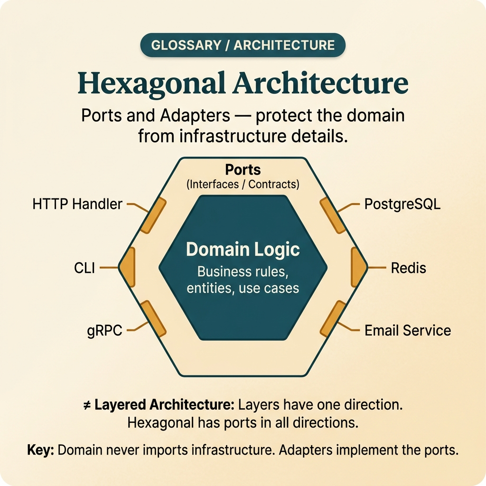

<!-- tags: glossary, reference, software-engineering-fundamentals, hexagonal-architecture -->
# Hexagonal Architecture

> An architectural style that separates domain logic from infrastructure using ports and adapters, ensuring business logic has no direct dependency on frameworks or databases.

| Aspect | Detail |
| --- | --- |
| **Concept** | An architectural style that separates domain logic from infrastructure using ports and adapters, ensuring business logic has no direct dependency on frameworks or databases. |
| **Audience** | Reviewer, tech lead, developer who needs to use this term within the correct boundary |
| **Primary style** | Glossary term |
| **Entry point** | Use when the concept of **Hexagonal Architecture** needs to be named correctly in a review, ADR, or incident note. |

📅 Created: 2026-03-30 · 🔄 Updated: 2026-04-04 · ⏱️ 5 min read

---

## 1. DEFINE

You are in the middle of a code review or writing an ADR. Someone says: "this is **Hexagonal Architecture**." If the room understands that word in three different ways, the discussion will drift away from the actual technical problem. This glossary term exists to lock the boundary before the team decides whether to refactor, accept a trade-off, or change policy.

**Hexagonal Architecture** is an architectural style that separates domain logic from infrastructure using ports and adapters, ensuring business logic has no direct dependency on frameworks or databases.

Hexagonal Architecture emphasizes the domain core and ports/adapters at the edge. It is close to Clean Architecture, but focuses more strongly on the direction of dependency and the ability to swap adapters without touching the domain.

| Variant | Description |
| --- | --- |
| Inbound Ports | Use case contracts that adapters such as HTTP, CLI, or queue handlers will call into. |
| Outbound Ports | Contracts the domain needs to communicate with DB, cache, email, payment, etc. |
| Adapters | Concrete implementations that connect a port to a framework or external infrastructure. |

| Approach | Time | Space | When to choose |
| --- | --- | --- | --- |
| Port-first modeling | Per use case count | Per port count | When you want to lock contracts before choosing a framework or database. |
| Adapter isolation | Per boundary | Per boundary | When you need to swap transport/storage without touching the domain core. |
| Anti-corruption wrapper | O(1) | O(1) | When an external system returns a model that does not fit the domain. |

Core insight:

> Hexagonal Architecture succeeds when the domain core does not know that HTTP, ORMs, or message brokers exist. Frameworks and databases are just adapters at the edge; business decisions must live inside.

### 1.1 Invariants & Failure Modes

A good glossary term must maintain these invariants:
- Hexagonal Architecture must refer to the same class of phenomena or decision in all related documents;
- the term must be accompanied by evidence, not just a feeling;
- Hexagonal Architecture must lead to a clear next action: continue reviewing, refactor, harden, or accept intentionally.

The failure mode is renaming folders to ports/adapters while letting business logic continue to depend on ORM entities, HTTP DTOs, or transaction APIs. At that point the hexagon is just a pretty diagram on the README.

---

## 2. CONTEXT

**Who uses it**: Reviewer, tech lead, developer who needs to use this term within the correct boundary

**When**: Use when the concept of **Hexagonal Architecture** needs to be named correctly in a review, ADR, or incident note.

**Purpose**: Hexagonal Architecture succeeds when the domain core does not know that HTTP, ORMs, or message brokers exist. Frameworks and databases are just adapters at the edge; business decisions must live inside.

**In the ecosystem**:
When using the term **Hexagonal Architecture**, always attach it to a specific boundary: module, review workflow, runtime signal, or operational policy. Without a boundary, the reader hears a buzzword rather than a decision aid.

---

Separating core logic from infrastructure is clear. But how many ports are enough, what does the adapter pattern look like, and when is hexagonal over-engineering?

## 3. EXAMPLES

Hexagonal architecture surfaces most clearly when switching DB from Postgres to MongoDB takes three months because SQL is everywhere, when business logic is mixed into HTTP handlers, or when testing domain code requires spinning up the entire infrastructure. The examples below place the pattern in exactly those moments.

### Example 1: Basic — Separate domain from framework-specific code

> **Goal**: Create a short note so the entire team uses **Hexagonal Architecture** with the same meaning in a PR or review.
> **Approach**: Use a structured YAML note to force the term to come with a summary, boundary, and next step instead of a bare buzzword.
> **Example**: A reviewer wants to say "this is Hexagonal Architecture" without leaving an opinionated comment.
> **Complexity**: Basic — turn vocabulary into a clear artifact before deeper debate.


*Figure: The hexagonal model places domain logic at the center, shielded by port interfaces. Inbound adapters (HTTP, CLI, queue) call use case ports; outbound ports call adapter implementations (DB, cache, email). The critical invariant: dependency arrows always point inward.*

```yaml
term: 07-hexagonal-architecture
title: "Hexagonal Architecture"
decision_context: "PR or design review needs to name Hexagonal Architecture correctly to lock the boundary before further debate."
use_when:
  - "Need to lock the meaning of the term before the team debates further"
  - "Want to attach the term to a specific technical boundary"
not_when:
  - "Actual impact or relevant boundary has not been identified yet"
summary: "An architectural style that separates domain logic from infrastructure using ports and adapters, ensuring business logic has no direct dependency on frameworks or databases."
next_step: "Open adjacent terms if Hexagonal Architecture needs to be distinguished from similar concepts."
```

**Why?** Even as a basic example, the structured note is valuable because it forces the writer to prove they are actually talking about **Hexagonal Architecture**, not a vague feeling of discomfort. Simply forcing boundary and next step into writing eliminates a great deal of noise in discussions.

**Takeaway**: When Hexagonal Architecture comes with a clear artifact, reviews focus on changeability and real boundaries instead of stopping at engineering slogans.

### Example 2: Intermediate — Design outbound ports so domain does not depend on the ORM

> **Goal**: Distinguish **Hexagonal Architecture** from similar concepts so the backlog or design notes do not mix different types of work.
> **Approach**: Use a small review checklist to ask the right questions about boundary, evidence, and impact before accepting the term.
> **Example**: The team is about to create a ticket or ADR comment and needs to know which term should be the primary vocabulary.
> **Complexity**: Intermediate — trade-offs and risk classification require clearer mechanism explanation.

```yaml
review_question: "Is this actually Hexagonal Architecture or just a symptom that looks similar?"
boundary:
  system_area: "service / module / runtime / review comment"
  observable_impact:
    - "change cost"
    - "design clarity"
    - "operational behavior"
comparison:
  this_term: "Hexagonal Architecture"
  often_confused_with: "Hexagonal Architecture emphasizes the domain core and ports/adapters at the edge. It is close to Clean Architecture, but focuses more strongly on the direction of dependency and the ability to swap adapters without touching the domain."
decision:
  keep_term: true
  evidence_required:
    - "state the specific phenomenon"
    - "state the decision or risk affected"
    - "state the follow-up action if needed"
```

**Why?** This checklist forces the team to move from symptoms to mechanisms. Without comparing boundaries and evidence, a term like **Hexagonal Architecture** easily gets misused: sometimes to describe a root cause, sometimes to describe a consequence, sometimes as a purely emotional label.

**Takeaway**: The intermediate value of Hexagonal Architecture is helping tickets, reviews, and ADRs correctly classify the type of debt or hygiene that needs to be addressed first.

### Example 3: Advanced — Keep the hexagon alive after many features, not just pretty at kickoff

> **Goal**: Elevate **Hexagonal Architecture** from shared vocabulary into a lightweight guardrail in the engineering workflow.
> **Approach**: Write a policy/checklist so that anyone using the term must identify the boundary, impact, and next action.
> **Example**: Apply to PR templates, ADR templates, or incident postmortems so the term is not used in the wrong context.
> **Complexity**: Advanced — moving from a personal note to team- or module-level governance.

```yaml
policy:
  glossary_term: "Hexagonal Architecture"
  trigger:
    - "PR review repeats the same type of comment"
    - "ADR needs to lock vocabulary to prevent misunderstanding"
    - "incident postmortem needs to distinguish the correct cause"
  owner: "tech lead or reviewer responsible for that boundary"
  checklist:
    - "State the term"
    - "State the boundary"
    - "State the impact"
    - "State the next action"
  reject_if:
    - "term is used as a buzzword"
    - "no evidence or corresponding system behavior"
```

**Why?** A term only truly lives within a team when it becomes part of the workflow — not just individual memory. This small policy turns **Hexagonal Architecture** into a language contract: anyone using the term must prove they are pointing at the same class of decision or risk.

**Takeaway**: At the advanced level, Hexagonal Architecture is a strategy for keeping the domain minimally constrained by transport and storage details — not a diagram to hang on the wall.

---

## 4. COMPARE




*Figure: The position of hexagonal architecture between clean architecture, onion architecture, and layered architecture.*

Hexagonal sounds like clean architecture. Very close — but hexagonal emphasizes the port/adapter metaphor, while clean architecture emphasizes the dependency rule. Both separate domain from infrastructure; the expression differs.

### Level 1

```text
Inbound adapter -> use case port -> domain -> outbound port -> adapter.
```
*Figure: Level 1 places the term **Hexagonal Architecture** into a simple decision flow so beginners know when to use this term instead of speaking vaguely.*

### Level 2

```text
If encountering...                                What signal identifies Hexagonal Architecture correctly
-----------------------------------------          ---------------------------------------------------------
Vague comment about Hexagonal Architecture          Find the specific boundary: module, policy, runtime, or related workflow
A similar term appears                              Compare Hexagonal Architecture's invariant with the easily confused concept
Need to choose an action after mentioning it        Decide whether to refactor, harden, measure more, or accept the trade-off
The correct boundary is not in the folder name but in the dependency direction. If domain imports the adapter package, the hexagon is already broken.
```
*Figure: Level 2 helps experienced readers see that a glossary term is not just a definition — it is a decision router for choosing the correct next action.*

### Easy to confuse or cross the boundary

| # | Severity | Mistake | Consequence | Fix |
| --- | --- | --- | --- | --- |
| 1 | 🔴 Fatal | Using **Hexagonal Architecture** as a buzzword without a boundary | Team says the same word but argues about three different issues | Always state the module, workflow, or runtime behavior the term points to |
| 2 | 🟡 Common | Mixing **Hexagonal Architecture** with similar concepts | Tickets, ADRs, or reviews get misclassified | Add a comparison line in the note or README hub before expanding scope |
| 3 | 🟡 Common | Naming the term without a next action | Glossary becomes a decorative dictionary, not a decision aid | Accompany with an action: measure more, refactor, harden, create policy, or accept trade-off |
| 4 | 🔵 Minor | Deep-linking the term without linking back to the topic hub | Reader understands the term in isolation, hard to place in a learning path | Keep the README topic and adjacent concepts in RECOMMEND / navigation at the end |

### Quick scan

| If you encounter | What to do |
| --- | --- |
| Someone uses **Hexagonal Architecture** too generically | Ask for boundary, impact, and next action before agreeing to keep the term |
| Need to deep-link quickly in a review | Link directly to this glossary file, then connect through the topic hub for broader context |
| Team is mixing up several similar terms | Open the topic hub to compare adjacent concepts before creating a ticket or ADR |

---

## 5. REF

| Resource | Type | Link | Notes |
| --- | --- | --- | --- |
| Martin Fowler | Blog | https://martinfowler.com/ | Strong source for vocabulary on design, refactoring, and architecture debt. |
| Refactoring.Guru | Reference | https://refactoring.guru/ | Useful when comparing glossary terms with similar patterns or smells. |
| The Twelve-Factor App | Official | https://12factor.net/ | Good source of truth for terms leaning toward runtime and deploy hygiene. |

---

## 6. RECOMMEND

Hexagonal architecture answers the question "domain logic is mixed with infrastructure." The next question: which 12-factor principles apply this pattern, and what does the app lifecycle look like?

| Expand to | When to read next | Why | File/Link |
| --- | --- | --- | --- |
| Topic hub | When **Hexagonal Architecture** needs to be placed in a larger learning path | Avoid understanding the term as an island separated from the taxonomy | [Software Engineering Fundamentals](./README.md) |
| Previous concept | When you need to return to the preceding term for boundary comparison | Useful if the discussion is sliding between two similar terms | [Inversion of Control](./06-inversion-of-control.md) |
| Next concept | When the current term typically leads to an adjacent decision or pattern | Helps read continuously along the concept chain of the topic | [12-Factor App](./08-twelve-factor-app.md) |

Back to that DB migration at the beginning — three months because SQL was everywhere. Now you know: separate ports and adapters, domain logic does not know what DB it is. Switching Postgres to MongoDB just means writing a new adapter; domain code does not change a single line.

**Links**: [← Previous](./06-inversion-of-control.md) · [→ Next](./08-twelve-factor-app.md)
