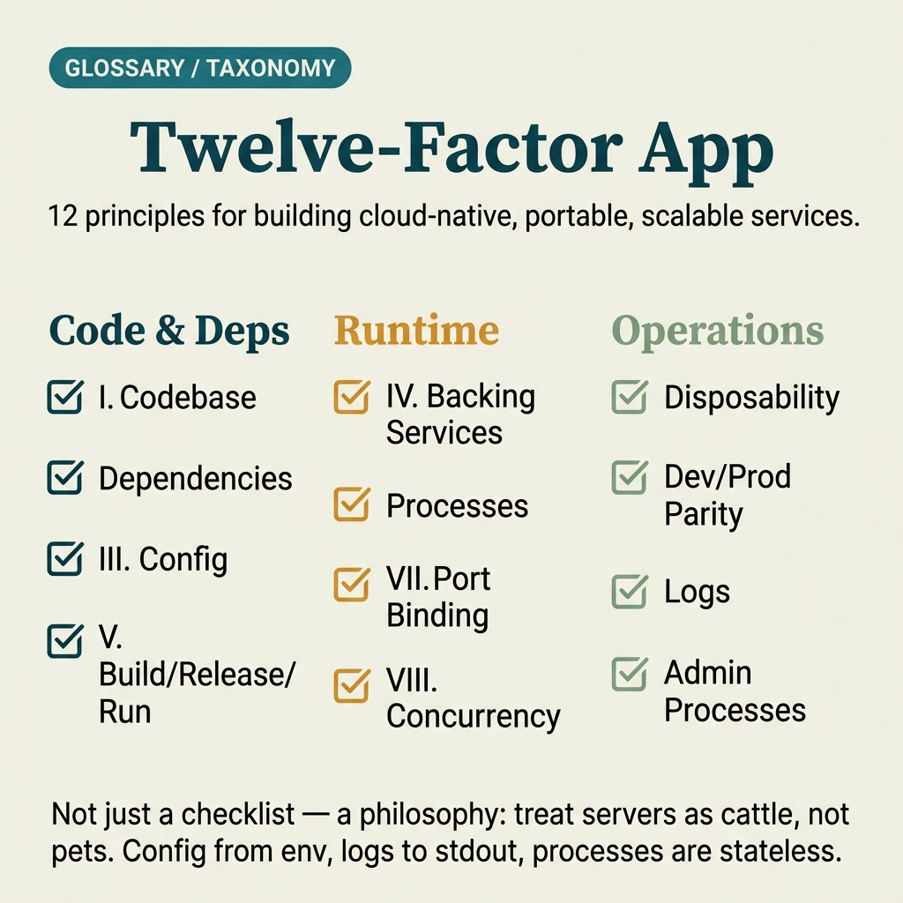

<!-- tags: glossary, reference, software-engineering-fundamentals, twelve-factor-app -->
# 12-Factor App

> A set of design principles for cloud-native applications, emphasizing separation of config from code, stateless processes, automation, and repeatable deployments.

| Aspect | Detail |
| --- | --- |
| **Concept** | A set of design principles for cloud-native applications, emphasizing separation of config from code, stateless processes, automation, and repeatable deployments. |
| **Audience** | Reviewer, tech lead, developer who needs to use this term within the correct boundary |
| **Primary style** | Glossary term |
| **Entry point** | Use when the concept of **12-Factor App** needs to be named correctly in a review, ADR, or incident note. |

📅 Created: 2026-03-30 · 🔄 Updated: 2026-04-04 · ⏱️ 5 min read

---

## 1. DEFINE

You are in the middle of a code review or writing an ADR. Someone says: "this is **12-Factor App**." If the room understands that word in three different ways, the discussion will drift away from the actual technical problem. This glossary term exists to lock the boundary before the team decides whether to refactor, accept a trade-off, or change policy.

**12-Factor App** is a set of design principles for cloud-native applications, emphasizing separation of config from code, stateless processes, automation, and repeatable deployments.

12-Factor App is not a magic checklist for every system, but it provides an excellent baseline for config, statelessness, and automation in modern cloud/runtime environments.

| Variant | Description |
| --- | --- |
| Config in Environment | Separate config from code so the artifact can be deployed across multiple environments. |
| Stateless Processes | Every process can be replaced at any time without losing critical internal state. |
| Logs as Event Streams | Logs are emitted to stdout/stderr or a centralized pipeline — not tightly bound to local files. |

| Approach | Time | Space | When to choose |
| --- | --- | --- | --- |
| Factor-by-factor gap scan | O(12) | O(1) | When auditing a current service against the cloud-native baseline. |
| Runtime contract first | Per service | O(1) | When designing a new service and wanting to avoid local state from the start. |
| Ops feedback loop | Per deploy cycle | O(1) | When connecting 12-factor to observability and real-world rollout. |

Core insight:

> 12-Factor is useful because it forces the application to think of itself as a deployable unit that can be built, released, and run repeatably. It cuts through many implicit assumptions like "this server lives forever" or "this config is just temporary in the code."

### 1.1 Invariants & Failure Modes

A good glossary term must maintain these invariants:
- 12-Factor App must refer to the same class of phenomena or decision in all related documents;
- the term must be accompanied by evidence, not just a feeling;
- 12-Factor App must lead to a clear next action: continue reviewing, refactor, harden, or accept intentionally.

The failure mode is memorizing the 12 factors as slogans without connecting them to real trade-offs, such as stateful workloads, local caching, or migration steps that need their own orchestration.

---

## 2. CONTEXT

**Who uses it**: Reviewer, tech lead, developer who needs to use this term within the correct boundary

**When**: Use when the concept of **12-Factor App** needs to be named correctly in a review, ADR, or incident note.

**Purpose**: 12-Factor is useful because it forces the application to think of itself as a deployable unit that can be built, released, and run repeatably. It cuts through many implicit assumptions like "this server lives forever" or "this config is just temporary in the code."

**In the ecosystem**:
When using the term **12-Factor App**, always attach it to a specific boundary: module, review workflow, runtime signal, or operational policy. Without a boundary, the reader hears a buzzword rather than a decision aid.

---

The 12 cloud-native principles are clear. But which factor is most important, which one do teams violate most often, and when is 12-factor too strict?

## 3. EXAMPLES

12-Factor App surfaces most clearly when config lives in code and deploying to staging requires editing source, when logs write to a local file and a container restart loses everything, or when a service is not stateless and horizontal scaling is impossible. The examples below place the pattern in exactly those moments.

### Example 1: Basic — Quick audit of a service against the 12-factor baseline

> **Goal**: Create a short note so the entire team uses **12-Factor App** with the same meaning in a PR or review.
> **Approach**: Use a structured YAML note to force the term to come with a summary, boundary, and next step instead of a bare buzzword.
> **Example**: A reviewer wants to say "this is 12-Factor App" without leaving an opinionated comment.
> **Complexity**: Basic — turn vocabulary into a clear artifact before deeper debate.


*Figure: The 12-factor pipeline separates three strict phases — Build (compile artifact), Release (attach config), Run (execute stateless process). Config comes from environment variables, not source code. Logs stream to stdout; state lives in backing services. Violating these boundaries creates "works on my laptop" failures.*

```yaml
term: 08-twelve-factor-app
title: "12-Factor App"
decision_context: "PR or design review needs to name 12-Factor App correctly to lock the boundary before further debate."
use_when:
  - "Need to lock the meaning of the term before the team debates further"
  - "Want to attach the term to a specific technical boundary"
not_when:
  - "Actual impact or relevant boundary has not been identified yet"
summary: "A set of design principles for cloud-native applications, emphasizing separation of config from code, stateless processes, automation, and repeatable deployments."
next_step: "Open adjacent terms if 12-Factor App needs to be distinguished from similar concepts."
```

**Why?** Even as a basic example, the structured note is valuable because it forces the writer to prove they are actually talking about **12-Factor App**, not a vague feeling of discomfort. Simply forcing boundary and next step into writing eliminates a great deal of noise in discussions.

**Takeaway**: When 12-Factor App comes with a clear artifact, reviews focus on changeability and real boundaries instead of stopping at engineering slogans.

### Example 2: Intermediate — Use 12-factor to separate config from the artifact

> **Goal**: Distinguish **12-Factor App** from similar concepts so the backlog or design notes do not mix different types of work.
> **Approach**: Use a small review checklist to ask the right questions about boundary, evidence, and impact before accepting the term.
> **Example**: The team is about to create a ticket or ADR comment and needs to know which term should be the primary vocabulary.
> **Complexity**: Intermediate — trade-offs and risk classification require clearer mechanism explanation.

```yaml
review_question: "Is this actually a 12-Factor App issue or just a symptom that looks similar?"
boundary:
  system_area: "service / module / runtime / review comment"
  observable_impact:
    - "change cost"
    - "design clarity"
    - "operational behavior"
comparison:
  this_term: "12-Factor App"
  often_confused_with: "12-Factor App is not a magic checklist for every system, but it provides an excellent baseline for config, statelessness, and automation in modern cloud/runtime environments."
decision:
  keep_term: true
  evidence_required:
    - "state the specific phenomenon"
    - "state the decision or risk affected"
    - "state the follow-up action if needed"
```

**Why?** This checklist forces the team to move from symptoms to mechanisms. Without comparing boundaries and evidence, a term like **12-Factor App** easily gets misused: sometimes to describe a root cause, sometimes to describe a consequence, sometimes as a purely emotional label.

**Takeaway**: The intermediate value of 12-Factor App is helping tickets, reviews, and ADRs correctly classify the type of debt or hygiene that needs to be addressed first.

### Example 3: Advanced — Identify where 12-factor falls short and needs supplemental policy

> **Goal**: Elevate **12-Factor App** from shared vocabulary into a lightweight guardrail in the engineering workflow.
> **Approach**: Write a policy/checklist so that anyone using the term must identify the boundary, impact, and next action.
> **Example**: Apply to PR templates, ADR templates, or incident postmortems so the term is not used in the wrong context.
> **Complexity**: Advanced — moving from a personal note to team- or module-level governance.

```yaml
policy:
  glossary_term: "12-Factor App"
  trigger:
    - "PR review repeats the same type of comment"
    - "ADR needs to lock vocabulary to prevent misunderstanding"
    - "incident postmortem needs to distinguish the correct cause"
  owner: "tech lead or reviewer responsible for that boundary"
  checklist:
    - "State the term"
    - "State the boundary"
    - "State the impact"
    - "State the next action"
  reject_if:
    - "term is used as a buzzword"
    - "no evidence or corresponding system behavior"
```

**Why?** A term only truly lives within a team when it becomes part of the workflow — not just individual memory. This small policy turns **12-Factor App** into a language contract: anyone using the term must prove they are pointing at the same class of decision or risk.

**Takeaway**: At the advanced level, Twelve-Factor App is a set of criteria for keeping applications consistently operable on a platform — not a poster of slogans to check off.

---

## 4. COMPARE




*Figure: The position of 12-Factor App between cloud-native principles, microservices, and container best practices.*

12-Factor sounds like a container checklist. Not exactly: 12-Factor predates Docker — it is a methodology for SaaS apps. Containerization is one way to implement it, not a requirement.

### Level 1

```text
Build once -> config via env -> stateless process -> logs to stream -> repeatable deploy.
```
*Figure: Level 1 places the term **12-Factor App** into a simple decision flow so beginners know when to use this term instead of speaking vaguely.*

### Level 2

```text
If encountering...                         What signal identifies 12-Factor App correctly
-----------------------------------------  ---------------------------------------------------------
Vague comment about 12-Factor App           Find the specific boundary: module, policy, runtime, or related workflow
A similar term appears                      Compare 12-Factor App's invariant with the easily confused concept
Need to choose an action after mentioning   Decide whether to refactor, harden, measure more, or accept the trade-off
12-Factor does not solve every architecture, but it is a very strong baseline to detect operational smells before a service scales or goes multi-env.
```
*Figure: Level 2 helps experienced readers see that a glossary term is not just a definition — it is a decision router for choosing the correct next action.*

### Easy to confuse or cross the boundary

| # | Severity | Mistake | Consequence | Fix |
| --- | --- | --- | --- | --- |
| 1 | 🔴 Fatal | Using **12-Factor App** as a buzzword without a boundary | Team says the same word but argues about three different issues | Always state the module, workflow, or runtime behavior the term points to |
| 2 | 🟡 Common | Mixing **12-Factor App** with similar concepts | Tickets, ADRs, or reviews get misclassified | Add a comparison line in the note or README hub before expanding scope |
| 3 | 🟡 Common | Naming the term without a next action | Glossary becomes a decorative dictionary, not a decision aid | Accompany with an action: measure more, refactor, harden, create policy, or accept trade-off |
| 4 | 🔵 Minor | Deep-linking the term without linking back to the topic hub | Reader understands the term in isolation, hard to place in a learning path | Keep the README topic and adjacent concepts in RECOMMEND / navigation at the end |

### Quick scan

| If you encounter | What to do |
| --- | --- |
| Someone uses **12-Factor App** too generically | Ask for boundary, impact, and next action before agreeing to keep the term |
| Need to deep-link quickly in a review | Link directly to this glossary file, then connect through the topic hub for broader context |
| Team is mixing up several similar terms | Open the topic hub to compare adjacent concepts before creating a ticket or ADR |

---

## 5. REF

| Resource | Type | Link | Notes |
| --- | --- | --- | --- |
| Martin Fowler | Blog | https://martinfowler.com/ | Strong source for vocabulary on design, refactoring, and architecture debt. |
| Refactoring.Guru | Reference | https://refactoring.guru/ | Useful when comparing glossary terms with similar patterns or smells. |
| The Twelve-Factor App | Official | https://12factor.net/ | Source of truth for terms leaning toward runtime and deploy hygiene. |

---

## 6. RECOMMEND

12-Factor App answers the question "the app works on my laptop but dies on the cloud." The next question: how does graceful shutdown work, and what about health checks?

| Expand to | When to read next | Why | File/Link |
| --- | --- | --- | --- |
| Topic hub | When **12-Factor App** needs to be placed in a larger learning path | Avoid understanding the term as an island separated from the taxonomy | [Software Engineering Fundamentals](./README.md) |
| Previous concept | When you need to return to the preceding term for boundary comparison | Useful if the discussion is sliding between two similar terms | [Hexagonal Architecture](./07-hexagonal-architecture.md) |
| Next concept | When the current term typically leads to an adjacent decision or pattern | Helps read continuously along the concept chain of the topic | [Graceful Shutdown](./09-graceful-shutdown.md) |

Back to that config-in-code at the beginning — deploying to staging required editing source, logs went to local files, container restarts lost everything. Now you know: config via env, logs via stdout, processes stateless. Not a hard rule for every app, but violate it and the cloud will punish you.

**Links**: [← Previous](./07-hexagonal-architecture.md) · [→ Next](./09-graceful-shutdown.md)
