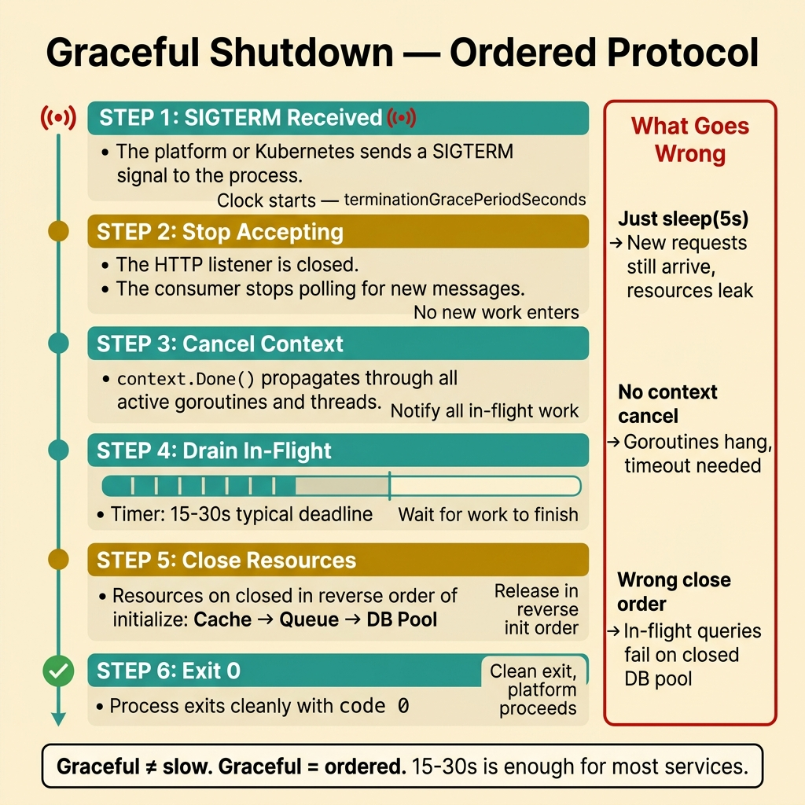
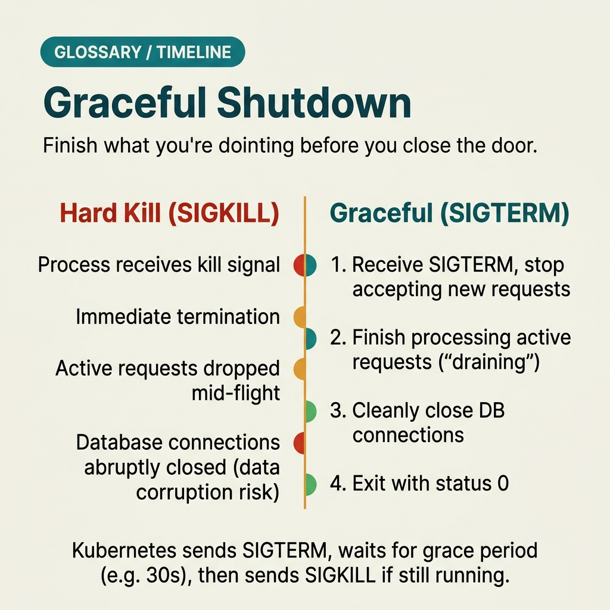

<!-- tags: glossary, reference, software-engineering-fundamentals, graceful-shutdown -->
# Graceful Shutdown

> A method for stopping a service safely: stop accepting new requests, complete in-flight work, close resources, and only then exit the process.

| Aspect | Detail |
| --- | --- |
| **Concept** | A method for stopping a service safely: stop accepting new requests, complete in-flight work, close resources, and only then exit the process. |
| **Audience** | Reviewer, tech lead, developer who needs to use this term within the correct boundary |
| **Primary style** | Glossary term |
| **Entry point** | Use when the concept of **Graceful Shutdown** needs to be named correctly in a review, ADR, or incident note. |

📅 Created: 2026-03-30 · 🔄 Updated: 2026-04-04 · ⏱️ 5 min read

---

## 1. DEFINE

You are in the middle of a code review or writing an ADR. Someone says: "this is **Graceful Shutdown**." If the room understands that word in three different ways, the discussion will drift away from the actual technical problem. This glossary term exists to lock the boundary before the team decides whether to refactor, accept a trade-off, or change policy.

**Graceful Shutdown** is a method for stopping a service safely: stop accepting new requests, complete in-flight work, close resources, and only then exit the process.

Graceful shutdown differs from killing a process immediately. The goal is to stop accepting new work, drain work already in progress, and release resources in a safe order.

| Variant | Description |
| --- | --- |
| HTTP Drain | Stop accepting new requests, then wait for in-progress requests to finish or timeout. |
| Worker Drain | Stop pulling new jobs from the queue but allow currently running jobs to complete. |
| Signal-driven Shutdown | Listen for SIGTERM/SIGINT and map them to a cleanup flow with a deadline. |

| Approach | Time | Space | When to choose |
| --- | --- | --- | --- |
| Stop-accept first | O(1) | O(1) | When the service has a continuous work intake such as HTTP, consumer, or scheduler. |
| Deadline-based drain | Per timeout | O(1) | When balancing between completing old work and rollout speed. |
| Cleanup ordering | O(n resources) | O(1) | When DB pools, queue connections, and background workers need to close in order. |

Core insight:

> Graceful shutdown is not "wait a moment then exit." It is an ordered protocol: stop accepting, notify cancellation, drain in-flight work, close resources, then exit.

### 1.1 Invariants & Failure Modes

A good glossary term must maintain these invariants:
- Graceful Shutdown must refer to the same class of phenomena or decision in all related documents;
- the term must be accompanied by evidence, not just a feeling;
- Graceful Shutdown must lead to a clear next action: continue reviewing, refactor, harden, or accept intentionally.

The failure mode is simply trapping a signal and sleeping for a few seconds. That does not prevent new requests, does not propagate cancellation, and does not guarantee that in-flight work is handled consistently.

---

## 2. CONTEXT

**Who uses it**: Reviewer, tech lead, developer who needs to use this term within the correct boundary

**When**: Use when the concept of **Graceful Shutdown** needs to be named correctly in a review, ADR, or incident note.

**Purpose**: Graceful shutdown is not "wait a moment then exit." It is an ordered protocol: stop accepting, notify cancellation, drain in-flight work, close resources, then exit.

**In the ecosystem**:
When using the term **Graceful Shutdown**, always attach it to a specific boundary: module, review workflow, runtime signal, or operational policy. Without a boundary, the reader hears a buzzword rather than a decision aid.

---

Shutting down cleanly before stopping is clear. But how long should the timeout be, how do you drain connections, and what about requests being processed mid-stream?

## 3. EXAMPLES

Graceful shutdown surfaces most clearly when a new deploy kills the old pod while a user is mid-checkout, when a DB connection pool leaks because the process was SIGKILLed, or when rolling updates cause 5xx spikes on every deployment. The examples below place the pattern in exactly those moments.

### Example 1: Basic — Stop an HTTP service without cutting in-progress requests

> **Goal**: Create a short note so the entire team uses **Graceful Shutdown** with the same meaning in a PR or review.
> **Approach**: Use a structured YAML note to force the term to come with a summary, boundary, and next step instead of a bare buzzword.
> **Example**: A reviewer wants to say "this is Graceful Shutdown" without leaving an opinionated comment.
> **Complexity**: Basic — turn vocabulary into a clear artifact before deeper debate.



*Figure: Graceful shutdown follows a strict sequence: SIGTERM arrives → stop accepting new connections → propagate context cancellation → drain in-flight requests with a deadline → close resources (DB pool, queue, cache) in reverse init order → exit with code 0. Skipping any step creates the illusion of graceful while still losing work.*

```yaml
term: 09-graceful-shutdown
title: "Graceful Shutdown"
decision_context: "PR or design review needs to name Graceful Shutdown correctly to lock the boundary before further debate."
use_when:
  - "Need to lock the meaning of the term before the team debates further"
  - "Want to attach the term to a specific technical boundary"
not_when:
  - "Actual impact or relevant boundary has not been identified yet"
summary: "A method for stopping a service safely: stop accepting new requests, complete in-flight work, close resources, and only then exit the process."
next_step: "Open adjacent terms if Graceful Shutdown needs to be distinguished from similar concepts."
```

**Why?** Even as a basic example, the structured note is valuable because it forces the writer to prove they are actually talking about **Graceful Shutdown**, not a vague feeling of discomfort. Simply forcing boundary and next step into writing eliminates a great deal of noise in discussions.

**Takeaway**: When Graceful Shutdown comes with a clear artifact, reviews focus on changeability and real boundaries instead of stopping at engineering slogans.

### Example 2: Intermediate — Design a shutdown flow for workers and background jobs

> **Goal**: Distinguish **Graceful Shutdown** from similar concepts so the backlog or design notes do not mix different types of work.
> **Approach**: Use a small review checklist to ask the right questions about boundary, evidence, and impact before accepting the term.
> **Example**: The team is about to create a ticket or ADR comment and needs to know which term should be the primary vocabulary.
> **Complexity**: Intermediate — trade-offs and risk classification require clearer mechanism explanation.

```yaml
review_question: "Is this actually Graceful Shutdown or just a symptom that looks similar?"
boundary:
  system_area: "service / module / runtime / review comment"
  observable_impact:
    - "change cost"
    - "design clarity"
    - "operational behavior"
comparison:
  this_term: "Graceful Shutdown"
  often_confused_with: "Graceful shutdown differs from killing a process immediately. The goal is to stop accepting new work, drain work already in progress, and release resources in a safe order."
decision:
  keep_term: true
  evidence_required:
    - "state the specific phenomenon"
    - "state the decision or risk affected"
    - "state the follow-up action if needed"
```

**Why?** This checklist forces the team to move from symptoms to mechanisms. Without comparing boundaries and evidence, a term like **Graceful Shutdown** easily gets misused: sometimes to describe a root cause, sometimes to describe a consequence, sometimes as a purely emotional label.

**Takeaway**: The intermediate value of Graceful Shutdown is helping tickets, reviews, and ADRs correctly classify the type of debt or hygiene that needs to be addressed first.

### Example 3: Advanced — Standardize graceful shutdown into a release/runtime checklist

> **Goal**: Elevate **Graceful Shutdown** from shared vocabulary into a lightweight guardrail in the engineering workflow.
> **Approach**: Write a policy/checklist so that anyone using the term must identify the boundary, impact, and next action.
> **Example**: Apply to PR templates, ADR templates, or incident postmortems so the term is not used in the wrong context.
> **Complexity**: Advanced — moving from a personal note to team- or module-level governance.

```yaml
policy:
  glossary_term: "Graceful Shutdown"
  trigger:
    - "PR review repeats the same type of comment"
    - "ADR needs to lock vocabulary to prevent misunderstanding"
    - "incident postmortem needs to distinguish the correct cause"
  owner: "tech lead or reviewer responsible for that boundary"
  checklist:
    - "State the term"
    - "State the boundary"
    - "State the impact"
    - "State the next action"
  reject_if:
    - "term is used as a buzzword"
    - "no evidence or corresponding system behavior"
```

**Why?** A term only truly lives within a team when it becomes part of the workflow — not just individual memory. This small policy turns **Graceful Shutdown** into a language contract: anyone using the term must prove they are pointing at the same class of decision or risk.

**Takeaway**: At the advanced level, Graceful Shutdown is a contract between the application, the platform, and the running workload — not just handling signals for show.

---

## 4. COMPARE




*Figure: The position of graceful shutdown between health checks, liveness/readiness probes, and deployment strategy.*

Graceful shutdown sounds like "shutting down the app properly." True — but in Kubernetes, graceful shutdown must coordinate with the readiness probe and preStop hook, not just trap SIGTERM.

### Level 1

```text
SIGTERM -> stop accept -> cancel context -> drain in-flight -> close resources -> exit.
```
*Figure: Level 1 places the term **Graceful Shutdown** into a simple decision flow so beginners know when to use this term instead of speaking vaguely.*

### Level 2

```text
If encountering...                              What signal identifies Graceful Shutdown correctly
-----------------------------------------        ---------------------------------------------------------
Vague comment about Graceful Shutdown             Find the specific boundary: module, policy, runtime, or related workflow
A similar term appears                            Compare Graceful Shutdown's invariant with the easily confused concept
Need to choose an action after mentioning it      Decide whether to refactor, harden, measure more, or accept the trade-off
The more components shutting down concurrently, the more order matters; closing the wrong resource first can fail in-flight work even though the app "appears" to be graceful.
```
*Figure: Level 2 helps experienced readers see that a glossary term is not just a definition — it is a decision router for choosing the correct next action.*

### Easy to confuse or cross the boundary

| # | Severity | Mistake | Consequence | Fix |
| --- | --- | --- | --- | --- |
| 1 | 🔴 Fatal | Using **Graceful Shutdown** as a buzzword without a boundary | Team says the same word but argues about three different issues | Always state the module, workflow, or runtime behavior the term points to |
| 2 | 🟡 Common | Mixing **Graceful Shutdown** with similar concepts | Tickets, ADRs, or reviews get misclassified | Add a comparison line in the note or README hub before expanding scope |
| 3 | 🟡 Common | Naming the term without a next action | Glossary becomes a decorative dictionary, not a decision aid | Accompany with an action: measure more, refactor, harden, create policy, or accept trade-off |
| 4 | 🔵 Minor | Deep-linking the term without linking back to the topic hub | Reader understands the term in isolation, hard to place in a learning path | Keep the README topic and adjacent concepts in RECOMMEND / navigation at the end |

### Quick scan

| If you encounter | What to do |
| --- | --- |
| Someone uses **Graceful Shutdown** too generically | Ask for boundary, impact, and next action before agreeing to keep the term |
| Need to deep-link quickly in a review | Link directly to this glossary file, then connect through the topic hub for broader context |
| Team is mixing up several similar terms | Open the topic hub to compare adjacent concepts before creating a ticket or ADR |

---

## 5. REF

| Resource | Type | Link | Notes |
| --- | --- | --- | --- |
| Martin Fowler | Blog | https://martinfowler.com/ | Strong source for vocabulary on design, refactoring, and architecture debt. |
| Refactoring.Guru | Reference | https://refactoring.guru/ | Useful when comparing glossary terms with similar patterns or smells. |
| The Twelve-Factor App | Official | https://12factor.net/ | Good source of truth for terms leaning toward runtime and deploy hygiene. |

---

## 6. RECOMMEND

Graceful shutdown answers the question "new deploys cause 5xx because old pods die mid-request." The next question: how should health checks be configured, and what is the difference between liveness and readiness?

| Expand to | When to read next | Why | File/Link |
| --- | --- | --- | --- |
| Topic hub | When **Graceful Shutdown** needs to be placed in a larger learning path | Avoid understanding the term as an island separated from the taxonomy | [Software Engineering Fundamentals](./README.md) |
| Previous concept | When you need to return to the preceding term for boundary comparison | Useful if the discussion is sliding between two similar terms | [12-Factor App](./08-twelve-factor-app.md) |
| Next concept | When the current term typically leads to an adjacent decision or pattern | Helps read continuously along the concept chain of the topic | [Health Check](./10-health-check.md) |

Back to that deploy at the beginning — killed the old pod, the user was mid-checkout and got a 5xx. Now you know: trap SIGTERM, drain connections, wait for in-flight requests to finish, then exit. 15–30 seconds is enough for most services.

**Links**: [← Previous](./08-twelve-factor-app.md) · [→ Next](./10-health-check.md)
