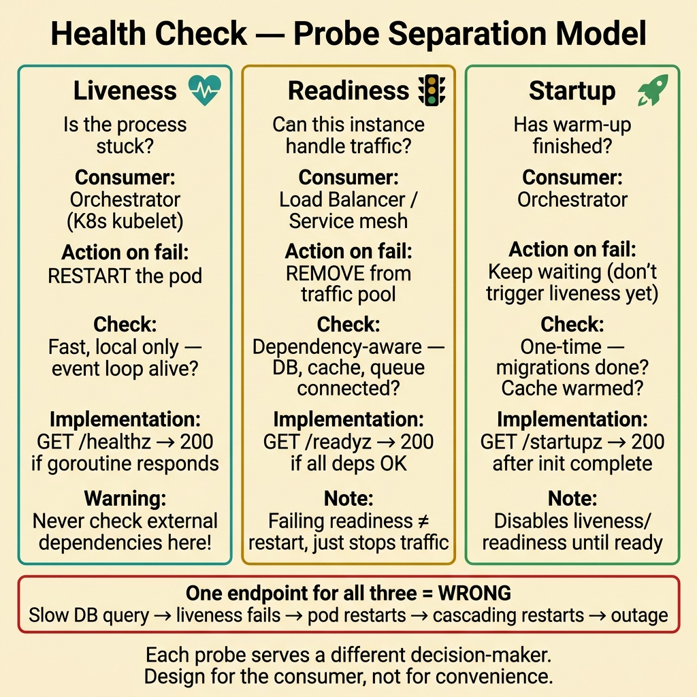
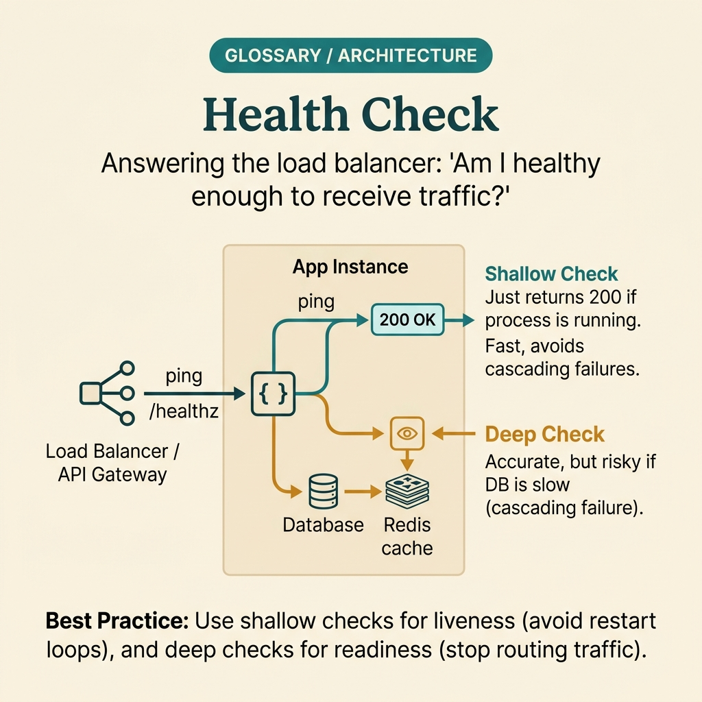

<!-- tags: glossary, reference, software-engineering-fundamentals, health-check -->
# Health Check

> An endpoint or signal used to confirm whether an application is alive, ready, or experiencing an error that requires orchestrator intervention.

| Aspect | Detail |
| --- | --- |
| **Concept** | An endpoint or signal used to confirm whether an application is alive, ready, or experiencing an error that requires orchestrator intervention. |
| **Audience** | Reviewer, tech lead, developer who needs to use this term within the correct boundary |
| **Primary style** | Glossary term |
| **Entry point** | Use when the concept of **Health Check** needs to be named correctly in a review, ADR, or incident note. |

📅 Created: 2026-03-30 · 🔄 Updated: 2026-04-04 · ⏱️ 5 min read

---

## 1. DEFINE

You are in the middle of a code review or writing an ADR. Someone says: "this is **Health Check**." If the room understands that word in three different ways, the discussion will drift away from the actual technical problem. This glossary term exists to lock the boundary before the team decides whether to refactor, accept a trade-off, or change policy.

**Health Check** is an endpoint or signal used to confirm whether an application is alive, ready, or experiencing an error that requires orchestrator intervention.

A health check is a concise diagnostic signal, not a business endpoint. It serves the operational decisions of the orchestrator or load balancer.

| Variant | Description |
| --- | --- |
| Liveness | Answers the question: is the process alive, and should it be restarted? |
| Readiness | Answers the question: is the instance ready to accept traffic? |
| Startup | Answers the question: has the app finished warming up so that other probes become meaningful? |

| Approach | Time | Space | When to choose |
| --- | --- | --- | --- |
| Fast local check | O(1) | O(1) | When liveness only needs to know whether the event loop/process is stuck. |
| Dependency-aware readiness | Per dependency count | O(1) | When readiness depends on DB, queue, cache, or migration state. |
| Probe separation | O(1) | O(1) | When you need to prevent one endpoint from serving both liveness and readiness and sending wrong signals. |

Core insight:

> A health check is valuable because it helps other systems make decisions on your behalf. If the probe does not accurately reflect runtime state, the orchestrator will restart at the wrong time or route traffic to an instance that is not ready.

### 1.1 Invariants & Failure Modes

A good glossary term must maintain these invariants:
- Health Check must refer to the same class of phenomena or decision in all related documents;
- the term must be accompanied by evidence, not just a feeling;
- Health Check must lead to a clear next action: continue reviewing, refactor, harden, or accept intentionally.

The failure mode is reusing the same endpoint for every purpose. When that happens, a slow dependency can cause the liveness check to fail and trigger a meaningless restart of the instance.

---

## 2. CONTEXT

**Who uses it**: Reviewer, tech lead, developer who needs to use this term within the correct boundary

**When**: Use when the concept of **Health Check** needs to be named correctly in a review, ADR, or incident note.

**Purpose**: A health check is valuable because it helps other systems make decisions on your behalf. If the probe does not accurately reflect runtime state, the orchestrator will restart at the wrong time or route traffic to an instance that is not ready.

**In the ecosystem**:
When using the term **Health Check**, always attach it to a specific boundary: module, review workflow, runtime signal, or operational policy. Without a boundary, the reader hears a buzzword rather than a decision aid.

---

A health endpoint is clear. But what should the health endpoint check, should deep checks be included, and how do you handle false positives/negatives?

## 3. EXAMPLES

Health check surfaces most clearly when the endpoint returns 200 but the DB connection is dead, when a deep health check calls every dependency and takes 5 seconds to respond, or when a load balancer routes traffic to a pod that is not ready. The examples below place the pattern in exactly those moments.

### Example 1: Basic — Design a health endpoint that serves the right operational decision

> **Goal**: Create a short note so the entire team uses **Health Check** with the same meaning in a PR or review.
> **Approach**: Use a structured YAML note to force the term to come with a summary, boundary, and next step instead of a bare buzzword.
> **Example**: A reviewer wants to say "this is Health Check" without leaving an opinionated comment.
> **Complexity**: Basic — turn vocabulary into a clear artifact before deeper debate.



*Figure: Health checks serve three distinct questions for three distinct consumers. Liveness asks "is the process stuck?" — the orchestrator restarts if yes. Readiness asks "can this instance handle traffic?" — the load balancer removes it if not. Startup asks "has warm-up finished?" — other probes are disabled until startup succeeds. Mixing these into one endpoint creates false signals that cascade into wrong decisions.*

```yaml
term: 10-health-check
title: "Health Check"
decision_context: "PR or design review needs to name Health Check correctly to lock the boundary before further debate."
use_when:
  - "Need to lock the meaning of the term before the team debates further"
  - "Want to attach the term to a specific technical boundary"
not_when:
  - "Actual impact or relevant boundary has not been identified yet"
summary: "An endpoint or signal used to confirm whether an application is alive, ready, or experiencing an error that requires orchestrator intervention."
next_step: "Open adjacent terms if Health Check needs to be distinguished from similar concepts."
```

**Why?** Even as a basic example, the structured note is valuable because it forces the writer to prove they are actually talking about **Health Check**, not a vague feeling of discomfort. Simply forcing boundary and next step into writing eliminates a great deal of noise in discussions.

**Takeaway**: When Health Check comes with a clear artifact, reviews focus on changeability and real boundaries instead of stopping at engineering slogans.

### Example 2: Intermediate — Separate liveness and readiness instead of combining them

> **Goal**: Distinguish **Health Check** from similar concepts so the backlog or design notes do not mix different types of work.
> **Approach**: Use a small review checklist to ask the right questions about boundary, evidence, and impact before accepting the term.
> **Example**: The team is about to create a ticket or ADR comment and needs to know which term should be the primary vocabulary.
> **Complexity**: Intermediate — trade-offs and risk classification require clearer mechanism explanation.

```yaml
review_question: "Is this actually a Health Check issue or just a symptom that looks similar?"
boundary:
  system_area: "service / module / runtime / review comment"
  observable_impact:
    - "change cost"
    - "design clarity"
    - "operational behavior"
comparison:
  this_term: "Health Check"
  often_confused_with: "A health check is a concise diagnostic signal, not a business endpoint. It serves the operational decisions of the orchestrator or load balancer."
decision:
  keep_term: true
  evidence_required:
    - "state the specific phenomenon"
    - "state the decision or risk affected"
    - "state the follow-up action if needed"
```

**Why?** This checklist forces the team to move from symptoms to mechanisms. Without comparing boundaries and evidence, a term like **Health Check** easily gets misused: sometimes to describe a root cause, sometimes to describe a consequence, sometimes as a purely emotional label.

**Takeaway**: The intermediate value of Health Check is helping tickets, reviews, and ADRs correctly classify the type of debt or hygiene that needs to be addressed first.

### Example 3: Advanced — Turn health checks into a contract between app and orchestrator

> **Goal**: Elevate **Health Check** from shared vocabulary into a lightweight guardrail in the engineering workflow.
> **Approach**: Write a policy/checklist so that anyone using the term must identify the boundary, impact, and next action.
> **Example**: Apply to PR templates, ADR templates, or incident postmortems so the term is not used in the wrong context.
> **Complexity**: Advanced — moving from a personal note to team- or module-level governance.

```yaml
policy:
  glossary_term: "Health Check"
  trigger:
    - "PR review repeats the same type of comment"
    - "ADR needs to lock vocabulary to prevent misunderstanding"
    - "incident postmortem needs to distinguish the correct cause"
  owner: "tech lead or reviewer responsible for that boundary"
  checklist:
    - "State the term"
    - "State the boundary"
    - "State the impact"
    - "State the next action"
  reject_if:
    - "term is used as a buzzword"
    - "no evidence or corresponding system behavior"
```

**Why?** A term only truly lives within a team when it becomes part of the workflow — not just individual memory. This small policy turns **Health Check** into a language contract: anyone using the term must prove they are pointing at the same class of decision or risk.

**Takeaway**: At the advanced level, Health Check is the communication language between the service and the control plane — not just a green/red endpoint for peace of mind.

---

## 4. COMPARE




*Figure: The position of health check between liveness probe, readiness probe, and smoke test.*

Health check sounds like liveness probe. Not exactly: a health check is a general endpoint, a liveness probe asks "is the pod alive?", and a readiness probe asks "is the pod ready to accept traffic?" Three different questions.

### Level 1

```text
Probe -> orchestrator reads signal -> restart or route traffic based on probe meaning.
```
*Figure: Level 1 places the term **Health Check** into a simple decision flow so beginners know when to use this term instead of speaking vaguely.*

### Level 2

```text
If encountering...                              What signal identifies Health Check correctly
-----------------------------------------        ---------------------------------------------------------
Vague comment about Health Check                  Find the specific boundary: module, policy, runtime, or related workflow
A similar term appears                            Compare Health Check's invariant with the easily confused concept
Need to choose an action after mentioning it      Decide whether to refactor, harden, measure more, or accept the trade-off
A correct probe must be optimized for the decision it serves, not for "convenience" in implementation.
```
*Figure: Level 2 helps experienced readers see that a glossary term is not just a definition — it is a decision router for choosing the correct next action.*

### Easy to confuse or cross the boundary

| # | Severity | Mistake | Consequence | Fix |
| --- | --- | --- | --- | --- |
| 1 | 🔴 Fatal | Using **Health Check** as a buzzword without a boundary | Team says the same word but argues about three different issues | Always state the module, workflow, or runtime behavior the term points to |
| 2 | 🟡 Common | Mixing **Health Check** with similar concepts | Tickets, ADRs, or reviews get misclassified | Add a comparison line in the note or README hub before expanding scope |
| 3 | 🟡 Common | Naming the term without a next action | Glossary becomes a decorative dictionary, not a decision aid | Accompany with an action: measure more, refactor, harden, create policy, or accept trade-off |
| 4 | 🔵 Minor | Deep-linking the term without linking back to the topic hub | Reader understands the term in isolation, hard to place in a learning path | Keep the README topic and adjacent concepts in RECOMMEND / navigation at the end |

### Quick scan

| If you encounter | What to do |
| --- | --- |
| Someone uses **Health Check** too generically | Ask for boundary, impact, and next action before agreeing to keep the term |
| Need to deep-link quickly in a review | Link directly to this glossary file, then connect through the topic hub for broader context |
| Team is mixing up several similar terms | Open the topic hub to compare adjacent concepts before creating a ticket or ADR |

---

## 5. REF

| Resource | Type | Link | Notes |
| --- | --- | --- | --- |
| Martin Fowler | Blog | https://martinfowler.com/ | Strong source for vocabulary on design, refactoring, and architecture debt. |
| Refactoring.Guru | Reference | https://refactoring.guru/ | Useful when comparing glossary terms with similar patterns or smells. |
| The Twelve-Factor App | Official | https://12factor.net/ | Good source of truth for terms leaning toward runtime and deploy hygiene. |

---

## 6. RECOMMEND

Health check answers the question "the service is running but nobody knows if it is healthy." The next question: how do you distinguish liveness from readiness, and what does immutable infrastructure look like?

| Expand to | When to read next | Why | File/Link |
| --- | --- | --- | --- |
| Topic hub | When **Health Check** needs to be placed in a larger learning path | Avoid understanding the term as an island separated from the taxonomy | [Software Engineering Fundamentals](./README.md) |
| Previous concept | When you need to return to the preceding term for boundary comparison | Useful if the discussion is sliding between two similar terms | [Graceful Shutdown](./09-graceful-shutdown.md) |
| Next concept | When the current term typically leads to an adjacent decision or pattern | Helps read continuously along the concept chain of the topic | [Liveness vs Readiness](./11-liveness-vs-readiness.md) |

Back to that 200-OK endpoint at the beginning — it returned OK but the DB was dead. Now you know: shallow health check (process alive) for liveness, deep health check (dependencies ready) for readiness. Do not mix — liveness failure restarts the pod, readiness failure only stops traffic.

**Links**: [← Previous](./09-graceful-shutdown.md) · [→ Next](./11-liveness-vs-readiness.md)
