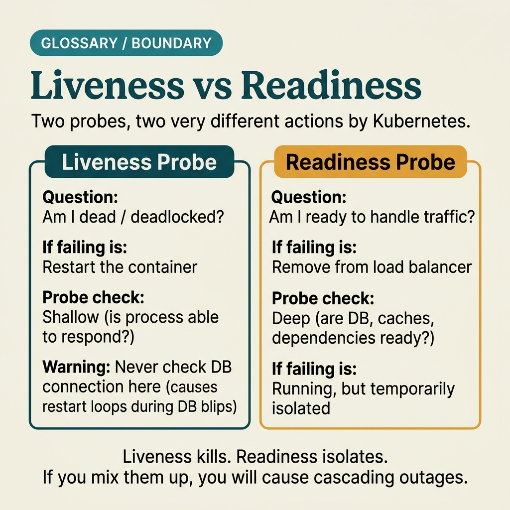

<!-- tags: glossary, reference, software-engineering-fundamentals, liveness-vs-readiness -->
# Liveness vs Readiness

> The distinction between "the process is alive" and "the instance is ready to accept traffic" — two signals that serve two different operational decisions.

| Aspect | Detail |
| --- | --- |
| **Concept** | The distinction between "the process is alive" and "the instance is ready to accept traffic" — two signals that serve two different operational decisions. |
| **Audience** | Reviewer, tech lead, developer who needs to use this term within the correct boundary |
| **Primary style** | Glossary term |
| **Entry point** | Use when the concept of **Liveness vs Readiness** needs to be named correctly in a review, ADR, or incident note. |

📅 Created: 2026-03-30 · 🔄 Updated: 2026-04-04 · ⏱️ 5 min read

---

## 1. DEFINE

You are in the middle of a code review or writing an ADR. Someone says: "this is **Liveness vs Readiness**." If the room understands that word in three different ways, the discussion will drift away from the actual technical problem. This glossary term exists to lock the boundary before the team decides whether to refactor, accept a trade-off, or change policy.

**Liveness vs Readiness** is the distinction between "the process is alive" and "the instance is ready to accept traffic" — two signals that serve two different operational decisions.

Liveness answers "should this process be restarted?", readiness answers "should traffic be sent to this instance?" One signal for process lifecycle, one signal for routing.

| Variant | Description |
| --- | --- |
| Liveness Probe | Restart signal when the process is deadlocked, in a crash loop, or stuck without recovery. |
| Readiness Probe | Traffic gate when the app has not warmed up or a dependency is temporarily unavailable. |
| Startup Probe | Buffer layer for slow-booting apps so that liveness does not kill the app prematurely. |

| Approach | Time | Space | When to choose |
| --- | --- | --- | --- |
| Probe role separation | O(1) | O(1) | When each signal should serve exactly one decision. |
| Grace period tuning | Per config | O(1) | When startup is long or dependency warmup is slow. |
| Failure-mode mapping | Per incident class | O(1) | When you need to know which failures should trigger a restart and which should only pull traffic. |

Core insight:

> Liveness and readiness only look alike on the surface as HTTP endpoints; semantically they are completely different. Mixing these two signals is one of the most common operational mistakes in service orchestration.

### 1.1 Invariants & Failure Modes

A good glossary term must maintain these invariants:
- Liveness vs Readiness must refer to the same class of phenomena or decision in all related documents;
- the term must be accompanied by evidence, not just a feeling;
- Liveness vs Readiness must lead to a clear next action: continue reviewing, refactor, harden, or accept intentionally.

The failure mode is letting readiness fail because the DB is slow and using the same endpoint for liveness. The result is that the orchestrator restarts a wave of instances exactly when the infrastructure is already shaking.

---

## 2. CONTEXT

**Who uses it**: Reviewer, tech lead, developer who needs to use this term within the correct boundary

**When**: Use when the concept of **Liveness vs Readiness** needs to be named correctly in a review, ADR, or incident note.

**Purpose**: Liveness and readiness only look alike on the surface as HTTP endpoints; semantically they are completely different. Mixing these two signals is one of the most common operational mistakes in service orchestration.

**In the ecosystem**:
When using the term **Liveness vs Readiness**, always attach it to a specific boundary: module, review workflow, runtime signal, or operational policy. Without a boundary, the reader hears a buzzword rather than a decision aid.

---

The two types of probes are clear. But what happens when liveness is confused with readiness, what about misconfigured timeouts, and when is a startup probe needed?

## 3. EXAMPLES

Liveness vs readiness surfaces most clearly when a slow DB causes liveness to fail and Kubernetes continuously restarts the pod (crash loop), when the readiness check is too lightweight and traffic reaches a pod that has not warmed up, or when a slow startup gets killed by liveness before boot completes. The examples below place the pattern in exactly those moments.

### Example 1: Basic — Classify which incidents are readiness issues and which are liveness issues

> **Goal**: Create a short note so the entire team uses **Liveness vs Readiness** with the same meaning in a PR or review.
> **Approach**: Use a structured YAML note to force the term to come with a summary, boundary, and next step instead of a bare buzzword.
> **Example**: A reviewer wants to say "this is Liveness vs Readiness" without leaving an opinionated comment.
> **Complexity**: Basic — turn vocabulary into a clear artifact before deeper debate.


*Figure: Liveness and readiness serve two completely different decision-makers. Liveness failure triggers a restart — only appropriate when the process is fundamentally stuck. Readiness failure removes the instance from the traffic pool — appropriate when a dependency is temporarily unavailable. Confusing the two turns the orchestrator's self-healing into a self-inflicted outage amplifier.*

```yaml
term: 11-liveness-vs-readiness
title: "Liveness vs Readiness"
decision_context: "PR or design review needs to name Liveness vs Readiness correctly to lock the boundary before further debate."
use_when:
  - "Need to lock the meaning of the term before the team debates further"
  - "Want to attach the term to a specific technical boundary"
not_when:
  - "Actual impact or relevant boundary has not been identified yet"
summary: "The distinction between 'the process is alive' and 'the instance is ready to accept traffic' — two signals that serve two different operational decisions."
next_step: "Open adjacent terms if Liveness vs Readiness needs to be distinguished from similar concepts."
```

**Why?** Even as a basic example, the structured note is valuable because it forces the writer to prove they are actually talking about **Liveness vs Readiness**, not a vague feeling of discomfort. Simply forcing boundary and next step into writing eliminates a great deal of noise in discussions.

**Takeaway**: When Liveness vs Readiness comes with a clear artifact, reviews focus on changeability and real boundaries instead of stopping at engineering slogans.

### Example 2: Intermediate — Tune probes for safe rollouts

> **Goal**: Distinguish **Liveness vs Readiness** from similar concepts so the backlog or design notes do not mix different types of work.
> **Approach**: Use a small review checklist to ask the right questions about boundary, evidence, and impact before accepting the term.
> **Example**: The team is about to create a ticket or ADR comment and needs to know which term should be the primary vocabulary.
> **Complexity**: Intermediate — trade-offs and risk classification require clearer mechanism explanation.

```yaml
review_question: "Is this actually a Liveness vs Readiness issue or just a symptom that looks similar?"
boundary:
  system_area: "service / module / runtime / review comment"
  observable_impact:
    - "change cost"
    - "design clarity"
    - "operational behavior"
comparison:
  this_term: "Liveness vs Readiness"
  often_confused_with: "Liveness answers 'should this process be restarted?', readiness answers 'should traffic be sent to this instance?' One signal for process lifecycle, one signal for routing."
decision:
  keep_term: true
  evidence_required:
    - "state the specific phenomenon"
    - "state the decision or risk affected"
    - "state the follow-up action if needed"
```

**Why?** This checklist forces the team to move from symptoms to mechanisms. Without comparing boundaries and evidence, a term like **Liveness vs Readiness** easily gets misused: sometimes to describe a root cause, sometimes to describe a consequence, sometimes as a purely emotional label.

**Takeaway**: The intermediate value of Liveness vs Readiness is helping tickets, reviews, and ADRs correctly classify the type of debt or hygiene that needs to be addressed first.

### Example 3: Advanced — Prevent self-inflicted outages from wrong probe semantics

> **Goal**: Elevate **Liveness vs Readiness** from shared vocabulary into a lightweight guardrail in the engineering workflow.
> **Approach**: Write a policy/checklist so that anyone using the term must identify the boundary, impact, and next action.
> **Example**: Apply to PR templates, ADR templates, or incident postmortems so the term is not used in the wrong context.
> **Complexity**: Advanced — moving from a personal note to team- or module-level governance.

```yaml
policy:
  glossary_term: "Liveness vs Readiness"
  trigger:
    - "PR review repeats the same type of comment"
    - "ADR needs to lock vocabulary to prevent misunderstanding"
    - "incident postmortem needs to distinguish the correct cause"
  owner: "tech lead or reviewer responsible for that boundary"
  checklist:
    - "State the term"
    - "State the boundary"
    - "State the impact"
    - "State the next action"
  reject_if:
    - "term is used as a buzzword"
    - "no evidence or corresponding system behavior"
```

**Why?** A term only truly lives within a team when it becomes part of the workflow — not just individual memory. This small policy turns **Liveness vs Readiness** into a language contract: anyone using the term must prove they are pointing at the same class of decision or risk.

**Takeaway**: At the advanced level, Liveness and Readiness are about protecting traffic at the right moment — not just setting two `/healthz` paths to look production-ready.

---

## 4. COMPARE




*Figure: The position of liveness/readiness between health check, startup probe, and graceful shutdown.*

Liveness sounds like a stronger readiness. Wrong: liveness asks "is the pod stuck?", readiness asks "is the pod ready to accept traffic?" Liveness failure = restart, readiness failure = stop traffic. Confusing these two is the number one cause of restart loops.

### Level 1

```text
Readiness off -> no traffic routed; liveness off -> restart process.
```
*Figure: Level 1 places the term **Liveness vs Readiness** into a simple decision flow so beginners know when to use this term instead of speaking vaguely.*

### Level 2

```text
If encountering...                                What signal identifies Liveness vs Readiness correctly
-----------------------------------------          ---------------------------------------------------------
Vague comment about Liveness vs Readiness           Find the specific boundary: module, policy, runtime, or related workflow
A similar term appears                              Compare Liveness vs Readiness's invariant with the easily confused concept
Need to choose an action after mentioning it        Decide whether to refactor, harden, measure more, or accept the trade-off
Good probe semantics help the system tolerate soft failures; wrong probe semantics amplify incidents through the orchestrator's own self-healing mechanism.
```
*Figure: Level 2 helps experienced readers see that a glossary term is not just a definition — it is a decision router for choosing the correct next action.*

### Easy to confuse or cross the boundary

| # | Severity | Mistake | Consequence | Fix |
| --- | --- | --- | --- | --- |
| 1 | 🔴 Fatal | Using **Liveness vs Readiness** as a buzzword without a boundary | Team says the same word but argues about three different issues | Always state the module, workflow, or runtime behavior the term points to |
| 2 | 🟡 Common | Mixing **Liveness vs Readiness** with similar concepts | Tickets, ADRs, or reviews get misclassified | Add a comparison line in the note or README hub before expanding scope |
| 3 | 🟡 Common | Naming the term without a next action | Glossary becomes a decorative dictionary, not a decision aid | Accompany with an action: measure more, refactor, harden, create policy, or accept trade-off |
| 4 | 🔵 Minor | Deep-linking the term without linking back to the topic hub | Reader understands the term in isolation, hard to place in a learning path | Keep the README topic and adjacent concepts in RECOMMEND / navigation at the end |

### Quick scan

| If you encounter | What to do |
| --- | --- |
| Someone uses **Liveness vs Readiness** too generically | Ask for boundary, impact, and next action before agreeing to keep the term |
| Need to deep-link quickly in a review | Link directly to this glossary file, then connect through the topic hub for broader context |
| Team is mixing up several similar terms | Open the topic hub to compare adjacent concepts before creating a ticket or ADR |

---

## 5. REF

| Resource | Type | Link | Notes |
| --- | --- | --- | --- |
| Martin Fowler | Blog | https://martinfowler.com/ | Strong source for vocabulary on design, refactoring, and architecture debt. |
| Refactoring.Guru | Reference | https://refactoring.guru/ | Useful when comparing glossary terms with similar patterns or smells. |
| The Twelve-Factor App | Official | https://12factor.net/ | Good source of truth for terms leaning toward runtime and deploy hygiene. |

---

## 6. RECOMMEND

Liveness vs readiness answers the question "the pod keeps restarting or receives traffic before it is ready." The next question: how should immutable infrastructure be designed, and what about IaC?

| Expand to | When to read next | Why | File/Link |
| --- | --- | --- | --- |
| Topic hub | When **Liveness vs Readiness** needs to be placed in a larger learning path | Avoid understanding the term as an island separated from the taxonomy | [Software Engineering Fundamentals](./README.md) |
| Previous concept | When you need to return to the preceding term for boundary comparison | Useful if the discussion is sliding between two similar terms | [Health Check](./10-health-check.md) |
| Next concept | When the current term typically leads to an adjacent decision or pattern | Helps read continuously along the concept chain of the topic | [Immutable Infrastructure](./12-immutable-infrastructure.md) |

Back to that crash loop at the beginning — DB was slow, liveness failed, pod restarted, DB got even slower, infinite loop. Now you know: liveness only checks if the process is stuck, not dependencies. Dependency health belongs to readiness. Assign correctly, loop ends.

**Links**: [← Previous](./10-health-check.md) · [→ Next](./12-immutable-infrastructure.md)
