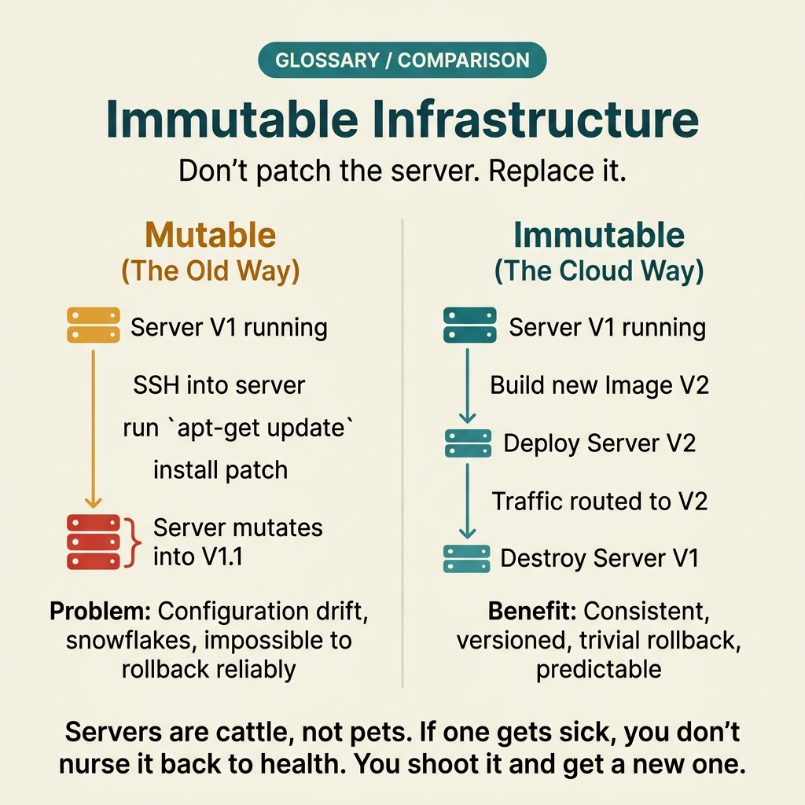

<!-- tags: glossary, reference, software-engineering-fundamentals, immutable-infrastructure -->
# Immutable Infrastructure

> An operational model where running servers/images are never manually modified; instead, they are replaced with pre-built immutable artifacts.

| Aspect | Detail |
| --- | --- |
| **Concept** | An operational model where running servers/images are never manually modified; instead, they are replaced with pre-built immutable artifacts. |
| **Audience** | Reviewer, tech lead, developer who needs to use this term within the correct boundary |
| **Primary style** | Glossary term |
| **Entry point** | Use when the concept of **Immutable Infrastructure** needs to be named correctly in a review, ADR, or incident note. |

📅 Created: 2026-03-30 · 🔄 Updated: 2026-04-04 · ⏱️ 5 min read

---

## 1. DEFINE

You are in the middle of a code review or writing an ADR. Someone says: "this is **Immutable Infrastructure**." If the room understands that word in three different ways, the discussion will drift away from the actual technical problem. This glossary term exists to lock the boundary before the team decides whether to refactor, accept a trade-off, or change policy.

**Immutable Infrastructure** is an operational model where running servers/images are never manually modified; instead, they are replaced with pre-built immutable artifacts.

Immutable infrastructure replaces "SSH in and fix the server" with "build a new artifact and replace." It is closely related to IaC but focuses on the lifecycle of the runtime artifact rather than resource definition.

| Variant | Description |
| --- | --- |
| Golden Image | A machine image pre-built with fixed dependencies, deployed via replacement. |
| Container Image | Runtime packaged in an immutable image, deployed by rolling out a new image. |
| Replace-not-Patch | Never modify a running node; always replace with an artifact that has been built and reviewed. |

| Approach | Time | Space | When to choose |
| --- | --- | --- | --- |
| Image-first deploy | Per build cycle | Per image size | When you want fast rollback and environment consistency. |
| No-SSH policy | O(1) | O(1) | When you need to eliminate drift caused by manual post-deploy changes. |
| Artifact provenance | Per pipeline | O(1) | When you need to trace exactly what is running in production. |

Core insight:

> Immutable infrastructure dramatically reduces configuration drift because the runtime is no longer a place for "manual firefighting." Every change must go through an artifact build and a repeatable deploy flow.

### 1.1 Invariants & Failure Modes

A good glossary term must maintain these invariants:
- Immutable Infrastructure must refer to the same class of phenomena or decision in all related documents;
- the term must be accompanied by evidence, not just a feeling;
- Immutable Infrastructure must lead to a clear next action: continue reviewing, refactor, harden, or accept intentionally.

The failure mode is declaring immutable but keeping the habit of directly hotfixing nodes. A single exception like that is enough to destroy all confidence in the reproducibility of the environment.

---

## 2. CONTEXT

**Who uses it**: Reviewer, tech lead, developer who needs to use this term within the correct boundary

**When**: Use when the concept of **Immutable Infrastructure** needs to be named correctly in a review, ADR, or incident note.

**Purpose**: Immutable infrastructure dramatically reduces configuration drift because the runtime is no longer a place for "manual firefighting." Every change must go through an artifact build and a repeatable deploy flow.

**In the ecosystem**:
When using the term **Immutable Infrastructure**, always attach it to a specific boundary: module, review workflow, runtime signal, or operational policy. Without a boundary, the reader hears a buzzword rather than a decision aid.

---

Not modifying running servers is clear. But how do you debug production without SSH, how are config changes handled, and what is the cost of immutable?

## 3. EXAMPLES

Immutable infrastructure surfaces most clearly when someone SSHes into production, edits a config, and forgets to document it, when two servers with the same role have different state because they were patched at different times, or when rollback means "who remembers the old server config?" The examples below place the pattern in exactly those moments.

### Example 1: Basic — Stop hotfixing servers directly with replace-not-patch

> **Goal**: Create a short note so the entire team uses **Immutable Infrastructure** with the same meaning in a PR or review.
> **Approach**: Use a structured YAML note to force the term to come with a summary, boundary, and next step instead of a bare buzzword.
> **Example**: A reviewer wants to say "this is Immutable Infrastructure" without leaving an opinionated comment.
> **Complexity**: Basic — turn vocabulary into a clear artifact before deeper debate.


*Figure: Immutable infrastructure enforces a strict lifecycle: Source → Build artifact → Deploy replacement → Terminate old node. No manual changes touch the running instance. Rollback means deploying a previous artifact, not "remembering what the old config was." This eliminates configuration drift — the silent killer of environment reproducibility.*

```yaml
term: 12-immutable-infrastructure
title: "Immutable Infrastructure"
decision_context: "PR or design review needs to name Immutable Infrastructure correctly to lock the boundary before further debate."
use_when:
  - "Need to lock the meaning of the term before the team debates further"
  - "Want to attach the term to a specific technical boundary"
not_when:
  - "Actual impact or relevant boundary has not been identified yet"
summary: "An operational model where running servers/images are never manually modified; instead, they are replaced with pre-built immutable artifacts."
next_step: "Open adjacent terms if Immutable Infrastructure needs to be distinguished from similar concepts."
```

**Why?** Even as a basic example, the structured note is valuable because it forces the writer to prove they are actually talking about **Immutable Infrastructure**, not a vague feeling of discomfort. Simply forcing boundary and next step into writing eliminates a great deal of noise in discussions.

**Takeaway**: When Immutable Infrastructure comes with a clear artifact, reviews focus on changeability and real boundaries instead of stopping at engineering slogans.

### Example 2: Intermediate — Use immutable artifacts for fast rollback with clear provenance

> **Goal**: Distinguish **Immutable Infrastructure** from similar concepts so the backlog or design notes do not mix different types of work.
> **Approach**: Use a small review checklist to ask the right questions about boundary, evidence, and impact before accepting the term.
> **Example**: The team is about to create a ticket or ADR comment and needs to know which term should be the primary vocabulary.
> **Complexity**: Intermediate — trade-offs and risk classification require clearer mechanism explanation.

```yaml
review_question: "Is this actually Immutable Infrastructure or just a symptom that looks similar?"
boundary:
  system_area: "service / module / runtime / review comment"
  observable_impact:
    - "change cost"
    - "design clarity"
    - "operational behavior"
comparison:
  this_term: "Immutable Infrastructure"
  often_confused_with: "Immutable infrastructure replaces 'SSH in and fix the server' with 'build a new artifact and replace.' It is closely related to IaC but focuses on the lifecycle of the runtime artifact rather than resource definition."
decision:
  keep_term: true
  evidence_required:
    - "state the specific phenomenon"
    - "state the decision or risk affected"
    - "state the follow-up action if needed"
```

**Why?** This checklist forces the team to move from symptoms to mechanisms. Without comparing boundaries and evidence, a term like **Immutable Infrastructure** easily gets misused: sometimes to describe a root cause, sometimes to describe a consequence, sometimes as a purely emotional label.

**Takeaway**: The intermediate value of Immutable Infrastructure is helping tickets, reviews, and ADRs correctly classify the type of debt or hygiene that needs to be addressed first.

### Example 3: Advanced — Turn immutable infrastructure into operational policy instead of a slogan

> **Goal**: Elevate **Immutable Infrastructure** from shared vocabulary into a lightweight guardrail in the engineering workflow.
> **Approach**: Write a policy/checklist so that anyone using the term must identify the boundary, impact, and next action.
> **Example**: Apply to PR templates, ADR templates, or incident postmortems so the term is not used in the wrong context.
> **Complexity**: Advanced — moving from a personal note to team- or module-level governance.

```yaml
policy:
  glossary_term: "Immutable Infrastructure"
  trigger:
    - "PR review repeats the same type of comment"
    - "ADR needs to lock vocabulary to prevent misunderstanding"
    - "incident postmortem needs to distinguish the correct cause"
  owner: "tech lead or reviewer responsible for that boundary"
  checklist:
    - "State the term"
    - "State the boundary"
    - "State the impact"
    - "State the next action"
  reject_if:
    - "term is used as a buzzword"
    - "no evidence or corresponding system behavior"
```

**Why?** A term only truly lives within a team when it becomes part of the workflow — not just individual memory. This small policy turns **Immutable Infrastructure** into a language contract: anyone using the term must prove they are pointing at the same class of decision or risk.

**Takeaway**: At the advanced level, Immutable Infrastructure is a strategy for reducing drift and increasing rollback confidence — not just banning SSH to servers.

---

## 4. COMPARE




*Figure: The position of immutable infrastructure between IaC, container images, and configuration drift.*

Immutable sounds like containers. Close — but immutable infrastructure is a principle (do not modify running instances), while containers are just one implementation. Baked VM images are also immutable.

### Level 1

```text
Build artifact -> deploy replacement -> old node terminates -> rollback with old artifact if needed.
```
*Figure: Level 1 places the term **Immutable Infrastructure** into a simple decision flow so beginners know when to use this term instead of speaking vaguely.*

### Level 2

```text
If encountering...                                  What signal identifies Immutable Infrastructure correctly
-----------------------------------------            ---------------------------------------------------------
Vague comment about Immutable Infrastructure          Find the specific boundary: module, policy, runtime, or related workflow
A similar term appears                                Compare Immutable Infrastructure's invariant with the easily confused concept
Need to choose an action after mentioning it          Decide whether to refactor, harden, measure more, or accept the trade-off
Immutable does not mean the system never changes; it means every change goes through a pipeline that can be replayed and audited.
```
*Figure: Level 2 helps experienced readers see that a glossary term is not just a definition — it is a decision router for choosing the correct next action.*

### Easy to confuse or cross the boundary

| # | Severity | Mistake | Consequence | Fix |
| --- | --- | --- | --- | --- |
| 1 | 🔴 Fatal | Using **Immutable Infrastructure** as a buzzword without a boundary | Team says the same word but argues about three different issues | Always state the module, workflow, or runtime behavior the term points to |
| 2 | 🟡 Common | Mixing **Immutable Infrastructure** with similar concepts | Tickets, ADRs, or reviews get misclassified | Add a comparison line in the note or README hub before expanding scope |
| 3 | 🟡 Common | Naming the term without a next action | Glossary becomes a decorative dictionary, not a decision aid | Accompany with an action: measure more, refactor, harden, create policy, or accept trade-off |
| 4 | 🔵 Minor | Deep-linking the term without linking back to the topic hub | Reader understands the term in isolation, hard to place in a learning path | Keep the README topic and adjacent concepts in RECOMMEND / navigation at the end |

### Quick scan

| If you encounter | What to do |
| --- | --- |
| Someone uses **Immutable Infrastructure** too generically | Ask for boundary, impact, and next action before agreeing to keep the term |
| Need to deep-link quickly in a review | Link directly to this glossary file, then connect through the topic hub for broader context |
| Team is mixing up several similar terms | Open the topic hub to compare adjacent concepts before creating a ticket or ADR |

---

## 5. REF

| Resource | Type | Link | Notes |
| --- | --- | --- | --- |
| Martin Fowler | Blog | https://martinfowler.com/ | Strong source for vocabulary on design, refactoring, and architecture debt. |
| Refactoring.Guru | Reference | https://refactoring.guru/ | Useful when comparing glossary terms with similar patterns or smells. |
| The Twelve-Factor App | Official | https://12factor.net/ | Good source of truth for terms leaning toward runtime and deploy hygiene. |

---

## 6. RECOMMEND

Immutable infrastructure answers the question "two servers with the same role but different state." The next question: how does infrastructure as code manage this, and how should versioning work?

| Expand to | When to read next | Why | File/Link |
| --- | --- | --- | --- |
| Topic hub | When **Immutable Infrastructure** needs to be placed in a larger learning path | Avoid understanding the term as an island separated from the taxonomy | [Software Engineering Fundamentals](./README.md) |
| Previous concept | When you need to return to the preceding term for boundary comparison | Useful if the discussion is sliding between two similar terms | [Liveness vs Readiness](./11-liveness-vs-readiness.md) |
| Next concept | When the current term typically leads to an adjacent decision or pattern | Helps read continuously along the concept chain of the topic | [Infrastructure as Code](./13-infrastructure-as-code.md) |

Back to that SSH config edit at the beginning — forgot to document, two servers drifted. Now you know: never modify a running instance. Need a change? Build a new image, deploy it, kill the old one. Reproducible, auditable, rollback = deploy the old image again.

**Links**: [← Previous](./11-liveness-vs-readiness.md) · [→ Next](./13-infrastructure-as-code.md)
