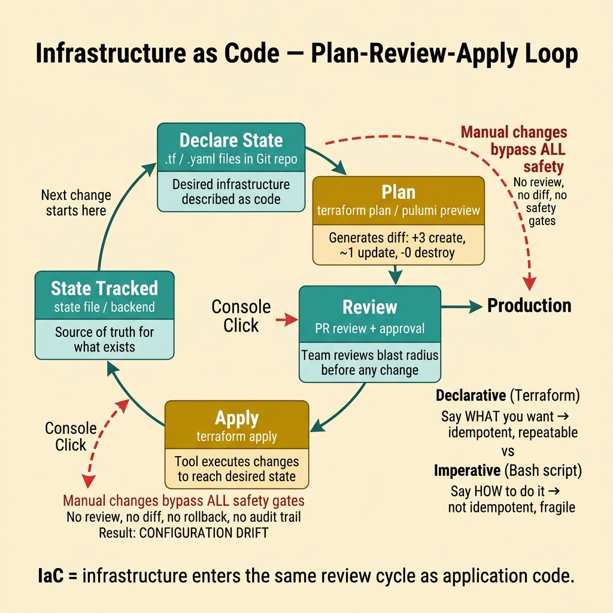
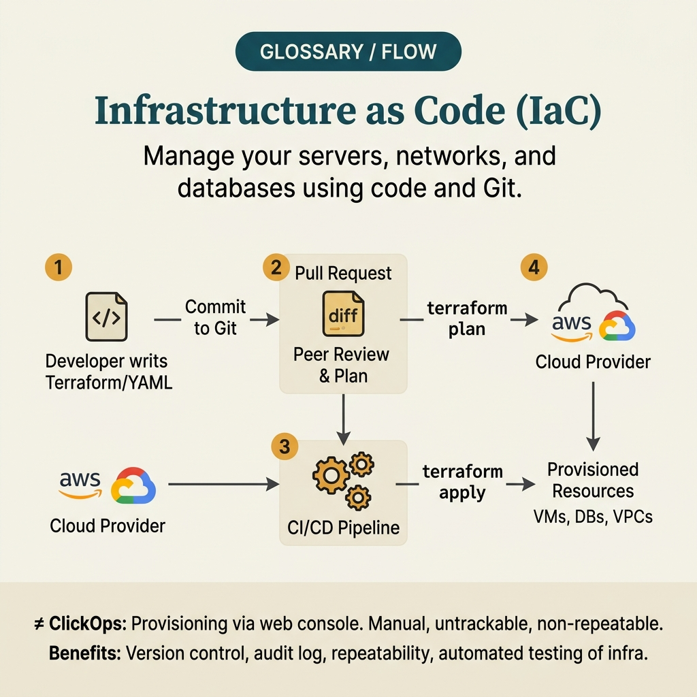

<!-- tags: glossary, reference, software-engineering-fundamentals, infrastructure-as-code -->
# Infrastructure as Code

> A method of describing and managing infrastructure through version-controlled, reviewable, automatable code instead of manual operations on environments.

| Aspect | Detail |
| --- | --- |
| **Concept** | A method of describing and managing infrastructure through version-controlled, reviewable, automatable code instead of manual operations on environments. |
| **Audience** | Reviewer, tech lead, developer who needs to use this term within the correct boundary |
| **Primary style** | Glossary term |
| **Entry point** | Use when the concept of **Infrastructure as Code** needs to be named correctly in a review, ADR, or incident note. |

📅 Created: 2026-03-30 · 🔄 Updated: 2026-04-04 · ⏱️ 5 min read

---

## 1. DEFINE

You are in the middle of a code review or writing an ADR. Someone says: "this is **Infrastructure as Code**." If the room understands that word in three different ways, the discussion will drift away from the actual technical problem. This glossary term exists to lock the boundary before the team decides whether to refactor, accept a trade-off, or change policy.

**Infrastructure as Code** is a method of describing and managing infrastructure through version-controlled, reviewable, automatable code instead of manual operations on environments.

Infrastructure as Code is about defining and managing infrastructure like code with review and versioning. It does not inherently require immutable runtime, but the two often go hand in hand in mature systems.

| Variant | Description |
| --- | --- |
| Declarative IaC | Declare the desired state; the tool calculates the diff and applies it. |
| Imperative IaC | Describe a sequential set of steps to create/modify resources. |
| Policy as Code | Encode guardrails, compliance, and review rules for infrastructure. |

| Approach | Time | Space | When to choose |
| --- | --- | --- | --- |
| Plan before apply | Per infra graph | Per state | When you need to review the diff and blast radius before making real changes. |
| Reusable modules | Per module | Per module | When multiple environments share the same resource pattern. |
| Drift detection | Per schedule | O(1) | When you want to know if production has diverged from the source of truth. |

Core insight:

> IaC is valuable because infrastructure becomes something that can be reviewed, diffed, and rolled back. When infra changes only live in click operations or shell history, the team is nearly blind to the root cause of runtime state.

### 1.1 Invariants & Failure Modes

A good glossary term must maintain these invariants:
- Infrastructure as Code must refer to the same class of phenomena or decision in all related documents;
- the term must be accompanied by evidence, not just a feeling;
- Infrastructure as Code must lead to a clear next action: continue reviewing, refactor, harden, or accept intentionally.

The failure mode is writing IaC but still applying changes manually, or copy-pasting modules without ownership. The result is having complex code while having no real source of truth.

---

## 2. CONTEXT

**Who uses it**: Reviewer, tech lead, developer who needs to use this term within the correct boundary

**When**: Use when the concept of **Infrastructure as Code** needs to be named correctly in a review, ADR, or incident note.

**Purpose**: IaC is valuable because infrastructure becomes something that can be reviewed, diffed, and rolled back. When infra changes only live in click operations or shell history, the team is nearly blind to the root cause of runtime state.

**In the ecosystem**:
When using the term **Infrastructure as Code**, always attach it to a specific boundary: module, review workflow, runtime signal, or operational policy. Without a boundary, the reader hears a buzzword rather than a decision aid.

---

Managing infra with code is clear. But Terraform or Pulumi, how to manage state files, and what about drift detection?

## 3. EXAMPLES

IaC surfaces most clearly when creating staging by hand takes 2 days but Terraform apply takes 10 minutes, when production config drifts because someone edited the console manually, or when rolling back an infra change is "revert commit + apply." The examples below place the pattern in exactly those moments.

### Example 1: Basic — Put infra changes into the review flow like code changes

> **Goal**: Create a short note so the entire team uses **Infrastructure as Code** with the same meaning in a PR or review.
> **Approach**: Use a structured YAML note to force the term to come with a summary, boundary, and next step instead of a bare buzzword.
> **Example**: A reviewer wants to say "this is Infrastructure as Code" without leaving an opinionated comment.
> **Complexity**: Basic — turn vocabulary into a clear artifact before deeper debate.



*Figure: IaC enforces a disciplined change loop: declare desired state in code → plan generates a diff showing exactly what will change → team reviews the diff and blast radius → apply executes the change → state file tracks what exists. Manual console clicks bypass every safety gate in this loop.*

```yaml
term: 13-infrastructure-as-code
title: "Infrastructure as Code"
decision_context: "PR or design review needs to name Infrastructure as Code correctly to lock the boundary before further debate."
use_when:
  - "Need to lock the meaning of the term before the team debates further"
  - "Want to attach the term to a specific technical boundary"
not_when:
  - "Actual impact or relevant boundary has not been identified yet"
summary: "A method of describing and managing infrastructure through version-controlled, reviewable, automatable code instead of manual operations on environments."
next_step: "Open adjacent terms if Infrastructure as Code needs to be distinguished from similar concepts."
```

**Why?** Even as a basic example, the structured note is valuable because it forces the writer to prove they are actually talking about **Infrastructure as Code**, not a vague feeling of discomfort. Simply forcing boundary and next step into writing eliminates a great deal of noise in discussions.

**Takeaway**: When Infrastructure as Code comes with a clear artifact, reviews focus on changeability and real boundaries instead of stopping at engineering slogans.

### Example 2: Intermediate — Use plan/apply to reduce blast radius

> **Goal**: Distinguish **Infrastructure as Code** from similar concepts so the backlog or design notes do not mix different types of work.
> **Approach**: Use a small review checklist to ask the right questions about boundary, evidence, and impact before accepting the term.
> **Example**: The team is about to create a ticket or ADR comment and needs to know which term should be the primary vocabulary.
> **Complexity**: Intermediate — trade-offs and risk classification require clearer mechanism explanation.

```yaml
review_question: "Is this actually Infrastructure as Code or just a symptom that looks similar?"
boundary:
  system_area: "service / module / runtime / review comment"
  observable_impact:
    - "change cost"
    - "design clarity"
    - "operational behavior"
comparison:
  this_term: "Infrastructure as Code"
  often_confused_with: "Infrastructure as Code is about defining and managing infrastructure like code with review and versioning. It does not inherently require immutable runtime, but the two often go hand in hand in mature systems."
decision:
  keep_term: true
  evidence_required:
    - "state the specific phenomenon"
    - "state the decision or risk affected"
    - "state the follow-up action if needed"
```

**Why?** This checklist forces the team to move from symptoms to mechanisms. Without comparing boundaries and evidence, a term like **Infrastructure as Code** easily gets misused: sometimes to describe a root cause, sometimes to describe a consequence, sometimes as a purely emotional label.

**Takeaway**: The intermediate value of Infrastructure as Code is helping tickets, reviews, and ADRs correctly classify the type of debt or hygiene that needs to be addressed first.

### Example 3: Advanced — Keep IaC as the source of truth instead of running it parallel to manual operations

> **Goal**: Elevate **Infrastructure as Code** from shared vocabulary into a lightweight guardrail in the engineering workflow.
> **Approach**: Write a policy/checklist so that anyone using the term must identify the boundary, impact, and next action.
> **Example**: Apply to PR templates, ADR templates, or incident postmortems so the term is not used in the wrong context.
> **Complexity**: Advanced — moving from a personal note to team- or module-level governance.

```yaml
policy:
  glossary_term: "Infrastructure as Code"
  trigger:
    - "PR review repeats the same type of comment"
    - "ADR needs to lock vocabulary to prevent misunderstanding"
    - "incident postmortem needs to distinguish the correct cause"
  owner: "tech lead or reviewer responsible for that boundary"
  checklist:
    - "State the term"
    - "State the boundary"
    - "State the impact"
    - "State the next action"
  reject_if:
    - "term is used as a buzzword"
    - "no evidence or corresponding system behavior"
```

**Why?** A term only truly lives within a team when it becomes part of the workflow — not just individual memory. This small policy turns **Infrastructure as Code** into a language contract: anyone using the term must prove they are pointing at the same class of decision or risk.

**Takeaway**: At the advanced level, Infrastructure as Code is how infrastructure enters the same review, audit, and history-tracked change cycle as software.

---

## 4. COMPARE




*Figure: The position of IaC between immutable infrastructure, GitOps, and configuration management.*

IaC sounds like automation scripts. Not exactly: scripts are imperative ("do this, then that"), while IaC tools like Terraform are declarative ("I want this state"). Declarative is idempotent; scripts are not.

### Level 1

```text
Code repo -> plan -> review diff -> apply -> state is tracked.
```
*Figure: Level 1 places the term **Infrastructure as Code** into a simple decision flow so beginners know when to use this term instead of speaking vaguely.*

### Level 2

```text
If encountering...                                  What signal identifies Infrastructure as Code correctly
-----------------------------------------            ---------------------------------------------------------
Vague comment about Infrastructure as Code            Find the specific boundary: module, policy, runtime, or related workflow
A similar term appears                                Compare Infrastructure as Code's invariant with the easily confused concept
Need to choose an action after mentioning it          Decide whether to refactor, harden, measure more, or accept the trade-off
IaC strengthens when combined with policy, drift detection, and clear module boundaries; without those it is just "scripting manual operations."
```
*Figure: Level 2 helps experienced readers see that a glossary term is not just a definition — it is a decision router for choosing the correct next action.*

### Easy to confuse or cross the boundary

| # | Severity | Mistake | Consequence | Fix |
| --- | --- | --- | --- | --- |
| 1 | 🔴 Fatal | Using **Infrastructure as Code** as a buzzword without a boundary | Team says the same word but argues about three different issues | Always state the module, workflow, or runtime behavior the term points to |
| 2 | 🟡 Common | Mixing **Infrastructure as Code** with similar concepts | Tickets, ADRs, or reviews get misclassified | Add a comparison line in the note or README hub before expanding scope |
| 3 | 🟡 Common | Naming the term without a next action | Glossary becomes a decorative dictionary, not a decision aid | Accompany with an action: measure more, refactor, harden, create policy, or accept trade-off |
| 4 | 🔵 Minor | Deep-linking the term without linking back to the topic hub | Reader understands the term in isolation, hard to place in a learning path | Keep the README topic and adjacent concepts in RECOMMEND / navigation at the end |

### Quick scan

| If you encounter | What to do |
| --- | --- |
| Someone uses **Infrastructure as Code** too generically | Ask for boundary, impact, and next action before agreeing to keep the term |
| Need to deep-link quickly in a review | Link directly to this glossary file, then connect through the topic hub for broader context |
| Team is mixing up several similar terms | Open the topic hub to compare adjacent concepts before creating a ticket or ADR |

---

## 5. REF

| Resource | Type | Link | Notes |
| --- | --- | --- | --- |
| Martin Fowler | Blog | https://martinfowler.com/ | Strong source for vocabulary on design, refactoring, and architecture debt. |
| Refactoring.Guru | Reference | https://refactoring.guru/ | Useful when comparing glossary terms with similar patterns or smells. |
| The Twelve-Factor App | Official | https://12factor.net/ | Good source of truth for terms leaning toward runtime and deploy hygiene. |

---

## 6. RECOMMEND

IaC answers the question "creating environments by hand, different every time." The next question: how should versioning work, and how does DI pattern relate?

| Expand to | When to read next | Why | File/Link |
| --- | --- | --- | --- |
| Topic hub | When **Infrastructure as Code** needs to be placed in a larger learning path | Avoid understanding the term as an island separated from the taxonomy | [Software Engineering Fundamentals](./README.md) |
| Previous concept | When you need to return to the preceding term for boundary comparison | Useful if the discussion is sliding between two similar terms | [Immutable Infrastructure](./12-immutable-infrastructure.md) |
| Next concept | When the current term typically leads to an adjacent decision or pattern | Helps read continuously along the concept chain of the topic | [Semantic Versioning](./14-semantic-versioning.md) |

Back to that manual staging creation at the beginning — 2 days, different every time. Now you know: declare the desired state, the tool handles the rest. Version control, code review, CI/CD for infra — exactly how the team works with application code.

**Links**: [← Previous](./12-immutable-infrastructure.md) · [→ Next](./14-semantic-versioning.md)
