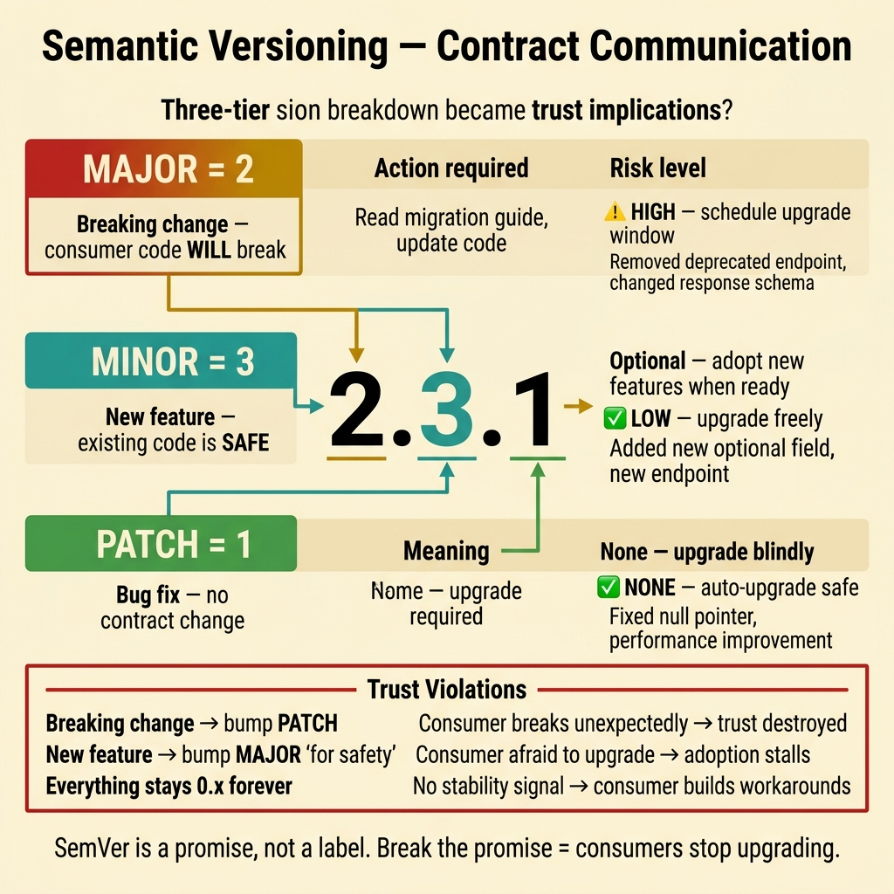
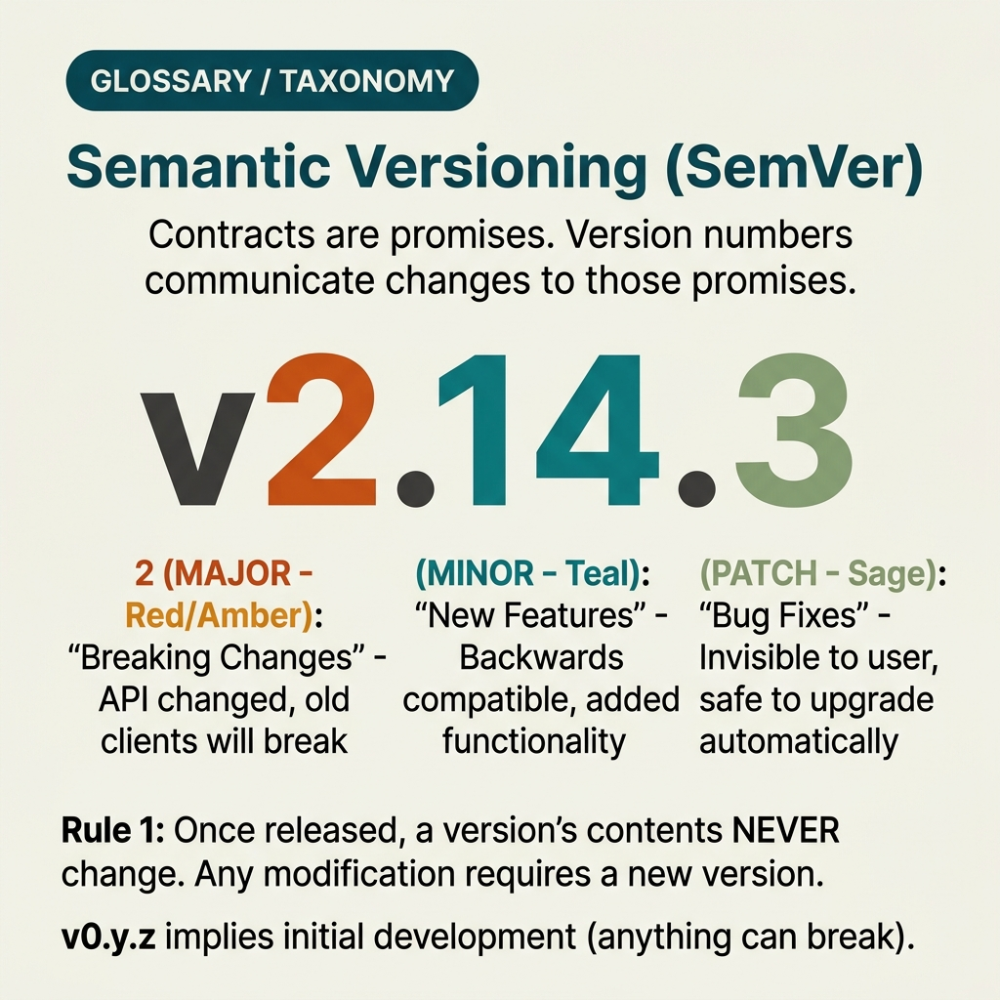

<!-- tags: glossary, reference, software-engineering-fundamentals, semantic-versioning -->
# Semantic Versioning

> A versioning convention using MAJOR.MINOR.PATCH to express the compatibility level and impact of a change.

| Aspect | Detail |
| --- | --- |
| **Concept** | A versioning convention using MAJOR.MINOR.PATCH to express the compatibility level and impact of a change. |
| **Audience** | Reviewer, tech lead, developer who needs to use this term within the correct boundary |
| **Primary style** | Glossary term |
| **Entry point** | Use when the concept of **Semantic Versioning** needs to be named correctly in a review, ADR, or incident note. |

📅 Created: 2026-03-30 · 🔄 Updated: 2026-04-04 · ⏱️ 5 min read

---

## 1. DEFINE

You are in the middle of a code review or writing an ADR. Someone says: "this is **Semantic Versioning**." If the room understands that word in three different ways, the discussion will drift away from the actual technical problem. This glossary term exists to lock the boundary before the team decides whether to refactor, accept a trade-off, or change policy.

**Semantic Versioning** is a versioning convention using MAJOR.MINOR.PATCH to express the compatibility level and impact of a change.

Semantic Versioning is not just a pretty numbering scheme. It is a communication contract about the compatibility of changes between producer and consumer.

| Variant | Description |
| --- | --- |
| MAJOR | Breaking change — consumer must adjust to remain compatible. |
| MINOR | Added backward-compatible functionality. |
| PATCH | Backward-compatible fix or improvement, no change to the public contract. |

| Approach | Time | Space | When to choose |
| --- | --- | --- | --- |
| Contract-first release note | O(1) | O(1) | When the version needs to be set based on real impact to the consumer. |
| Prerelease channels | O(1) | O(1) | When you want to review large changes through alpha/beta/rc before stable. |
| Automated bump policy | Per commit flow | O(1) | When you want to reduce manual arguments about versioning. |

Core insight:

> SemVer is useful when the entire team agrees on what "breaking change" means for the contract they are publishing. If the boundary contract is vague, the version number is just a ritual that does not communicate real risk.

### 1.1 Invariants & Failure Modes

A good glossary term must maintain these invariants:
- Semantic Versioning must refer to the same class of phenomena or decision in all related documents;
- the term must be accompanied by evidence, not just a feeling;
- Semantic Versioning must lead to a clear next action: continue reviewing, refactor, harden, or accept intentionally.

The failure mode is bumping by feeling: a breaking change but only incrementing patch, or adding a feature but bumping major "just to be safe." When consumers lose trust in the version, all benefits of SemVer disappear.

---

## 2. CONTEXT

**Who uses it**: Reviewer, tech lead, developer who needs to use this term within the correct boundary

**When**: Use when the concept of **Semantic Versioning** needs to be named correctly in a review, ADR, or incident note.

**Purpose**: SemVer is useful when the entire team agrees on what "breaking change" means for the contract they are publishing. If the boundary contract is vague, the version number is just a ritual that does not communicate real risk.

**In the ecosystem**:
When using the term **Semantic Versioning**, always attach it to a specific boundary: module, review workflow, runtime signal, or operational policy. Without a boundary, the reader hears a buzzword rather than a decision aid.

---

Major.minor.patch is clear. But when to bump major, how to handle pre-release tags, and which teams actually follow semver?

## 3. EXAMPLES

Semantic versioning surfaces most clearly when a library bumps minor but breaks a consumer because "it was only an internal change," when the team does not know whether 2.3.1 is compatible with 2.2.0, or when every release is 0.x because "it is not stable yet." The examples below place the pattern in exactly those moments.

### Example 1: Basic — Classify release impact before bumping the version

> **Goal**: Create a short note so the entire team uses **Semantic Versioning** with the same meaning in a PR or review.
> **Approach**: Use a structured YAML note to force the term to come with a summary, boundary, and next step instead of a bare buzzword.
> **Example**: A reviewer wants to say "this is Semantic Versioning" without leaving an opinionated comment.
> **Complexity**: Basic — turn vocabulary into a clear artifact before deeper debate.



*Figure: Semantic versioning is a trust contract between producer and consumer. MAJOR says "your code will break — read the migration guide." MINOR says "new capabilities available — your existing code is safe." PATCH says "bug fixed — safe to upgrade blindly." Violating this contract does not just break builds — it breaks trust, and consumers stop upgrading altogether.*

```yaml
term: 14-semantic-versioning
title: "Semantic Versioning"
decision_context: "PR or design review needs to name Semantic Versioning correctly to lock the boundary before further debate."
use_when:
  - "Need to lock the meaning of the term before the team debates further"
  - "Want to attach the term to a specific technical boundary"
not_when:
  - "Actual impact or relevant boundary has not been identified yet"
summary: "A versioning convention using MAJOR.MINOR.PATCH to express the compatibility level and impact of a change."
next_step: "Open adjacent terms if Semantic Versioning needs to be distinguished from similar concepts."
```

**Why?** Even as a basic example, the structured note is valuable because it forces the writer to prove they are actually talking about **Semantic Versioning**, not a vague feeling of discomfort. Simply forcing boundary and next step into writing eliminates a great deal of noise in discussions.

**Takeaway**: When Semantic Versioning comes with a clear artifact, reviews focus on changeability and real boundaries instead of stopping at engineering slogans.

### Example 2: Intermediate — Use alpha/beta/rc to reduce risk before stable

> **Goal**: Distinguish **Semantic Versioning** from similar concepts so the backlog or design notes do not mix different types of work.
> **Approach**: Use a small review checklist to ask the right questions about boundary, evidence, and impact before accepting the term.
> **Example**: The team is about to create a ticket or ADR comment and needs to know which term should be the primary vocabulary.
> **Complexity**: Intermediate — trade-offs and risk classification require clearer mechanism explanation.

```yaml
review_question: "Is this actually a Semantic Versioning issue or just a symptom that looks similar?"
boundary:
  system_area: "service / module / runtime / review comment"
  observable_impact:
    - "change cost"
    - "design clarity"
    - "operational behavior"
comparison:
  this_term: "Semantic Versioning"
  often_confused_with: "Semantic Versioning is not just a pretty numbering scheme. It is a communication contract about the compatibility of changes between producer and consumer."
decision:
  keep_term: true
  evidence_required:
    - "state the specific phenomenon"
    - "state the decision or risk affected"
    - "state the follow-up action if needed"
```

**Why?** This checklist forces the team to move from symptoms to mechanisms. Without comparing boundaries and evidence, a term like **Semantic Versioning** easily gets misused: sometimes to describe a root cause, sometimes to describe a consequence, sometimes as a purely emotional label.

**Takeaway**: The intermediate value of Semantic Versioning is helping tickets, reviews, and ADRs correctly classify the type of debt or hygiene that needs to be addressed first.

### Example 3: Advanced — Keep SemVer consistent across APIs, packages, and app shells

> **Goal**: Elevate **Semantic Versioning** from shared vocabulary into a lightweight guardrail in the engineering workflow.
> **Approach**: Write a policy/checklist so that anyone using the term must identify the boundary, impact, and next action.
> **Example**: Apply to PR templates, ADR templates, or incident postmortems so the term is not used in the wrong context.
> **Complexity**: Advanced — moving from a personal note to team- or module-level governance.

```yaml
policy:
  glossary_term: "Semantic Versioning"
  trigger:
    - "PR review repeats the same type of comment"
    - "ADR needs to lock vocabulary to prevent misunderstanding"
    - "incident postmortem needs to distinguish the correct cause"
  owner: "tech lead or reviewer responsible for that boundary"
  checklist:
    - "State the term"
    - "State the boundary"
    - "State the impact"
    - "State the next action"
  reject_if:
    - "term is used as a buzzword"
    - "no evidence or corresponding system behavior"
```

**Why?** A term only truly lives within a team when it becomes part of the workflow — not just individual memory. This small policy turns **Semantic Versioning** into a language contract: anyone using the term must prove they are pointing at the same class of decision or risk.

**Takeaway**: At the advanced level, Semantic Versioning is an expectation contract with the system's consumers — not just three numbers for a professional look.

---

## 4. COMPARE




*Figure: The position of semver between release management, dependency resolution, and API compatibility.*

Semver sounds like "numbering versions." True — but semver is a contract: major = breaking, minor = backward-compatible feature, patch = bugfix. Violating the contract breaks trust, not just builds.

### Level 1

```text
Public contract change -> classify impact -> choose the corresponding major/minor/patch.
```
*Figure: Level 1 places the term **Semantic Versioning** into a simple decision flow so beginners know when to use this term instead of speaking vaguely.*

### Level 2

```text
If encountering...                                  What signal identifies Semantic Versioning correctly
-----------------------------------------            ---------------------------------------------------------
Vague comment about Semantic Versioning               Find the specific boundary: module, policy, runtime, or related workflow
A similar term appears                                Compare Semantic Versioning's invariant with the easily confused concept
Need to choose an action after mentioning it          Decide whether to refactor, harden, measure more, or accept the trade-off
A version number is only trustworthy if it reflects the boundary consumers actually depend on, such as API, event schema, CLI flags, or config contract.
```
*Figure: Level 2 helps experienced readers see that a glossary term is not just a definition — it is a decision router for choosing the correct next action.*

### Easy to confuse or cross the boundary

| # | Severity | Mistake | Consequence | Fix |
| --- | --- | --- | --- | --- |
| 1 | 🔴 Fatal | Using **Semantic Versioning** as a buzzword without a boundary | Team says the same word but argues about three different issues | Always state the module, workflow, or runtime behavior the term points to |
| 2 | 🟡 Common | Mixing **Semantic Versioning** with similar concepts | Tickets, ADRs, or reviews get misclassified | Add a comparison line in the note or README hub before expanding scope |
| 3 | 🟡 Common | Naming the term without a next action | Glossary becomes a decorative dictionary, not a decision aid | Accompany with an action: measure more, refactor, harden, create policy, or accept trade-off |
| 4 | 🔵 Minor | Deep-linking the term without linking back to the topic hub | Reader understands the term in isolation, hard to place in a learning path | Keep the README topic and adjacent concepts in RECOMMEND / navigation at the end |

### Quick scan

| If you encounter | What to do |
| --- | --- |
| Someone uses **Semantic Versioning** too generically | Ask for boundary, impact, and next action before agreeing to keep the term |
| Need to deep-link quickly in a review | Link directly to this glossary file, then connect through the topic hub for broader context |
| Team is mixing up several similar terms | Open the topic hub to compare adjacent concepts before creating a ticket or ADR |

---

## 5. REF

| Resource | Type | Link | Notes |
| --- | --- | --- | --- |
| Martin Fowler | Blog | https://martinfowler.com/ | Strong source for vocabulary on design, refactoring, and architecture debt. |
| Refactoring.Guru | Reference | https://refactoring.guru/ | Useful when comparing glossary terms with similar patterns or smells. |
| The Twelve-Factor App | Official | https://12factor.net/ | Good source of truth for terms leaning toward runtime and deploy hygiene. |

---

## 6. RECOMMEND

Semantic versioning answers the question "the consumer does not know if upgrading is safe." The next question: which SOLID principles help maintain backward compatibility, and what refactoring strategy to use?

| Expand to | When to read next | Why | File/Link |
| --- | --- | --- | --- |
| Topic hub | When **Semantic Versioning** needs to be placed in a larger learning path | Avoid understanding the term as an island separated from the taxonomy | [Software Engineering Fundamentals](./README.md) |
| Previous concept | When you need to return to the preceding term for boundary comparison | Useful if the discussion is sliding between two similar terms | [Infrastructure as Code](./13-infrastructure-as-code.md) |
| Next concept | When the current term typically leads to an adjacent decision or pattern | Helps read continuously along the concept chain of the topic | [DRY, KISS, YAGNI — Software Design Principles](./DRY-KISS-YAGNI.md) |

Back to that minor bump at the beginning — the consumer upgraded and broke. Now you know: semver is a promise, not a label. Bump major when breaking the API, bump minor when adding backward-compatible features, bump patch when fixing bugs. Simple — but keeping the promise is hard.

**Links**: [← Previous](./13-infrastructure-as-code.md) · [→ Next](./DRY-KISS-YAGNI.md)
