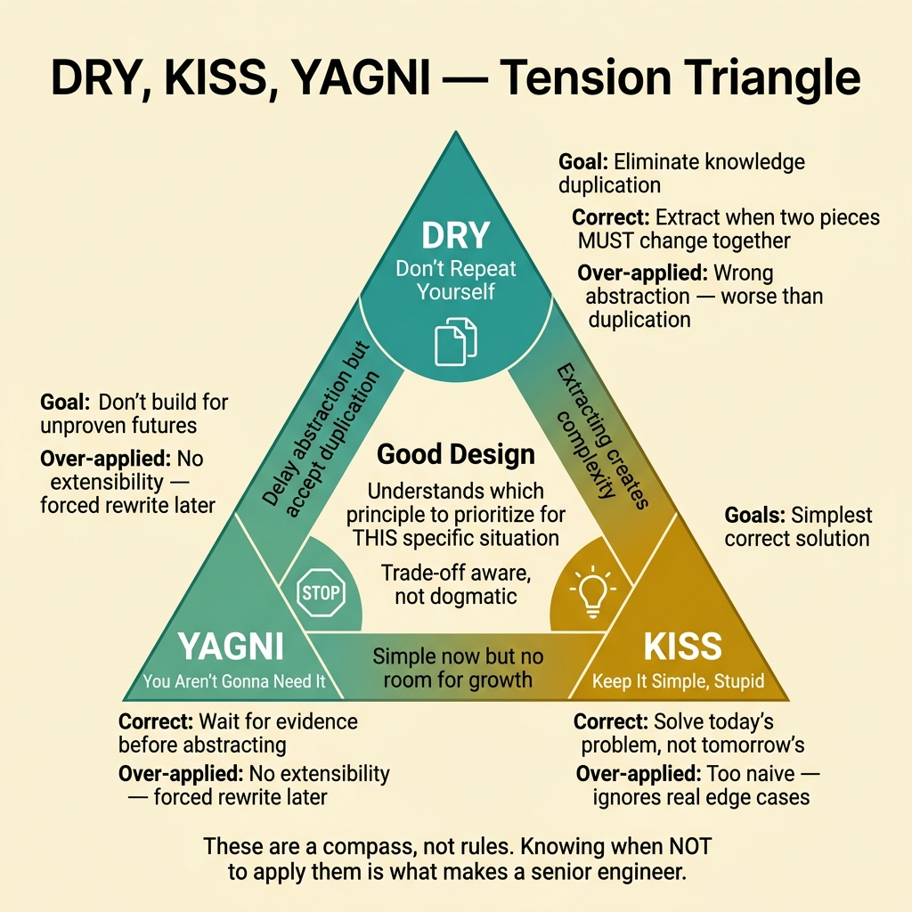
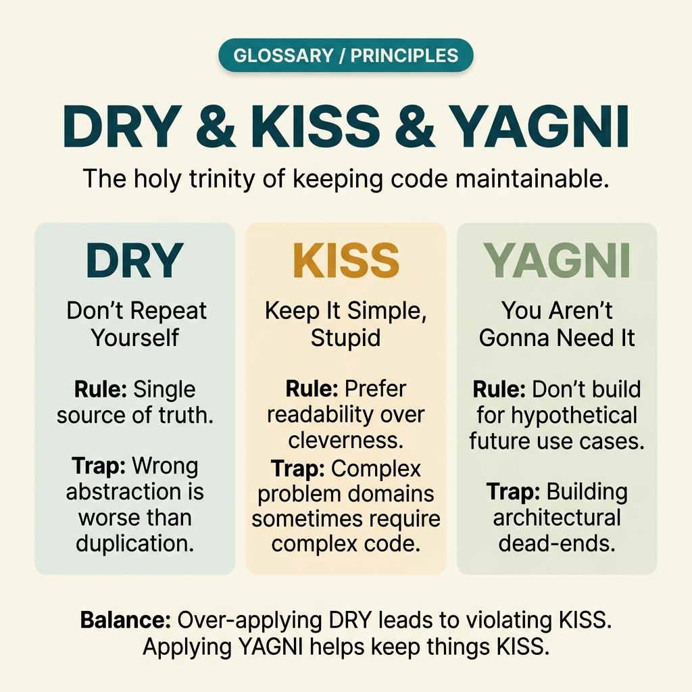

<!-- tags: glossary, reference, software-engineering-fundamentals, dry, kiss, yagni -->
# DRY, KISS, YAGNI — Software Design Principles

> Three simple but highly effective principles for keeping code clean: Don't Repeat Yourself, Keep It Simple Stupid, You Aren't Gonna Need It.

| Aspect | Detail |
| --- | --- |
| **Concept** | Three simple but highly effective principles for keeping code clean: avoid unnecessary duplication, unnecessary complexity, and unnecessary future-proofing. |
| **Audience** | Reviewer, tech lead, developer who needs to use this term within the correct boundary |
| **Primary style** | Glossary term |
| **Entry point** | Use when the concept of **DRY, KISS, YAGNI** needs to be named correctly in a review, ADR, or incident note. |

📅 Created: 2026-03-20 · 🔄 Updated: 2026-04-04 · ⏱️ 15 min read

---

## 1. DEFINE

You are in the middle of a code review or writing an ADR. Someone says: "this violates **DRY**" or "just keep it **KISS**." If the room understands these words in three different ways, the discussion will drift away from the actual technical problem. This glossary term exists to lock the boundary before the team decides whether to refactor, accept a trade-off, or change policy.

**DRY, KISS, YAGNI** are three complementary software design principles that guide the balance between simplicity and flexibility.

These three principles do not replace each other. DRY fights wasteful duplication, KISS fights unnecessary complexity, YAGNI fights building ahead of actual need. Misapplying any one of them can still produce bad design.

| Variant | Description |
| --- | --- |
| DRY | Do not repeat the same knowledge in multiple places if they must change together. |
| KISS | Prefer the simplest solution that adequately solves the current problem. |
| YAGNI | Do not build abstractions or features for a future that has no evidence of being needed. |

| Approach | Time | Space | When to choose |
| --- | --- | --- | --- |
| Duplicate-with-proof | O(1) | O(1) | When you need to prove two pieces of code truly share the same knowledge before abstracting. |
| Simplest viable design | O(1) | O(1) | When there are multiple approaches and the team tends to over-engineer. |
| Need-driven abstraction | O(1) | O(1) | When the temptation is to design for requirements that do not yet exist. |

Core insight:

> DRY, KISS, YAGNI are strongest when used as counter-questions in design reviews: which part has genuine knowledge duplication, which part is more complex than the need requires, and which part is designing for a future with no supporting data.

### 1.1 Invariants & Failure Modes

A good glossary term must maintain these invariants:
- DRY, KISS, YAGNI must refer to the same class of phenomena or decision in all related documents;
- the term must be accompanied by evidence, not just a feeling;
- DRY, KISS, YAGNI must lead to a clear next action: continue reviewing, refactor, harden, or accept intentionally.

The failure mode is applying DRY too early into a wrong abstraction, or abusing KISS/YAGNI to postpone design that is genuinely necessary for scale and safety. These are balancing principles, not absolute commandments.

---

## 2. CONTEXT

**Who uses it**: Reviewer, tech lead, developer who needs to use this term within the correct boundary

**When**: Use when the concept of **DRY, KISS, YAGNI** needs to be named correctly in a review, ADR, or incident note.

**Purpose**: DRY, KISS, YAGNI are strongest when used as counter-questions in design reviews: which part has genuine knowledge duplication, which part is more complex than the need requires, and which part is designing for a future with no supporting data.

**In the ecosystem**:
When using the term **DRY, KISS, YAGNI**, always attach it to a specific boundary: module, review workflow, runtime signal, or operational policy. Without a boundary, the reader hears a buzzword rather than a decision aid.

---

The three classic principles are clear. But DRY taken too far creates coupling, KISS taken too far creates naivety, YAGNI taken too far creates lack of preparation — where is the line?

## 3. EXAMPLES

DRY, KISS, YAGNI surface most clearly when DRY extracts a shared function but 5 callers need different behavior, when KISS leads to a solution too simple to handle edge cases, or when YAGNI causes the team to rewrite because they lacked extensibility. The examples below place the pattern in exactly those moments.

### Example 1: Basic — Use DRY/KISS/YAGNI to challenge a new design

> **Goal**: Create a short note so the entire team uses **DRY, KISS, YAGNI** with the same meaning in a PR or review.
> **Approach**: Use a structured YAML note to force the term to come with a summary, boundary, and next step instead of a bare buzzword.
> **Example**: A reviewer wants to say "this violates DRY" without leaving an opinionated comment.
> **Complexity**: Basic — turn vocabulary into a clear artifact before deeper debate.



*Figure: DRY, KISS, and YAGNI form a tension triangle — they often pull in slightly different directions. DRY says "extract shared knowledge" but taken too far creates wrong abstractions worse than duplication. KISS says "simplest solution" but taken too far ignores necessary edge cases. YAGNI says "don't build for tomorrow" but taken too far leaves no room for inevitable growth. Good design sits in the tension zone, not at any extreme.*

```yaml
term: dry-kiss-yagni
title: "DRY, KISS, YAGNI — Software Design Principles"
decision_context: "PR or design review needs to name DRY, KISS, YAGNI correctly to lock the boundary before further debate."
use_when:
  - "Need to lock the meaning of the term before the team debates further"
  - "Want to attach the term to a specific technical boundary"
not_when:
  - "Actual impact or relevant boundary has not been identified yet"
summary: "Three simple but highly effective principles for keeping code clean: avoid unnecessary duplication, unnecessary complexity, and unnecessary future-proofing."
next_step: "Open adjacent terms if DRY, KISS, YAGNI needs to be distinguished from similar concepts."
```

**Why?** Even as a basic example, the structured note is valuable because it forces the writer to prove they are actually talking about **DRY, KISS, YAGNI**, not a vague feeling of discomfort. Simply forcing boundary and next step into writing eliminates a great deal of noise in discussions.

**Takeaway**: When DRY, KISS, YAGNI comes with a clear artifact, reviews focus on changeability and real boundaries instead of stopping at engineering slogans.

### Example 2: Intermediate — Distinguish duplication that needs abstraction from acceptable duplication

> **Goal**: Distinguish **DRY, KISS, YAGNI** from similar concepts so the backlog or design notes do not mix different types of work.
> **Approach**: Use a small review checklist to ask the right questions about boundary, evidence, and impact before accepting the term.
> **Example**: The team is about to create a ticket or ADR comment and needs to know which term should be the primary vocabulary.
> **Complexity**: Intermediate — trade-offs and risk classification require clearer mechanism explanation.

```yaml
review_question: "Is this actually a DRY/KISS/YAGNI issue or just a symptom that looks similar?"
boundary:
  system_area: "service / module / runtime / review comment"
  observable_impact:
    - "change cost"
    - "design clarity"
    - "operational behavior"
comparison:
  this_term: "DRY, KISS, YAGNI"
  often_confused_with: "These three principles do not replace each other. DRY fights wasteful duplication, KISS fights unnecessary complexity, YAGNI fights building ahead of actual need. Misapplying any one of them can still produce bad design."
decision:
  keep_term: true
  evidence_required:
    - "state the specific phenomenon"
    - "state the decision or risk affected"
    - "state the follow-up action if needed"
```

**Why?** This checklist forces the team to move from symptoms to mechanisms. Without comparing boundaries and evidence, a term like **DRY, KISS, YAGNI** easily gets misused: sometimes to describe a root cause, sometimes to describe a consequence, sometimes as a purely emotional label.

**Takeaway**: The intermediate value of DRY, KISS, YAGNI is helping tickets, reviews, and ADRs correctly classify the type of debt or hygiene that needs to be addressed first.

### Example 3: Advanced — Avoid over-engineering with YAGNI without skipping necessary future-proofing

> **Goal**: Elevate **DRY, KISS, YAGNI** from shared vocabulary into a lightweight guardrail in the engineering workflow.
> **Approach**: Write a policy/checklist so that anyone using the term must identify the boundary, impact, and next action.
> **Example**: Apply to PR templates, ADR templates, or incident postmortems so the term is not used in the wrong context.
> **Complexity**: Advanced — moving from a personal note to team- or module-level governance.

```yaml
policy:
  glossary_term: "DRY, KISS, YAGNI"
  trigger:
    - "PR review repeats the same type of comment"
    - "ADR needs to lock vocabulary to prevent misunderstanding"
    - "incident postmortem needs to distinguish the correct cause"
  owner: "tech lead or reviewer responsible for that boundary"
  checklist:
    - "State the term"
    - "State the boundary"
    - "State the impact"
    - "State the next action"
  reject_if:
    - "term is used as a buzzword"
    - "no evidence or corresponding system behavior"
```

**Why?** A term only truly lives within a team when it becomes part of the workflow — not just individual memory. This small policy turns **DRY, KISS, YAGNI** into a language contract: anyone using the term must prove they are pointing at the same class of decision or risk.

**Takeaway**: At the advanced level, DRY, KISS, and YAGNI help balance the pressure to simplify within a real context — not as slogans to block every new idea.

---

## 4. COMPARE




*Figure: The position of DRY/KISS/YAGNI between SOLID, code smells, and over-engineering.*

DRY sounds like "do not duplicate code." True — but DRY taken too far creates wrong abstractions, worse than duplication. KISS is not "the simplest code possible" but "the simplest code that is still correct." YAGNI is not "do not prepare" but "do not build features that are not yet needed."

### Level 1

```text
Current requirement -> choose the simplest solution -> only abstract when duplication has evidence.
```
*Figure: Level 1 places the term **DRY, KISS, YAGNI** into a simple decision flow so beginners know when to use this term instead of speaking vaguely.*

### Level 2

```text
If encountering...                                  What signal identifies DRY, KISS, YAGNI correctly
-----------------------------------------            ---------------------------------------------------------
Vague comment about DRY, KISS, YAGNI                  Find the specific boundary: module, policy, runtime, or related workflow
A similar term appears                                Compare DRY, KISS, YAGNI's invariant with the easily confused concept
Need to choose an action after mentioning it          Decide whether to refactor, harden, measure more, or accept the trade-off
The three principles often mildly conflict with each other; good design understands the trade-off rather than trying to maximize all three simultaneously.
```
*Figure: Level 2 helps experienced readers see that a glossary term is not just a definition — it is a decision router for choosing the correct next action.*

### Easy to confuse or cross the boundary

| # | Severity | Mistake | Consequence | Fix |
| --- | --- | --- | --- | --- |
| 1 | 🔴 Fatal | Using **DRY, KISS, YAGNI** as a buzzword without a boundary | Team says the same word but argues about three different issues | Always state the module, workflow, or runtime behavior the term points to |
| 2 | 🟡 Common | Mixing **DRY, KISS, YAGNI** with similar concepts | Tickets, ADRs, or reviews get misclassified | Add a comparison line in the note or README hub before expanding scope |
| 3 | 🟡 Common | Naming the term without a next action | Glossary becomes a decorative dictionary, not a decision aid | Accompany with an action: measure more, refactor, harden, create policy, or accept trade-off |
| 4 | 🔵 Minor | Deep-linking the term without linking back to the topic hub | Reader understands the term in isolation, hard to place in a learning path | Keep the README topic and adjacent concepts in RECOMMEND / navigation at the end |

### Quick scan

| If you encounter | What to do |
| --- | --- |
| Someone uses **DRY, KISS, YAGNI** too generically | Ask for boundary, impact, and next action before agreeing to keep the term |
| Need to deep-link quickly in a review | Link directly to this glossary file, then connect through the topic hub for broader context |
| Team is mixing up several similar terms | Open the topic hub to compare adjacent concepts before creating a ticket or ADR |

---

## 5. REF

| Resource | Type | Link | Notes |
| --- | --- | --- | --- |
| Martin Fowler | Blog | https://martinfowler.com/ | Strong source for vocabulary on design, refactoring, and architecture debt. |
| Refactoring.Guru | Reference | https://refactoring.guru/ | Useful when comparing glossary terms with similar patterns or smells. |
| The Twelve-Factor App | Official | https://12factor.net/ | Good source of truth for terms leaning toward runtime and deploy hygiene. |

---

## 6. RECOMMEND

DRY/KISS/YAGNI answers the question "over-engineering vs under-engineering." The next question: how does SOLID go deeper, and which code smells violate these principles?

| Expand to | When to read next | Why | File/Link |
| --- | --- | --- | --- |
| Topic hub | When **DRY, KISS, YAGNI** needs to be placed in a larger learning path | Avoid understanding the term as an island separated from the taxonomy | [Software Engineering Fundamentals](./README.md) |
| Previous concept | When you need to return to the preceding term for boundary comparison | Useful if the discussion is sliding between two similar terms | [Semantic Versioning](./14-semantic-versioning.md) |
| Next concept | When the current term typically leads to an adjacent decision or pattern | Helps read continuously along the concept chain of the topic | [SOLID — 5 Object-Oriented Design Principles](./SOLID.md) |

Back to that shared function at the beginning — DRY extracted it but 5 callers needed different behavior. Now you know: duplication is cheaper than wrong abstraction. DRY, KISS, YAGNI are a compass, not a rule. Knowing when to apply and when not to is what makes a senior engineer.

**Links**: [← Previous](./14-semantic-versioning.md) · [→ Next](./SOLID.md)
