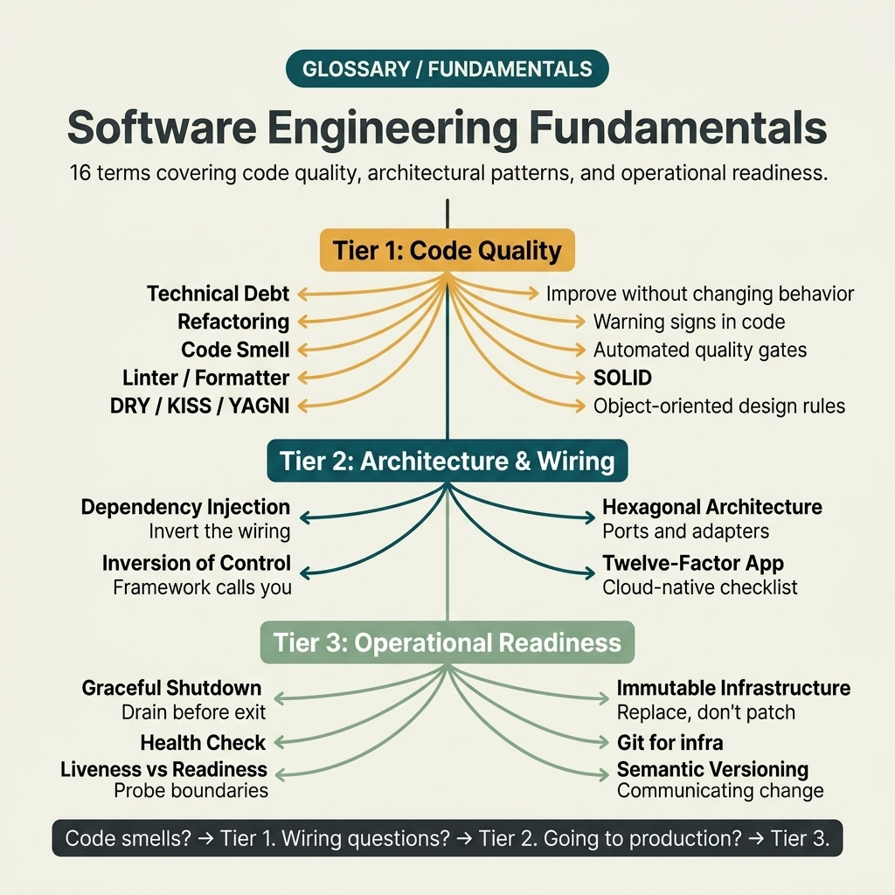

<!-- tags: glossary, reference, software-engineering-fundamentals, overview -->
# Software Engineering Fundamentals

> Cụm term nền tảng để team nói cùng một ngôn ngữ về code quality, design hygiene và operability cơ bản của ứng dụng.

| Aspect | Detail |
| --- | --- |
| **Concept** | Cụm term nền tảng để team nói cùng một ngôn ngữ về code quality, design hygiene và operability cơ bản của ứng dụng. |
| **Audience** | Developer, reviewer, tech lead |
| **Primary style** | Glossary hub router |
| **Entry point** | Mở khi vấn đề nằm ở quality engineering và architecture hygiene cơ bản nhưng chưa rõ term nào mới là entry point đúng |

📅 Ngày tạo: 2026-03-30 · 🔄 Cập nhật: 2026-04-11 · ⏱️ 7 phút đọc

---

## 1. DEFINE

Hình dung Nhiều review xấu không bắt đầu từ bug khó, mà bắt đầu từ việc mỗi người gọi cùng một hiện tượng bằng tên khác nhau: technical debt, code smell, refactor, architecture issue, operability gap. README này route những discussion cơ bản nhất của engineering vào đúng term trước khi team lao vào fix patchwork.

**Software Engineering Fundamentals** là cụm term nền tảng để team nói cùng một ngôn ngữ về code quality, design hygiene và operability cơ bản của ứng dụng.

| Variant | Mô tả |
| --- | --- |
| Code quality language | Technical debt, refactoring, code smell và linter/formatter giữ language cho quality engineering. |
| Design principles | Dependency Injection, Inversion of Control, Hexagonal Architecture, DRY/KISS/YAGNI và SOLID giữ boundary design. |
| Operability basics | 12-Factor, graceful shutdown, health check, readiness, immutable infrastructure, IaC và semantic versioning giữ hygiene cho runtime. |

| Approach | Time | Space | Khi chọn |
| --- | --- | --- | --- |
| Route theo review symptom | O(1) route | O(1) | Khi review code mà chưa rõ đang nói về debt, smell hay principle |
| Route theo design boundary | O(1) route | O(1) | Khi cần biết issue nằm ở dependency shape, layering hay architecture style |
| Học từ code quality đến operability | O(1) route | O(1) | Khi muốn đi từ hygiene trong code đến hygiene lúc chạy production |

Core insight:

> Engineering fundamentals có giá trị khi nó biến những từ khóa quen tai thành decision aid rõ ràng cho code review, design và production hygiene.

### 1.1 Signals & Boundaries

- Technical debt, refactoring và code smell liên quan nhau nhưng không đồng nghĩa.
- DI, IoC và Hexagonal Architecture thuộc lớp design boundary, cần tách khỏi principle slogan.
- 12-Factor, health check, readiness và IaC thuộc operability, rất dễ bị đánh giá quá muộn nếu không có vocabulary sẵn.

### Coverage Map

| Entry | Vai trò | Ghi chú |
| --- | --- | --- |
| [Technical Debt](01-technical-debt.md) | Canonical term | Entry chính của nhánh này |
| [Refactoring](02-refactoring.md) | Canonical term | Entry chính của nhánh này |
| [Code Smell](03-code-smell.md) | Canonical term | Entry chính của nhánh này |
| [Linter / Formatter](04-linter-formatter.md) | Canonical term | Entry chính của nhánh này |
| [Dependency Injection](05-dependency-injection.md) | Canonical term | Entry chính của nhánh này |
| [Inversion of Control](06-inversion-of-control.md) | Canonical term | Entry chính của nhánh này |
| [Hexagonal Architecture](07-hexagonal-architecture.md) | Canonical term | Entry chính của nhánh này |
| [12-Factor App](08-twelve-factor-app.md) | Canonical term | Entry chính của nhánh này |
| [Graceful Shutdown](09-graceful-shutdown.md) | Canonical term | Entry chính của nhánh này |
| [Health Check](10-health-check.md) | Canonical term | Entry chính của nhánh này |
| [Liveness vs Readiness](11-liveness-vs-readiness.md) | Canonical term | Entry chính của nhánh này |
| [Immutable Infrastructure](12-immutable-infrastructure.md) | Canonical term | Entry chính của nhánh này |
| [Infrastructure as Code](13-infrastructure-as-code.md) | Canonical term | Entry chính của nhánh này |
| [Semantic Versioning](14-semantic-versioning.md) | Canonical term | Entry chính của nhánh này |
| [DRY, KISS, YAGNI — Nguyên tắc Thiết kế Phần mềm](DRY-KISS-YAGNI.md) | Canonical term | Entry chính của nhánh này |
| [SOLID — 5 Nguyên tắc Thiết kế Hướng Đối tượng](SOLID.md) | Canonical term | Entry chính của nhánh này |

---

## 2. VISUAL




*Hình: Router map tách quality language, design boundaries và operability basics để review conversation không trượt sang sai lớp vấn đề.*

Đến đây, điều còn thiếu không phải thêm định nghĩa mà là một route map đủ rõ để thấy debt language, dependency boundary và runtime hygiene đang thuộc ba lane khác nhau của cùng một hệ engineering.

### Level 1

```text
Code quality language
Design principles
Operability basics
```

*Hình: Level 1 chia hub này thành các lane quyết định chính để người đọc không phải mò từ một danh sách thuật ngữ phẳng.*

### Level 2

```text
Nếu hiện tượng là...                               Mở file nào trước
------------------------------------------------   ------------------------------------------
Review đang nói về chi phí thay đổi và debt tích lũy Technical Debt
Cần nói về sửa shape code mà không đổi behavior nghiệp vụ Refactoring
Issue nằm ở dependency và architecture boundary     Dependency Injection
Production hygiene đang mơ hồ sau khi deploy       Graceful Shutdown
```

*Hình: Level 2 biến hub thành symptom router: bắt đầu từ câu hỏi thật, rồi mới rẽ sang term cụ thể.*

---

## 3. CODE

Diagram vừa tách nhóm này thành quality language, design boundaries và operability basics. Tiếp theo, hãy dùng hub như bàn định tuyến cho các cuộc review đang bị lẫn giữa nguyên tắc, debt và hygiene.

### Problem 1: Basic — Route đúng symptom vào đúng glossary entry

> **Mục tiêu**: Không để mọi câu hỏi về **Software Engineering Fundamentals** bị ném vào cùng một rổ.
> **Approach**: Bắt đầu từ symptom hoặc câu hỏi của người đọc, rồi mở entry đầu tiên phù hợp nhất.
> **Ví dụ**: Đầu vào là một câu hỏi review/design; đầu ra là file nên mở đầu tiên như `./01-technical-debt.md`.
> **Độ phức tạp**: Basic

```yaml
router:
  - symptom: Review đang nói về chi phí thay đổi và debt tích lũy
    open_first: ./01-technical-debt.md
  - symptom: Cần nói về sửa shape code mà không đổi behavior nghiệp vụ
    open_first: ./02-refactoring.md
  - symptom: Issue nằm ở dependency và architecture boundary
    open_first: ./05-dependency-injection.md
  - symptom: Production hygiene đang mơ hồ sau khi deploy
    open_first: ./09-graceful-shutdown.md
```

**Tại sao?** Trong fundamentals, sai entry point thường khiến team tranh cãi giải pháp trước khi thống nhất bản chất vấn đề là debt, design hay vận hành. Router này kéo cuộc nói chuyện về đúng lớp nền tảng.

**Kết luận**: Giá trị đầu tiên của hub này là giúp review mở đúng term trước khi cuộc tranh luận trôi sang giải pháp cụ thể.

### Problem 2: Intermediate — Dùng hub như learning path có chủ đích

> **Mục tiêu**: Đọc **Software Engineering Fundamentals** theo cụm có logic thay vì nhảy file rời rạc.
> **Approach**: Đi theo lane từ nền tảng đến biến thể nặng hơn, rồi quay lại so sánh adjacent concepts khi cần.
> **Ví dụ**: Một reader muốn xây mental model bền hơn thay vì chỉ tra một định nghĩa đơn lẻ.
> **Độ phức tạp**: Intermediate

```yaml
learning_path:
  quality_language:
    - 01-technical-debt.md
    - 02-refactoring.md
    - 03-code-smell.md
    - 04-linter-formatter.md
  design_boundaries:
    - 05-dependency-injection.md
    - 06-inversion-of-control.md
    - 07-hexagonal-architecture.md
    - DRY-KISS-YAGNI.md
    - SOLID.md
  operability:
    - 08-twelve-factor-app.md
    - 09-graceful-shutdown.md
    - 10-health-check.md
    - 11-liveness-vs-readiness.md
    - 12-immutable-infrastructure.md
    - 13-infrastructure-as-code.md
    - 14-semantic-versioning.md
```

**Tại sao?** Các term fundamentals bám chặt vào nhau: hiểu refactoring mà không thấy technical debt hoặc smell thì mental model sẽ rỗng. Learning path giữ các khái niệm nền ở đúng mạch phát triển của chúng.

**Kết luận**: Ở mức intermediate, hub này biến các nguyên tắc nền thành một learning path có thứ tự, để review không còn nhảy từ khẩu hiệu này sang khẩu hiệu khác.

### Problem 3: Advanced — Dùng hub như governance map cho shared vocabulary

> **Mục tiêu**: Giữ review, ADR, runbook hoặc postmortem dùng đúng cùng một language trong **Software Engineering Fundamentals**.
> **Approach**: Gom các term theo lane quyết định, rồi dùng lane đó như glossary contract cho team.
> **Ví dụ**: Khi hai người đang nói cùng một từ nhưng thật ra đang tranh luận ở hai lớp khác nhau của hệ thống.
> **Độ phức tạp**: Advanced

```yaml
governance_map:
  code_quality_language:
    - 01-technical-debt.md
    - 02-refactoring.md
    - 03-code-smell.md
  design_principles:
    - 05-dependency-injection.md
    - 06-inversion-of-control.md
    - 07-hexagonal-architecture.md
  operability_basics:
    - 08-twelve-factor-app.md
    - 09-graceful-shutdown.md
    - 10-health-check.md
```

**Tại sao?** Nếu lane ở cụm này rõ, team sẽ bớt dùng nguyên tắc như khẩu hiệu và bắt đầu dùng chúng như công cụ reasoning. Governance map giữ cho vocabulary nền không bị pha tạp theo cảm tính từng reviewer.

**Kết luận**: Ở mức advanced, hub này là bộ từ vựng nền để team nói nhất quán về chất lượng, boundary và hygiene cơ bản.

---

## 4. PITFALLS

Taxonomy đã rõ, nhưng route đúng chưa đủ để tránh những cú trượt phổ biến khi dùng hoặc diễn giải cụm khái niệm này.

| # | Severity | Lỗi | Hậu quả | Fix |
| --- | --- | --- | --- | --- |
| 1 | 🔴 Fatal | Trộn nhiều lớp khái niệm trong cùng một cuộc thảo luận | Team fix sai lớp vấn đề, tranh luận lệch hướng | Route lại theo đúng lane trong README trước khi mở term cụ thể |
| 2 | 🟡 Common | Chọn term theo tên quen tai thay vì theo symptom | Deep-link đúng file nhưng sai boundary | Đặt câu hỏi symptom trước, rồi mới chọn entry point |
| 3 | 🟡 Common | Đọc term lẻ mà bỏ qua learning path | Hiểu rời rạc, thiếu adjacent concept để so sánh | Đi theo cụm đọc đã gợi ý ở CODE/RECOMMEND |
| 4 | 🔵 Minor | Không link ngược về hub cha hoặc root hub | Người đọc khó quay lại taxonomy khi bị lạc | Giữ hub như router, không biến file thành island |

---

## 5. REF

| Resource | Loại | Link | Ghi chú |
| --- | --- | --- | --- |
| Refactoring | Book | https://martinfowler.com/books/refactoring.html | Nguồn kinh điển cho refactoring và quality language |
| The Twelve-Factor App | Official | https://12factor.net/ | Canon cho operability hygiene |
| A Philosophy of Software Design | Book | https://web.stanford.edu/~ouster/cgi-bin/book.php | Rất hợp cho design hygiene và complexity |

---

## 6. RECOMMEND

Bạn đã biết mình đang vướng quality language, design boundary hay operability. Hãy mở tiếp đúng lane để tránh biến fundamentals thành một nắm slogan lẫn lộn.

| Mở rộng | Khi nào | Lý do | File/Link |
| --- | --- | --- | --- |
| Technical Debt trước | Khi team cần gọi tên chi phí thay đổi | Đây là term mở của nhiều conversation quality engineering | [Technical Debt](./01-technical-debt.md) |
| Dependency Injection khi issue nằm ở dependency shape | Khi codebase khó test, khó thay implementation | Vấn đề lúc này là boundary phụ thuộc, không chỉ là style | [Dependency Injection](./05-dependency-injection.md) |
| Graceful Shutdown khi production hygiene bắt đầu lộ rõ | Khi runtime behavior mới là điểm đầu của debt | Engineering fundamentals không dừng ở code style | [Graceful Shutdown](./09-graceful-shutdown.md) |

---

## 7. QUICK REF

| Nếu gặp | Mở đâu |
| --- | --- |
| Review đang nói về chi phí thay đổi và debt tích lũy | [Technical Debt](./01-technical-debt.md) |
| Cần nói về sửa shape code mà không đổi behavior nghiệp vụ | [Refactoring](./02-refactoring.md) |
| Issue nằm ở dependency và architecture boundary | [Dependency Injection](./05-dependency-injection.md) |
| Production hygiene đang mơ hồ sau khi deploy | [Graceful Shutdown](./09-graceful-shutdown.md) |
