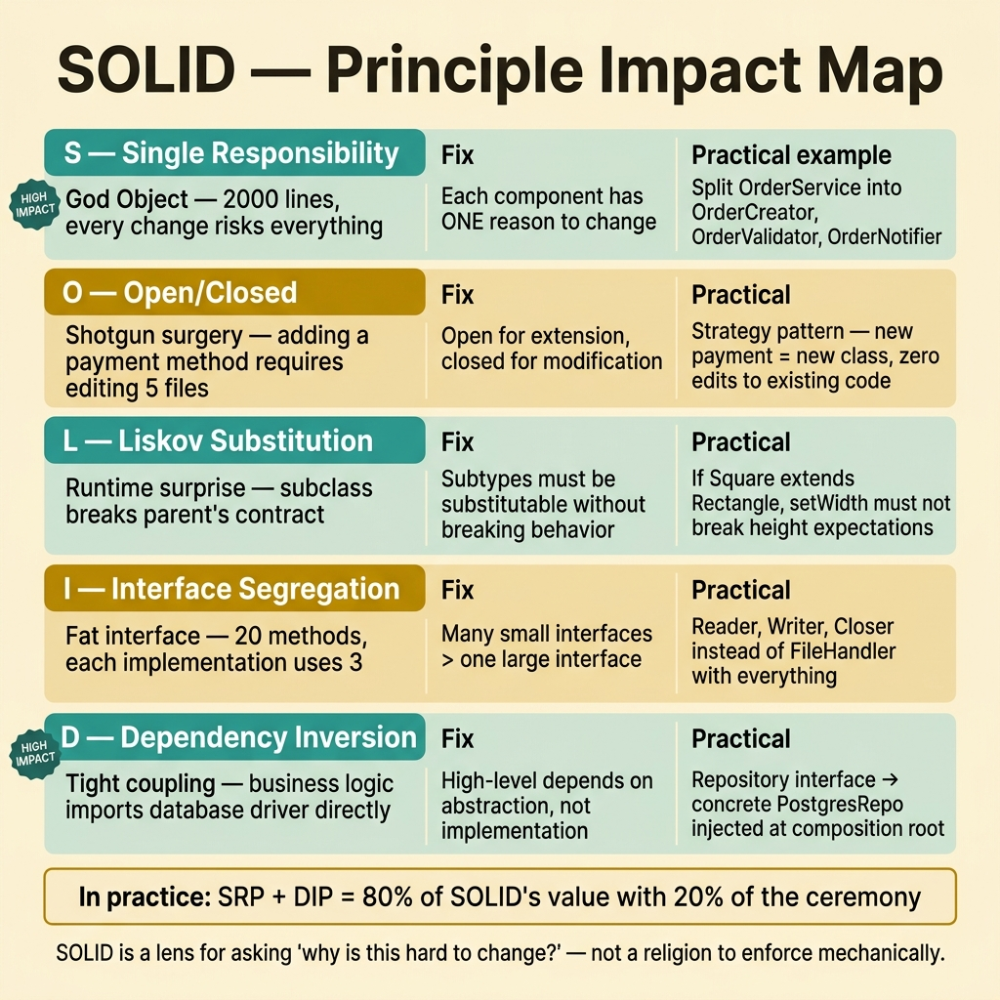
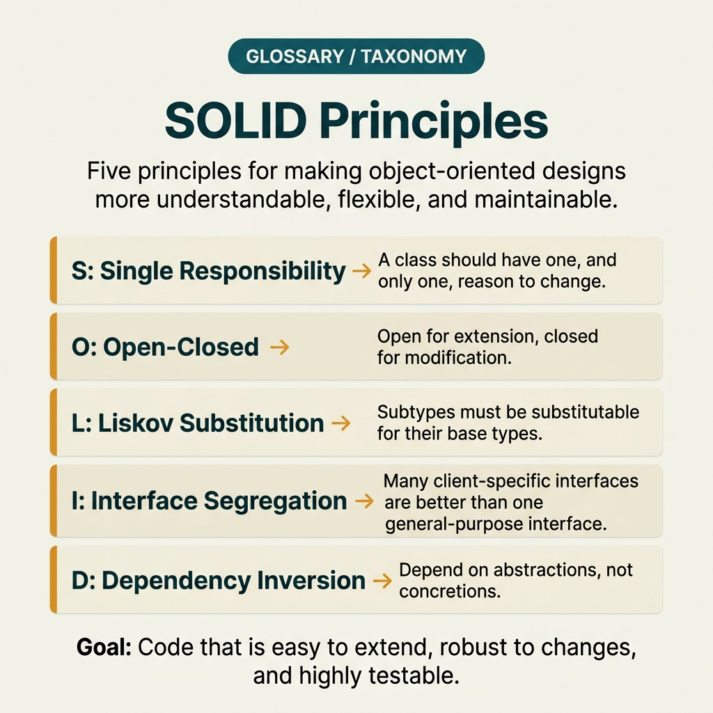

<!-- tags: glossary, reference, software-engineering-fundamentals, solid -->
# SOLID — 5 Object-Oriented Design Principles

> Five foundational design principles for clean, maintainable code: Single Responsibility, Open/Closed, Liskov Substitution, Interface Segregation, and Dependency Inversion.

| Aspect | Detail |
| --- | --- |
| **Concept** | Five foundational design principles for clean, maintainable code that reduce coupling and increase changeability. |
| **Audience** | Reviewer, tech lead, developer who needs to use this term within the correct boundary |
| **Primary style** | Glossary term |
| **Entry point** | Use when the concept of **SOLID** needs to be named correctly in a review, ADR, or incident note. |

📅 Created: 2026-03-20 · 🔄 Updated: 2026-04-04 · ⏱️ 15 min read

---

## 1. DEFINE

You are in the middle of a code review or writing an ADR. Someone says: "this violates **SOLID**." If the room understands that word in three different ways, the discussion will drift away from the actual technical problem. This glossary term exists to lock the boundary before the team decides whether to refactor, accept a trade-off, or change policy.

**SOLID** is a set of five principles guiding object-oriented module/system design. They are valuable when they reduce coupling and increase changeability; they are not mandates to create interfaces everywhere.

| Variant | Description |
| --- | --- |
| SRP / OCP | A component has one reason to change, and is open for extension but closed to unnecessary modification. |
| LSP / ISP | Subtypes can substitute without breaking the contract; interfaces are narrow enough that consumers do not depend on things they do not use. |
| DIP | High-level policy depends on abstraction, not on detailed implementation. |

| Approach | Time | Space | When to choose |
| --- | --- | --- | --- |
| Responsibility mapping | Per module | O(1) | When reviewing a class/service that is taking on too many roles. |
| Contract-first abstraction | Per interface | O(1) | When you want an extension point but need to avoid unnecessary abstraction. |
| Composition over inheritance | O(1) | O(1) | When applying SOLID without falling into rigid class hierarchies. |

Core insight:

> SOLID is valuable when it makes the cost of change lower and boundaries clearer. If applied as a formal checklist, the team will create more abstraction, not more clarity.

### 1.1 Invariants & Failure Modes

A good glossary term must maintain these invariants:
- SOLID must refer to the same class of phenomena or decision in all related documents;
- the term must be accompanied by evidence, not just a feeling;
- SOLID must lead to a clear next action: continue reviewing, refactor, harden, or accept intentionally.

The failure mode is turning every class into an interface, every use case into a hierarchy, and calling that SOLID. When abstractions are created faster than actual change needs, the codebase becomes harder to read rather than more flexible.

---

## 2. CONTEXT

**Who uses it**: Reviewer, tech lead, developer who needs to use this term within the correct boundary

**When**: Use when the concept of **SOLID** needs to be named correctly in a review, ADR, or incident note.

**Purpose**: SOLID is valuable when it makes the cost of change lower and boundaries clearer. If applied as a formal checklist, the team will create more abstraction, not more clarity.

**In the ecosystem**:
When using the term **SOLID**, always attach it to a specific boundary: module, review workflow, runtime signal, or operational policy. Without a boundary, the reader hears a buzzword rather than a decision aid.

---

The five classic principles are clear. But how does SOLID in Go differ from Java, when does applying SOLID become over-engineering, and which principle matters most?

## 3. EXAMPLES

SOLID surfaces most clearly when a God Object class contains 2000 lines (violating SRP), when adding a feature requires changes across 5 files (violating OCP), or when an interface has 20 methods but each implementation only uses 3 (violating ISP). The examples below place the pattern in exactly those moments.

### Example 1: Basic — Use SOLID to review a service taking on too many responsibilities

> **Goal**: Create a short note so the entire team uses **SOLID** with the same meaning in a PR or review.
> **Approach**: Use a structured YAML note to force the term to come with a summary, boundary, and next step instead of a bare buzzword.
> **Example**: A reviewer wants to say "this violates SRP" without leaving an opinionated comment.
> **Complexity**: Basic — turn vocabulary into a clear artifact before deeper debate.



*Figure: SOLID's five principles target different design pain points. SRP prevents God Objects by restricting each component to a single reason to change. OCP prevents shotgun surgery by allowing extension without modification. LSP prevents runtime surprises by ensuring substitutability. ISP prevents fat dependencies by keeping interfaces narrow. DIP prevents tight coupling by inverting the dependency direction. In practice, SRP and DIP deliver the highest impact for the least ceremony.*

```yaml
term: solid
title: "SOLID — 5 Object-Oriented Design Principles"
decision_context: "PR or design review needs to name SOLID correctly to lock the boundary before further debate."
use_when:
  - "Need to lock the meaning of the term before the team debates further"
  - "Want to attach the term to a specific technical boundary"
not_when:
  - "Actual impact or relevant boundary has not been identified yet"
summary: "Five foundational design principles for clean, maintainable code that reduce coupling and increase changeability."
next_step: "Open adjacent terms if SOLID needs to be distinguished from similar concepts."
```

**Why?** Even as a basic example, the structured note is valuable because it forces the writer to prove they are actually talking about **SOLID**, not a vague feeling of discomfort. Simply forcing boundary and next step into writing eliminates a great deal of noise in discussions.

**Takeaway**: When SOLID comes with a clear artifact, reviews focus on changeability and real boundaries instead of stopping at engineering slogans.

### Example 2: Intermediate — Design just-enough abstraction instead of interfacing everything

> **Goal**: Distinguish **SOLID** from similar concepts so the backlog or design notes do not mix different types of work.
> **Approach**: Use a small review checklist to ask the right questions about boundary, evidence, and impact before accepting the term.
> **Example**: The team is about to create a ticket or ADR comment and needs to know which term should be the primary vocabulary.
> **Complexity**: Intermediate — trade-offs and risk classification require clearer mechanism explanation.

```yaml
review_question: "Is this actually a SOLID violation or just a symptom that looks similar?"
boundary:
  system_area: "service / module / runtime / review comment"
  observable_impact:
    - "change cost"
    - "design clarity"
    - "operational behavior"
comparison:
  this_term: "SOLID"
  often_confused_with: "SOLID is a set of principles guiding object-oriented module/system design. They are useful when they reduce coupling and increase changeability; they are not mandates to create interfaces everywhere."
decision:
  keep_term: true
  evidence_required:
    - "state the specific phenomenon"
    - "state the decision or risk affected"
    - "state the follow-up action if needed"
```

**Why?** This checklist forces the team to move from symptoms to mechanisms. Without comparing boundaries and evidence, a term like **SOLID** easily gets misused: sometimes to describe a root cause, sometimes to describe a consequence, sometimes as a purely emotional label.

**Takeaway**: The intermediate value of SOLID is helping tickets, reviews, and ADRs correctly classify the type of debt or hygiene that needs to be addressed first.

### Example 3: Advanced — Apply SOLID through composition and contracts, not heavy hierarchies

> **Goal**: Elevate **SOLID** from shared vocabulary into a lightweight guardrail in the engineering workflow.
> **Approach**: Write a policy/checklist so that anyone using the term must identify the boundary, impact, and next action.
> **Example**: Apply to PR templates, ADR templates, or incident postmortems so the term is not used in the wrong context.
> **Complexity**: Advanced — moving from a personal note to team- or module-level governance.

```yaml
policy:
  glossary_term: "SOLID"
  trigger:
    - "PR review repeats the same type of comment"
    - "ADR needs to lock vocabulary to prevent misunderstanding"
    - "incident postmortem needs to distinguish the correct cause"
  owner: "tech lead or reviewer responsible for that boundary"
  checklist:
    - "State the term"
    - "State the boundary"
    - "State the impact"
    - "State the next action"
  reject_if:
    - "term is used as a buzzword"
    - "no evidence or corresponding system behavior"
```

**Why?** A term only truly lives within a team when it becomes part of the workflow — not just individual memory. This small policy turns **SOLID** into a language contract: anyone using the term must prove they are pointing at the same class of decision or risk.

**Takeaway**: At the advanced level, SOLID is a reference frame for reasoning about change and coupling — not an OOP checklist to memorize and mechanically enforce.

---

## 4. COMPARE




*Figure: The position of SOLID between DRY/KISS/YAGNI, design patterns, and clean architecture.*

SOLID sounds like design patterns. Not exactly: SOLID consists of principles, while design patterns are concrete solutions. SOLID says "why," patterns say "how." Applying SOLID without understanding context leads to needlessly complex code.

### Level 1

```text
Identify responsibility -> separate into narrow, correctly-scoped contracts -> inject abstraction at boundaries that need to change.
```
*Figure: Level 1 places the term **SOLID** into a simple decision flow so beginners know when to use this term instead of speaking vaguely.*

### Level 2

```text
If encountering...                                  What signal identifies SOLID correctly
-----------------------------------------            ---------------------------------------------------------
Vague comment about SOLID                             Find the specific boundary: module, policy, runtime, or related workflow
A similar term appears                                Compare SOLID's invariant with the easily confused concept
Need to choose an action after mentioning it          Decide whether to refactor, harden, measure more, or accept the trade-off
SOLID is not the destination; it is a lens-set for asking "why is this hard to change?" Only use the principle that addresses the actual pain point.
```
*Figure: Level 2 helps experienced readers see that a glossary term is not just a definition — it is a decision router for choosing the correct next action.*

### Easy to confuse or cross the boundary

| # | Severity | Mistake | Consequence | Fix |
| --- | --- | --- | --- | --- |
| 1 | 🔴 Fatal | Using **SOLID** as a buzzword without a boundary | Team says the same word but argues about three different issues | Always state the module, workflow, or runtime behavior the term points to |
| 2 | 🟡 Common | Mixing **SOLID** with similar concepts | Tickets, ADRs, or reviews get misclassified | Add a comparison line in the note or README hub before expanding scope |
| 3 | 🟡 Common | Naming the term without a next action | Glossary becomes a decorative dictionary, not a decision aid | Accompany with an action: measure more, refactor, harden, create policy, or accept trade-off |
| 4 | 🔵 Minor | Deep-linking the term without linking back to the topic hub | Reader understands the term in isolation, hard to place in a learning path | Keep the README topic and adjacent concepts in RECOMMEND / navigation at the end |

### Quick scan

| If you encounter | What to do |
| --- | --- |
| Someone uses **SOLID** too generically | Ask for boundary, impact, and next action before agreeing to keep the term |
| Need to deep-link quickly in a review | Link directly to this glossary file, then connect through the topic hub for broader context |
| Team is mixing up several similar terms | Open the topic hub to compare adjacent concepts before creating a ticket or ADR |

---

## 5. REF

| Resource | Type | Link | Notes |
| --- | --- | --- | --- |
| Martin Fowler | Blog | https://martinfowler.com/ | Strong source for vocabulary on design, refactoring, and architecture debt. |
| Refactoring.Guru | Reference | https://refactoring.guru/ | Useful when comparing glossary terms with similar patterns or smells. |
| The Twelve-Factor App | Official | https://12factor.net/ | Good source of truth for terms leaning toward runtime and deploy hygiene. |

---

## 6. RECOMMEND

SOLID answers the question "the code works but every change hurts." The next question: how do DRY/KISS/YAGNI complement SOLID, and how does technical debt accumulate?

| Expand to | When to read next | Why | File/Link |
| --- | --- | --- | --- |
| Topic hub | When **SOLID** needs to be placed in a larger learning path | Avoid understanding the term as an island separated from the taxonomy | [Software Engineering Fundamentals](./README.md) |
| Previous concept | When you need to return to the preceding term for boundary comparison | Useful if the discussion is sliding between two similar terms | [DRY, KISS, YAGNI — Software Design Principles](./DRY-KISS-YAGNI.md) |
| Next concept | When the current term typically leads to an adjacent decision or pattern | Helps read continuously along the concept chain of the topic | [README](./README.md) |

Back to that 2000-line God Object at the beginning — every change affects everything. Now you know: SOLID is not a religion. SRP and DIP are the two principles with the highest real-world impact. Apply them at the right level, and code becomes maintainable. Apply them excessively, and code becomes more complex than the problem.

**Links**: [← Previous](./DRY-KISS-YAGNI.md) · [→ Next](./README.md)
