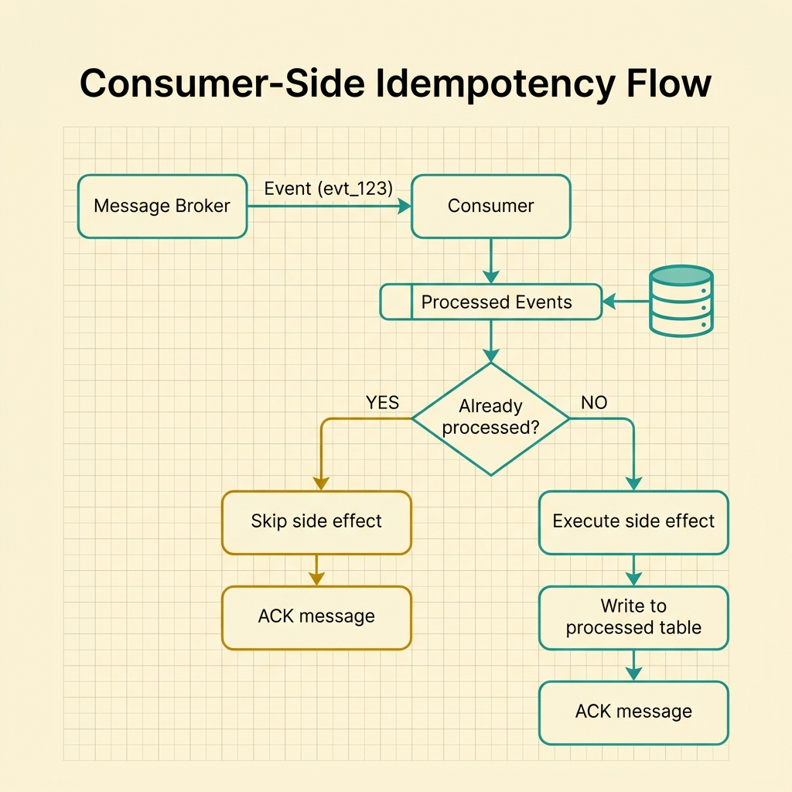
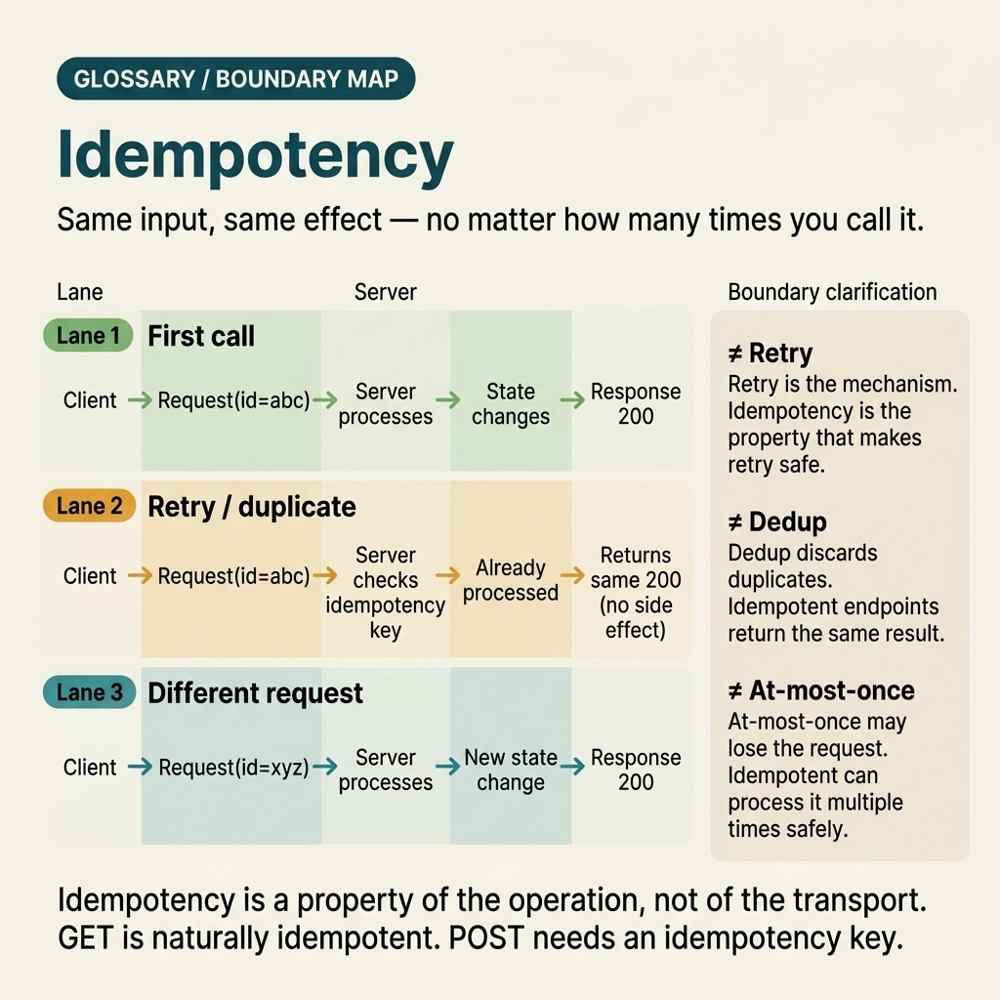

<!-- tags: glossary, reference, system-design-architecture, idempotency -->
# Idempotency

> The property that makes an operation produce the same observable result when called multiple times as the first valid execution.

| Aspect | Detail |
| --- | --- |
| **Concept** | The property that makes an operation produce the same observable result when called multiple times as the first valid execution. |
| **Audience** | Backend engineer, API designer, distributed systems reviewer |
| **Primary style** | Glossary term |
| **Entry point** | Use when retry, at-least-once delivery, or duplicate submission can occur and the team needs to prevent side effects from being doubled. |

📅 Created: 2026-03-30 · 🔄 Updated: 2026-04-04 · ⏱️ 10 min read

---

## 1. DEFINE

Picture this: you just received an alert from the payment gateway — a user was charged twice for the same checkout session. Logs show no obvious logic bug; only that the client timed out on the first request, the mobile app retried immediately with a second request, and both went through `POST /payments`. If the system cannot distinguish "the same intent sent again" from "a new intent," duplicate side effects will naturally emerge at exactly the moment the network is most unstable. That is the boundary of idempotency.

**Idempotency** is the property that makes an operation produce the same observable result when called multiple times as the first valid execution.

| Variant | Description |
| --- | --- |
| Natural idempotency | The operation inherently sets state or overwrites the same resource, like `PUT /profile`. |
| Key-based idempotency | An idempotency key is attached to identify the same create or payment intent. |
| Consumer-side idempotency | The consumer records a processed ledger to skip message redelivery. |
| Workflow-level idempotency | The entire job or saga step uses a stable business key to avoid replaying side effects. |

| Approach | Time | Space | When to choose |
| --- | --- | --- | --- |
| Deterministic overwrite | O(1) | O(1) | When the operation is purely set-state and the side effect always converges to a single state. |
| Idempotency key store | O(lookup) | O(key store) | When `POST` create/payment/retry has sensitive side effects. |
| Processed-event ledger | O(lookup) | O(process log) | When handling broker redelivery under at-least-once delivery. |
| Workflow business key | O(step lookup) | O(workflow state) | When an intent passes through multiple async steps or scheduled jobs. |

Core insight:

> Idempotency does not make an operation "side-effect-free." It ensures the same intent does not create additional side effects when retried, resent, or redelivered.

### 1.1 Invariants & Failure Modes

- The same intent key must lead to the same observable business result.
- If the outcome of the first execution already exists, a valid retry must replay that outcome instead of creating a new side effect.
- Key store, consumer ledger, or workflow state all need explicit TTL/retention; otherwise, the system will either swallow valid requests or grow metadata without control.

---

## 2. CONTEXT

**Who uses it**: Backend engineer, API designer, distributed systems reviewer

**When**: Use when retry, at-least-once delivery, or duplicate submission can occur and the team needs to prevent side effects from being doubled.

**Purpose**: Idempotency does not make an operation "side-effect-free." It ensures the same intent does not create additional side effects when retried, resent, or redelivered.

**In the ecosystem**:
- Idempotency differs from UI disable button; the UI only reduces accidental duplicates but cannot protect against retry from client, gateway, or broker.
- Idempotency differs from exactly-once delivery; most systems still live with at-least-once and use idempotency to absorb duplicates.
- Idempotency also differs from dedup by payload alone; the business intent is what needs to be correctly identified.

---

The definition and ecosystem are clear. But what does idempotency actually look like inside a concrete architecture — that is the part most easily misunderstood if kept at the theory level.

## 3. EXAMPLES

Idempotency only becomes clear when it touches a payment charged twice, a confirmation email sent again, or a cron job replaying at midnight. The examples below place this term into exactly those situations — where "calling again" is normal, and side effects must not follow suit.

### Example 1: Basic — Keep create operations from doubling when the client retries

> **Goal**: Do not create two orders or two payments because the same intent was sent again.
> **Approach**: Attach an idempotency key to the request and store the first outcome.
> **Example**: `POST /payments` times out on the client but the server only charges once.
> **Complexity**: Basic

```yaml
idempotent_request:
  endpoint: POST /payments
  idempotency_key: pay_9f3a
  first_result: payment_created
  duplicate_behavior: return_first_result
```

**Why?** Retry is normal behavior on an unreliable network. If the server does not remember the intent already processed, a duplicate request will very easily become a duplicate business action instead of a replay of the same outcome.

**Takeaway**: Basic idempotency usually starts at the most sensitive `POST` endpoints with clear key-based handling.

### Example 2: Intermediate — Design an idempotent consumer for at-least-once messaging

> **Goal**: Do not let broker redelivery recreate an email, a ledger entry, or a state transition already processed.
> **Approach**: Record the processed message ID or business key before applying the side effect.
> **Example**: An outbox consumer receives the same event after a crash but does not resend the confirmation email.
> **Complexity**: Intermediate



*Figure: Consumer-side idempotency ensures broker redelivery does not duplicate business side effects.*

```yaml
consumer_idempotency:
  message_id: evt_123
  processed_table_check: true
  action_if_seen: skip_side_effect
```

**Why?** At-least-once delivery is more practical than exactly-once, but its price is duplicate delivery. Consumer idempotency is the buffer layer so that duplicates at the transport level do not become duplicates at the business level.

**Takeaway**: Intermediate idempotency is a survival condition for message-driven systems — not an optional enhancement.

### Example 3: Advanced — Separate intent identity from payload equality

> **Goal**: Do not mistake two requests with identical payloads as the same intent, or vice versa.
> **Approach**: Define a business key/intent key more precisely than comparing the entire body.
> **Example**: Two payments of the same amount for the same user on the same day can still be two different intents.
> **Complexity**: Advanced

```yaml
intent_model:
  business_intent_key: checkout_session_42
  payload_fields: [amount, currency, customer_id]
  anti_pattern: payload_hash_only
```

**Why?** Idempotency is about the sameness of intent, not just the sameness of payload. If you use a payload hash as the only key, the system may swallow a legitimate second request or still let a duplicate through where the real business key lies elsewhere.

**Takeaway**: Advanced idempotency succeeds when the team correctly models the identity of the business intent.

### Example 4: Expert — Maintain idempotency across a multi-step workflow and cron/job retry

> **Goal**: Do not let the same business workflow be replayed by the job scheduler, webhook replay, and consumer retry all at once.
> **Approach**: Use a stable workflow key, persist step outcomes, and clearly distinguish technical retry from a new business intent.
> **Example**: `checkout_session_42` has payment, email, and inventory reservation; each step can be retried but the entire workflow must still converge exactly once.
> **Complexity**: Expert

```yaml
workflow_idempotency:
  workflow_key: checkout_session_42
  steps:
    payment: completed
    inventory: completed
    email: pending_retry
  replay_policy: resume_incomplete_only
```

**Why?** In production, duplicates rarely appear at just one boundary. Client retry, webhook replay, queue redelivery, and job restart can all stack on top of each other. If the workflow has no stable identity and clear step state, each layer being "a little bit idempotent" is still not enough for the entire system to avoid duplicate side effects.

**Takeaway**: Expert idempotency views duplicate protection as a property of the entire workflow — not just of individual endpoints.

---

From payment retry to workflow replay — you have seen idempotency operating at multiple levels. The remaining question: where does it stand among the similar-sounding concepts that teams frequently mix up?

## 4. COMPARE




*Figure: Boundary map showing where idempotency stands relative to dedup, exactly-once, UI disable, and retry.*

From a distance, idempotency sounds like deduplication, like exactly-once, like a UI disable button. Up close, each solves a different layer — and confusing layers is the most common way duplicates still leak into production.

### Level 1

```text
client sends request
  -> timeout or retry happens
  -> server sees same intent again
  -> no new side effect is created
```

*Figure: Level 1 shows duplicate delivery is only safe when the same intent does not produce additional side effects.*

### Level 2

```text
idempotency key stored with outcome
  -> duplicate request arrives
  -> server returns previous result
  -> downstream side effects are not replayed
```

*Figure: Level 2 emphasizes the idempotency key must not only block duplicates but also be able to replay the previous outcome.*

### Easy to confuse or cross the boundary

| # | Severity | Mistake | Consequence | Fix |
| --- | --- | --- | --- | --- |
| 1 | 🔴 Fatal | Comparing duplicates only by raw payload | Swallows a legitimate intent or misses the real duplicate | Define a clear business intent key. |
| 2 | 🟡 Common | Trusting UI disable button is sufficient | Retry from client, gateway, or broker still doubles side effects | Place idempotency at the server or consumer boundary. |
| 3 | 🟡 Common | Not storing the first outcome of the idempotency key | Duplicate requests cannot replay the correct result | Persist the state and response reference of the first execution. |
| 4 | 🟡 Common | No TTL/cleanup for the key store | Store grows endlessly or blocks legitimate requests later | Design retention according to business risk. |
| 5 | 🔵 Minor | Only implementing idempotency at the endpoint, not at the worker | Duplicate side effects still occur on the async path | Treat idempotency as an end-to-end concern. |

### Quick scan

| If you encounter | What to do |
| --- | --- |
| Retry can create duplicate side effects | Add idempotency |
| Broker redelivery is normal | Make the consumer idempotent |
| Payload is identical but business intents differ | Redefine the intent key |
| Workflow has multiple retry layers | Use workflow key + step state |

---

## 5. REF

| Resource | Type | Link | Notes |
| --- | --- | --- | --- |
| Designing Data-Intensive Applications | Book | https://dataintensive.net/ | Foundational source for consistency, data flow, and distributed trade-offs. |
| Microservices.io | Reference | https://microservices.io/ | Practical pattern catalog for saga, outbox, and resilience. |
| Stripe API Idempotent Requests | Official | https://docs.stripe.com/api/idempotent_requests | Real-world example of key-based idempotency. |

---

## 6. RECOMMEND

You now understand that idempotency protects side effects from being doubled. But keeping intent correct is only half the distributed problem — the other half is consistency, orchestration, and reliable delivery.

| Expand to | When | Why | File/Link |
| --- | --- | --- | --- |
| Consistency trade-off | When retry involves data that has not yet converged | Eventual Consistency is the adjacent concept | [Eventual Consistency](./02-eventual-consistency.md) |
| Workflow consistency | When duplicate protection spans multiple distributed steps | Saga Pattern extends to workflow-level control | [Saga Pattern](./04-saga-pattern.md) |
| Reliable event publish | When idempotency accompanies an async event path | Outbox Pattern is the next step | [Outbox Pattern](./07-outbox-pattern.md) |

Back to that alert at the beginning — user charged twice. Now you know the bug is not in business logic but in the server not remembering the intent already processed. One idempotency key, one outcome store. That simple — but it must exist.

**Links**: [← Previous](./README.md) · [→ Next](./02-eventual-consistency.md)
