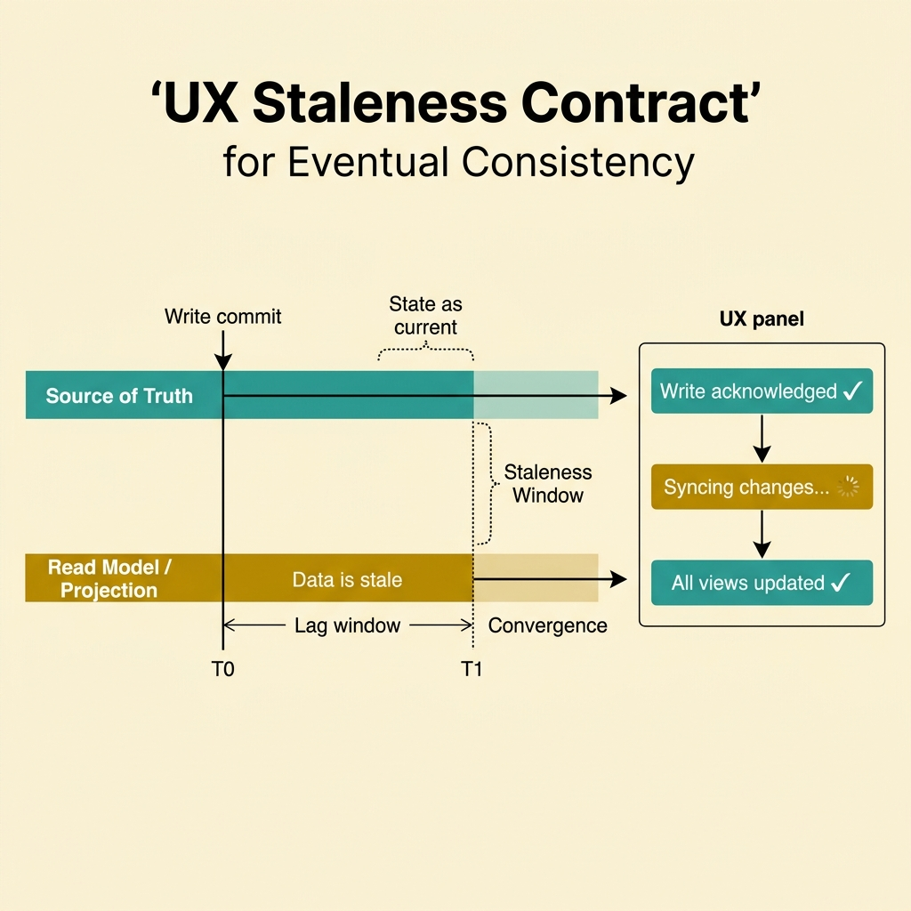
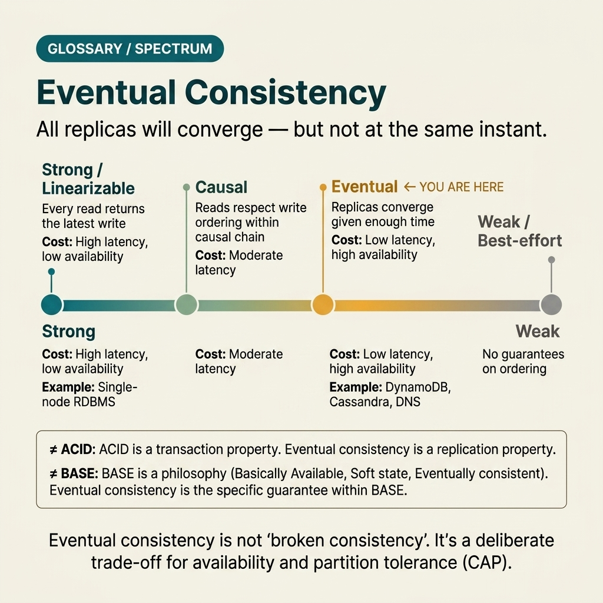

<!-- tags: glossary, reference, system-design-architecture, eventual-consistency -->
# Eventual Consistency

> A model in which replicas or read models may temporarily diverge but will converge to the same state after updates have been sufficiently propagated.

| Aspect | Detail |
| --- | --- |
| **Concept** | A model in which replicas or read models may temporarily diverge but will converge to the same state after updates have been sufficiently propagated. |
| **Audience** | Backend engineer, architect, data consistency reviewer |
| **Primary style** | Glossary term |
| **Entry point** | Use when a distributed system prioritizes availability, scalability, or async propagation over every node seeing the same state instantly. |

📅 Created: 2026-03-30 · 🔄 Updated: 2026-04-04 · ⏱️ 10 min read

---

## 1. DEFINE

Picture this: you just changed the shipping address for a customer. The source service has committed the write successfully, but the search index, support dashboard, and replica read API still show the old data for a few more seconds. If the team does not name this trade-off correctly, they will either label it a "random bug," or try to force every read path to be as strong as the source of truth and pay the price in throughput and coupling. That is the boundary of eventual consistency.

**Eventual Consistency** is a model in which replicas or read models may temporarily diverge but will converge to the same state after updates have been sufficiently propagated.

| Variant | Description |
| --- | --- |
| Replica lag consistency | The primary already has the write but the replica/read side has not caught up. |
| Projection lag | A read model in CQRS, search, or analytics updates slower than the write model. |
| Cross-service convergence | Multiple services need time to reflect the same business fact. |
| Client-observed staleness | The user sees old state in a short window after the write has committed. |

| Approach | Time | Space | When to choose |
| --- | --- | --- | --- |
| Synchronous consistency | O(write coordination) | O(1) | When stale reads are not acceptable at that boundary. |
| Async propagation | O(write fast, convergence slow) | O(queue/projection state) | When availability, decoupling, or throughput matters more than immediate global agreement. |
| Bounded staleness UX | O(async propagation) | O(client/view state) | When lag is accepted but a clear contract with the user is needed. |
| Hybrid consistency partition | O(varies by path) | O(mixed states) | When some invariants must be strong while derived views can converge later. |

Core insight:

> Eventual consistency does not mean "data is wrong forever." It means the system accepts a temporary window of divergence in exchange for decoupling, throughput, or resilience where appropriate.

### 1.1 Invariants & Failure Modes

- Propagation lag must be measurable — not "probably a few seconds."
- Invariants like payment capture, inventory reservation, and identity mutation typically cannot be pushed entirely to the eventual path.
- If the UX promises "updated everywhere" while the projection still lags, stale state will be perceived as a trust-breaking bug rather than a design trade-off.

---

## 2. CONTEXT

**Who uses it**: Backend engineer, architect, data consistency reviewer

**When**: Use when a distributed system prioritizes availability, scalability, or async propagation over every node seeing the same state instantly.

**Purpose**: Eventual consistency does not mean "data is wrong forever." It means the system accepts a temporary window of divergence in exchange for decoupling, throughput, or resilience where appropriate.

**In the ecosystem**:
- Eventual consistency differs from data corruption; state may be temporarily stale but must still converge correctly.
- Eventual consistency does not exempt the need to identify which invariants must still be strong at local boundaries.
- Eventual consistency is a contract for both backend and UX; product copy and behavior need to reflect it.

---

The contract is clear: temporary staleness in exchange for decoupling. But what does that "temporary" look like in a search index, in UX copy, and in a midnight runbook?

## 3. EXAMPLES

Eventual consistency surfaces most visibly when a user refreshes the page and sees old data, when a support agent cannot find the order on the dashboard, or when projection lag turns into an incident report. The examples below place the term into exactly those levels.

### Example 1: Basic — Accept bounded stale reads on secondary read models

> **Goal**: Do not force every read path to be as strong as the source of truth.
> **Approach**: Allow async projection lag on views that do not need exact-now semantics.
> **Example**: A search index updates a few seconds after the product title changes.
> **Complexity**: Basic

```yaml
read_model_policy:
  source_of_truth: product_service
  projection: search_index
  tolerated_staleness: 5s
```

**Why?** Not every place that displays data needs instant synchronization. If projections are forced to be strong-consistent everywhere, the system loses many benefits of async decoupling that the user may not even need.

**Takeaway**: Basic eventual consistency is allowing bounded stale reads on the right paths.

### Example 2: Intermediate — Align the consistency model with UX and business expectations

> **Goal**: Do not let the technical team accept lag while the UX still behaves as if data is instant.
> **Approach**: Design UI copy, refresh behavior, or optimistic feedback to match the propagation lag.
> **Example**: After the user changes their profile, the UI shows "syncing changes" instead of assuming every view is already updated.
> **Complexity**: Intermediate



*Figure: When UX and consistency model speak the same language, stale state feels like a design choice — not a bug.*

```yaml
ux_contract:
  write_ack: source_of_truth_committed
  read_model_note: syncing_changes
  fallback: refresh_after_projection_delay
```

**Why?** The consistency model is part of product behavior. If the UX promises instant global consistency while the backend does not provide it, every lag will be perceived as an inexplicable bug rather than an intentionally designed trade-off.

**Takeaway**: Intermediate work is making UX and the consistency model speak the same language.

### Example 3: Advanced — Separate which invariants must be strong and which can converge later

> **Goal**: Do not use eventual consistency as a reason to loosen every important boundary.
> **Approach**: Keep strong local transactions at the source of truth for core invariants; propagate async for derived views.
> **Example**: Inventory reservation is strong at the local store; analytics and search update async.
> **Complexity**: Advanced

```yaml
consistency_partition:
  strong_invariants: [inventory_reservation, payment_capture]
  eventual_views: [search_projection, analytics_stream]
```

**Why?** Mature systems do not choose "strong for everything" or "eventual for everything" — they partition correctly between where stale state is tolerable and where it is not. This decision governs both architecture and UX contract.

**Takeaway**: Advanced eventual consistency is a locally controlled choice — not a slogan for the entire system.

### Example 4: Expert — Operate eventual consistency with lag metrics, repair strategy, and a replay plan

> **Goal**: Do not let the eventual path become a black box of "just wait and it will be correct."
> **Approach**: Measure projection lag, have a replay/repair pipeline, and set clear boundary alerting.
> **Example**: The order dashboard projection lagging beyond 2 minutes triggers an alert; the consumer can replay the stream to self-repair the read model.
> **Complexity**: Expert

```yaml
operational_contract:
  projection_lag_slo: 120s
  repair_mode: replay_projection_stream
  alert_on_lag_breach: true
```

**Why?** Eventual consistency is only acceptable when the divergence window is under control. Without lag metrics and a repair path, "eventual" very quickly becomes an excuse to legitimize a system that stays stale forever with nobody knowing when it will converge.

**Takeaway**: Expert eventual consistency is an operational model that can be measured, repaired, and explained to product.

---

From simple stale reads to an operational contract with a replay pipeline — you have seen that eventual consistency is not a binary decision. But it is easily confused with things that sound similar — and confusion here carries a non-trivial cost.

## 4. COMPARE




*Figure: Boundary map showing where eventual consistency stands among strong consistency, data corruption, and related concepts.*

"Eventual" sounds like "it will be correct eventually." But when the team uses this phrase without specifying which layer it applies to, it easily slides into an excuse for legitimizing uncontrolled stale data.

### Level 1

```text
write committed on source
  -> replicas / projections lag behind
  -> after propagation they converge
```

*Figure: Level 1 shows the divergence is temporary between the source of truth and replicas/read models.*

### Level 2

```text
user writes new state
  -> immediate read hits stale projection
  -> later read sees updated state
  -> UX must tolerate or surface this window
```

*Figure: Level 2 places eventual consistency into the real experience of the read path and the user.*

### Easy to confuse or cross the boundary

| # | Severity | Mistake | Consequence | Fix |
| --- | --- | --- | --- | --- |
| 1 | 🔴 Fatal | Using eventual consistency for invariants that cannot tolerate stale state | Business errors or double-spend | Keep strong boundaries for core invariants. |
| 2 | 🟡 Common | Not communicating lag to UX or stakeholders | Stale reads perceived as random bugs | Design an explicit consistency contract. |
| 3 | 🟡 Common | Not measuring propagation lag | No visibility into how long the divergence window lasts | Track projection lag or replica lag as a first-class metric. |
| 4 | 🟡 Common | No replay/repair path for projections | Read model stays stale for extended periods after incidents | Prepare a replay pipeline and operational runbook. |
| 5 | 🔵 Minor | Using the phrase "eventual consistency" to cover design vagueness | Review cannot assess the real boundary | State clearly where eventual applies and why. |

### Quick scan

| If you encounter | What to do |
| --- | --- |
| Read model stale for a few seconds but will converge | That is eventual consistency |
| Core invariant cannot tolerate stale state | Do not use eventual there |
| Product perceives stale data as a bug | Clarify the consistency contract with UX |
| Projection lag is not measurable | Add lag metric and repair path |

---

## 5. REF

| Resource | Type | Link | Notes |
| --- | --- | --- | --- |
| Designing Data-Intensive Applications | Book | https://dataintensive.net/ | Foundational source for consistency, data flow, and distributed trade-offs. |
| Amazon Dynamo paper | Paper | https://www.allthingsdistributed.com/files/amazon-dynamo-sosp2007.pdf | Classic example of availability, replication, and eventual convergence. |
| Martin Fowler — Eventual Consistency | Reference | https://martinfowler.com/articles/patterns-of-distributed-systems/eventual-consistency.html | Concise perspective closely aligned with system design trade-offs. |

---

## 6. RECOMMEND

Eventual consistency solves the problem of "not needing every node to see the same state instantly." But the next question is always: what are the hard limits of the consistency trade-off, and how do services coordinate when state is still divergent?

| Expand to | When | Why | File/Link |
| --- | --- | --- | --- |
| Trade-off theorem | When you want to go deeper into the root of the consistency trade-off | CAP Theorem is the adjacent concept | [CAP Theorem](./03-cap-theorem.md) |
| Distributed workflow | When consistency spans multiple services | Saga Pattern is the adjacent concept | [Saga Pattern](./04-saga-pattern.md) |
| Read/write split | When eventual consistency accompanies a separate read model | CQRS is the next concept | [CQRS](./05-cqrs.md) |

Back to that support dashboard at the beginning — where the old address still appeared seconds after the user changed it. Now you know that is not a bug. It is a trade-off — as long as the team can measure it, explain it, and repair it when needed.

**Links**: [← Previous](./01-idempotency.md) · [→ Next](./03-cap-theorem.md)
