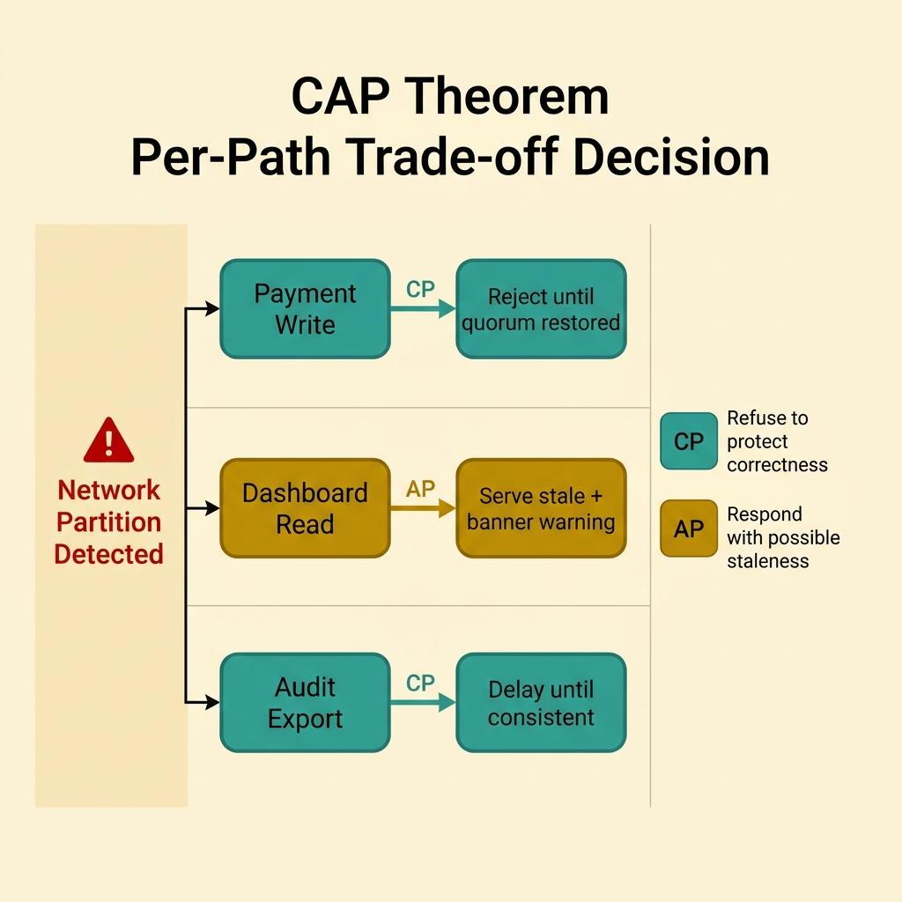
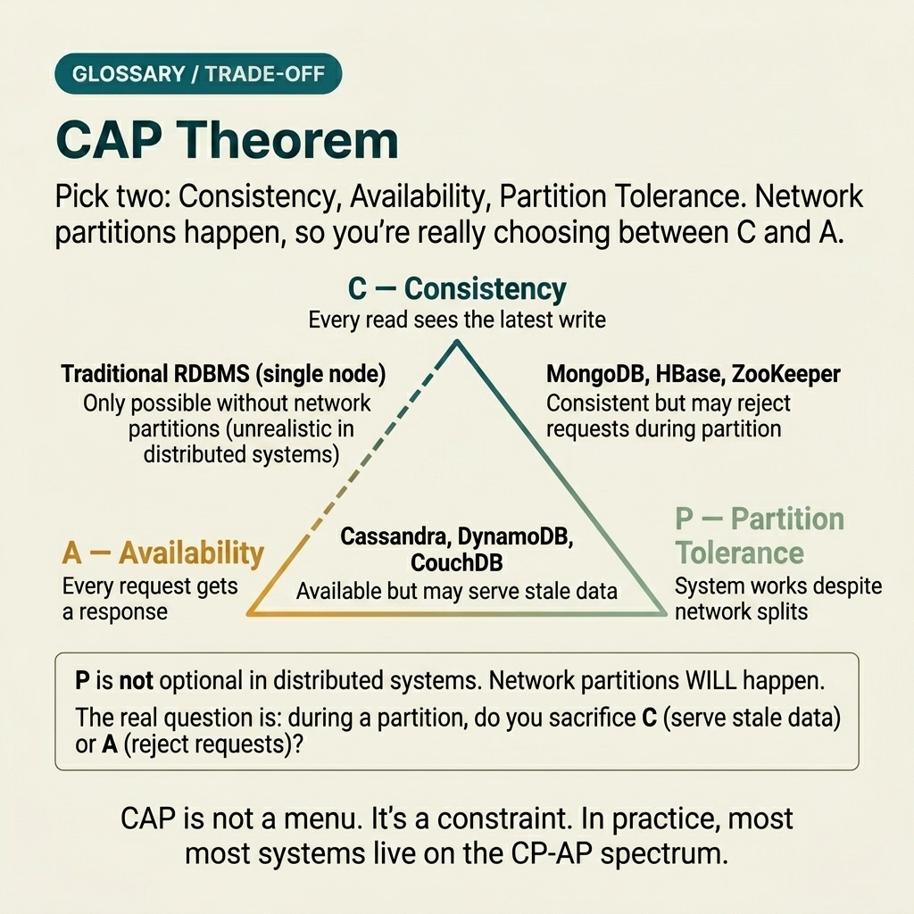

<!-- tags: glossary, reference, system-design-architecture, cap-theorem -->
# CAP Theorem

> CAP Theorem states that when a network partition occurs, a distributed system must trade off between strong consistency and availability of access operations.

| Aspect | Detail |
| --- | --- |
| **Concept** | CAP Theorem states that when a network partition occurs, a distributed system must trade off between strong consistency and availability of access operations. |
| **Audience** | Architect, backend engineer, distributed systems learner |
| **Primary style** | Glossary term |
| **Entry point** | Use when the team is debating consistency vs availability under partition conditions — instead of vaguely saying "distributed systems must make trade-offs." |

📅 Created: 2026-03-30 · 🔄 Updated: 2026-04-04 · ⏱️ 10 min read

---

## 1. DEFINE

Picture this: design meetings that hit a dead end very quickly — "We want both consistent and available." That statement sounds reasonable until an actual partition occurs between nodes or regions. At that moment, the system is forced to answer a much harder question: prioritize refusing requests to maintain agreement, or continue responding even though state may be stale or temporarily divergent? That is the boundary CAP forces the team to confront.

**CAP Theorem** states that when a network partition occurs, a distributed system must trade off between strong consistency and availability of access operations.

| Variant | Description |
| --- | --- |
| CP-oriented choice | Prioritizes consistency when partition occurs, accepting rejection or delay of some requests. |
| AP-oriented choice | Prioritizes responding to requests even though state may be stale or temporarily divergent. |
| Per-workflow CAP choice | Each read/write path has different tolerance for partition. |
| CAP misconception | Misunderstanding CAP as a choice at all times, rather than at the moment of network partition. |

| Approach | Time | Space | When to choose |
| --- | --- | --- | --- |
| CP design | O(coordination) | O(quorum state) | When stale state is more dangerous than temporary unavailability. |
| AP design | O(local response) | O(replica divergence state) | When continuous request serving matters more than exact-now agreement. |
| Hybrid per workflow | O(varies by path) | O(mixed state) | When each operation has different consequences under partition. |
| CAP + UX contract | O(decision + communication) | O(state annotations) | When the user needs to know what happens during a partition. |

Core insight:

> CAP is most useful when it forces the team to answer: if a partition happens, do you want to refuse requests or accept responding with state that may no longer be fully consistent?

### 1.1 Invariants & Failure Modes

- If stale state causes double-spend, duplicate allocation, or policy breach, that path can hardly accept AP during partition.
- If temporary unavailability hurts experience but does not break business, that path can still lean CP.
- The most common mistake is turning CAP into a slogan for every distributed problem, even when the real issue has nothing to do with network partition.

---

## 2. CONTEXT

**Who uses it**: Architect, backend engineer, distributed systems learner

**When**: Use when the team is debating consistency vs availability under partition conditions — instead of vaguely saying "distributed systems must make trade-offs."

**Purpose**: CAP is most useful when it forces the team to answer: if a partition happens, do you want to refuse requests or accept responding with state that may no longer be fully consistent?

**In the ecosystem**:
- CAP is about partitioned distributed systems — not every single-node database.
- CAP does not replace latency, cost, throughput, or complexity analysis; those are separate trade-off axes.
- A system does not need to "choose CP/AP once for life"; different read and write paths can choose differently.

---

So when does the team actually need to talk about CAP, and when are they using it in the wrong role? The answer lies in how it appears in each specific decision.

## 3. EXAMPLES

CAP lives most vividly in design reviews where the question "if a network partition happens, what price are you willing to pay?" starts replacing assertions of "we want both." The examples below place the theorem where it helps — and clearly point out where it does not.

### Example 1: Basic — Use CAP in the right place during architecture discussion

> **Goal**: Do not drag CAP into places where the problem does not actually have a partition trade-off.
> **Approach**: Only use CAP when the real question is consistency vs availability under a network split.
> **Example**: A multi-region write path must decide whether to keep accepting writes when quorum is lost.
> **Complexity**: Basic

```yaml
cap_question:
  partition_present: true
  decision: reject_writes_or_accept_possible_stale_state
```

**Why?** If there is no network partition in the problem, CAP is usually not the most useful lens. Using CAP in the right place makes the discussion sharper and prevents it from becoming a buzzword that obscures the real issue.

**Takeaway**: Basic CAP reasoning is checking the partition condition before talking about C and A.

### Example 2: Intermediate — Choose CP or AP based on the business consequence of stale state

> **Goal**: Do not choose the trade-off based purely on technical preference.
> **Approach**: Map the cost of stale or divergent state against the cost of temporary unavailability.
> **Example**: Inventory allocation leans CP; social feed read path can lean AP.
> **Complexity**: Intermediate



*Figure: The same system may have workflows with very different tolerances for stale state — CP/AP choice should follow business impact.*

```yaml
partition_policy:
  inventory_write: prefer_cp
  social_feed_read: prefer_ap
```

**Why?** The same system can have workflows with very different tolerance for stale state. The right trade-off does not come from pure theory but from the business consequences when each choice is applied to a specific path.

**Takeaway**: Intermediate CAP use is tying the CP/AP choice to the business impact of each workflow.

### Example 3: Advanced — Separate CAP from other trade-offs while keeping them in the same decision stack

> **Goal**: Do not explain everything with just "we lean CP/AP."
> **Approach**: Place CAP alongside latency budget, quorum strategy, failover behavior, and UX contract.
> **Example**: A multi-region read path needs to articulate partition policy, latency budget, and stale-read notice together.
> **Complexity**: Advanced

```yaml
decision_stack:
  partition_tradeoff: cp_or_ap
  latency_budget: explicit
  quorum_strategy: documented
  ux_contract_for_staleness: explicit
```

**Why?** CAP only illuminates one slice of the distributed problem. Mature systems need to combine it with latency, failover, observability, and user expectations. Otherwise, the team will think they have solved the problem with a very shallow CP/AP label.

**Takeaway**: Advanced CAP is an important lens — but never the only lens.

### Example 4: Expert — Design a mixed policy per operation instead of labeling the entire system

> **Goal**: Avoid calling the whole platform "CP" or "AP" inaccurately.
> **Approach**: Document the policy per critical operation: which write path stops, which read path degrades, which cache path can tolerate staleness.
> **Example**: Payment writes reject when quorum is lost, but the dashboard read continues serving with a stale banner.
> **Complexity**: Expert

```yaml
per_operation_policy:
  payment_write: reject_on_partition
  customer_dashboard_read: allow_stale_with_banner
  audit_export: delay_until_consistent
```

**Why?** Nearly no large system lives entirely at one end of the CAP spectrum. Reality is a mixed policy per operation. Only by making each path explicit can design review reflect the system actually running — not just an architecture slogan.

**Takeaway**: Expert CAP thinking is designing policy per operation — not labeling the entire system for convenience.

---

From simple "is there a partition?" questions to mixed per-operation policy — you have seen that CAP has no default answer. But it is also one of the most overused terms. The section below separates it from things that sound similar.

## 4. COMPARE




*Figure: Position of CAP among eventual consistency, PACELC, and common misconceptions.*

CAP sounds like a simple binary split: choose C or A. In reality it is not that simple — and it is precisely this false simplicity that leads many teams to mislabel.

### Level 1

```text
network partition happens
  -> cannot have both strict global agreement and always-available responses
```

*Figure: Level 1 states the correct context of CAP: the choice only sharpens when a partition occurs.*

### Level 2

```text
CP path
  -> reject or delay conflicting operations
AP path
  -> continue serving with possible stale state
```

*Figure: Level 2 compares the two typical responses under network partition.*

### Easy to confuse or cross the boundary

| # | Severity | Mistake | Consequence | Fix |
| --- | --- | --- | --- | --- |
| 1 | 🔴 Fatal | Using CAP for every distributed problem even without partition | Discussion becomes hollow and misdirected | Only invoke CAP when partition is the deciding condition. |
| 2 | 🟡 Common | Calling the system CP/AP globally | Obscures per-workflow trade-offs | Split the decision by critical read/write path. |
| 3 | 🟡 Common | Choosing CP/AP without tying it to business consequences | Architecture decision lacks foundation | Map the trade-off to business impact. |
| 4 | 🟡 Common | Ignoring UX implications of stale state or temporary rejection | Product behavior does not match infra choice | Document what the user will see during partition. |
| 5 | 🔵 Minor | Using CAP as a shortcut to skip quorum/failover analysis | Decision review lacks depth | Place CAP within a full decision stack. |

### Quick scan

| If you encounter | What to do |
| --- | --- |
| Debating consistency vs availability during a network split | CAP is relevant |
| No partition in the problem | Do not overuse CAP |
| Different workflows tolerate stale state differently | Choose CP/AP per path |
| Team labels the entire system CP/AP | Ask them to rewrite policy per operation |

---

## 5. REF

| Resource | Type | Link | Notes |
| --- | --- | --- | --- |
| Brewer's CAP Theorem | Reference | https://people.eecs.berkeley.edu/~brewer/cs262b-2004/PODC-keynote.pdf | Original context of the CAP theorem. |
| Designing Data-Intensive Applications | Book | https://dataintensive.net/ | Foundational source for consistency, replication, and partition trade-offs. |
| Martin Kleppmann — Please stop calling databases CP or AP | Article | https://martin.kleppmann.com/2015/05/11/please-stop-calling-databases-cp-or-ap.html | Explains why crude system-wide labeling should be avoided. |

---

## 6. RECOMMEND

CAP gives you a framework for thinking about partition. But real architecture does not stop at choosing C or A — it also needs a consistency model, workflow coordination, and data layer strategy.

| Expand to | When | Why | File/Link |
| --- | --- | --- | --- |
| Consistency model | When you want to go from theorem to actual data behavior | Eventual Consistency is the adjacent concept | [Eventual Consistency](./02-eventual-consistency.md) |
| Distributed workflow | When you want to apply the trade-off to a multi-step business process | Saga Pattern is the adjacent concept | [Saga Pattern](./04-saga-pattern.md) |
| Data topic | When a closer data/database perspective is needed | ACID/BASE is the appropriate branch | [Data & Database](../data-database/README.md) |

Back to that design meeting at the beginning — where everyone said "we want both consistent and available." Now you know that statement is only true when there is no partition. When partition happens, the real question is: what price are you willing to pay?

**Links**: [← Previous](./02-eventual-consistency.md) · [→ Next](./04-saga-pattern.md)
