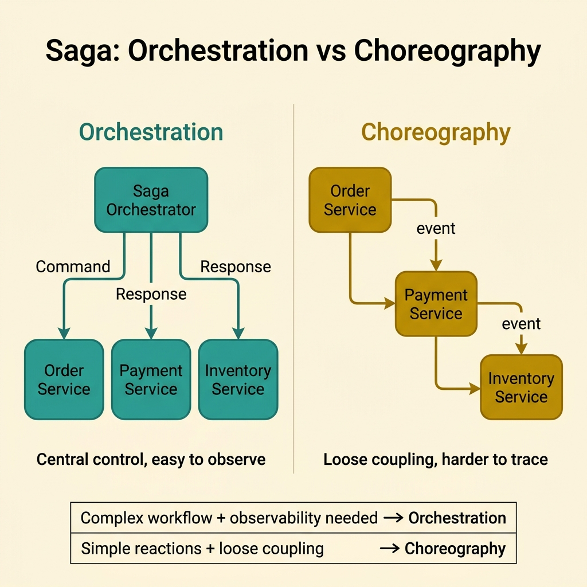
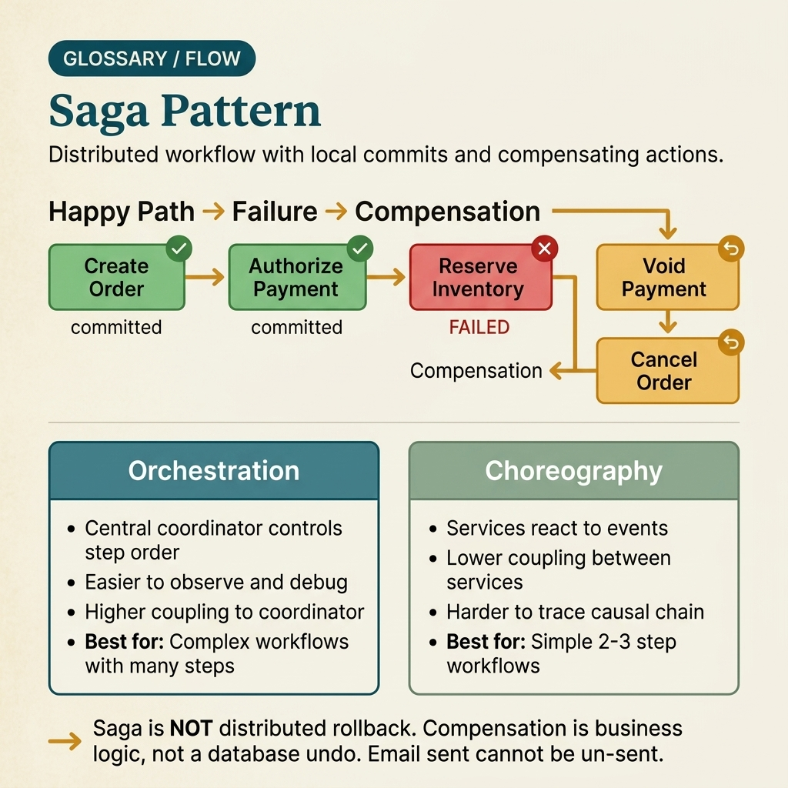

<!-- tags: glossary, reference, system-design-architecture, saga-pattern -->
# Saga Pattern

> A way to coordinate distributed transactions through a chain of local transactions paired with compensating actions for each step that may fail.

| Aspect | Detail |
| --- | --- |
| **Concept** | A way to coordinate distributed transactions through a chain of local transactions paired with compensating actions for each step that may fail. |
| **Audience** | Backend engineer, architect, distributed transaction reviewer |
| **Primary style** | Glossary term |
| **Entry point** | Use when a business workflow spans multiple services, cannot maintain an ACID transaction across boundaries, but still needs to restore business consistency. |

📅 Created: 2026-03-30 · 🔄 Updated: 2026-04-04 · ⏱️ 10 min read

---

## 1. DEFINE

Picture this: checkout just passed through order, payment, inventory, and shipping. Each service has its own database, so you cannot wrap everything in a single global ACID transaction and still keep the distributed architecture clean. But if you let each service commit on its own and "hope everything works out," the workflow will break exactly when a middle step fails. Saga was born to turn that chain of local commits into a process with state, retry, and compensation. That is the boundary of the saga pattern.

**Saga Pattern** is a way to coordinate distributed transactions through a chain of local transactions paired with compensating actions for each step that may fail.

| Variant | Description |
| --- | --- |
| Orchestrated saga | A central coordinator manages the sequence, retry, and compensation. |
| Choreographed saga | Services react via events without a central coordinator. |
| Hybrid saga | Partly centrally orchestrated, partly event-driven by domain. |
| Long-running saga | Workflow that spans multiple async steps, human approvals, or timers. |

| Approach | Time | Space | When to choose |
| --- | --- | --- | --- |
| Central orchestrator | O(n steps) | O(saga state) | When the workflow needs easy observability, retry, and clear compensation. |
| Event choreography | O(n events) | O(event chain state) | When lower coupling between services is desired and the workflow is simpler. |
| Saga + outbox | O(n steps + relay) | O(outbox + saga state) | When more reliable event publishing is needed. |
| Saga + timeout/approval state | O(n + waiting states) | O(long-running state) | When the workflow includes human steps or deadlines. |

Core insight:

> Saga does not make a distributed transaction ACID like a single database. It makes failure manageable through a chain of local commits and intentional compensation.

### 1.1 Invariants & Failure Modes

- The workflow must have observable current step and failure state.
- Compensation must not only exist on slides; it must be a real action that can be re-run or audited.
- If step 3 fails after steps 1-2 have committed without a clear recovery model, that is not a saga; it is a remote-call chain hoping for luck.

---

## 2. CONTEXT

**Who uses it**: Backend engineer, architect, distributed transaction reviewer

**When**: Use when a business workflow spans multiple services, cannot maintain an ACID transaction across boundaries, but still needs to restore business consistency.

**Purpose**: Saga does not make a distributed transaction ACID like a single database. It makes failure manageable through a chain of local commits and intentional compensation.

**In the ecosystem**:
- Saga differs from 2PC; saga accepts eventual consistency and compensation instead of global lock/commit.
- Saga differs from outbox; outbox solves dual-write at a single service, while saga manages a multi-service business process.
- Saga does not mean every step can be perfectly undone; some compensations are only approximate business offsets.

---

Saga does not live in definitions. It lives where step 3 fails after steps 1-2 have committed — and the team needs to know exactly what happens next.

## 3. EXAMPLES

Saga surfaces most clearly when checkout breaks mid-way, when an email has been sent but payment is voided, or when the workflow on slides only has green arrows and no red ones. The examples below place the pattern in exactly those moments.

### Example 1: Basic — Replace a global transaction with a chain of local transactions with compensation

> **Goal**: Keep a multi-service workflow from falling into an uncontrolled half-finished state.
> **Approach**: Let each step commit locally, then prepare a compensating action for when downstream fails.
> **Example**: Order created, payment authorized, but inventory reserve fails — so the order is cancelled and payment voided.
> **Complexity**: Basic

```yaml
saga_flow:
  - create_order
  - authorize_payment
  - reserve_inventory
  on_failure: [cancel_order, void_payment]
```

**Why?** In a database-per-service environment, a global ACID transaction is usually impractical. Saga replaces physical atomicity with business consistency achieved through local commits and compensation.

**Takeaway**: Basic saga reasoning is always thinking about the failure path alongside the happy path.

### Example 2: Intermediate — Choose orchestration or choreography based on workflow complexity

> **Goal**: Do not choose a coordination style based solely on architectural preference.
> **Approach**: Evaluate the number of steps, observability needs, retry logic, and desired coupling.
> **Example**: Critical checkout usually fits an orchestrator; simple domain event propagation may better suit choreography.
> **Complexity**: Intermediate



*Figure: Orchestration gives visibility and control but increases central knowledge; choreography reduces direct coupling but makes long causal chains harder to debug.*

```yaml
saga_style_decision:
  if_workflow_complex_and_needs_visibility: orchestrator
  if_loose_coupling_simple_reactions: choreography
```

**Why?** Orchestration provides good visibility and control but increases centralized knowledge. Choreography reduces direct coupling, but causal chains quickly become difficult to debug as the workflow grows. The right style depends on the shape of the workflow — not on dogma.

**Takeaway**: Intermediate saga design is choosing the coordination style based on the operational needs of the workflow.

### Example 3: Advanced — Design compensation as real business action, not as imaginary rollback

> **Goal**: Do not assume every side effect can be perfectly undone.
> **Approach**: Classify which steps are reversible and which can only be offset by another action.
> **Example**: An email already sent cannot be "un-sent"; compensation might be sending a correction or opening a support workflow.
> **Complexity**: Advanced

```yaml
compensation_model:
  reversible_steps: [inventory_reservation, payment_authorization]
  business_compensation_only: [customer_notification_sent]
```

**Why?** Compensation in distributed systems is rarely perfectly symmetrical like a database rollback. If the team does not state clearly which steps are truly reversible and which are only business offsets, the saga design will break the moment it encounters a side effect that reaches the outside world.

**Takeaway**: A mature advanced saga is one that understands the limits of its compensations and encodes them as real workflow.

### Example 4: Expert — Operate a long-running saga with timeout, retry budget, and manual intervention

> **Goal**: Do not let a long workflow hang indefinitely or retry to the point of damaging downstream.
> **Approach**: Attach timeout, retry budget, and manual escalation state to each critical step.
> **Example**: An approval step past 24 hours expires; payment retry exceeding 3 attempts transitions to manual review.
> **Complexity**: Expert

```yaml
long_running_saga:
  timeout_per_step:
    payment: 5m
    manual_approval: 24h
  retry_budget:
    payment_authorization: 3
  escalation: manual_review_queue
```

**Why?** Long-running sagas deal not only with commit/compensation issues but also with time and operations. Without controlling timeout and retry budget, the workflow can linger indefinitely or trigger a retry storm while downstream is broken.

**Takeaway**: An expert saga is a workflow engine with explicit state, deadlines, and a manual escape hatch.

---

From simple compensation to a long-running saga with deadlines and manual escalation — you have seen that saga is more than "having undo." But it is easily confused with 2PC, with outbox, with a plain event chain — and every conflation is a workflow break that nobody understands why.

## 4. COMPARE




*Figure: Position of saga among 2PC, outbox, choreography, and other coordination patterns.*

Saga sounds like "distributed rollback." It is not. It is a workflow with state and compensation — and that difference determines whether the team can debug a failure or not.

### Level 1

```text
step 1 local transaction commits
  -> step 2 commits
  -> step 3 fails
  -> compensation runs for prior committed steps
```

*Figure: Level 1 shows saga managing failure through compensation after local commits have already occurred.*

### Level 2

```text
orchestrator or event chain
  -> track current step
  -> retry or compensate
  -> workflow converges to business-consistent state
```

*Figure: Level 2 emphasizes saga is a workflow manager for business consistency — not a global atomic commit.*

### Easy to confuse or cross the boundary

| # | Severity | Mistake | Consequence | Fix |
| --- | --- | --- | --- | --- |
| 1 | 🔴 Fatal | Only designing the happy path, no compensation | Workflow stuck in a half-finished state | Design the failure path on equal footing with the happy path. |
| 2 | 🟡 Common | Using saga for a workflow that only needs a local transaction | Architecture over-complicated for no reason | Keep strong transactions at local boundary if sufficient. |
| 3 | 🟡 Common | Choosing choreography for a long workflow without observability | Debugging causal chains becomes very hard | Consider an orchestrator or traceable saga state. |
| 4 | 🟡 Common | Not controlling timeout and retry budget | Workflow hangs or causes retry storms | Attach deadline, retry policy, and manual intervention. |
| 5 | 🔵 Minor | Calling compensation a perfect rollback | Sets wrong expectations for business | Distinguish technical rollback from business compensation. |

### Quick scan

| If you encounter | What to do |
| --- | --- |
| Workflow spans multiple services with side effects | Think about saga |
| Cannot globally rollback every step | Design compensation |
| Long workflow that is hard to debug | Consider orchestrator + clear state |
| Workflow has human steps or timeouts | Add long-running saga controls |

---

## 5. REF

| Resource | Type | Link | Notes |
| --- | --- | --- | --- |
| Microservices.io Saga Pattern | Reference | https://microservices.io/patterns/data/saga.html | Practical description of orchestration, choreography, and compensation. |
| Designing Data-Intensive Applications | Book | https://dataintensive.net/ | Foundation for consistency and workflow trade-offs. |
| Enterprise Integration Patterns | Book | https://www.enterpriseintegrationpatterns.com/ | Useful for message flow, timeout, and orchestration patterns. |

---

## 6. RECOMMEND

Saga solves the problem of "multi-service workflow that cannot be globally ACID." But the next question is: is event publish reliable, how is the read model separated, and where are the consistency boundaries of the entire system?

| Expand to | When | Why | File/Link |
| --- | --- | --- | --- |
| Write/read separation | When the saga workflow accompanies a split command-query model | CQRS is the next concept | [CQRS](./05-cqrs.md) |
| Event publish reliability | When the saga needs reliable event publishing | Outbox Pattern is the adjacent concept | [Outbox Pattern](./07-outbox-pattern.md) |
| Data consistency topic | When viewing saga from a consistency model perspective | Eventual Consistency is the preceding concept | [Eventual Consistency](./02-eventual-consistency.md) |

Back to that broken checkout at the beginning — order created, payment charged, but inventory was out and nobody compensated. Now you know: that was not a missing try-catch. It was a missing saga — with state, compensation, and a deadline.

**Links**: [← Previous](./03-cap-theorem.md) · [→ Next](./05-cqrs.md)
