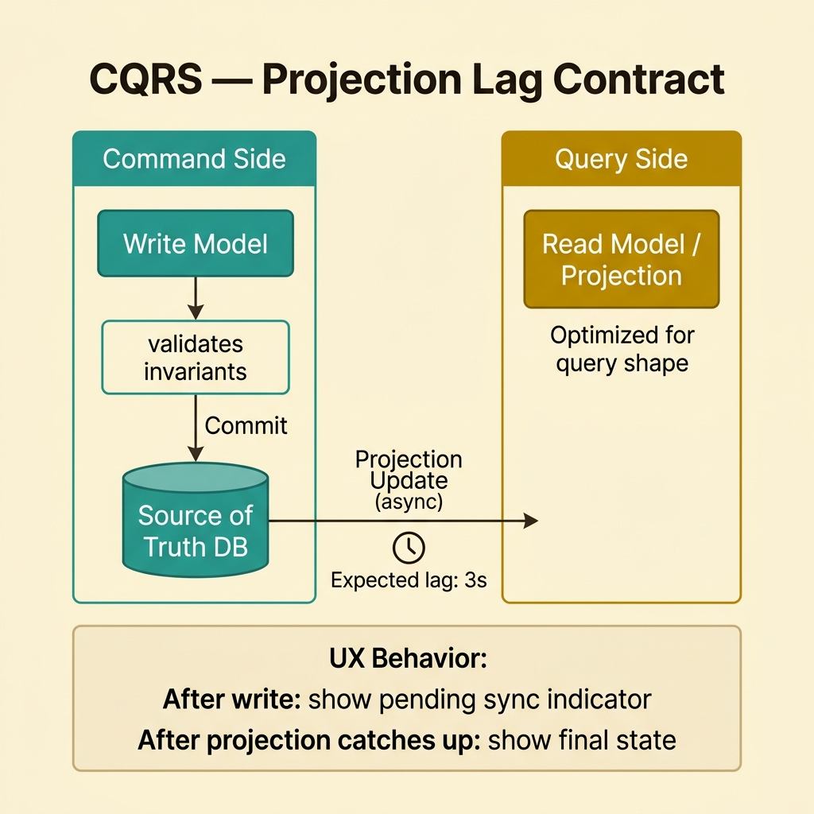
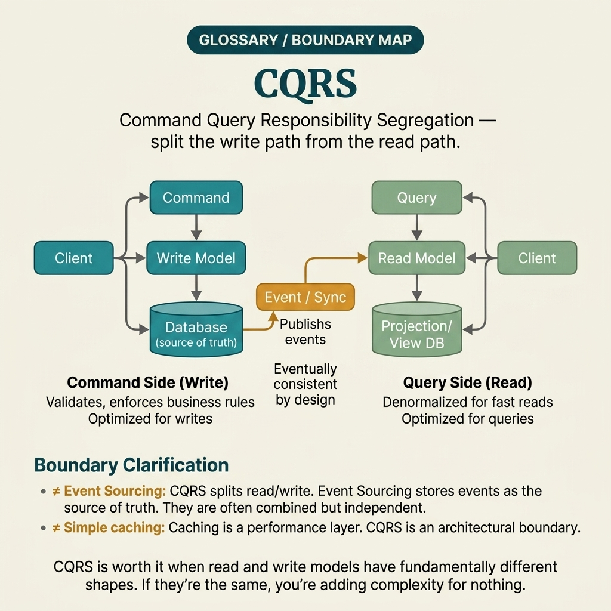

<!-- tags: glossary, reference, system-design-architecture, cqrs -->
# CQRS

> A way to separate the command and query models so the write path and read path can each be optimized for their different needs.

| Aspect | Detail |
| --- | --- |
| **Concept** | A way to separate the command and query models so the write path and read path can each be optimized for their different needs. |
| **Audience** | Backend engineer, architect, model design reviewer |
| **Primary style** | Glossary term |
| **Entry point** | Use when the same domain has both complex write invariants and read shapes that are very different from the command side's needs. |

📅 Created: 2026-03-30 · 🔄 Updated: 2026-04-04 · ⏱️ 10 min read

---

## 1. DEFINE

Picture this: a service typically starts with a single model for both writing and reading. Once the write side must maintain many invariants while the read side needs projections for dashboards, search, exports, or mobile feeds, that single model starts being pulled in two opposite directions. Every change to help read queries also degrades the aggregate, and every rule to maintain correctness makes queries harder to read. That is the boundary of CQRS.

**CQRS** is a way to separate the command and query models so the write path and read path can each be optimized for their different needs.

| Variant | Description |
| --- | --- |
| Logical CQRS | Command/query are separated at the code layer but may still use the same database. |
| Physical CQRS | Read model and write model have independent storage or paths. |
| CQRS + event-driven projection | The read side is updated asynchronously from events or a change feed. |
| Selective CQRS | Only a few bounded contexts need a strong split; the rest stays simple CRUD. |

| Approach | Time | Space | When to choose |
| --- | --- | --- | --- |
| Single-model CRUD | O(1 model reasoning) | O(1) | When the domain is simple and read/write pressure has not diverged strongly. |
| Logical split | O(command/query separated in code) | O(separate handlers/models) | When clarity is needed but separate storage is not yet required. |
| Physical split | O(write + projection) | O(read model state) | When the read shape is very different from the write model and query scale is large. |
| CQRS + event sourcing | O(replay + projection) | O(event store + projection) | When event history is also a first-class requirement. |

Core insight:

> CQRS is not the default for every service. It pays off when read concerns and write concerns truly pull the design in two different directions.

### 1.1 Invariants & Failure Modes

- The command side exists to maintain invariants — not to optimize query shape.
- The read side exists to serve the consumption model — it does not need to mirror the domain model one-to-one.
- The most common mistake is applying CQRS too early to a simple domain, forcing the team to maintain two models without gaining a large enough payoff.

---

## 2. CONTEXT

**Who uses it**: Backend engineer, architect, model design reviewer

**When**: Use when the same domain has both complex write invariants and read shapes that are very different from the command side's needs.

**Purpose**: CQRS is not the default for every service. It pays off when read concerns and write concerns truly pull the design in two different directions.

**In the ecosystem**:
- CQRS differs from Event Sourcing; CQRS splits read/write models, while Event Sourcing changes the source of truth.
- CQRS does not require eventual consistency, but physical CQRS usually introduces read lag.
- A logical split is often a more pragmatic starting point than full-blown separate stores.

---

Read and write pull a single model in two different directions — so where exactly does it hurt the most, and how do you split?

## 3. EXAMPLES

CQRS surfaces most clearly when dashboard queries start slowing down the aggregate, when the product team needs a read shape completely different from the write model, or when a projection goes stale and nobody knows who owns it. The examples below place the pattern in exactly those situations.

### Example 1: Basic — Separate write invariants from complex read shapes

> **Goal**: Do not let a single model bear both write validation and hard-to-read projection.
> **Approach**: Keep the command model optimized for correctness, the read model optimized for query shape.
> **Example**: The order aggregate maintains ordering invariants; the dashboard reads from a projection grouped by customer/status.
> **Complexity**: Basic

```yaml
cqrs_split:
  command_model: order_aggregate
  read_model: order_dashboard_projection
```

**Why?** A model good for writing is not necessarily good for reading. When forcing a single model to serve both, code typically becomes both hard to maintain invariants and hard to query efficiently.

**Takeaway**: Basic CQRS is clearly separating the correctness model from the consumption model.

### Example 2: Intermediate — Accept and manage read lag on projections

> **Goal**: Do not be surprised when the read side does not reflect the write instantly in physical CQRS.
> **Approach**: Design projection lag, retry, and UX contract explicitly.
> **Example**: Right after submitting an order, the dashboard may lag a few seconds before the projection catches up.
> **Complexity**: Intermediate



*Figure: Physical CQRS trades instant read consistency for performance and flexibility — but projection lag must be an explicit contract.*

```yaml
projection_contract:
  update_mode: async
  expected_lag: 3s
  client_behavior: show_pending_sync_state
```

**Why?** Physical CQRS delivers read performance and flexibility, but the read side can be stale. If the team does not treat this as a first-class trade-off, product and support will perceive projection lag as a bug rather than an intentionally designed consequence.

**Takeaway**: Intermediate CQRS design is making projection lag explicit and designing how to live with it.

### Example 3: Advanced — Choose the right degree of CQRS split for the domain's actual complexity

> **Goal**: Do not jump straight to full-blown separate stores when a logical split is sufficient.
> **Approach**: Evaluate the real benefit of read/write divergence before splitting physically.
> **Example**: An internal service only needs to split handlers in code — it does not yet need a separate projection DB.
> **Complexity**: Advanced

```yaml
cqrs_adoption_level:
  logical_split_only: when_model_pressure_is_moderate
  physical_split: when_query_scaling_or_shape_divergence_is_high
```

**Why?** CQRS is a spectrum — not a binary switch. The right decision lies in splitting just enough to capture real benefits without introducing unnecessary complexity into the system.

**Takeaway**: A mature advanced CQRS is one applied at the right dosage according to the domain's actual pressure.

### Example 4: Expert — Connect CQRS with projection governance, repair, and clear ownership

> **Goal**: Do not let the read side explode into numerous ownerless, stale, or un-deletable projections.
> **Approach**: Attach owner, freshness contract, replay path, and deprecation rules to each important projection.
> **Example**: The dashboard projection is owned by the reporting team, has a freshness SLO of 30s, and has its own replay job.
> **Complexity**: Expert

```yaml
projection_governance:
  projection: order_dashboard_projection
  owner: reporting_team
  freshness_slo: 30s
  repair_mode: replay_from_event_stream
```

**Why?** When CQRS succeeds, read models multiply very quickly. Without governance, projections become "junk schema with caching" — vague freshness and blurred ownership. Operational discipline is what keeps CQRS sustainable long-term, not just the initial modeling.

**Takeaway**: Expert CQRS is a read/write split with clear ownership, freshness contracts, and repair strategy.

---

From a simple logical split to projection governance with owners and rebuild pipelines — you have seen that CQRS is not "splitting for fun." But it is easily confused with Event Sourcing, with eventual consistency, and with over-engineering simple CRUD.

## 4. COMPARE




*Figure: Position of CQRS among Event Sourcing, read/write split levels, and easily confused patterns.*

"Separating read and write" sounds simple. But CQRS differs from CRUD with a separate read endpoint, differs from Event Sourcing, and differs from just creating an extra view table. The section below helps distinguish.

### Level 1

```text
command side validates invariants
  -> writes source of truth
query side serves optimized read shape
```

*Figure: Level 1 shows command and query optimized for two different objectives.*

### Level 2

```text
write model changes
  -> projection updates read model
  -> read side may lag but serves query efficiently
```

*Figure: Level 2 illustrates physical CQRS with projection and temporary read lag.*

### Easy to confuse or cross the boundary

| # | Severity | Mistake | Consequence | Fix |
| --- | --- | --- | --- | --- |
| 1 | 🔴 Fatal | Applying CQRS just because of a trend | Complexity increases without real benefit | Only use when read/write pressure truly diverges. |
| 2 | 🟡 Common | Not communicating projection lag | Stale read side causes misunderstandings | Set an explicit contract for read freshness. |
| 3 | 🟡 Common | Thinking CQRS must always accompany Event Sourcing | Design gets pulled beyond what is necessary | Separate the read/write split decision from the storage strategy. |
| 4 | 🟡 Common | Projection has no owner or replay plan | Support struggles to repair when stale or drifted | Attach ownership and repair path to each projection. |
| 5 | 🔵 Minor | Over-splitting for a very simple service | High maintenance cost | Keep a minimal logical split if that is sufficient. |

### Quick scan

| If you encounter | What to do |
| --- | --- |
| Read shape diverges heavily from write invariants | CQRS may be worth considering |
| Projection lag frustrates the product team | Set an explicit read freshness contract |
| Simple domain but heavy design | May be over-CQRS |
| Many projections frequently going stale | Add ownership + replay governance |

---

## 5. REF

| Resource | Type | Link | Notes |
| --- | --- | --- | --- |
| Martin Fowler — CQRS | Reference | https://martinfowler.com/bliki/CQRS.html | Original post explaining why CQRS is not the default for every system. |
| Designing Data-Intensive Applications | Book | https://dataintensive.net/ | Foundation for read/write split, projections, and consistency. |
| Greg Young CQRS Documents | Reference | https://cqrs.files.wordpress.com/2010/11/cqrs_documents.pdf | Deeper perspective on adoption and operational concerns. |

---

## 6. RECOMMEND

CQRS solves the problem of "one model not serving both write and read well." The next question: how is state stored, is event publish reliable, and what mechanism converges the projection?

| Expand to | When | Why | File/Link |
| --- | --- | --- | --- |
| Storage model | When comparing with storing state as event history | Event Sourcing is the next concept | [Event Sourcing](./06-event-sourcing.md) |
| Workflow consistency | When the write path extends across multiple services | Saga Pattern is the adjacent concept | [Saga Pattern](./04-saga-pattern.md) |
| Async projection reliability | When the read model updates via event publish | Outbox Pattern is the next read | [Outbox Pattern](./07-outbox-pattern.md) |

Back to that service at the beginning — where one model bore both write invariants and dashboard queries. Now you know: when the pressure pulling in two directions is strong enough, splitting is the right call. How far to split depends on the real divergence of the domain — not on architecture slides.

**Links**: [← Previous](./04-saga-pattern.md) · [→ Next](./06-event-sourcing.md)
