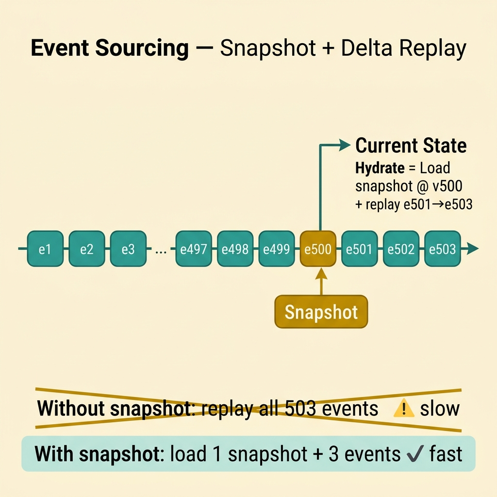
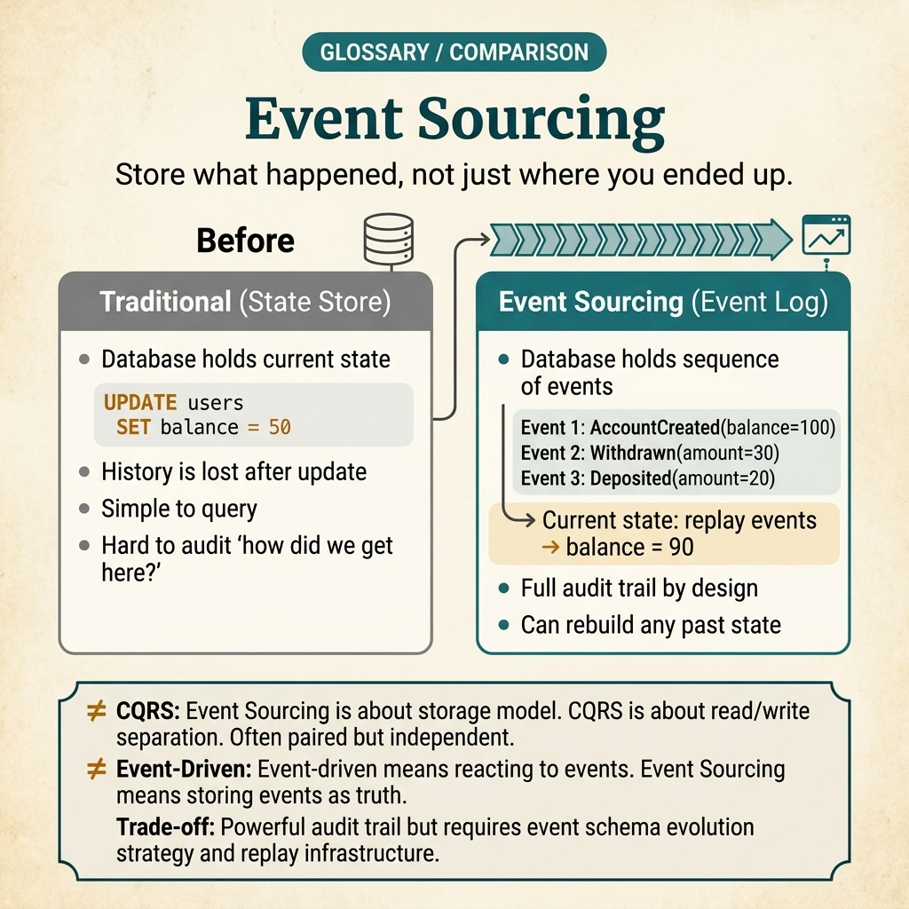

<!-- tags: glossary, reference, system-design-architecture, event-sourcing -->
# Event Sourcing

> A way to store system state as an immutable sequence of events, where the current state is derived by replaying or snapshotting the stream.

| Aspect | Detail |
| --- | --- |
| **Concept** | A way to store system state as an immutable sequence of events, where the current state is derived by replaying or snapshotting the stream. |
| **Audience** | Backend engineer, architect, event-driven systems reviewer |
| **Primary style** | Glossary term |
| **Entry point** | Use when the history of changes is a first-class requirement or state needs to be reconstructed from the sequence of events that have occurred. |

📅 Created: 2026-03-30 · 🔄 Updated: 2026-04-04 · ⏱️ 10 min read

---

## 1. DEFINE

Picture this: there are domains where the important question is not just "what is the current state" but also "how did it get there." When auditability, replay, temporal debugging, or derived projections are real requirements, storing only the final state starts to fall short. You do not just need the current balance; you need to know which sequence of changes led to that balance, which version brought the business into its current state, and whether a replay can build a new projection. That is the boundary of event sourcing.

**Event Sourcing** is a way to store system state as an immutable sequence of events, where the current state is derived by replaying or snapshotting the stream.

| Variant | Description |
| --- | --- |
| Pure event store | Aggregate state is built entirely from the event stream. |
| Snapshot-assisted sourcing | Snapshots are used to shorten long replays. |
| Selective event sourcing | Only a few critical aggregates use event sourcing; the rest stays CRUD. |
| Event sourcing + projections | The event stream feeds multiple read models or integration flows. |

| Approach | Time | Space | When to choose |
| --- | --- | --- | --- |
| State snapshot only | O(1) current read | O(current state) | When history is not a primary requirement. |
| Event stream replay | O(n events) | O(event stream) | When temporal history and audit are first-class. |
| Replay + snapshot | O(k after snapshot) | O(event stream + snapshots) | When the stream is long but sourcing is still needed. |
| Selective sourcing | O(mixed by aggregate) | O(event store + CRUD state) | When only part of the domain needs strong audit/replay. |

Core insight:

> Event Sourcing is not "logging more." It turns the event stream into the source of truth for state.

### 1.1 Invariants & Failure Modes

- The event stream must maintain reliable ordering and versioning for replay to work.
- A snapshot is an optimization — it does not replace the stream as source of truth.
- The most common mistake is choosing Event Sourcing because it seems to give "free undo," then being overwhelmed by migration, replay, versioning, and modeling complexity.

---

## 2. CONTEXT

**Who uses it**: Backend engineer, architect, event-driven systems reviewer

**When**: Use when the history of changes is a first-class requirement or state needs to be reconstructed from the sequence of events that have occurred.

**Purpose**: Event Sourcing is not "logging more." It turns the event stream into the source of truth for state.

**In the ecosystem**:
- Event Sourcing differs from CQRS; CQRS splits read/write, Event Sourcing changes the source of truth.
- An event log for analytics differs from an event store for aggregate state; both semantics and retention are different.
- Selective adoption is usually more practical than full-platform event sourcing.

---

So what does "storing events as source of truth" look like when it encounters a long stream, schema changes, and real replay requirements?

## 3. EXAMPLES

Event Sourcing surfaces most clearly when the team needs an audit trail that cannot be patched in after the fact, when replaying to build a new projection, or when someone asks "how did this balance get here?" The examples below place the pattern at each of those levels.

### Example 1: Basic — Keep event history as source of truth for an aggregate

> **Goal**: Do not lose the ability to audit and replay critical state transitions.
> **Approach**: Persist domain events in order and build the aggregate from that stream.
> **Example**: An account balance or order lifecycle is reconstructed from events that have occurred.
> **Complexity**: Basic

```yaml
event_stream:
  aggregate_id: order_42
  events: [OrderCreated, PaymentAuthorized, OrderShipped]
  source_of_truth: events
```

**Why?** When current state is stored directly, history usually gets dropped or must be patched together via audit tables. Event sourcing makes history a native part of the model rather than an afterthought.

**Takeaway**: Basic event sourcing is treating the event stream as the source of truth for the aggregate.

### Example 2: Intermediate — Use snapshots to control replay cost

> **Goal**: Do not let a growing aggregate make every state hydration prohibitively expensive.
> **Approach**: Periodically save a snapshot and replay only the delta after that snapshot.
> **Example**: An account aggregate with tens of thousands of events takes a snapshot every 500 versions.
> **Complexity**: Intermediate



*Figure: Snapshot does not replace the source of truth — it keeps replay cost within operational bounds when the stream grows long.*

```yaml
snapshot_policy:
  every_versions: 500
  hydrate_from: latest_snapshot_then_replay_delta
```

**Why?** Replaying the entire event stream for every load will soon become a bottleneck for hot aggregates. Snapshots do not replace the source of truth, but they keep replay cost within operational limits.

**Takeaway**: Intermediate event sourcing typically needs snapshots to keep hydration practical.

### Example 3: Advanced — Manage event schema/version as a long-lived public contract

> **Goal**: Do not let old event history become an unplayable burden after a few years.
> **Approach**: Version event schemas, maintain backward compatibility, or establish a clear upcaster strategy.
> **Example**: `OrderCreated v1` and `v2` both need to be replayable on the current aggregate.
> **Complexity**: Advanced

```yaml
event_versioning:
  event_type: OrderCreated
  supported_versions: [v1, v2]
  replay_strategy: upcaster_or_backward_compat
```

**Why?** When the event stream is the source of truth, event schema is no longer a short-term implementation detail. It outlives the current code. If versioning is superficial, replay and audit will break over time.

**Takeaway**: Advanced event sourcing depends heavily on the discipline of event schema lifecycle.

### Example 4: Expert — Operate event sourcing with replay governance, projection rebuild, and selective adoption

> **Goal**: Do not let event sourcing spread to every aggregate and then become uncontrolled operational cost.
> **Approach**: Only source where history truly has value; prepare a projection rebuild pipeline and clear replay runbook.
> **Example**: Payment ledger uses event sourcing; profile service stays CRUD. Analytics projection has its own rebuild job.
> **Complexity**: Expert

```yaml
sourcing_governance:
  sourced_aggregates: [payment_ledger, account_balance]
  non_sourced_aggregates: [user_profile]
  rebuild_mode: projection_replay_pipeline
```

**Why?** The real problem of event sourcing does not stop at initial modeling. It lies in replay cost, rebuild cadence, schema evolution, and limiting where it is worth using. Selective adoption keeps the payoff of history without pushing the entire system into unnecessary complexity.

**Takeaway**: Expert event sourcing is event sourcing with discipline in scope and a clear replay strategy.

---

From a basic event stream to selective adoption and schema lifecycle — you have seen that event sourcing is not "logging more." But it is easily confused with CQRS, with audit logs, with analytics events — and every conflation is a time the team takes on complexity without the payoff.

## 4. COMPARE




*Figure: Position of event sourcing among CQRS, audit logs, analytics streams, and easily confused concepts.*

Event sourcing sounds like "store everything." But the key difference is: the event store is the source of truth for building state — not a log to read back.

### Level 1

```text
event_1
  -> event_2
  -> event_3
  -> aggregate state reconstructed from stream
```

*Figure: Level 1 shows current state is generated from event history — not the other way around.*

### Level 2

```text
long event stream
  -> snapshot at version N
  -> replay only events after N
```

*Figure: Level 2 illustrates why snapshots typically accompany event sourcing as the stream grows.*

### Easy to confuse or cross the boundary

| # | Severity | Mistake | Consequence | Fix |
| --- | --- | --- | --- | --- |
| 1 | 🔴 Fatal | Choosing Event Sourcing when history is not a real requirement | High complexity without payoff | Only use for aggregates with clear audit/replay needs. |
| 2 | 🟡 Common | No strategy for long streams | Hydration slows down over time | Add a reasonable snapshot policy. |
| 3 | 🟡 Common | Treating event schema as a private detail that can be freely changed | Replay and migration break | Manage event versions as long-lived contracts. |
| 4 | 🟡 Common | No projection rebuild/replay runbook | Read model incident resolution is very slow | Prepare a rebuild pipeline and audit path. |
| 5 | 🔵 Minor | Confusing event store with analytics log | Model diverges from its purpose | Separate source-of-truth events from telemetry events. |

### Quick scan

| If you encounter | What to do |
| --- | --- |
| History is a first-class requirement | Consider Event Sourcing |
| Replay is too slow | Add snapshots |
| Event schema changes without control | Design a versioning lifecycle |
| Unsure which aggregate should be sourced | Switch to selective adoption |

---

## 5. REF

| Resource | Type | Link | Notes |
| --- | --- | --- | --- |
| Martin Fowler — Event Sourcing | Reference | https://martinfowler.com/eaaDev/EventSourcing.html | Classic post explaining source of truth from event stream. |
| Designing Data-Intensive Applications | Book | https://dataintensive.net/ | Foundation for logs, streams, replay, and consistency. |
| Greg Young — Versioning in an Event Sourced System | Reference | https://leanpub.com/esversioning/read | Focused on long-lived event schema lifecycle. |

---

## 6. RECOMMEND

Event sourcing solves the problem of "needing to know how state got here." The next question: where is the read model separated, is event publish reliable, and what manages consistency?

| Expand to | When | Why | File/Link |
| --- | --- | --- | --- |
| Read/write split | When event sourcing accompanies a separate read projection | CQRS is the preceding concept | [CQRS](./05-cqrs.md) |
| Reliable publishing | When the event store needs to publish events externally | Outbox Pattern is the next read | [Outbox Pattern](./07-outbox-pattern.md) |
| Consistency trade-off | When read projections will converge with a delay | Eventual Consistency is the adjacent concept | [Eventual Consistency](./02-eventual-consistency.md) |

Back to the question at the beginning — "how did this balance get here?" Now you know: if you only store the final state, the answer is always "we do not know." Event sourcing is the choice that ensures that question never loses its answer.

**Links**: [← Previous](./05-cqrs.md) · [→ Next](./07-outbox-pattern.md)
