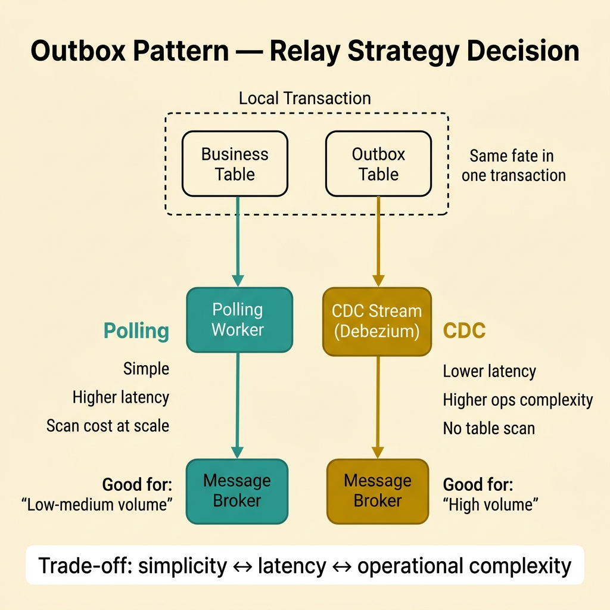
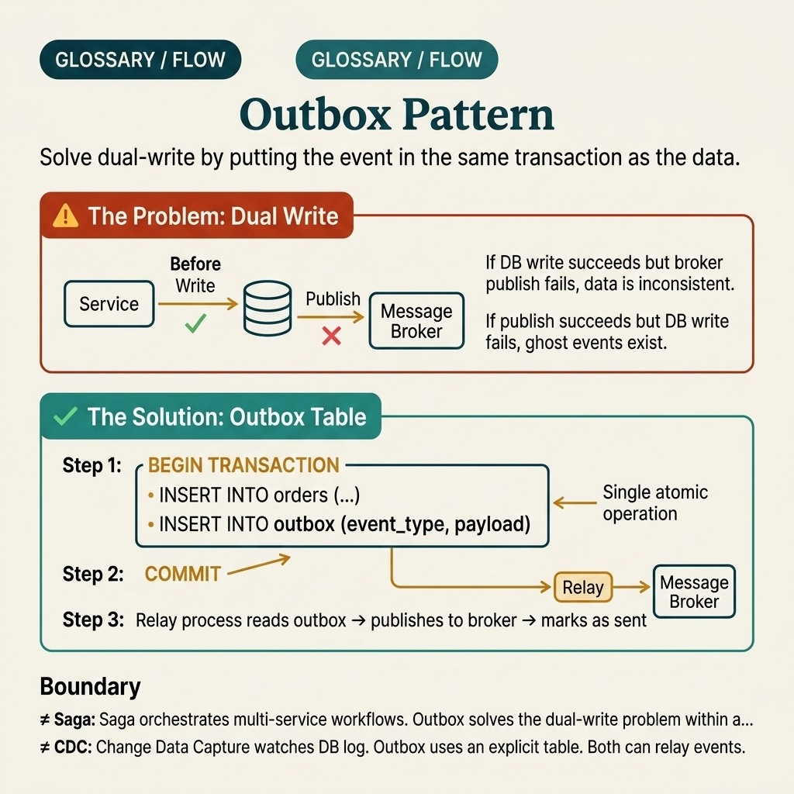

<!-- tags: glossary, reference, system-design-architecture, outbox-pattern -->
# Outbox Pattern

> Outbox Pattern writes the business state and the event to be published into the same local transaction, then relays the event to a broker afterwards to avoid dual-write inconsistency.

| Aspect | Detail |
| --- | --- |
| **Concept** | Outbox Pattern writes the business state and the event to be published into the same local transaction, then relays the event to a broker afterwards to avoid dual-write inconsistency. |
| **Audience** | Backend engineer, event-driven architect, integration reviewer |
| **Primary style** | Glossary term |
| **Entry point** | Use when a service must both commit local data and publish a reliable event for other systems without falling into a dual-write race. |

📅 Created: 2026-03-30 · 🔄 Updated: 2026-04-04 · ⏱️ 10 min read

---

## 1. DEFINE

Picture this: a service writes an order to the database successfully, but right as it tries to publish the event to a broker, the process dies. Or the reverse — the event has already gone out, but the local transaction rolls back at the last moment. These two scenarios are the dual-write nightmare: state and the signal about state no longer share the same fate. Outbox Pattern exists to bind the business write and the "publish intent" into a single, locally reliable commit boundary. That is the boundary of the outbox.

**Outbox Pattern** writes the business state and the event to be published into the same local transaction, then relays the event to a broker afterwards to avoid dual-write inconsistency.

| Variant | Description |
| --- | --- |
| Polling outbox | A worker scans the outbox table and publishes gradually. |
| CDC outbox | Uses change data capture to stream the outbox to a broker. |
| Outbox + inbox | Pairs outbox with a consumer dedup/inbox for two-way reliability. |
| Transactional outbox + relay metrics | Measures relay lag, retries, and dead letters for operations. |

| Approach | Time | Space | When to choose |
| --- | --- | --- | --- |
| Direct dual-write | O(db + broker write) | O(1) | Only acceptable when inconsistency cost is very low. |
| Transactional outbox | O(local tx + async relay) | O(outbox table) | When both business state and events are important. |
| Outbox + idempotent consumer | O(tx + relay + dedup) | O(outbox + processed ledger) | When duplicate delivery is normal at the downstream. |
| CDC relay | O(local tx + stream tail) | O(outbox + CDC infra) | When volume is large enough that polling scan becomes expensive. |

Core insight:

> Outbox Pattern does not make the event publish synchronous with the broker in a single global transaction. It makes the local write and the "publish intent" commit atomically together.

### 1.1 Invariants & Failure Modes

- Business state and the outbox record must share the same fate within the local transaction.
- Relay lag must be observable; the outbox is not useful if events are stuck and nobody knows.
- The most common mistake is installing an outbox and treating it as magic exactly-once delivery, when duplicate publish and consumer retry remain everyday realities.

---

## 2. CONTEXT

**Who uses it**: Backend engineer, event-driven architect, integration reviewer

**When**: Use when a service must both commit local data and publish a reliable event for other systems without falling into a dual-write race.

**Purpose**: Outbox Pattern does not make the event publish synchronous with the broker in a single global transaction. It makes the local write and the "publish intent" commit atomically together.

**In the ecosystem**:
- Outbox differs from saga; outbox solves dual-write at one service, saga manages a multi-service workflow.
- Outbox differs from a pure queue; its most important part is atomic persistence before async publish.
- Outbox does not eliminate the need for consumer idempotency; relay retries and broker redelivery can still create duplicates.

---

The dual-write nightmare is clear. But what does outbox look like when you compare polling vs CDC, when the relay dies mid-flight, and when the outbox table bloats with nobody cleaning up?

## 3. EXAMPLES

Outbox surfaces most clearly when an order has committed but the event never reaches the broker, when a relay crash causes missed notification emails, or when a dead-letter queue keeps growing and nobody notices. The examples below place the pattern in exactly those moments.

### Example 1: Basic — Avoid dual-write between DB and broker

> **Goal**: Do not let business state commit while the event is lost, or the event go out while state does not commit.
> **Approach**: Write the outbox record in the same transaction as the business write, then publish async.
> **Example**: The `OrderCreated` row and outbox event commit together in a local DB transaction.
> **Complexity**: Basic

```yaml
local_transaction:
  writes: [orders_table, outbox_table]
  broker_publish: async_after_commit
```

**Why?** The pain of dual-write is that two important side effects do not share the same fate. Outbox makes local state and publish intent share fate within the local transaction, eliminating one of the most common layers of inconsistency.

**Takeaway**: Basic outbox use is atomically saving the business change and publish intent in the same place before relaying.

### Example 2: Intermediate — Choose the relay mechanism that fits volume and operations

> **Goal**: Do not default to polling or CDC without looking at the trade-offs.
> **Approach**: Match polling interval, throughput, and operational complexity with system needs.
> **Example**: A small service uses a simple polling worker; a large platform uses a CDC stream to reduce delay and scan load.
> **Complexity**: Intermediate



*Figure: Polling trades simplicity for latency; CDC trades operational complexity for throughput. The relay mechanism is a first-class design decision, not a footnote.*

```yaml
relay_strategy:
  low_volume_service: polling_worker
  high_volume_platform: cdc_stream
```

**Why?** Polling is usually easy and good enough at moderate scale. CDC reduces lag and scan cost but adds operational complexity. Choosing the right relay is a critical part of outbox design — not a minor detail.

**Takeaway**: Intermediate outbox design is understanding what you are trading — simplicity for latency or vice versa.

### Example 3: Advanced — Combine outbox with consumer idempotency and observability

> **Goal**: Do not stop at producer-side reliability while ignoring the message path behind it.
> **Approach**: Log/publish clear metadata, monitor relay lag, and require consumers to handle duplicates safely.
> **Example**: Outbox events have a stable `event_id`; consumer writes to a processed ledger to skip duplicates.
> **Complexity**: Advanced

```yaml
end_to_end_reliability:
  outbox_event_id: stable
  relay_lag_metric: enabled
  consumer_dedup: required
```

**Why?** Outbox only solves the local producer consistency problem. End-to-end message reliability still depends on relay health, monitoring, and idempotent consumer handling. Ignoring the second half makes the pattern look correct while the actual system still duplicates side effects.

**Takeaway**: Advanced outbox must be viewed as part of a reliability pipeline — not a table you install and forget.

### Example 4: Expert — Operate outbox with retry, DLQ, and retention matching the data lifecycle

> **Goal**: Do not let the outbox table become a dumping ground for stuck events, retry storms, or data that never gets cleaned up.
> **Approach**: Separate pending/failed/published states; add DLQ or poison handling and a clear retention policy.
> **Example**: Events that fail publish after 10 attempts are moved to a dead-letter review queue; published rows are archived after 7 days.
> **Complexity**: Expert

```yaml
outbox_ops:
  retry_budget: 10
  poison_event_action: dead_letter_review
  retention:
    published: 7d
    failed: until_manual_resolution
```

**Why?** An outbox is only truly reliable when it is operable. If retries are unlimited, there is no poison handling, or retention is vague, the outbox table gradually becomes a gray zone that is hard to observe and hard to clean up. A reliability pattern without ops discipline will soon become a source of toil.

**Takeaway**: Expert outbox is a transactional guarantee paired with full retry control, observability, and lifecycle management.

---

From a simple atomic outbox row to retry budgets, DLQ, and retention policy — you have seen that outbox is not "just add another table." But it is easily confused with saga, message queues, and idempotency — and each confusion is a layer of inconsistency nobody catches in time.

## 4. COMPARE




*Figure: Position of outbox among saga, idempotency, message queue, and other easily confused concepts.*

Outbox sounds like "writing to a queue." Not quite — the key point is atomic persistence before publish, not direct publish.

### Level 1

```text
business write + outbox row in one local tx
  -> relay reads outbox
  -> broker publish happens later
```

*Figure: Level 1 shows atomicity is between business state and the outbox record — not between the DB and the broker.*

### Level 2

```text
relay crashes after publish
  -> duplicate publish can happen on retry
  -> consumer must still be idempotent
```

*Figure: Level 2 emphasizes that outbox solves one layer of consistency — it does not solve the entire duplicate problem.*

### Easy to confuse or cross the boundary

| # | Severity | Mistake | Consequence | Fix |
| --- | --- | --- | --- | --- |
| 1 | 🔴 Fatal | Installing outbox but consumer is not idempotent | Duplicate publish causes duplicate side effects | Keep consumer dedup as a mandatory requirement. |
| 2 | 🟡 Common | Not measuring relay lag or queue backlog | Event propagation is slow but nobody knows | Track relay lag as a first-class metric. |
| 3 | 🟡 Common | Choosing polling/CDC by trend instead of actual scale | Cost or latency does not fit | Choose relay by throughput and ops maturity. |
| 4 | 🟡 Common | No poison-event handling or retention | Outbox table bloats or events are stuck forever | Design retry budget, DLQ, and archival policy. |
| 5 | 🔵 Minor | Deleting outbox rows too early, lacking audit trail | Difficult to investigate publish issues | Design reasonable retention/archival. |

### Quick scan

| If you encounter | What to do |
| --- | --- |
| DB write and broker publish need the same fate | Use Outbox Pattern |
| Relay may publish duplicates | Consumer must still be idempotent |
| Events are stuck and nobody knows | Measure relay lag and add poison handling |
| Outbox table keeps growing over time | Design a retention policy |

---

## 5. REF

| Resource | Type | Link | Notes |
| --- | --- | --- | --- |
| Microservices.io Transactional Outbox | Reference | https://microservices.io/patterns/data/transactional-outbox.html | Describes the dual-write problem and the outbox solution accurately. |
| Designing Data-Intensive Applications | Book | https://dataintensive.net/ | Foundation for logs, messaging, and consistency trade-offs. |
| Debezium Outbox Event Router | Official | https://debezium.io/documentation/reference/stable/transformations/outbox-event-router.html | Practical example of CDC-based outbox relay. |

---

## 6. RECOMMEND

Outbox solves the problem of "DB commit and event publish do not share the same fate." The next question: how do multi-service workflows coordinate, how does the consumer handle duplicates, and where is the consistency boundary of the entire system?

| Expand to | When | Why | File/Link |
| --- | --- | --- | --- |
| Workflow consistency | When outbox sits inside a distributed business flow | Saga Pattern is the most related article | [Saga Pattern](./04-saga-pattern.md) |
| Duplicate protection | When consumer needs redelivery protection | Idempotency is a fitting starting article | [Idempotency](./01-idempotency.md) |
| Read model lag | When outbox feeds a projection or read side | CQRS/Eventual Consistency is the expansion path | [CQRS](./05-cqrs.md), [Eventual Consistency](./02-eventual-consistency.md) |

Back to that service at the beginning — order committed but the event never reached the broker. Now you know: the fault was not in the publish code. The fault was that two important side effects did not share the same fate. One outbox table, one relay worker. Simple — but it is the kind of simple that keeps the system from breaking at 2 AM.

**Links**: [← Previous](./06-event-sourcing.md) · [→ Next](./08-strangler-fig-pattern.md)
