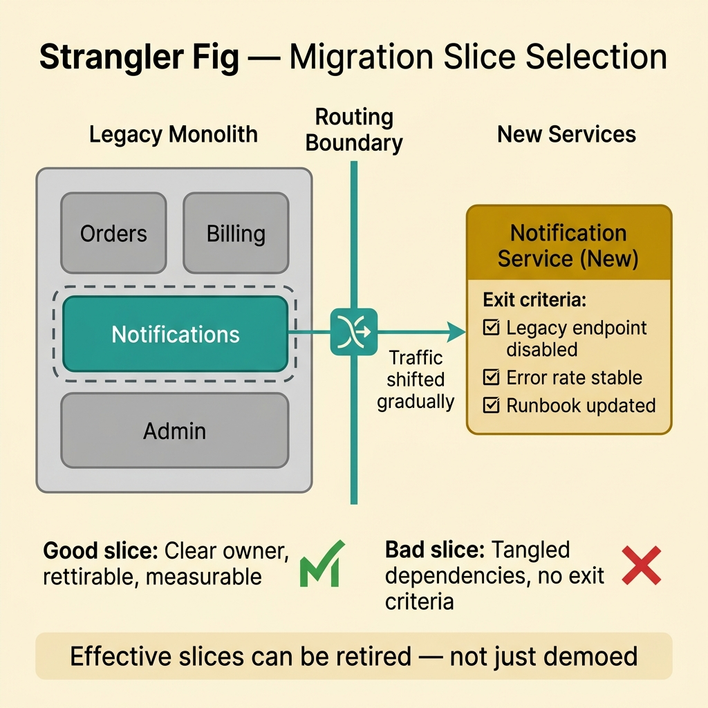
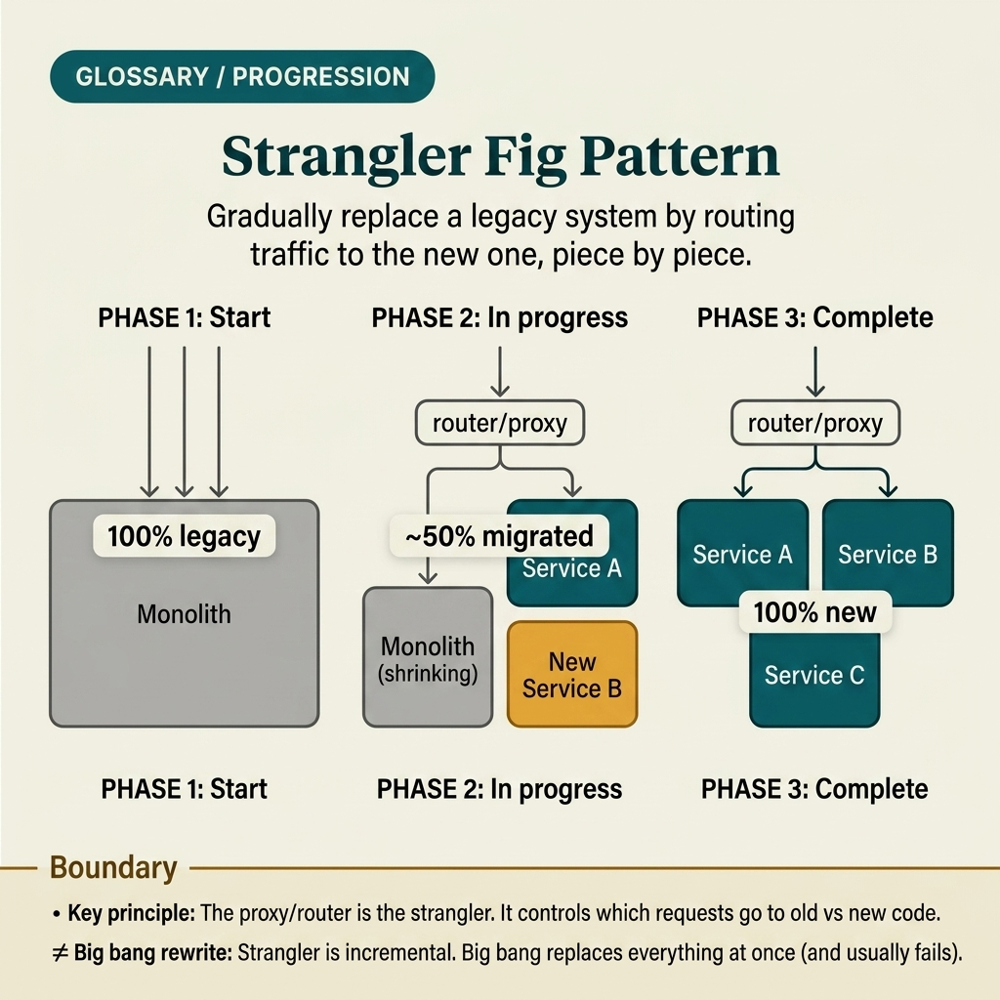

<!-- tags: glossary, reference, system-design-architecture, strangler-fig-pattern -->
# Strangler Fig Pattern

> Strangler Fig Pattern is a strategy to incrementally replace a legacy system by wrapping and substituting it piece by piece, instead of a big-bang rewrite.

| Aspect | Detail |
| --- | --- |
| **Concept** | Strangler Fig Pattern is a strategy to incrementally replace a legacy system by wrapping and substituting it piece by piece, instead of a big-bang rewrite. |
| **Audience** | Architect, backend engineer, migration owner |
| **Primary style** | Glossary term |
| **Entry point** | Use when the team needs to modernize a monolith or legacy platform without accepting the downtime, risk, and scope of a big-bang rewrite. |

📅 Created: 2026-03-30 · 🔄 Updated: 2026-04-04 · ⏱️ 10 min read

---

## 1. DEFINE

Picture this: a legacy system rarely dies because of a lack of rewrite ideas; it dies because the rewrite is too large, takes too long, and has no safe stopping point. You want to shift traffic to the new system, but you cannot freeze the business for 9 months waiting for "the great migration day." Strangler Fig Pattern appears right at this point: it lets you wrap the old system, extract a small capability, shift traffic gradually, then repeat until the old part is fully peeled away. That is the boundary of the strangler fig.

**Strangler Fig Pattern** is a strategy to incrementally replace a legacy system by wrapping and substituting it piece by piece, instead of a big-bang rewrite.

| Variant | Description |
| --- | --- |
| Proxy strangler | Places a routing/proxy layer in front and gradually shifts endpoints to new services. |
| Domain-by-domain strangler | Extracts by bounded context or business capability. |
| UI strangler | Peels screens or frontend routes away from the legacy app gradually. |
| Data strangler | Maintains a temporary read/write bridge while gradually separating storage or ownership. |

| Approach | Time | Space | When to choose |
| --- | --- | --- | --- |
| Big-bang rewrite | O(long parallel project) | O(double system) | Only acceptable when scope is small, boundaries are clear, and risk is low. |
| Traffic strangler | O(incremental migration) | O(proxy + coexistence cost) | When risk must be reduced and migration must be sliced. |
| Domain strangler | O(per capability extraction) | O(old + new bounded context) | When business capabilities have fairly clear boundaries. |
| Strangler + observability gate | O(incremental + metrics validation) | O(migration control state) | When rollout must be measurable and safely rollbackable. |

Core insight:

> Strangler Fig Pattern is not just "writing the new system in parallel." It is a migration strategy with boundaries, routing, measurement, and gradual rollback per capability.

### 1.1 Invariants & Failure Modes

- Each capability being extracted must have a clear owner, migration target, and exit criterion.
- The routing layer must know which requests go to legacy and which go to the new system.
- The most common mistake is "infinite strangler": the team opens the new system but never actually retires any legacy path.

---

## 2. CONTEXT

**Who uses it**: Architect, backend engineer, migration owner

**When**: Use when the team needs to modernize a monolith or legacy platform without accepting the downtime, risk, and scope of a big-bang rewrite.

**Purpose**: Strangler Fig Pattern is not just "writing the new system in parallel." It is a migration strategy with boundaries, routing, measurement, and gradual rollback per capability.

**In the ecosystem**:
- Strangler differs from uncontrolled parallel rewrite; strangler always needs a clear traffic boundary or ownership boundary.
- Strangler differs from a regular feature flag; feature flags can be a supporting tool, but the pattern's essence lies in incremental replacement.
- Strangler is not free; you must bear the coexistence cost between the old and new systems for a period.

---

The strategy is clear: wrap, extract, shift, repeat. But what does the "repeat" part look like when legacy is still handling production traffic?

## 3. EXAMPLES

Strangler fig surfaces most clearly when the team wants to rewrite module by module but does not know where to route traffic, when legacy and the new system must coexist for months, or when what started as "a small temporary service" eventually swallows the entire monolith.

### Example 1: Basic — Wrap legacy with a routing boundary to shift endpoints one by one

> **Goal**: Do not cut over the entire system in a single deploy.
> **Approach**: Place a proxy or gateway in front of legacy and shift endpoints/capabilities to new services one at a time.
> **Example**: `/orders/*` starts being routed to the new service, while `/billing/*` stays on the monolith.
> **Complexity**: Basic

```yaml
traffic_boundary:
  legacy_routes: [/billing/*, /admin/*]
  migrated_routes: [/orders/*]
  router: api_gateway
```

**Why?** Without a control boundary, migration becomes deploying two systems simultaneously with no visibility into where traffic actually goes. The routing boundary is the starting point for strangler to gradually expand scope without a big-bang cut-over.

**Takeaway**: Basic strangler starts with the right to control traffic — not with mass code rewriting.

### Example 2: Intermediate — Choose migration slices by capabilities that can actually be retired

> **Goal**: Do not peel off a technically convenient part that the business cannot actually retire from the legacy path.
> **Approach**: Choose a migration slice with a clear owner, contract, and measurable success of the extraction.
> **Example**: Extracting notification preferences is easier to retire than extracting half of a checkout workflow with tangled dependencies.
> **Complexity**: Intermediate



*Figure: Effective migration slices have clear owners, defined exit criteria, and measurable retirement — not just technical convenience.*

```yaml
migration_slice:
  capability: notification_preferences
  owner: customer_platform_team
  exit_criteria:
    - legacy_endpoint_disabled
    - error_rate_stable
    - support_runbook_updated
```

**Why?** Strangler is only effective when each slice ends with legacy actually shrinking. If slices are chosen without exit criteria and clear ownership, the team accumulates new systems while legacy barely shrinks.

**Takeaway**: Intermediate strangler is choosing capabilities that can be retired — not just capabilities that are easy to demo.

### Example 3: Advanced — Manage data ownership and compatibility during coexistence

> **Goal**: Do not let the old and new systems write to the same boundary without a clear source of truth.
> **Approach**: Define data ownership per phase; use temporary bridges/outbox/sync if needed.
> **Example**: The new service owns `order_status`; legacy only reads via API or projection during the transition period.
> **Complexity**: Advanced

```yaml
coexistence_contract:
  source_of_truth: order_service_new
  legacy_access_mode: read_only_via_api
  temporary_sync: outbox_projection
```

**Why?** Migrations usually break not because of routing, but because of ambiguous data ownership. Two systems writing to the same state is the fastest way to create inconsistency that is hard to untangle. Mature strangler always defines who is the source of truth at each phase.

**Takeaway**: Advanced strangler is migration with a clear data ownership contract during coexistence.

### Example 4: Expert — Use metrics gates and rollback gates to prevent infinite strangler or blind cut-over

> **Goal**: Do not push traffic to the new system just because "it looks fine," and do not keep coexistence indefinitely.
> **Approach**: Tie migration to success metrics, rollback gates, and concrete legacy retirement deadlines.
> **Example**: Traffic increases from 10% → 50% → 100% only when latency, correctness, and support tickets stay within thresholds.
> **Complexity**: Expert

```yaml
migration_gate:
  traffic_steps: [10%, 50%, 100%]
  success_metrics: [latency_p95, error_rate, business_correctness]
  rollback_trigger: threshold_breach
  retire_deadline: 2026-06-30
```

**Why?** A good strangler does not just reduce technical risk — it also creates pressure for legacy to actually be retired. Metrics gates make cut-over evidence-based; retirement deadlines prevent the pattern from becoming an indefinite "we will delete it later."

**Takeaway**: Expert strangler is incremental migration with both safety rails and exit discipline.

---

## 4. COMPARE




*Figure: Position of strangler fig among big-bang rewrite, branch-by-abstraction, and other migration strategies.*

Strangler fig sounds like "step-by-step rewrite." Partly true — but the key difference is: traffic routes are shifted gradually, not code copied gradually.

### Level 1

```text
legacy system
  -> traffic enters a control boundary
  -> one capability is routed to new service
  -> remaining traffic still stays on legacy
```

*Figure: Level 1 shows strangler always begins with a boundary that controls traffic or ownership before replacing anything.*

### Level 2

```text
route selected capability to new system
  -> compare metrics and correctness
  -> expand traffic slice gradually
  -> retire old path when exit criteria are met
```

*Figure: Level 2 emphasizes that migration does not end at "wrote a new service" — it ends when the legacy path is retired with metrics and rollback control.*

### Easy to confuse or cross the boundary

| # | Severity | Mistake | Consequence | Fix |
| --- | --- | --- | --- | --- |
| 1 | 🔴 Fatal | Writing a new system in parallel without a routing/ownership boundary | Traffic and responsibility are ambiguous; legacy cannot be retired | Set up a control boundary before extracting capability. |
| 2 | 🟡 Common | Choosing migration slices without exit criteria | New systems accumulate but legacy does not shrink | Choose capabilities with clear owners and retire conditions. |
| 3 | 🟡 Common | Both systems writing to the same state during coexistence | Data drift and incidents that are hard to debug | Define source of truth per phase. |
| 4 | 🟡 Common | No metric/rollback gate for cut-over | Migration is based on gut feeling | Tie traffic steps to clear success metrics. |
| 5 | 🔵 Minor | Dragging coexistence too long because there is no deadline | Pattern becomes a maintenance burden | Set a realistic legacy retirement milestone. |

### Quick scan

| If you encounter | What to do |
| --- | --- |
| Want to replace legacy gradually instead of big-bang rewrite | Think Strangler Fig Pattern |
| Don't know where traffic goes after extraction | Add a routing boundary |
| Legacy does not shrink even though the new system grows | Review exit criteria and ownership |
| Both systems writing to the same state | Lock down source of truth |

---

## 5. REF

| Resource | Type | Link | Notes |
| --- | --- | --- | --- |
| Martin Fowler — Strangler Fig Application | Reference | https://martinfowler.com/bliki/StranglerFigApplication.html | The original article capturing the spirit of incremental migration. |
| Azure Architecture Center — Strangler Fig Pattern | Reference | https://learn.microsoft.com/azure/architecture/patterns/strangler-fig | Pragmatic enterprise perspective on migration. |
| Microservices.io | Reference | https://microservices.io/ | Many patterns related to extraction, gateway, and data ownership. |

---

## 6. RECOMMEND

Strangler fig solves the problem of "cannot rewrite all at once." The next question: what resilience patterns does the new system need, how is edge control designed, and how is service-to-service communication managed as the count grows?

| Expand to | When | Why | File/Link |
| --- | --- | --- | --- |
| Resilience boundary | When the new system needs protection from downstream failure | Circuit Breaker is the next article | [Circuit Breaker](./09-circuit-breaker.md) |
| Edge routing | When traffic routing needs a unified edge boundary | API Gateway is an adjacent concept | [API Gateway](./13-api-gateway.md) |
| Service isolation | When resource separation between legacy and new is needed | Bulkhead Pattern is the expansion path | [Bulkhead Pattern](./10-bulkhead-pattern.md) |

Back to that legacy system at the beginning — where the rewrite was too large, too long, and had no safe stopping point. Now you know: you do not need "the great migration day." You need a proxy, a route, and one small capability shifted first. The rest is repetition.

**Links**: [← Previous](./07-outbox-pattern.md) · [→ Next](./09-circuit-breaker.md)
