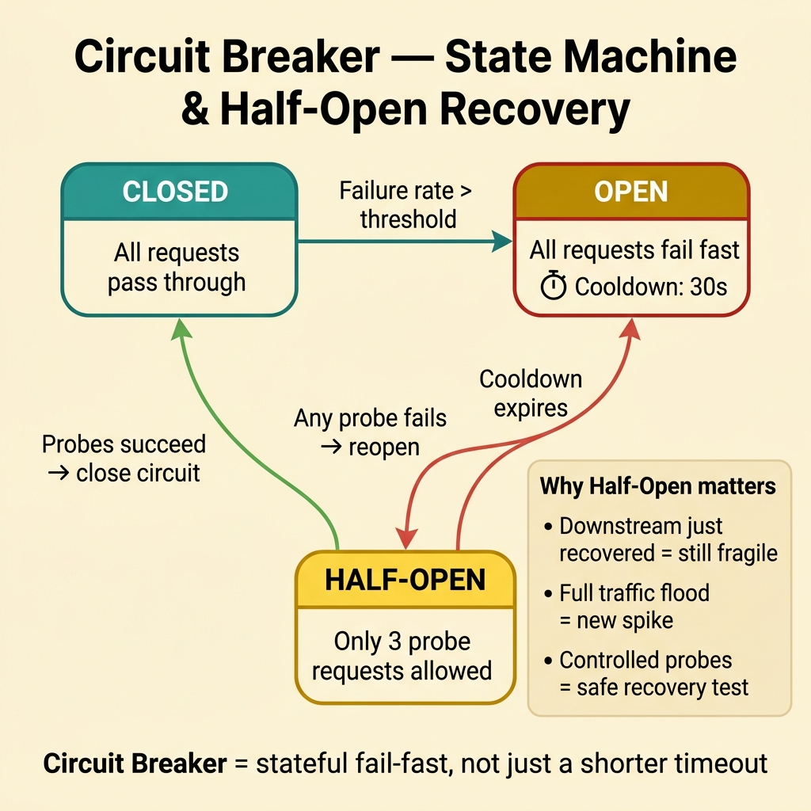
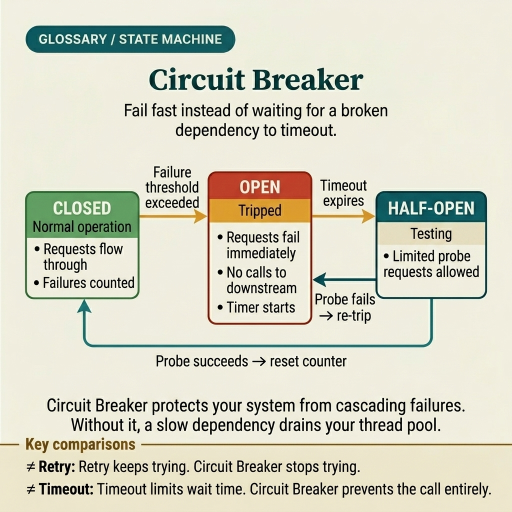

<!-- tags: glossary, reference, system-design-architecture, circuit-breaker -->
# Circuit Breaker

> Circuit Breaker is a pattern that protects the system from prolonged downstream failure by opening the circuit, blocking new requests, and only retrying with control.

| Aspect | Detail |
| --- | --- |
| **Concept** | Circuit Breaker is a pattern that protects the system from prolonged downstream failure by opening the circuit, blocking new requests, and only retrying with control. |
| **Audience** | Backend engineer, SRE, resilience reviewer |
| **Primary style** | Glossary term |
| **Entry point** | Use when a downstream frequently times out or fails for extended periods and the caller needs to avoid burning through its own threads, connections, or retry budget. |

📅 Created: 2026-03-30 · 🔄 Updated: 2026-04-04 · ⏱️ 10 min read

---

## 1. DEFINE

Picture this: a downstream starts timing out continuously. The caller keeps trying, retrying more, then queue backlogs pile up, thread pools are exhausted, and latency cascades backward across the entire service cluster. Without a mechanism to say "enough, stop calling for now," a single dependency's failure will drag the caller down with it. Circuit Breaker appears exactly at this boundary: it temporarily cuts the call path to the failing downstream so the system can breathe, and only retries with control. That is the boundary of the circuit breaker.

**Circuit Breaker** is a pattern that protects the system from prolonged downstream failure by opening the circuit, blocking new requests, and only retrying with control.

| Variant | Description |
| --- | --- |
| Closed → Open → Half-open | The classic state machine model for circuit breakers. |
| Per-downstream breaker | Each dependency gets its own breaker. |
| Per-operation breaker | Separates breakers by endpoint or call type. |
| Adaptive breaker | Threshold based on failure rate, latency, or concurrency. |

| Approach | Time | Space | When to choose |
| --- | --- | --- | --- |
| Timeout only | O(call timeout) | O(1) | When downstream rarely fails for extended periods and stateful protection is not yet needed. |
| Fixed-threshold breaker | O(window check) | O(failure window state) | When clear protection is needed for a frequently failing downstream. |
| Sliding-window breaker | O(window update) | O(window metrics) | When softer response based on error rate or latency is desired. |
| Breaker + fallback | O(window + fallback path) | O(fallback state) | When the caller has an acceptable degraded mode. |

Core insight:

> Circuit Breaker does not fix the downstream. It protects the caller from killing itself by chasing a downstream that is already broken.

### 1.1 Invariants & Failure Modes

- A breaker must be attached to a specific, clear dependency boundary — do not use a single breaker for all downstreams.
- Half-open probes must have limits; otherwise "opening back up to try" becomes a mini thundering herd.
- The most common mistake is setting thresholds arbitrarily, causing the breaker to either never open or open too easily, making traffic oscillate constantly.

---

## 2. CONTEXT

**Who uses it**: Backend engineer, SRE, resilience reviewer

**When**: Use when a downstream frequently times out or fails for extended periods and the caller needs to avoid burning through its own threads, connections, or retry budget.

**Purpose**: Circuit Breaker does not fix the downstream. It protects the caller from killing itself by chasing a downstream that is already broken.

**In the ecosystem**:
- Circuit breaker differs from timeout; timeout stops a single request, a breaker stops an entire chain of requests when the failure pattern is clear.
- Circuit breaker differs from retry; retry tries to call again, a breaker decides when to stop calling entirely.
- A breaker does not replace backpressure, bulkhead, or capacity planning; it is a separate resilience layer.

---

Cutting the call path so the system can breathe — sounds simple. But when to reopen, how much to let through, and how does the UX behave when the circuit first opens?

## 3. EXAMPLES

Circuit breaker surfaces most clearly when a downstream keeps timing out while the caller retries endlessly, when thread pools are drained by a single dead dependency, or when the half-open state lets requests through but the downstream still has not recovered. The examples below place the pattern in exactly those moments.

### Example 1: Basic — Cut new calls quickly when downstream is failing in bulk

> **Goal**: Do not let the caller continue timing out on a downstream that is clearly broken.
> **Approach**: Open the breaker when failure count exceeds a threshold and fail fast during the cooldown period.
> **Example**: Payment gateway times out continuously; order service temporarily blocks new calls instead of waiting 5 seconds per request.
> **Complexity**: Basic

```yaml
breaker_basic:
  downstream: payment_gateway
  open_when_failures: 10
  cooldown: 30s
  behavior_while_open: fail_fast
```

**Why?** When a downstream has clearly failed, continuing to send requests only converts the downstream's latency into the caller's latency. Fail fast protects the thread pool, connection pool, and retry budget upstream.

**Takeaway**: Basic circuit breaker is a stateful fail-fast mechanism — not just a shorter timeout.

### Example 2: Intermediate — Design half-open probes for controlled recovery testing

> **Goal**: Do not dump all traffic back at once the instant the cooldown expires.
> **Approach**: Allow only a small number of probes when the breaker is in half-open state.
> **Example**: After 30 seconds in open state, only 3 requests are allowed to probe the payment gateway.
> **Complexity**: Intermediate



*Figure: The breaker transitions through Closed → Open → Half-Open. Half-open probes test recovery with minimal traffic to avoid re-spiking a fragile downstream.*

```yaml
half_open_policy:
  allowed_probes: 3
  success_to_close: 3
  failure_to_reopen: 1
```

**Why?** A downstream that has just recovered is usually still fragile. If all traffic floods back at once, the breaker creates a new spike. Half-open probes allow health-checking the downstream with small, controlled traffic.

**Takeaway**: Intermediate breaker design is about the half-open policy — not just the initial open threshold.

### Example 3: Advanced — Combine breaker with truly useful fallback or degraded mode

> **Goal**: Do not just block errors but also maintain a minimum acceptable experience for the caller.
> **Approach**: When the breaker is open, route to a fallback such as a cached response, queued request, or partial experience.
> **Example**: When the recommendation service is down, the homepage uses a 15-minute cached ranking instead of returning a 500.
> **Complexity**: Advanced

```yaml
breaker_with_fallback:
  downstream: recommendation_service
  when_open: serve_cached_snapshot
  cache_ttl: 15m
```

**Why?** The breaker only blocks error propagation; it does not automatically create a good degraded experience. In production, the real value of a breaker often comes from the caller still serving a reasonably degraded version instead of dying completely.

**Takeaway**: Advanced circuit breaker is a breaker paired with an intentional fallback — not just request rejection.

### Example 4: Expert — Tune breakers with error budget, latency profile, and per-operation policy

> **Goal**: Do not use a single rigid threshold for every downstream and every call type.
> **Approach**: Separate breakers by operation criticality, latency profile, and business cost of failing fast.
> **Example**: Charge payment and query exchange rate have different breakers because their failure costs and SLOs differ.
> **Complexity**: Expert

```yaml
breaker_tuning:
  payment_charge:
    failure_rate_threshold: 20%
    cooldown: 60s
  exchange_rate_lookup:
    failure_rate_threshold: 50%
    fallback: cached_rate
```

**Why?** A good breaker is not one that is "very sensitive" or "very strict" — it is one that accurately reflects the cost of each downstream path. Critical operations need different thresholds than enrichment-only operations. Without tuning per path, the breaker ends up either too aggressive or nearly useless.

**Takeaway**: Expert breaker design is per-operation resilience policy — not a copy-pasted config for the whole system.

---

## 4. COMPARE




*Figure: Position of circuit breaker among retry, bulkhead, timeout, and other resilience patterns.*

Circuit breaker sounds like "stop calling when it fails." True — but the key difference from a retry policy is: it has a state machine (closed → open → half-open) and a recovery path.

### Level 1

```text
downstream starts failing
  -> breaker opens
  -> new calls are rejected fast
```

*Figure: Level 1 shows circuit breaker cutting new requests quickly instead of letting the caller continue timing out in a chain.*

### Level 2

```text
closed
  -> failure rate crosses threshold
  -> open
  -> cooldown expires
  -> half-open probes decide whether to close again
```

*Figure: Level 2 emphasizes that the breaker is an operational state machine — not just an if-check around a request.*

### Easy to confuse or cross the boundary

| # | Severity | Mistake | Consequence | Fix |
| --- | --- | --- | --- | --- |
| 1 | 🔴 Fatal | Using a single breaker for all downstreams | One dependency's failure can mistakenly block traffic to others | Separate breakers by dependency or operation. |
| 2 | 🟡 Common | Only having timeout, no breaker state | Caller still burns resources when downstream fails for extended periods | Add open/half-open/closed policy. |
| 3 | 🟡 Common | Unlimited half-open probes | Traffic returns all at once causing a new spike | Allow only a small, controlled number of probes. |
| 4 | 🟡 Common | Not pairing breaker with fallback or UX plan | Fails fast but experience is still terrible | Design a degraded mode if the path allows. |
| 5 | 🔵 Minor | Copy-pasting thresholds for every path | Breaker reacts at the wrong level for each workload | Tune by error budget and business criticality. |

### Quick scan

| If you encounter | What to do |
| --- | --- |
| Downstream timeouts dragging on | Add a circuit breaker |
| Cooldown ends but traffic floods back too hard | Limit half-open probes |
| Breaker opens but UX is still completely broken | Design a fallback/degraded mode |
| One breaker config applied to all paths | Split policy by operation |

---

## 5. REF

| Resource | Type | Link | Notes |
| --- | --- | --- | --- |
| Michael Nygard — Release It! | Book | https://pragprog.com/titles/mnee2/release-it-second-edition/ | The canonical source for circuit breaker and stability patterns. |
| Martin Fowler — Circuit Breaker | Reference | https://martinfowler.com/bliki/CircuitBreaker.html | Concise explanation of the state machine and motivation. |
| Resilience4j CircuitBreaker Guide | Official | https://resilience4j.readme.io/docs/circuitbreaker | Practical example of thresholds, half-open, and metrics. |

---

## 6. RECOMMEND

Circuit breaker solves the problem of "downstream is dead but the caller keeps calling." The next question: how is the caller's resources isolated, where do cross-cutting concerns live, and should the producer slow down when the consumer is choking?

| Expand to | When | Why | File/Link |
| --- | --- | --- | --- |
| Resource isolation | When blast radius on the caller side needs limiting | Bulkhead is the next article | [Bulkhead Pattern](./10-bulkhead-pattern.md) |
| Cross-cutting concern | When retry/mTLS/tracing need centralized management | Service Mesh is an adjacent concept | [Service Mesh](./12-service-mesh.md) |
| Producer slowdown | When the consumer is overloaded and needs to signal back | Backpressure is a related article | [Backpressure](./15-backpressure.md) |

Back to that downstream timeout at the beginning — caller kept retrying, thread pool drained, latency cascaded backward across the entire cluster. Now you know: the fault was not the downstream. The fault was that the caller did not know how to say "pause for now." Circuit breaker is that button.

**Links**: [← Previous](./08-strangler-fig-pattern.md) · [→ Next](./10-bulkhead-pattern.md)
