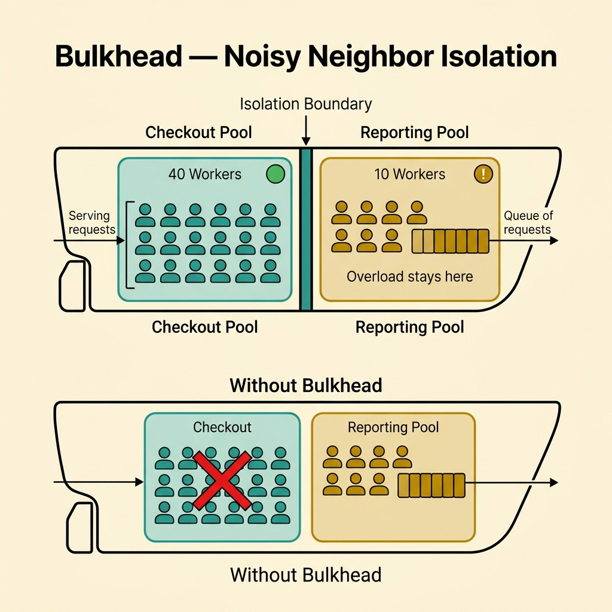
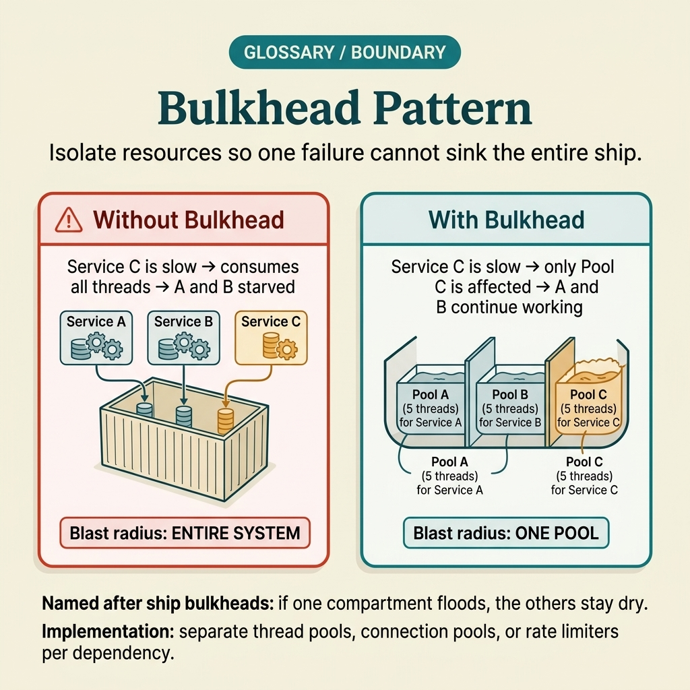

<!-- tags: glossary, reference, system-design-architecture, bulkhead-pattern -->
# Bulkhead Pattern

> A way to isolate resources between components so that failure or overload in one zone does not drain the entire system's resources.

| Aspect | Detail |
| --- | --- |
| **Concept** | A way to isolate resources between components so that failure or overload in one zone does not drain the entire system's resources. |
| **Audience** | Backend engineer, platform engineer, resilience reviewer |
| **Primary style** | Glossary term |
| **Entry point** | Use when multiple workloads share a thread pool, connection pool, or compute quota and a single failing path can choke everything else. |

📅 Created: 2026-03-30 · 🔄 Updated: 2026-04-04 · ⏱️ 10 min read

---

## 1. DEFINE

Picture this: a reporting endpoint suddenly slows down. It starts consuming all DB connections and worker threads, and then checkout, auth, and health checks all choke — even though they themselves have no bugs. If every workload shares a single resource pool with no boundaries, one flooded zone sinks the entire ship. Bulkhead Pattern borrows exactly that image: divide the system into independent resource compartments so that one failed zone does not sink everything. That is the boundary of bulkhead.

**Bulkhead Pattern** is a way to isolate resources between components so that failure or overload in one zone does not drain the entire system's resources.

| Variant | Description |
| --- | --- |
| Thread-pool bulkhead | Separate worker pools by workload or dependency. |
| Connection-pool bulkhead | Separate connection quotas by path or service. |
| Queue bulkhead | Separate queues so backlog on one path does not block another. |
| Tenant or class-of-service bulkhead | Separate resources by priority level or customer group. |

| Approach | Time | Space | When to choose |
| --- | --- | --- | --- |
| Shared pool only | O(shared contention) | O(shared pool) | Only suitable when workloads are uniform and risk is low. |
| Fixed bulkhead partitions | O(per partition scheduling) | O(multiple pools/queues) | When a critical workload needs protection from noisy neighbors. |
| Priority-based isolation | O(priority scheduling) | O(priority state) | When a higher class-of-service needs protection. |
| Adaptive isolation | O(dynamic signals) | O(metrics + control state) | When load is highly variable and runtime adjustment is needed. |

Core insight:

> Bulkhead does not magically make the system faster. It keeps failure and contention confined to one compartment instead of cascading into a global incident.

### 1.1 Invariants & Failure Modes

- Critical workloads must have a minimum protected resource share.
- Too few partitions renders isolation useless; too many causes poor utilization and operational complexity.
- The most common mistake is claiming "we have bulkheads" while every path still shares the same DB pool or goroutine pool.

---

## 2. CONTEXT

**Who uses it**: Backend engineer, platform engineer, resilience reviewer

**When**: Use when multiple workloads share a thread pool, connection pool, or compute quota and a single failing path can choke everything else.

**Purpose**: Bulkhead does not magically make the system faster. It keeps failure and contention confined to one compartment instead of cascading into a global incident.

**In the ecosystem**:
- Bulkhead differs from circuit breaker; a breaker blocks calls to a failing downstream, while bulkhead separates resources between workloads.
- Bulkhead differs from rate limiting; rate limiting controls inbound speed, while bulkhead controls damage scope when contention occurs.
- Bulkhead typically operates at the thread pool, queue, connection pool, or tenant isolation layer.

---

Splitting into resource compartments sounds logical. But where to split, how many partitions, and how does the team know which compartment is flooding?

## 3. EXAMPLES

Bulkhead surfaces most clearly when a slow reporting endpoint drains the connection pool for checkout, when a batch job consumes all CPU causing health checks to fail, or when the team says "everything is slow" but in reality only one workload is sinking the rest. The examples below place the pattern in exactly those situations.

### Example 1: Basic — Separate critical workloads from background workloads

> **Goal**: Do not let ancillary paths like export/reporting choke checkout or auth.
> **Approach**: Use separate pools or queues for critical and non-critical workloads.
> **Example**: Checkout keeps a pool of 40 workers; reporting uses a separate pool of 10 workers.
> **Complexity**: Basic

```yaml
bulkhead_basic:
  checkout_workers: 40
  reporting_workers: 10
  shared_pool: false
```

**Why?** When every request uses a shared pool, the noisiest path wins. Bulkhead reserves capacity for critical workloads so a noisy neighbor does not bring everything down together.

**Takeaway**: Basic bulkhead is the minimum resource split for the most critical paths.

### Example 2: Intermediate — Choose bulkhead boundaries by dependency or class-of-service

> **Goal**: Do not partition pools arbitrarily without reflecting the actual blast radius.
> **Approach**: Partition by hot dependency, class-of-service, or tenant tier with different risk profiles.
> **Example**: Premium tenant traffic uses an isolated quota so batch jobs from the free tier do not choke them.
> **Complexity**: Intermediate



*Figure: Choosing the right partition boundary is what makes bulkhead effective — split by actual contention, not by org chart.*

```yaml
bulkhead_boundary:
  premium_tenants_pool: isolated
  batch_jobs_pool: isolated
  dependency_partition: [payments, reporting]
```

**Why?** Bulkhead is only effective when its boundaries align with where contention actually occurs. Splitting at the wrong boundary increases complexity while the blast radius stays the same.

**Takeaway**: Intermediate bulkhead design is choosing boundaries based on contention patterns — not based on team org charts.

### Example 3: Advanced — Combine bulkhead with backpressure and queue shedding

> **Goal**: Not only isolate resources but also know when to reject or slow down overloaded workloads.
> **Approach**: When a partition fills up, apply backpressure, queue caps, or shedding instead of letting latency grow unbounded.
> **Example**: Reporting queue at 1000 jobs rejects new enqueues and keeps checkout untouched.
> **Complexity**: Advanced

```yaml
bulkhead_overflow_policy:
  reporting_queue_limit: 1000
  on_limit_reached: reject_new_jobs
  protect_checkout: true
```

**Why?** Bulkhead is not just splitting pools and hoping for the best. When a compartment fills, the system must know how to shed load or apply backpressure at the right point. Otherwise, latency still grows uncontrolled inside that compartment and eventually leaks to other zones through dependency chains.

**Takeaway**: Advanced bulkhead is isolation paired with an explicit overflow policy.

### Example 4: Expert — Tune bulkhead using utilization targets and business priority

> **Goal**: Do not configure partitions once and forget about them even though traffic profiles change constantly.
> **Approach**: Use metrics on utilization, saturation, and business criticality to adjust capacity or quotas.
> **Example**: During peak hours, checkout gets increased reserved workers; at night, batch gets more capacity.
> **Complexity**: Expert

```yaml
bulkhead_tuning:
  checkout_reserved_workers: 60
  batch_reserved_workers: 15
  adjustment_signal: utilization_and_slo
```

**Why?** A good bulkhead must balance protection and utilization. If partitions are too rigid, idle resources are wasted. If too loose, protection vanishes. Tuning by SLO and workload profile is what maintains both.

**Takeaway**: Expert bulkhead is a living resource policy — not a few immutable numbers in a config file.

---

## 4. COMPARE




*Figure: Position of bulkhead among circuit breaker, resource limits, thread pool isolation, and other resilience patterns.*

Bulkhead sounds like "split resources." True — but it differs from rate limiting in that bulkhead protects the caller from itself, not the server from the caller.

### Level 1

```text
critical workload pool
non_critical workload pool
  -> overload in one pool
  -> other pool still has capacity
```

*Figure: Level 1 shows bulkhead separating resources so overload in one zone does not drain the remaining zones.*

### Level 2

```text
reporting traffic spikes
  -> reporting queue saturates
  -> checkout queue remains healthy
  -> incident stays localized
```

*Figure: Level 2 places bulkhead in the noisy-neighbor scenario and blast-radius control.*

### Easy to confuse or cross the boundary

| # | Severity | Mistake | Consequence | Fix |
| --- | --- | --- | --- | --- |
| 1 | 🔴 Fatal | Claiming bulkhead exists but all paths still share a pool | Actual blast radius does not decrease | Truly separate pool/queue along critical boundaries. |
| 2 | 🟡 Common | Splitting at the wrong contention boundary | Complexity increases but choking remains | Partition by actual dependency or class-of-service. |
| 3 | 🟡 Common | No overflow policy when a partition fills | Latency grows unbounded within that compartment | Add backpressure or shedding. |
| 4 | 🟡 Common | Reserving too rigidly without tuning for traffic profile | Waste or insufficient protection at peak | Tune by utilization and SLO. |
| 5 | 🔵 Minor | Watching only throughput, not saturation | Noisy-neighbor goes unnoticed until too late | Monitor queue depth, pool saturation, and wait time. |

### Quick scan

| If you encounter | What to do |
| --- | --- |
| One workload choking another | Add bulkhead |
| Pool already split but blast radius is still large | Re-examine partition boundaries |
| Partition full and latency still growing unbounded | Add an overflow policy |
| Reserved capacity causing waste | Tune by utilization/SLO |

---

## 5. REF

| Resource | Type | Link | Notes |
| --- | --- | --- | --- |
| Michael Nygard — Release It! | Book | https://pragprog.com/titles/mnee2/release-it-second-edition/ | Classic source for bulkhead and blast-radius control. |
| Azure Architecture Center — Bulkhead Pattern | Reference | https://learn.microsoft.com/azure/architecture/patterns/bulkhead | Good explanation of isolation boundaries and trade-offs. |
| Netflix Concurrency Limits | Reference | https://github.com/Netflix/concurrency-limits | Modern example of adaptive isolation and limit tuning. |

---

## 6. RECOMMEND

Bulkhead solves the problem of "one flooded workload sinking the entire ship." The next question: where do you cut calls when downstream fails, how is traffic burst controlled at the edge, and how does worker pool isolation work in an async pipeline?

| Expand to | When | Why | File/Link |
| --- | --- | --- | --- |
| Downstream failure control | When overload comes with downstream errors | Circuit Breaker is the preceding article | [Circuit Breaker](./09-circuit-breaker.md) |
| Traffic shaping | When isolation needs to combine with edge throttling | Throttling is a later article in the same topic | [Throttling](./16-throttling.md) |
| Async load control | When queue/pool isolation relates to concurrency | See worker pool and backoff | [Concurrency & Async](../concurrency-async/README.md) |

Back to that reporting endpoint at the beginning — it consumed all DB connections, choking checkout and auth along the way. Now you know: the problem was not the endpoint itself. The problem was that every workload shared a single resource pool with no partitions. One separate pool, one clear limit. Simple as that — but it keeps the ship afloat.

**Links**: [← Previous](./09-circuit-breaker.md) · [→ Next](./11-sidecar-pattern.md)
