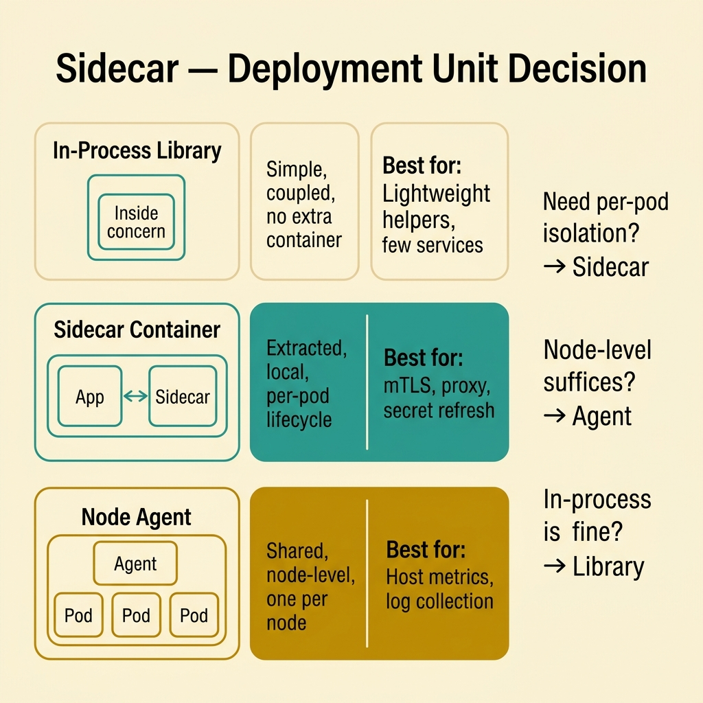
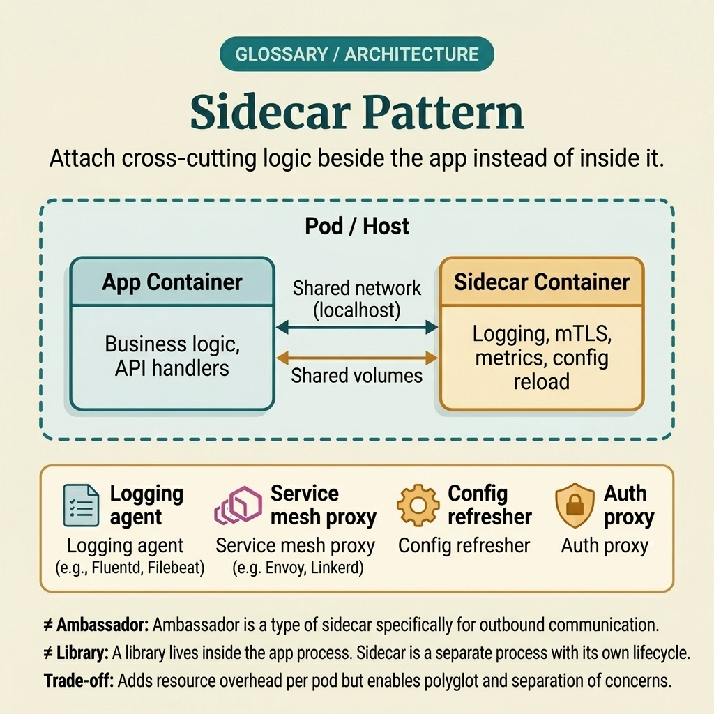

<!-- tags: glossary, reference, system-design-architecture, sidecar-pattern -->
# Sidecar Pattern

> A deployment pattern where a companion container runs alongside the main application to handle shared concerns such as proxy, auth, logging, or telemetry.

| Aspect | Detail |
| --- | --- |
| **Concept** | A deployment pattern where a companion container runs alongside the main application to handle shared concerns such as proxy, auth, logging, or telemetry. |
| **Audience** | Platform engineer, backend engineer, runtime architecture reviewer |
| **Primary style** | Glossary term |
| **Entry point** | Use when multiple services need the same runtime capability close to the main process but you do not want to embed that concern into each codebase. |

📅 Created: 2026-03-30 · 🔄 Updated: 2026-04-04 · ⏱️ 10 min read

---

## 1. DEFINE

Picture this: a group of services all need TLS termination, request telemetry, and local policy enforcement. If each service implements all that logic in its own code, every repo takes on the same infrastructure concern. If everything is pushed to a central gateway, many local concerns — like service-to-service proxy or per-pod metrics — become hard to handle close enough to the workload. Sidecar pattern appears in exactly this middle ground: place a runtime companion next to the application to handle shared concerns locally. That is the boundary of sidecar.

**Sidecar Pattern** is a deployment pattern where a companion container runs alongside the main application to handle shared concerns such as proxy, auth, logging, or telemetry.

| Variant | Description |
| --- | --- |
| Proxy sidecar | Envoy/nginx sidecar handling mTLS, retry, routing, or policy. |
| Logging/telemetry sidecar | Collects logs, metrics, or traces locally then ships them out. |
| Security sidecar | Injects secrets, performs auth checks, or handles certificate rotation close to the workload. |
| Helper sidecar | Provides specialized runtime capabilities like file sync, cache warmup, or a local adapter. |

| Approach | Time | Space | When to choose |
| --- | --- | --- | --- |
| In-process library | O(in-process call) | O(app memory) | When the concern is simple, few services exist, and coupling is acceptable. |
| Sidecar per workload | O(local network hop) | O(extra container per pod) | When a shared runtime concern is needed but should stay separate from app code. |
| Node-level agent | O(shared agent hop) | O(node agent state) | When the concern fits better at node level rather than per-pod. |
| Mesh-managed sidecar | O(proxy hop + mesh control) | O(sidecar + control plane) | When service-to-service policy needs broad consistency. |

Core insight:

> Sidecar is not just "adding one more container." It is the decision to extract an infrastructure concern from app code while keeping it close enough to the workload to control local behavior.

### 1.1 Invariants & Failure Modes

- The main application and sidecar must have a clear contract: who owns health, who owns startup order, and how the pod is handled if either fails.
- Sidecar adds a local hop and another runtime component that must be observed, updated, and debugged.
- The most common mistake is sidecar-izing because it "sounds cloud-native," when the concern would actually be much simpler as a library or node agent.

---

## 2. CONTEXT

**Who uses it**: Platform engineer, backend engineer, runtime architecture reviewer

**When**: Use when multiple services need the same runtime capability close to the main process but you do not want to embed that concern into each codebase.

**Purpose**: Sidecar is not just "adding one more container." It is the decision to extract an infrastructure concern from app code while keeping it close enough to the workload to control local behavior.

**In the ecosystem**:
- Sidecar differs from a library; sidecar extracts the concern out of the application process.
- Sidecar differs from service mesh; sidecar is a deployment unit, while mesh is a model for managing network behavior at scale — often using sidecar proxies as an implementation detail.
- Not every concern should be sidecar-ized; per-pod overhead and operational toil always have a cost.

---

Sidecar solves "shared concern that needs to be close to the workload." But when should you sidecar vs. use a library, and at scale how much does a per-pod companion cost?

## 3. EXAMPLES

Sidecar surfaces most clearly when 10 services all copy the same TLS logic into their code, when a node agent is not close enough to intercept traffic per-pod, or when a sidecar rollout causes an incident because nobody manages version skew. The examples below place the pattern at each of those levels.

### Example 1: Basic — Extract shared concerns from application code

> **Goal**: Do not copy the same proxy, log shipper, or auth helper logic into every service.
> **Approach**: Place a companion container next to the app to handle shared runtime concerns.
> **Example**: The app only talks to a localhost proxy sidecar; the sidecar handles TLS and upstream routing.
> **Complexity**: Basic

```yaml
sidecar_basic:
  app_container: order_service
  sidecar_container: envoy_proxy
  responsibility_split:
    app: business_logic
    sidecar: tls_routing_observability
```

**Why?** When the same concern must be repeated across many services, embedding it in app code creates coupling and drift very quickly. Sidecar turns that concern into a runtime companion that can be standardized and changed more independently.

**Takeaway**: Basic sidecar is extracting infrastructure concerns from business code while keeping them close to the workload.

### Example 2: Intermediate — Choose sidecar over library or node agent at the right point

> **Goal**: Do not sidecar-ize everything instinctively.
> **Approach**: Compare needs for local isolation, rollout independence, and operational overhead.
> **Example**: Secret refresh per-pod fits a sidecar; host metrics collection fits a node agent better.
> **Complexity**: Intermediate



*Figure: Not every concern warrants a sidecar — the right deployment unit depends on the nature of the concern and its proximity requirement.*

```yaml
deployment_choice:
  secret_refresh: sidecar
  host_metrics: node_agent
  lightweight_helper: maybe_library
```

**Why?** Sidecar is beneficial when the concern must follow the pod's lifecycle or needs very close interception of app traffic. If the concern fits at node-level or is just lightweight in-process logic, a sidecar adds unnecessary overhead.

**Takeaway**: Intermediate sidecar design is choosing the right deployment unit for the nature of the concern.

### Example 3: Advanced — Manage startup, health, and failure contract between app and sidecar

> **Goal**: Do not let the app assume the sidecar is ready when the sidecar is still booting or has already died.
> **Approach**: Define clear readiness/liveness and dependency contracts between the two containers.
> **Example**: The app is only ready when the sidecar proxy has finished loading config and received a valid cert.
> **Complexity**: Advanced

```yaml
sidecar_runtime_contract:
  app_ready_requires: sidecar_ready
  sidecar_failure_action: pod_not_ready
  shared_health_signal: true
```

**Why?** Sidecar adds a new runtime dependency within the same pod. If startup order and health semantics are vague, the app may send traffic to a sidecar that is not ready or live in a degraded state that the platform does not recognize.

**Takeaway**: Advanced sidecar is a sidecar with a clear lifecycle contract between app, platform, and the companion container.

### Example 4: Expert — Control sidecar sprawl and operational cost at scale

> **Goal**: Do not let every pod add a sidecar until the cluster bloats in CPU/memory and rollout complexity exceeds control.
> **Approach**: Only sidecar-ize concerns that truly warrant it; measure overhead and standardize version/rollout strategy.
> **Example**: 400 pods each adding an Envoy sidecar noticeably increases the resource bill and blast radius during proxy rollouts.
> **Complexity**: Expert

```yaml
sidecar_governance:
  enable_when: concern_requires_local_runtime_boundary
  resource_budget: explicit
  rollout_owner: platform_team
  version_skew_policy: defined
```

**Why?** The benefit of sidecars at small scale is easy to see, but at large scale the cost of a per-pod companion grows sharply: resource overhead, startup latency, version skew, and debug surface. Without governance, sidecars silently become a tax across the entire platform.

**Takeaway**: Expert sidecar is a sidecar with budget, owner, and clear enable/disable rules based on real value.

---

## 4. COMPARE




*Figure: Position of sidecar among library, node agent, service mesh, and other deployment models.*

Sidecar sounds like "adding one more container." True in form — but it differs from a library in that it extracts the concern from the process, and from a mesh in that it is a deployment unit, not a governance model.

### Level 1

```text
application container
  <-> local sidecar
  -> sidecar handles shared runtime concern
```

*Figure: Level 1 shows sidecar as a companion runtime placed next to the app to handle shared concerns locally.*

### Level 2

```text
many pods each have app + sidecar
  -> policy or telemetry handled locally per pod
  -> platform still manages rollout and health for both containers
```

*Figure: Level 2 highlights both the benefit and cost of the per-pod companion model at scale.*

### Easy to confuse or cross the boundary

| # | Severity | Mistake | Consequence | Fix |
| --- | --- | --- | --- | --- |
| 1 | 🔴 Fatal | Sidecar-izing every concern without cost/benefit analysis | Cluster overhead and complexity spike | Only use sidecar when a local runtime boundary is truly needed. |
| 2 | 🟡 Common | Unclear how much the app depends on the sidecar | Startup or readiness behaves incorrectly | Define a clear lifecycle contract. |
| 3 | 🟡 Common | Using sidecar when a node agent or library would suffice | Container count and toil increase needlessly | Choose the right deployment unit for the concern. |
| 4 | 🟡 Common | No version skew or rollout owner management | Incidents hard to debug during sidecar rollouts | Standardize versioning and ownership. |
| 5 | 🔵 Minor | Ignoring per-sidecar resource overhead | Capacity planning becomes inaccurate | Track CPU/memory tax of each sidecar. |

### Quick scan

| If you encounter | What to do |
| --- | --- |
| Many services need the same runtime concern close to the app | Consider sidecar |
| Concern actually fits at node or library level | Do not over-sidecar |
| App depends heavily on sidecar | Define readiness/lifecycle contract |
| Cluster starts incurring cost from sidecars | Add governance and budget |

---

## 5. REF

| Resource | Type | Link | Notes |
| --- | --- | --- | --- |
| Kubernetes Patterns — Sidecar Pattern | Reference | https://learnk8s.io/sidecar-containers-patterns | Good overview contrasting sidecar use cases. |
| Kubernetes Sidecar Containers | Official | https://kubernetes.io/docs/concepts/workloads/pods/sidecar-containers/ | Official perspective on lifecycle and container model. |
| Istio Architecture | Official | https://istio.io/latest/docs/ops/deployment/architecture/ | Large-scale example where sidecar serves as mesh implementation. |

---

## 6. RECOMMEND

Sidecar solves the problem of "shared concern that needs to be close to the workload." The next question: when sidecar count grows, who manages policy across the cluster, should some concerns live at the edge, and how is resource isolation handled?

| Expand to | When | Why | File/Link |
| --- | --- | --- | --- |
| Mesh-level control | When sidecar concerns start needing consistent policy across the cluster | Service Mesh is the next article | [Service Mesh](./12-service-mesh.md) |
| Resource isolation | When sidecars increase resource contention | Bulkhead Pattern helps re-examine blast radius | [Bulkhead Pattern](./10-bulkhead-pattern.md) |
| Edge routing | When the concern belongs at the entry point rather than per-pod | API Gateway is a more suitable approach | [API Gateway](./13-api-gateway.md) |

Back to that group of services at the beginning — every repo copying the same TLS, telemetry, and policy layer. Now you know: you do not need to embed that concern in app code, nor push it all to a distant gateway. A companion runtime placed next to the pod — close enough to intercept, separate enough to roll out independently.

**Links**: [← Previous](./10-bulkhead-pattern.md) · [→ Next](./12-service-mesh.md)
