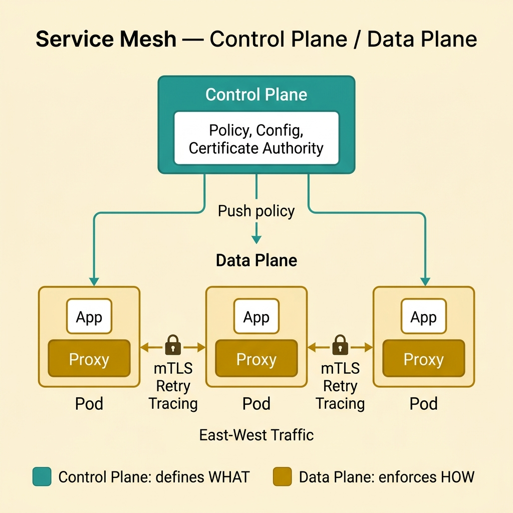
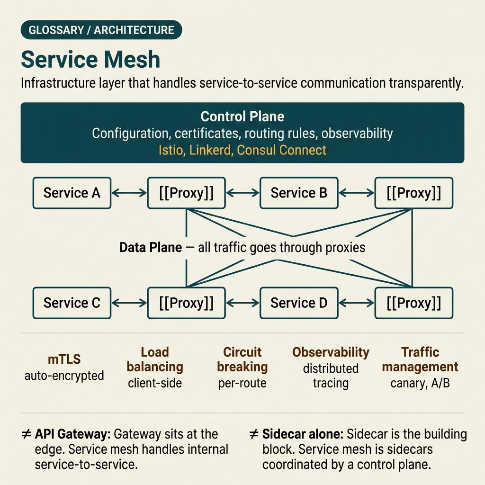

<!-- tags: glossary, reference, system-design-architecture, service-mesh -->
# Service Mesh

> An infrastructure layer that controls service-to-service communication, typically handling mTLS, retry, load balancing, and observability at cluster-wide scale.

| Aspect | Detail |
| --- | --- |
| **Concept** | An infrastructure layer that controls service-to-service communication, typically handling mTLS, retry, load balancing, and observability at cluster-wide scale. |
| **Audience** | Platform engineer, architect, service-to-service networking reviewer |
| **Primary style** | Glossary term |
| **Entry point** | Use when the number of services is large enough that network policy, mTLS, and telemetry are no longer feasible to implement manually in each individual service. |

📅 Created: 2026-03-30 · 🔄 Updated: 2026-04-04 · ⏱️ 10 min read

---

## 1. DEFINE

Picture this: when the system has only a few services, each service implementing its own retry, TLS, or tracing is still manageable. But as the number of services grows, network policy starts to drift: service A enables mTLS, service B does not; service C retries too aggressively; service D does not emit trace headers correctly. Service Mesh appears at the point where service-to-service behavior needs to be managed as shared infrastructure rather than libraries scattered across individual apps. That is the boundary of service mesh.

**Service Mesh** is an infrastructure layer that controls service-to-service communication, typically handling mTLS, retry, load balancing, and observability at cluster-wide scale.

| Variant | Description |
| --- | --- |
| Sidecar-based mesh | Each workload has a proxy sidecar; the control plane pushes policy down. |
| Ambient or sidecarless mesh | Some implementations reduce per-pod sidecars and move part of the data plane to another layer. |
| Security-first mesh | Focus is on mTLS, identity, and policy enforcement. |
| Traffic-management-first mesh | Focus is on routing, canary, retry, timeout, and observability. |

| Approach | Time | Space | When to choose |
| --- | --- | --- | --- |
| Library-based networking | O(in-process) | O(app complexity) | When service count is low and policy is still simple. |
| Service mesh rollout | O(proxy hop + control sync) | O(data plane + control plane) | When network policy needs standardization at scale. |
| Partial mesh adoption | O(scoped rollout) | O(mixed infra state) | When only a few namespaces/workloads need mesh initially. |
| Mesh + platform guardrails | O(policy evaluation) | O(policy and telemetry state) | When managing standardized mTLS/traffic at org scale. |

Core insight:

> Service Mesh is not "more proxies." It is the shift of service-to-service policy from application logic to a more centrally managed infrastructure layer.

### 1.1 Invariants & Failure Modes

- Critical network policies like mTLS, retry, and timeout must have an owner and standardized defaults.
- Both data plane and control plane are production dependencies; a mesh incident can affect the entire cluster if rollout is poor.
- The most common mistake is introducing mesh just to "be modern," when the service count is not large enough or the team lacks the operational maturity to run it.

---

## 2. CONTEXT

**Who uses it**: Platform engineer, architect, service-to-service networking reviewer

**When**: Use when the number of services is large enough that network policy, mTLS, and telemetry are no longer feasible to implement manually in each individual service.

**Purpose**: Service Mesh is not "more proxies." It is the shift of service-to-service policy from application logic to a more centrally managed infrastructure layer.

**In the ecosystem**:
- Service mesh differs from the sidecar pattern; sidecar is a deployment unit, mesh is a model for orchestrating network policy at large scale.
- Service mesh does not replace API gateway; gateway handles edge traffic, mesh handles east-west traffic between services.
- Mesh is not free; it adds data plane hops, control plane operations, and a new surface area for debugging.

---

Network policy drift is clear. But what does mesh look like when the team is not ready to operate it, when rollout blast radius is too wide, and when ownership between platform and app teams is still fuzzy?

## 3. EXAMPLES

Service mesh surfaces most clearly when 50 services each implement retry their own way, when mTLS is enabled sporadically making incidents hard to debug, or when a mesh rollout causes a latency spike across the entire cluster. The examples below place this term at each of those moments.

### Example 1: Basic — Standardize mTLS, retry, and tracing for east-west traffic

> **Goal**: Do not let each service implement network policy in its own way.
> **Approach**: Use mesh to apply the same baseline policy for service-to-service communication.
> **Example**: All internal traffic gets mTLS and trace propagation by default.
> **Complexity**: Basic

```yaml
mesh_baseline:
  mtls: enabled
  trace_propagation: enabled
  default_retry_policy: standardized
```

**Why?** When network policy is scattered across individual codebases, drift is almost guaranteed. Mesh centralizes this baseline so service teams do not have to reinvent it differently in each repo.

**Takeaway**: Basic mesh value is standardizing east-west traffic behavior at scale.

### Example 2: Intermediate — Compare mesh with sidecar or library for the right problem size

> **Goal**: Do not jump to mesh when the problem is actually just a few sidecars or library helpers.
> **Approach**: Evaluate service count, degree of policy drift, and need for centralized governance.
> **Example**: 6 internal services may not yet need mesh; 120 services across multiple teams with mTLS drift very likely do.
> **Complexity**: Intermediate



*Figure: Mesh is a governance model — control plane distributes policy, data plane enforces it per workload. Understand this split before adopting.*

```yaml
mesh_readiness:
  service_count: high
  policy_drift: observable
  governance_need: centralized
```

**Why?** Mesh solves a governance problem at scale. If scale or policy drift is not large enough, the cost of data plane and control plane may exceed the benefit. Choosing mesh at the right time matters as much as choosing the right product.

**Takeaway**: Intermediate mesh decision is looking at the actual problem size — not chasing tool hype.

### Example 3: Advanced — Use mesh for traffic shaping but keep clear ownership between platform and app teams

> **Goal**: Do not let app teams lose visibility or be unexpectedly affected by platform policies.
> **Approach**: Clearly separate which policies are platform defaults and which are app-team opt-in or controlled overrides.
> **Example**: Platform sets mTLS as mandatory; app teams can configure canary routes and retry budgets within permitted guardrails.
> **Complexity**: Advanced

```yaml
mesh_ownership:
  platform_defaults: [mtls, telemetry, baseline_timeout]
  app_overrides: [canary_route, retry_budget]
  guardrails: explicit
```

**Why?** Mesh increases control at the platform layer, but if ownership is fuzzy, app teams are easily surprised by policies outside their code. A good mesh must simultaneously standardize the baseline and maintain local accountability.

**Takeaway**: Advanced mesh is a clear governance model between the platform team and service owners.

### Example 4: Expert — Roll out mesh in controlled scope to avoid cluster-wide blast radius

> **Goal**: Do not enable mesh for the entire cluster at once and then face a wide-reaching incident.
> **Approach**: Roll out by namespace or service class, with SLO and a rollback plan for data plane and control plane.
> **Example**: Start with a non-critical internal tools namespace, measure latency tax and mTLS handshake issues before expanding.
> **Complexity**: Expert

```yaml
mesh_rollout:
  phase_1: internal_tools_namespace
  phase_2: customer_facing_noncritical
  metrics: [latency_p95, handshake_errors, proxy_cpu]
  rollback_plan: namespace_disable
```

**Why?** Mesh is infrastructure that touches every call path between services. If rollout has no phases and no rollback plan, a single config or proxy regression can become a cluster-wide incident. Incremental rollout is what turns mesh from a power tool into a safely operable one.

**Takeaway**: Expert mesh adoption is staged rollout with clear blast-radius control.

---

## 4. COMPARE




*Figure: Position of service mesh among sidecar, API gateway, library-based networking, and other models.*

Mesh sounds like "expanded sidecar." Not quite: sidecar is a deployment unit, mesh is a governance model for service-to-service policy at cluster-wide scale.

### Level 1

```text
service A <-> mesh policy/data plane <-> service B
  -> mTLS, retry, telemetry applied consistently
```

*Figure: Level 1 shows mesh placing a shared policy layer between service-to-service calls.*

### Level 2

```text
control plane defines policy
  -> data plane enforces per workload
  -> traffic behavior becomes centrally observable and tunable
```

*Figure: Level 2 emphasizes mesh as the combination of policy distribution and runtime enforcement at scale.*

### Easy to confuse or cross the boundary

| # | Severity | Mistake | Consequence | Fix |
| --- | --- | --- | --- | --- |
| 1 | 🔴 Fatal | Introducing mesh when the team lacks operational maturity | Control plane/data plane becomes a new failure point | Only adopt when ops ownership is clear. |
| 2 | 🟡 Common | Confusing mesh with API gateway or a standalone sidecar | Design gets wrong boundary and ownership | Clearly distinguish edge traffic from east-west traffic. |
| 3 | 🟡 Common | Platform and app ownership is fuzzy | App teams struggle to debug runtime behavior | Set guardrails and override rights clearly. |
| 4 | 🟡 Common | Rolling out mesh cluster-wide at once | Blast radius too large when regression occurs | Roll out in phases with metrics and rollback. |
| 5 | 🔵 Minor | Not measuring proxy tax on latency/CPU | Unknown cost of running mesh | Track data plane cost as a first-class metric. |

### Quick scan

| If you encounter | What to do |
| --- | --- |
| East-west traffic policy drifting across many services | Consider service mesh |
| Only a few services and policy is still simple | May not need mesh yet |
| Mesh rollout too broad too early | Switch to phased rollout |
| Unknown mesh cost | Measure proxy tax and control-plane blast radius |

---

## 5. REF

| Resource | Type | Link | Notes |
| --- | --- | --- | --- |
| Istio Architecture | Official | https://istio.io/latest/docs/ops/deployment/architecture/ | Overview of control plane and data plane. |
| Linkerd Docs | Official | https://linkerd.io/2/overview/ | A different perspective on mesh and operational simplicity. |
| Service Mesh Interface | Reference | https://smi-spec.io/ | Useful for thinking about policy portability and common concepts. |

---

## 6. RECOMMEND

Mesh solves the problem of "east-west policy can no longer be manually implemented in each service." The next question: how do sidecar-level concerns differ from mesh-level concerns, what handles edge traffic, and how is security posture managed?

| Expand to | When | Why | File/Link |
| --- | --- | --- | --- |
| Local runtime companion | When distinguishing mesh from sidecar deployment unit | Sidecar Pattern is the preceding article | [Sidecar Pattern](./11-sidecar-pattern.md) |
| Edge entry policy | When the traffic concern is at the client-to-service boundary | API Gateway is the next article | [API Gateway](./13-api-gateway.md) |
| Security posture | When mesh is primarily used for mTLS/policy | See Zero Trust in the security topic | [Security & Access Control](../security-access-control/README.md) |

Back to that cluster of services at the beginning — where service A had mTLS enabled, service B did not, and service C retried too aggressively. Now you know: that was not individual teams' fault. It was a sign that network policy needed a shared infrastructure layer — and mesh is that layer, as long as the team is ready to operate it.

**Links**: [← Previous](./11-sidecar-pattern.md) · [→ Next](./13-api-gateway.md)
