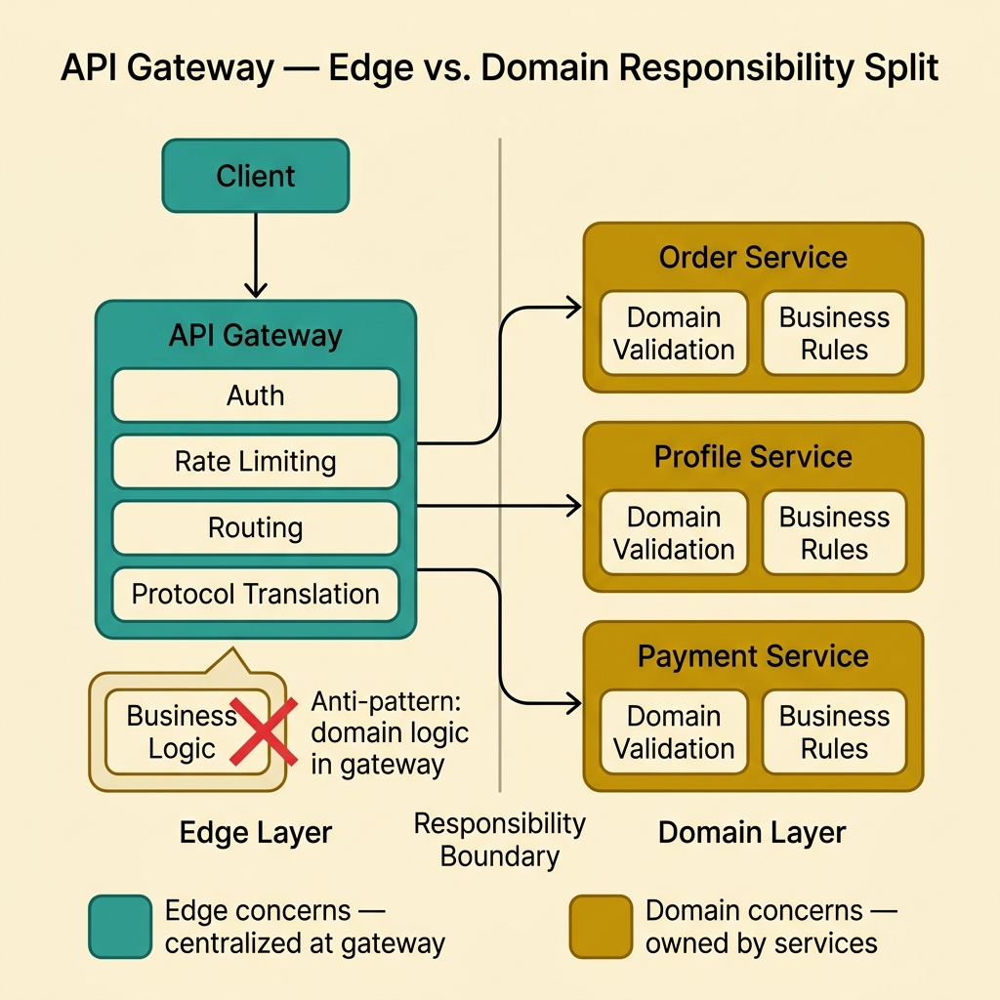
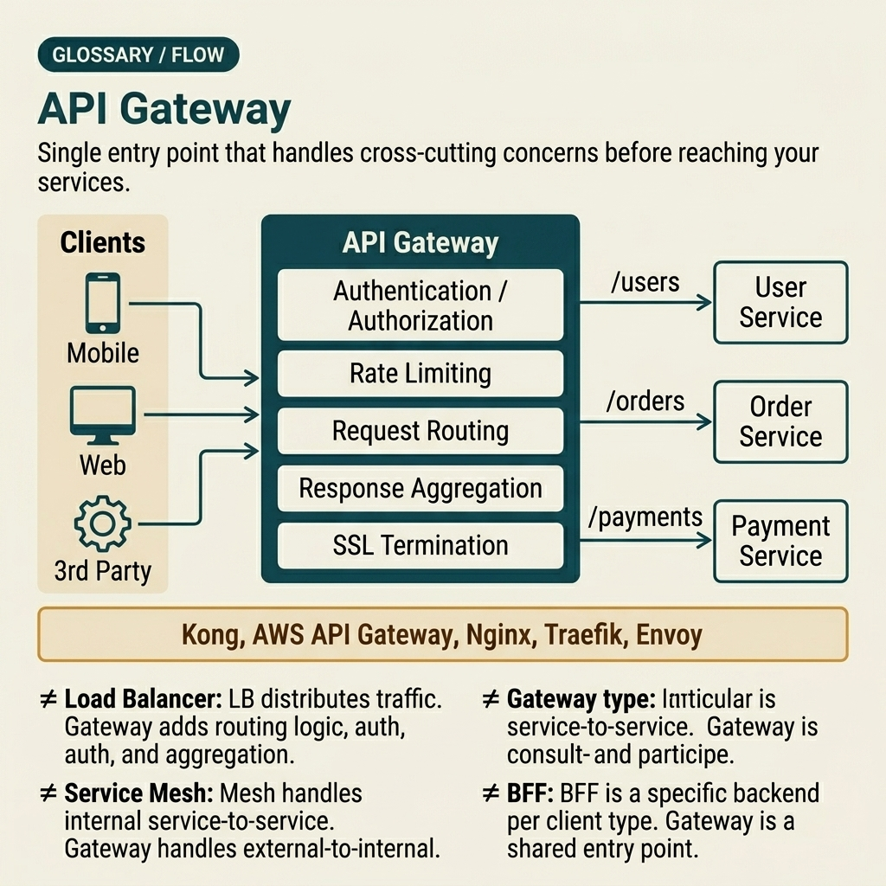

<!-- tags: glossary, reference, system-design-architecture, api-gateway -->
# API Gateway

> The unified entry point for a system, responsible for routing, auth, throttling, and cross-cutting concerns at the system edge.

| Aspect | Detail |
| --- | --- |
| **Concept** | The unified entry point for a system, responsible for routing, auth, throttling, and cross-cutting concerns at the system edge. |
| **Audience** | Backend engineer, platform engineer, edge architecture reviewer |
| **Primary style** | Glossary term |
| **Entry point** | Use when client-facing traffic needs a shared edge boundary for auth, routing, rate limiting, observability, or protocol translation. |

📅 Created: 2026-03-30 · 🔄 Updated: 2026-04-04 · ⏱️ 10 min read

---

## 1. DEFINE

Picture this: if every client has to know about dozens of internal services directly — handling auth, rate limits, and endpoint mapping on its own — the system edge quickly becomes a scattered set of contracts that are very hard to maintain. API Gateway appears here as a unified edge boundary: the point where clients enter, where routing and cross-cutting policy are applied before traffic goes deeper inside. That is the boundary of API gateway.

**API Gateway** is the unified entry point for a system, responsible for routing, auth, throttling, and cross-cutting concerns at the system edge.

| Variant | Description |
| --- | --- |
| Edge gateway | The primary entry point for external clients. |
| Internal gateway | Boundary between domain teams or internal consumers. |
| BFF-style gateway | A gateway or facade optimized specifically for a particular client type. |
| Protocol translation gateway | Converts HTTP to gRPC, REST to event path, or vice versa. |

| Approach | Time | Space | When to choose |
| --- | --- | --- | --- |
| Direct client-to-service | O(direct routing) | O(client complexity) | When the system is very small and cross-cutting concerns are minimal. |
| Single API gateway | O(gateway hop) | O(edge policy state) | When a shared edge boundary is needed for auth, routing, and throttling. |
| Domain gateways | O(gateway hop + domain split) | O(multiple gateway configs) | When a single gateway starts becoming an organizational or technical bottleneck. |
| Gateway + BFF split | O(edge + client facade hop) | O(edge + per-client facade) | When multiple client types have very different contract needs. |

Core insight:

> API Gateway is not just a place "traffic passes through for convenience." It is the boundary at the system edge where cross-cutting policy is centralized and client complexity is absorbed with intention.

### 1.1 Invariants & Failure Modes

- Gateway needs clear ownership for policy, auth, and observability.
- If too much aggregation or business logic creeps into the gateway, it becomes a technical and organizational bottleneck.
- The most common mistake is "everything goes through the gateway" but nobody clearly decides which policies should live at the edge and which should live in the service.

---

## 2. CONTEXT

**Who uses it**: Backend engineer, platform engineer, edge architecture reviewer

**When**: Use when client-facing traffic needs a shared edge boundary for auth, routing, rate limiting, observability, or protocol translation.

**Purpose**: API Gateway is not just a place "traffic passes through for convenience." It is the boundary at the system edge where cross-cutting policy is centralized and client complexity is absorbed with intention.

**In the ecosystem**:
- API gateway differs from service mesh; gateway handles north-south traffic, mesh handles east-west traffic.
- API gateway differs from a pure load balancer; gateway also handles auth, throttling, protocol translation, or aggregation.
- Gateway should not become the new business logic monolith; deep domain logic still belongs in the appropriate service.

---

A unified edge boundary is clear. But which policies should live at the gateway, which at the service, and when does a single gateway start bloating into a bottleneck?

## 3. EXAMPLES

API gateway surfaces most clearly when clients have to know about dozens of internal endpoints directly, when auth logic is copied across every service, or when a single throttling config error at the edge shakes the entire system. The examples below place the pattern in exactly those situations.

### Example 1: Basic — Centralize auth, routing, and throttling at the edge boundary

> **Goal**: Do not let each service repeat the same edge concern logic.
> **Approach**: Use a gateway as the unified entry point for client-facing traffic.
> **Example**: Mobile app calls `api.example.com`, gateway handles JWT + routes the request to order or profile service.
> **Complexity**: Basic

```yaml
gateway_basic:
  entrypoint: api.example.com
  edge_policies: [auth, routing, throttling]
  downstreams: [order_service, profile_service]
```

**Why?** When edge concerns are scattered across individual services, policy drift and duplication are almost guaranteed. Gateway allows standardizing the entry boundary and reducing the complexity that clients have to bear.

**Takeaway**: Basic gateway is a unified entry point to absorb cross-cutting concerns at the system edge.

### Example 2: Intermediate — Separate which policies belong at the gateway vs. the service

> **Goal**: Do not turn the gateway into a dumping ground for all logic just because "all traffic goes through here."
> **Approach**: Keep auth, routing, throttling, and coarse aggregation at the edge; leave deep domain rules to the service.
> **Example**: Gateway authenticates the token and routes the request; the rule "whether an order can be cancelled" stays in the order service.
> **Complexity**: Intermediate



*Figure: The gateway absorbs cross-cutting edge concerns; domain logic stays where it belongs — in the service that owns it.*

```yaml
edge_boundary:
  gateway_responsibility: [authn, rate_limit, routing]
  service_responsibility: [domain_validation, business_rules]
```

**Why?** Edge concerns and domain concerns differ in lifecycle and ownership. If business rules are pulled into the gateway, the system gains a new monolith at the edge — hard to evolve and easy to create cross-team coupling.

**Takeaway**: Intermediate gateway design is boundary discipline: edge handles edge, domain handles domain.

### Example 3: Advanced — Choose single gateway, domain gateways, or gateway + BFF by client landscape complexity

> **Goal**: Do not maintain a single gateway when the client landscape and team topology have already changed.
> **Approach**: Evaluate client count, aggregation needs, and contract ownership.
> **Example**: Web admin and mobile consumer may need different BFFs instead of going through one massive edge contract.
> **Complexity**: Advanced

```yaml
edge_topology:
  shared_gateway: api.example.com
  mobile_bff: mobile-api.example.com
  admin_bff: admin-api.example.com
```

**Why?** A single gateway makes sense in the early stages, but when multiple clients have very different needs, forcing everything through the same contract bloats the edge layer and makes it hard to change. Splitting topology at the right time helps the edge boundary stay clear instead of becoming a bottleneck.

**Takeaway**: Advanced gateway architecture is choosing the right edge topology for the client landscape and team ownership.

### Example 4: Expert — Operate the gateway as a critical edge system with rate-limit policy, incident isolation, and deep observability

> **Goal**: Do not let the gateway become a single point of pain during traffic spikes or config errors.
> **Approach**: Treat gateway as a tier-0 edge system: policy versioning, canary config, per-route metrics, and fast rollback.
> **Example**: A bad throttling rule only affects `/search`, and must not choke the entire API domain.
> **Complexity**: Expert

```yaml
gateway_ops:
  config_rollout: canary
  metrics_scope: per_route
  rollback_mode: fast_policy_revert
  isolate_incident_to: affected_routes_only
```

**Why?** The gateway sits at the edge of all traffic, so even a small config error can become a wide-reaching incident. Operating a gateway must treat policy like production code: roll out gradually, measure per-route, roll back fast, and limit blast radius.

**Takeaway**: Expert API gateway is an edge control plane with operational discipline equivalent to a tier-0 service.

---

## 4. COMPARE




*Figure: Position of API gateway among load balancer, service mesh, BFF, and other edge concerns.*

Gateway sounds like "a reverse proxy with extra config." Not quite: gateway is where cross-cutting policy is centralized with intention — not merely where traffic passes through.

### Level 1

```text
client
  -> API gateway
  -> routed to appropriate backend services
```

*Figure: Level 1 shows gateway as the shared edge entry point before traffic is routed to backends.*

### Level 2

```text
auth + throttling + routing at edge
  -> optional aggregation or translation
  -> internal services remain focused on domain logic
```

*Figure: Level 2 highlights how gateway absorbs cross-cutting edge concerns so backends do not have to repeat them everywhere.*

### Easy to confuse or cross the boundary

| # | Severity | Mistake | Consequence | Fix |
| --- | --- | --- | --- | --- |
| 1 | 🔴 Fatal | Stuffing deep business logic into the gateway | Gateway becomes new monolith and organizational bottleneck | Keep domain rules in the service. |
| 2 | 🟡 Common | Not distinguishing gateway from mesh or load balancer | Policies placed at the wrong layer | Clearly separate north-south, east-west, and pure L4 concerns. |
| 3 | 🟡 Common | A single gateway bloating as clients grow | Edge contract becomes hard to evolve | Consider domain gateways or BFF split. |
| 4 | 🟡 Common | Rolling out gateway config without canary/rollback | A single policy error affects everyone | Treat gateway config as production code. |
| 5 | 🔵 Minor | Only measuring aggregate gateway metrics | Cannot tell which route is broken | Track per-route latency, error rate, and throttle hits. |

### Quick scan

| If you encounter | What to do |
| --- | --- |
| Clients must know too many backends directly | Add an API gateway |
| Gateway starts containing deep business logic | Pull logic back to the service |
| Multiple clients have very different needs | Consider BFF or domain gateways |
| A gateway config error shakes the entire system | Add canary + per-route rollback |

---

## 5. REF

| Resource | Type | Link | Notes |
| --- | --- | --- | --- |
| Azure Architecture Center — Gateway Routing | Reference | https://learn.microsoft.com/azure/architecture/patterns/gateway-routing | Solid reference for API gateway routing patterns. |
| Microservices.io API Gateway | Reference | https://microservices.io/patterns/apigateway.html | Pattern context and accompanying trade-offs. |
| Kong Gateway Docs | Official | https://docs.konghq.com/gateway/latest/ | Practical example for policies, plugins, and edge config rollout. |

---

## 6. RECOMMEND

Gateway solves the problem of "the system edge is a scattered set of contracts." The next question: when the client landscape diverges strongly, should you split into BFFs, and what policy controls traffic bursts?

| Expand to | When | Why | File/Link |
| --- | --- | --- | --- |
| Client-specific facade | When contracts for each client start diverging strongly | BFF is the next article | [Backend for Frontend](./14-backend-for-frontend.md) |
| East-west policy | When the concern is between services, not at the edge | Service Mesh is the preceding article | [Service Mesh](./12-service-mesh.md) |
| Edge traffic shaping | When the gateway needs to protect against traffic bursts | Throttling is the related policy article | [Throttling](./16-throttling.md) |

Back to that system edge at the beginning — where clients had to know dozens of services directly, handle auth themselves, handle rate limits themselves. Now you know: each service does not need to own that part. What is needed is a unified edge boundary — smart enough to absorb cross-cutting concerns, disciplined enough not to stuff business logic in.

**Links**: [← Previous](./12-service-mesh.md) · [→ Next](./14-backend-for-frontend.md)
