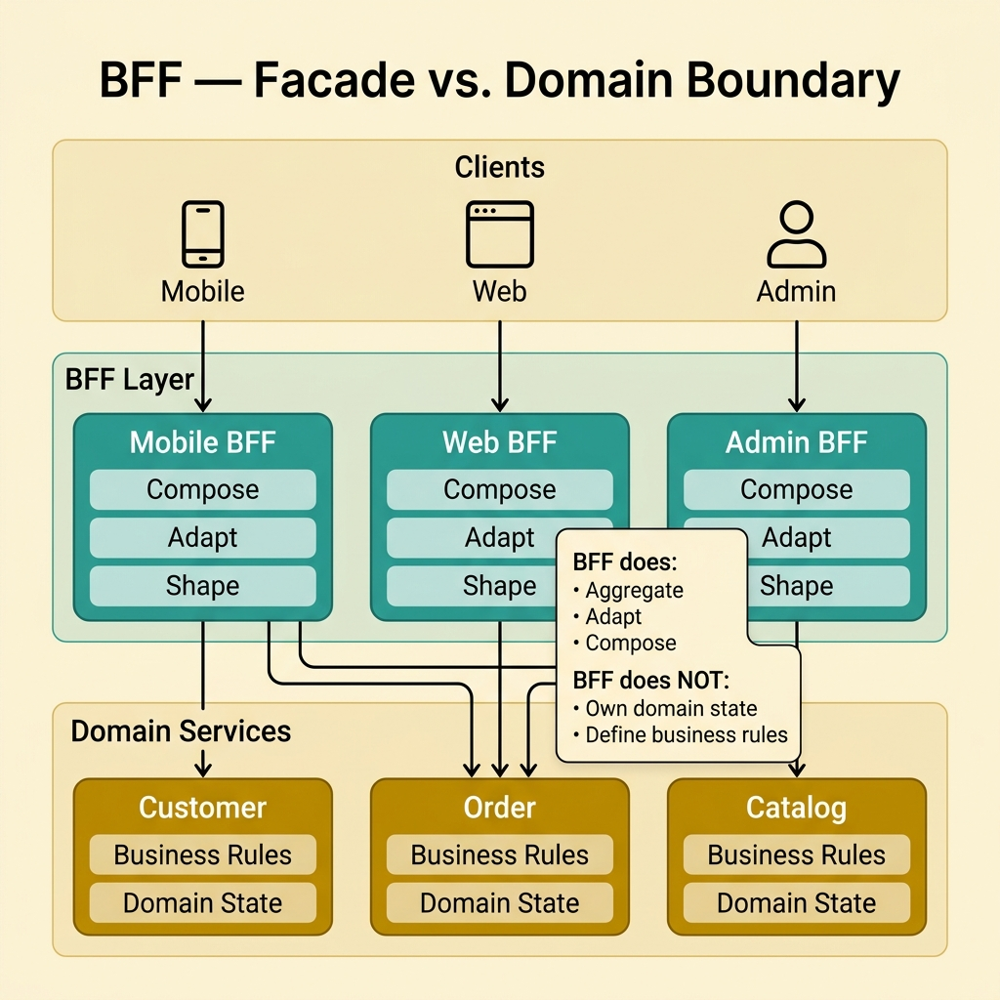
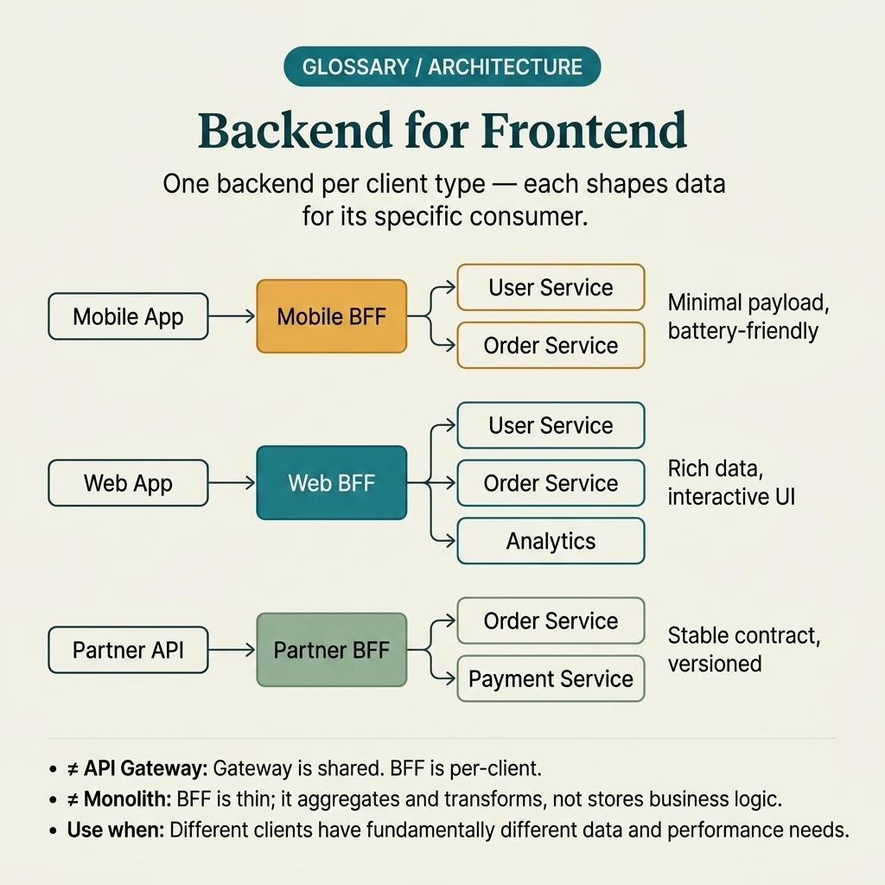

<!-- tags: glossary, reference, system-design-architecture, backend-for-frontend -->
# Backend for Frontend

> A design approach where each client type gets its own gateway or facade that returns data shapes and workflows tailored to that specific experience.

| Aspect | Detail |
| --- | --- |
| **Concept** | A design approach where each client type gets its own gateway or facade that returns data shapes and workflows tailored to that specific experience. |
| **Audience** | Backend engineer, architect, frontend-platform reviewer |
| **Primary style** | Glossary term |
| **Entry point** | Use when web, mobile, admin, or partner clients have contract, aggregation, and release cadence needs different enough that a shared API edge starts becoming unwieldy. |

📅 Created: 2026-03-30 · 🔄 Updated: 2026-04-04 · ⏱️ 10 min read

---

## 1. DEFINE

Picture this: a shared API gateway may work well enough in the early stages. But then mobile needs ultra-compact payloads, web needs pre-aggregated data to avoid waterfalls, and the admin portal needs an entirely different workflow. A shared edge contract starts dragging every client into the same rate of change. Backend for Frontend emerges to separate "serving the client experience" from "serving the shared domain," allowing each client to have its own optimized facade without forcing backend domains to deform to accommodate every UI need. That is the boundary of BFF.

**Backend for Frontend** is a design approach where each client type gets its own gateway or facade that returns data shapes and workflows tailored to that specific experience.

| Variant | Description |
| --- | --- |
| Mobile BFF | Optimizes for small payloads, fewer round trips, and mobile network constraints. |
| Web BFF | Aggregates data for SSR/SPA flows, reducing client-side waterfalls. |
| Admin BFF | Centralizes admin workflows, reporting, or moderation. |
| Partner/client-specific facade | Provides a dedicated contract for integration partners or external client classes. |

| Approach | Time | Space | When to choose |
| --- | --- | --- | --- |
| Single shared gateway | O(shared edge hop) | O(shared edge complexity) | When client needs are still fairly similar. |
| BFF per client type | O(edge + per-client facade hop) | O(per-client backend layer) | When mobile/web/admin clearly diverge in contract and cadence. |
| GraphQL federation or composition | O(query composition) | O(graph layer state) | When clients need flexible data assembly rather than fixed endpoints. |
| Hybrid gateway + BFF | O(shared edge + client facade) | O(shared policy + client adapters) | When shared policy is still needed at the edge but client experiences need tailoring. |

Core insight:

> BFF does not exist to "add one more layer for fun." It exists to absorb the specific needs of each client without letting domain APIs or the shared gateway bloat in an uncontrollable way.

### 1.1 Invariants & Failure Modes

- Each BFF needs a clear owner tied to the client experience it serves.
- A BFF's contract should reflect actual client needs — not mechanically mirror every domain service behind it.
- The most common mistake is creating a BFF for every team even though client needs have not diverged enough, leading to pointless duplication.

---

## 2. CONTEXT

**Who uses it**: Backend engineer, architect, frontend-platform reviewer

**When**: Use when web, mobile, admin, or partner clients have contract, aggregation, and release cadence needs different enough that a shared API edge starts becoming unwieldy.

**Purpose**: BFF does not exist to "add one more layer for fun." It exists to absorb the specific needs of each client without letting domain APIs or the shared gateway bloat in an uncontrollable way.

**In the ecosystem**:
- BFF differs from a pure API gateway; gateway handles shared edge policy, BFF optimizes the contract for a specific client type.
- BFF should not contain deep domain logic; it exists to compose, adapt, and shape data for the client.
- Not every system needs a BFF; if clients are still similar enough, a shared API may still be sufficient.

---

Separating a facade for each client type sounds logical. But when is it truly needed, when is a shared gateway still enough, and who owns the BFF when mobile and web start swimming apart?

## 3. EXAMPLES

BFF surfaces most clearly when mobile needs a 3-field payload but the API returns 30, when an admin dashboard needs entirely different aggregation from the consumer app, or when a shared contract starts slowing everyone down. The examples below place the pattern in exactly those situations.

### Example 1: Basic — Split contracts for mobile and web when payload needs clearly differ

> **Goal**: Do not force every client to use the same response shape when constraints are very different.
> **Approach**: Create a separate BFF for each client type with distinct payload and workflow needs.
> **Example**: Mobile home screen needs a compact payload; web dashboard needs aggregated widgets.
> **Complexity**: Basic

```yaml
bff_split:
  mobile_bff: compact_payloads
  web_bff: aggregated_dashboard_data
  shared_domain_services: true
```

**Why?** When a shared API must serve both mobile and web, it usually ends up either too heavy for mobile or too sparse for web. BFF allows optimizing the contract at exactly the client-facing layer without breaking domain boundaries underneath.

**Takeaway**: Basic BFF is used when client types differ enough that a shared contract starts causing clear friction.

### Example 2: Intermediate — Use BFF to reduce client waterfalls without pulling domain logic to the wrong place

> **Goal**: Reduce round trips from the client without turning the BFF into a new business monolith.
> **Approach**: Let BFF handle aggregation, orchestration, and response shaping; keep core domain rules in the service.
> **Example**: BFF combines profile, orders, and recommendations for the homepage, but the loyalty tier calculation stays in the customer service.
> **Complexity**: Intermediate



*Figure: BFF composes and shapes data for the client experience; core business rules stay in domain services where they belong.*

```yaml
bff_responsibility:
  do: [aggregate, adapt, compose]
  do_not: [core_business_rules, ownership_of_domain_state]
```

**Why?** The biggest value of BFF is reducing client complexity. But if aggregation slides into domain logic, you have only moved the monolith from gateway into BFF. Boundary discipline is what keeps this pattern useful.

**Takeaway**: Intermediate BFF is a facade for the client experience — not a place to redefine the domain.

### Example 3: Advanced — Organize ownership and release cadence by client experience

> **Goal**: Do not let a shared edge layer lock mobile, web, and admin release cadences into the same backlog.
> **Approach**: Each BFF comes with its own owner, SLO, and deployment cadence suited to the client it serves.
> **Example**: Mobile BFF releases fast following app experiments; admin BFF releases slower but is more stable and audit-heavy.
> **Complexity**: Advanced

```yaml
bff_ownership:
  mobile_bff:
    owner: mobile_platform_team
    cadence: fast
  admin_bff:
    owner: admin_platform_team
    cadence: controlled
```

**Why?** BFF is usually created because experiences diverge, so ownership and release cadence should diverge accordingly. If everything is still forced through the same pipeline and decision lane, the pattern loses most of its organizational value.

**Takeaway**: Advanced BFF separates not just the contract, but also ownership by client experience.

### Example 4: Expert — Control BFF sprawl to avoid every client getting a backend that duplicates the others

> **Goal**: Do not let BFF count grow with every team or every small feature.
> **Approach**: Only split BFF when client divergence is large enough; measure duplication and keep shared policies at the common layer.
> **Example**: Two web apps with nearly identical needs can share a web BFF instead of splitting into yet another facade.
> **Complexity**: Expert

```yaml
bff_governance:
  create_new_bff_when: major_contract_divergence
  measure: duplication_and_release_coupling
  keep_shared: [auth_policy, edge_observability]
```

**Why?** BFF solves real divergence — it is not a license to build a separate backend for every interface. Without creation rules, BFFs proliferate into a forest of overlapping facades that cost effort and are hard to maintain.

**Takeaway**: Expert BFF is client-specific where needed, shared where possible.

---

## 4. COMPARE




*Figure: Position of BFF among API gateway, GraphQL layer, and other edge facades.*

BFF sounds like "creating one more API layer." Not quite: BFF is a facade owned by specific client teams — not a shared gateway for all clients.

### Level 1

```text
mobile client -> mobile BFF -> domain services
web client    -> web BFF    -> domain services
```

*Figure: Level 1 shows BFF splitting edge contracts by client experience instead of forcing every client through the same facade.*

### Level 2

```text
shared edge policy at gateway
  -> route by client type
  -> each BFF aggregates and shapes data differently
  -> domain services stay focused on core business logic
```

*Figure: Level 2 highlights how BFF typically sits behind shared edge policy but before domain services to optimize the experience for each client type.*

### Easy to confuse or cross the boundary

| # | Severity | Mistake | Consequence | Fix |
| --- | --- | --- | --- | --- |
| 1 | 🔴 Fatal | Stuffing deep domain logic into BFF | BFF becomes a new monolith that is hard to maintain | Keep core business rules in domain services. |
| 2 | 🟡 Common | Creating BFF when client needs have not diverged enough | Pointless duplication increases | Only split when contract/release cadence truly differs. |
| 3 | 🟡 Common | No clear owner for each BFF | Release and incident handling become vague | Tie ownership to client experience. |
| 4 | 🟡 Common | Shared edge policy copied into every BFF | Policy drift and maintenance cost increase | Keep auth/observability at the shared edge layer. |
| 5 | 🔵 Minor | Using BFF as just a new name for API gateway | Boundary between gateway and client facade is blurred | Write out the role of each layer explicitly. |

### Quick scan

| If you encounter | What to do |
| --- | --- |
| Mobile and web need very different contracts | Consider BFF |
| BFF starts containing deep domain rules | Pull logic back to the service |
| Too many near-identical BFFs | Add governance for creation |
| Client experiences diverge but release cadence is still locked together | Split ownership by BFF |

---

## 5. REF

| Resource | Type | Link | Notes |
| --- | --- | --- | --- |
| Sam Newman — Backend for Frontend Pattern | Reference | https://samnewman.io/patterns/architectural/bff/ | Foundational article explaining when BFF should be used. |
| Microsoft Azure — Backends for Frontends pattern | Reference | https://learn.microsoft.com/azure/architecture/patterns/backends-for-frontends | Enterprise perspective and organizational trade-offs. |
| Microservices.io API Gateway | Reference | https://microservices.io/patterns/apigateway.html | Useful for comparing BFF with a shared gateway. |

---

## 6. RECOMMEND

BFF solves the problem of "a shared contract cannot serve every client type well." The next question: what handles the shared edge routing, how is per-client throttling managed, and what about downstream pressure when fan-out increases?

| Expand to | When | Why | File/Link |
| --- | --- | --- | --- |
| Shared edge boundary | When comparing BFF with the basic gateway | API Gateway is the preceding article | [API Gateway](./13-api-gateway.md) |
| Client traffic shaping | When client-specific paths need their own throttling | Throttling is a commonly paired policy | [Throttling](./16-throttling.md) |
| Async pressure control | When client fan-out creates queues/backlog at downstream | Backpressure is the next article | [Backpressure](./15-backpressure.md) |

Back to that shared API at the beginning — where mobile needed 3 fields but the API returned 30, where admin needed entirely different aggregation from the consumer. Now you know: the API was not wrong. The client landscape had simply diverged far enough to need separate facades. One BFF for mobile, one for admin — close enough to optimize, separate enough to evolve independently.

**Links**: [← Previous](./13-api-gateway.md) · [→ Next](./15-backpressure.md)
