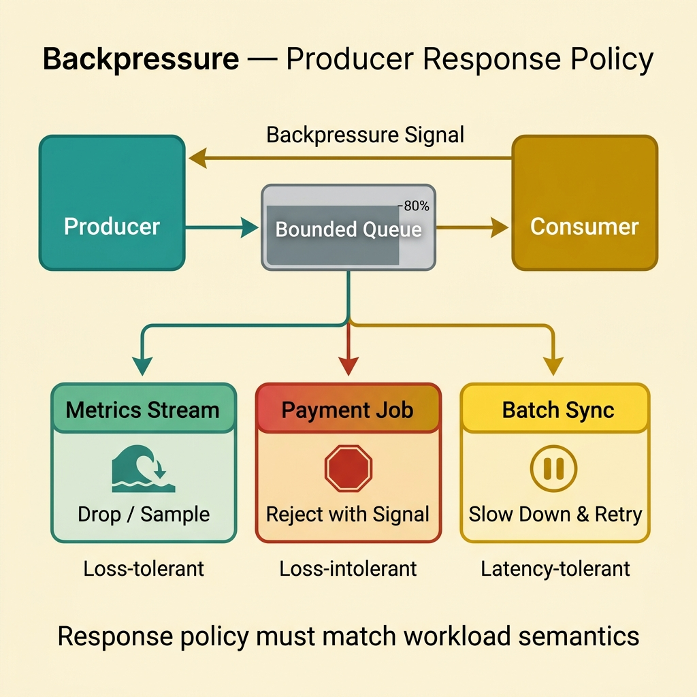
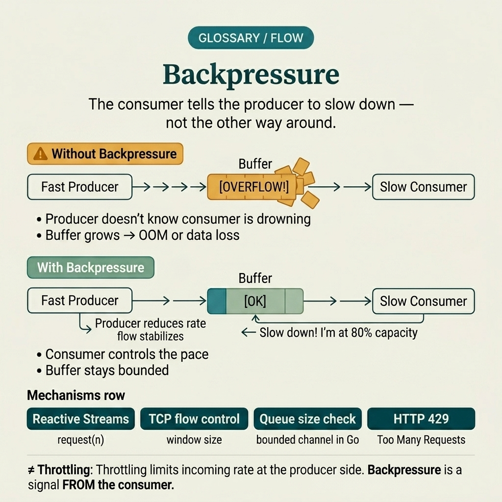

<!-- tags: glossary, reference, system-design-architecture, backpressure -->
# Backpressure

> A mechanism for the consumer or downstream to signal the producer to limit its rate when it cannot keep up.

| Aspect | Detail |
| --- | --- |
| **Concept** | A mechanism for the consumer or downstream to signal the producer to limit its rate when it cannot keep up. |
| **Audience** | Backend engineer, platform engineer, streaming or queue reviewer |
| **Primary style** | Glossary term |
| **Entry point** | Use when the producer creates data or requests faster than the consumer, queue, or downstream can process. |

📅 Created: 2026-03-30 · 🔄 Updated: 2026-04-04 · ⏱️ 10 min read

---

## 1. DEFINE

Picture this: a producer pushes events faster than the consumer can process. At first everything looks fine because the queue still has room. But the backlog grows, memory bloats, latency increases exponentially, and eventually the entire pipeline collapses because nobody forced the producer to slow down. Backpressure is the answer to that situation: the consumer or downstream must have a way to signal "slow down" — instead of letting overload silently accumulate. That is the boundary of backpressure.

**Backpressure** is a mechanism for the consumer or downstream to signal the producer to limit its rate when it cannot keep up.

| Variant | Description |
| --- | --- |
| Pull-based backpressure | Consumer only fetches more when it still has processing capacity. |
| Bounded queue backpressure | Queue has a limit; producer is blocked or rejected when full. |
| Rate-signaled backpressure | Consumer sends an explicit signal for the producer to slow down. |
| Credit-based flow control | Producer only sends when it still has credits/tokens from downstream. |

| Approach | Time | Space | When to choose |
| --- | --- | --- | --- |
| Unbounded buffering | O(enqueue) | O(unbounded backlog) | Only a temporary anti-pattern — not a sustainable solution. |
| Bounded queues | O(enqueue or reject) | O(fixed queue memory) | When a clear backlog limit is needed. |
| Pull/credit-based flow | O(signal exchange) | O(flow-control state) | When the stream or transport supports good coordination. |
| Backpressure + shedding | O(limit + reject policy) | O(queue + reject state) | When the system needs protection under extreme load. |

Core insight:

> Backpressure is not just "processing slower." It is a mechanism that makes the producer aware that the consumer has reached its limit and must adjust speed or accept rejection.

### 1.1 Invariants & Failure Modes

- Every buffer needs a clear limit or a strategy for when it fills.
- The producer must have a defined behavior when backpressured: block, slow down, retry with control, or reject.
- The most common mistake is calling every queue "backpressure" even though the producer receives no signal and is not limited at all when the consumer is slow.

---

## 2. CONTEXT

**Who uses it**: Backend engineer, platform engineer, streaming or queue reviewer

**When**: Use when the producer creates data or requests faster than the consumer, queue, or downstream can process.

**Purpose**: Backpressure is not just "processing slower." It is a mechanism that makes the producer aware that the consumer has reached its limit and must adjust speed or accept rejection.

**In the ecosystem**:
- Backpressure differs from throttling; throttling is a proactive limiting policy at the upstream/edge, while backpressure is a reaction to the actual processing capacity of downstream.
- Backpressure differs from a static rate limit; backpressure signals typically depend on runtime saturation.
- A queue only masks the problem in the short term; without backpressure, a queue merely delays the incident.

---

Bounded queues and rejection are one way. But when should you slow down, when should you reject, and how is the signal propagated backward through a multi-stage pipeline?

## 3. EXAMPLES

Backpressure surfaces most clearly when a queue grows endlessly without anyone knowing, when the consumer is slow but the producer keeps firing at full speed, or when OOM hits a worker that has been stuffed. The examples below place the pattern in exactly those moments.

### Example 1: Basic — Prevent infinite backlog with a bounded queue

> **Goal**: Do not let memory and latency grow unbounded when the consumer is slow.
> **Approach**: Use a queue with a limit, then block or reject the producer when full.
> **Example**: Job queue holds only 10,000 items; producer must slow down or fail fast when the queue is full.
> **Complexity**: Basic

```yaml
bounded_queue:
  max_items: 10000
  on_full: reject_or_block_producer
```

**Why?** Unbounded buffering only pushes the problem to the near future. Bounded queues force the system to face its actual processing capacity instead of silently accumulating backlog until collapse.

**Takeaway**: Basic backpressure starts by putting a real limit on the buffer.

### Example 2: Intermediate — Choose the right behavior when backpressure kicks in

> **Goal**: Do not just know the queue is full without knowing what the producer should do next.
> **Approach**: Define block, retry, slow down, or reject depending on the workload's semantics.
> **Example**: A metrics stream can drop samples; a payment job must reject intentionally and return an error.
> **Complexity**: Intermediate



*Figure: Different workloads tolerate loss, latency, and retry differently — the backpressure response must match each workload's semantics.*

```yaml
on_backpressure:
  metrics_stream: drop_or_sample
  payment_job: reject_with_signal
  batch_sync: slow_down_and_retry
```

**Why?** Backpressure is only useful when the producer knows how to respond. Each workload tolerates loss, latency, and retry differently, so the response policy must be rooted in business semantics rather than being one-size-fits-all.

**Takeaway**: Intermediate backpressure design is choosing the response policy appropriate for each workload.

### Example 3: Advanced — Combine backpressure with observability and admission control

> **Goal**: Do not let saturation be discovered only when the queue is about to burst.
> **Approach**: Monitor queue depth, lag, processing time, and cut admission early when saturation exceeds the threshold.
> **Example**: When queue lag exceeds 30s, the gateway starts shedding low-priority traffic before the queue fills completely.
> **Complexity**: Advanced

```yaml
backpressure_signals:
  queue_depth: monitored
  processing_lag: monitored
  admission_control: low_priority_shedding
```

**Why?** Only looking at "queue full" is already too late in many systems. Mature backpressure uses early saturation signals to reduce load before the system hits the wall.

**Takeaway**: Advanced backpressure is a feedback loop with metrics and admission control — not just a size-limited queue.

### Example 4: Expert — Design end-to-end flow control across multiple pipeline stages

> **Goal**: Do not let each stage handle overload independently, causing the bottleneck to shift around aimlessly.
> **Approach**: Propagate flow control signals across the entire pipeline or chain stages using credits, budgets, or coordinated limits.
> **Example**: Ingest, transform, and sink share a throughput budget so upstream does not exceed the final sink's capacity.
> **Complexity**: Expert

```yaml
pipeline_flow_control:
  stages: [ingest, transform, sink]
  shared_budget: 5000_events_per_second
  coordination: credit_based
```

**Why?** In a multi-stage pipeline, the real bottleneck is usually at the end of the chain. If each stage only protects itself, overload moves instead of disappearing. End-to-end flow control is what keeps the entire pipeline in a steady state.

**Takeaway**: Expert backpressure is a whole-pipeline problem — not just a local queue for one service.

---

## 4. COMPARE




*Figure: Position of backpressure among throttling, load shedding, circuit breaker, and other pressure control mechanisms.*

Backpressure sounds like "blocking requests." Not quite: backpressure is a signal from the consumer back up to the producer — not the producer deciding to block itself.

### Level 1

```text
producer emits faster than consumer can process
  -> queue grows
  -> downstream signals slow down or reject
```

*Figure: Level 1 shows backpressure appearing when production speed exceeds actual consumption capacity.*

### Level 2

```text
bounded buffer hits limit
  -> producer blocks / retries / sheds load
  -> system avoids infinite backlog growth
```

*Figure: Level 2 emphasizes backpressure's value: preventing unbounded backlog growth — not just "making the queue bigger."*

### Easy to confuse or cross the boundary

| # | Severity | Mistake | Consequence | Fix |
| --- | --- | --- | --- | --- |
| 1 | 🔴 Fatal | Using an unbounded buffer as a "solution" | Memory and latency grow unbounded | Use bounded queues or credit-based flow control. |
| 2 | 🟡 Common | Queue fills but producer has no response policy | System retries wildly or deadlocks | Define block/reject/drop clearly. |
| 3 | 🟡 Common | Calling every queue "backpressure" | Misunderstanding the system's actual protection capability | Only consider it backpressure when the producer is actually limited by downstream. |
| 4 | 🟡 Common | Only alerting when queue is full | Saturation detected too late | Monitor lag, queue depth, and processing time earlier. |
| 5 | 🔵 Minor | Not distinguishing loss-tolerant from loss-intolerant workloads | Overload policy mishandled for business | Separate response policy by workload semantics. |

### Quick scan

| If you encounter | What to do |
| --- | --- |
| Producer faster than consumer | Think about backpressure |
| Queue keeps growing | Add bounded buffer + response policy |
| Only notice queue full when it is too late | Measure lag and saturation earlier |
| Multiple stages all choking | Design end-to-end flow control |

---

## 5. REF

| Resource | Type | Link | Notes |
| --- | --- | --- | --- |
| Reactive Streams Specification | Official | https://www.reactive-streams.org/ | The canonical source for backpressure in stream processing. |
| Kafka Consumer Design Docs | Reference | https://kafka.apache.org/documentation/ | Useful for thinking about lag, consumer throughput, and queue semantics. |
| Designing Data-Intensive Applications | Book | https://dataintensive.net/ | Foundation for buffering, streaming, and flow control trade-offs. |

---

## 6. RECOMMEND

Backpressure solves the problem of "consumer overloaded but producer keeps firing at full speed." The next question: what actively blocks edge requests, how is resource isolation handled between workloads, and how is an async pipeline designed?

| Expand to | When | Why | File/Link |
| --- | --- | --- | --- |
| Edge request limiting | When comparing backpressure with proactive upstream policy | Throttling is the next article | [Throttling](./16-throttling.md) |
| Resource isolation | When one workload is consuming the entire queue/pool of another | Bulkhead Pattern is an adjacent concept | [Bulkhead Pattern](./10-bulkhead-pattern.md) |
| Async system behavior | When overload appears in a worker/pipeline | See concurrency-async topic | [Concurrency & Async](../concurrency-async/README.md) |

Back to that endlessly growing queue at the beginning — consumer slow, producer still firing, memory bloating, then OOM. Now you know: the fault was not the slow consumer. The fault was that nobody said back "enough, slow down." Backpressure is that signal.

**Links**: [← Previous](./14-backend-for-frontend.md) · [→ Next](./16-throttling.md)
