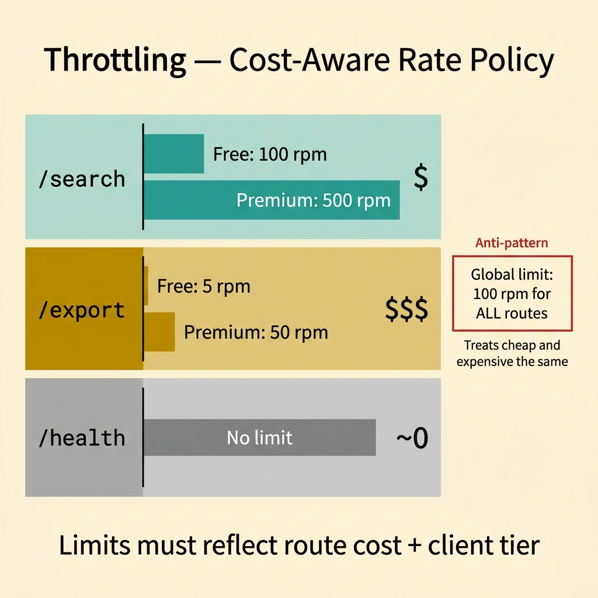
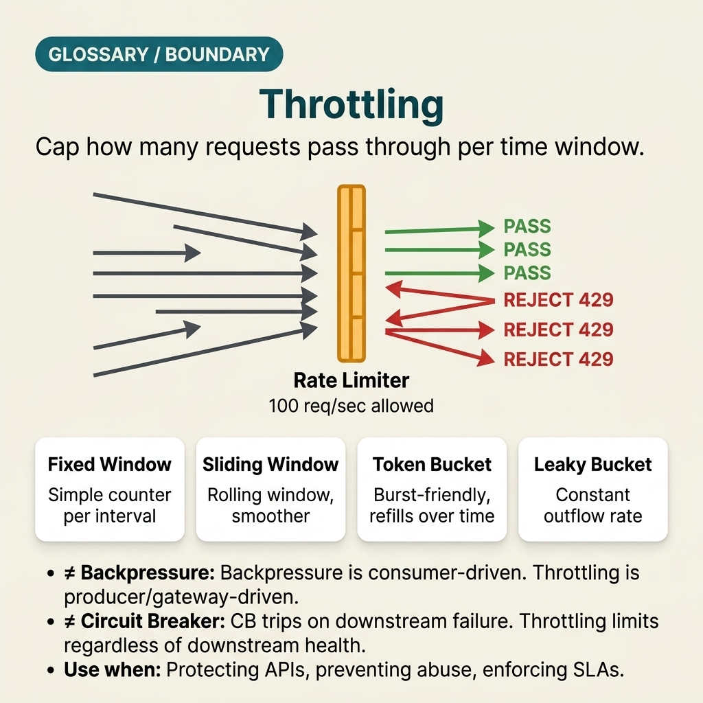

<!-- tags: glossary, reference, system-design-architecture, throttling -->
# Throttling

> A way to limit the number of requests or operations within a time window to protect the system from abuse or overload.

| Aspect | Detail |
| --- | --- |
| **Concept** | A way to limit the number of requests or operations within a time window to protect the system from abuse or overload. |
| **Audience** | Backend engineer, platform engineer, API protection reviewer |
| **Primary style** | Glossary term |
| **Entry point** | Use when the system needs to proactively limit request or operation rates by user, client, route, or class-of-service before load exceeds safe thresholds. |

📅 Created: 2026-03-30 · 🔄 Updated: 2026-04-04 · ⏱️ 10 min read

---

## 1. DEFINE

Picture this: an API just went public. A few clients with careless loops or a sudden marketing campaign can flood the system with requests before downstream even has time to signal overload. Unlike backpressure — which reacts once saturation has already formed — throttling is a proactive decision at the upstream or edge: limit the rate from the start to protect processing capacity and fairness. That is the boundary of throttling.

**Throttling** is a way to limit the number of requests or operations within a time window to protect the system from abuse or overload.

| Variant | Description |
| --- | --- |
| Per-user throttling | Limits by account or principal. |
| Per-client throttling | Limits by API key, app, or tenant. |
| Per-route throttling | Each endpoint/path has its own threshold. |
| Priority-aware throttling | Different thresholds per class-of-service or quota tier. |

| Approach | Time | Space | When to choose |
| --- | --- | --- | --- |
| Fixed window limit | O(1) | O(counter state) | When simplicity is needed and coarse boundaries are acceptable. |
| Sliding window/token bucket | O(1) amortized | O(bucket/window state) | When softer, more precise throttling is needed. |
| Adaptive throttling | O(signal evaluation) | O(metrics + control state) | When load varies and runtime tuning is needed. |
| Quota + burst policy | O(limit check) | O(quota and burst state) | When long-term fairness is needed but short bursts should still be allowed. |

Core insight:

> Throttling is a proactive control at the entry point. It protects the system by deciding who is allowed in at what rate — before overload spreads internally.

### 1.1 Invariants & Failure Modes

- Limits must be tied to a clear identity or resource boundary: user, API key, route, tenant, region.
- Throttle policy should be transparent to the client via headers, error codes, or retry hints where appropriate.
- The most common mistake is using a single global limit for all routes, treating cheap and expensive endpoints the same even though their costs are very different.

---

## 2. CONTEXT

**Who uses it**: Backend engineer, platform engineer, API protection reviewer

**When**: Use when the system needs to proactively limit request or operation rates by user, client, route, or class-of-service before load exceeds safe thresholds.

**Purpose**: Throttling is a proactive control at the entry point. It protects the system by deciding who is allowed in at what rate — before overload spreads internally.

**In the ecosystem**:
- Throttling differs from backpressure; throttling is proactive from the edge/upstream, backpressure reacts to actual saturation at downstream.
- Throttling differs from auth; auth decides who gets in, throttling decides how fast they can enter.
- Throttling can be applied at the gateway, service, job scheduler, or queue producer boundary.

---

Blocking bursts at the edge sounds simple. But who gets blocked, how much, and what does the client receive when it is blocked?

## 3. EXAMPLES

Throttling surfaces most clearly when a single client bursts 10x and slows down the entire system, when rate limits accidentally catch legitimate users, or when a 429 response with no retry-after header triggers a client retry loop. The examples below place the pattern in exactly those moments.

### Example 1: Basic — Block burst requests right at the edge

> **Goal**: Do not let sudden traffic spikes go straight into the system without a first line of defense.
> **Approach**: Apply rate limiting or token bucket at the gateway or service entrypoint.
> **Example**: Each API key gets only 100 requests per minute for the public search route.
> **Complexity**: Basic

```yaml
throttle_basic:
  scope: api_key
  route: /search
  limit: 100_per_minute
```

**Why?** A simple entry throttle can already block many types of traffic bursts or abuse before they turn into queue backlogs and downstream overload.

**Takeaway**: Basic throttling is the first line of defense at the edge boundary.

### Example 2: Intermediate — Split limits by route cost and client class

> **Goal**: Do not apply the same limit to cheap and expensive endpoints, or treat free and premium tiers identically.
> **Approach**: Design policy based on the route's cost model and class-of-service.
> **Example**: `/search` allows 100 rpm for free tier, but `/export` only 5 rpm; premium tier gets a larger burst allowance.
> **Complexity**: Intermediate



*Figure: Effective throttling aligns limits with actual route cost and client tier — not a single global number for everything.*

```yaml
throttle_policy:
  search_free: 100_rpm
  export_free: 5_rpm
  search_premium: 500_rpm
```

**Why?** Resource consumption varies across routes. If limits do not follow cost, you either under-protect expensive paths or over-restrict cheap, harmless ones.

**Takeaway**: Intermediate throttling is quotas that reflect actual cost and service tier.

### Example 3: Advanced — Combine throttling with degraded mode and courteous retry hints

> **Goal**: Do not just return a bare `429` without telling the client what to do next.
> **Approach**: Return retry hints, expose quota headers, or degrade part of the workflow if appropriate.
> **Example**: Client receives `Retry-After`, remaining quota, and gets routed to a lighter summary endpoint.
> **Complexity**: Advanced

```yaml
throttle_response_contract:
  status: 429
  headers: [Retry-After, X-RateLimit-Remaining]
  degraded_option: summary_endpoint_only
```

**Why?** Throttling is a policy between platform and client. If the client does not know why it was blocked or when to retry, throttling easily triggers retry storms or confusing user experiences. A good response contract makes this policy far more effective.

**Takeaway**: Advanced throttling is a protection policy paired with a clear communication contract for the caller.

### Example 4: Expert — Tune throttling with runtime signals without turning it into fake backpressure

> **Goal**: Do not keep static, rigid limits when load and system capacity are constantly changing — but also do not completely blur the line with backpressure.
> **Approach**: Allow adaptive limits based on SLO, saturation, and business priority, while keeping throttling as a proactive guardrail at the entry.
> **Example**: When CPU is high and error budget is draining, the gateway reduces burst for low-tier clients but preserves quota for critical partner integrations.
> **Complexity**: Expert

```yaml
adaptive_throttle:
  trigger_signals: [cpu, error_budget, queue_lag]
  reduce_for: low_priority_clients
  preserve_for: critical_integrations
```

**Why?** Runtime signals can make throttling smarter, but the goal remains proactively protecting the entry path. If every decision waits for downstream to choke before reacting, you have shifted to backpressure. Expert throttling uses runtime signals to tune the guardrail — not to let the guardrail lose its nature.

**Takeaway**: Expert throttling is proactive admission control with the ability to adapt — not purely reactive overload handling.

---

## 4. COMPARE




*Figure: Position of throttling among rate limiting, backpressure, load shedding, and other traffic controls.*

Throttling sounds like "blocking requests that come too fast." True — but it differs from backpressure in that throttling is proactive limiting by the producer/edge, while backpressure is a signal from the consumer going backward.

### Level 1

```text
incoming requests
  -> throttling policy at edge
  -> only allowed rate enters system
```

*Figure: Level 1 shows throttling blocking excess load at the entry point instead of waiting for the system to choke before reacting.*

### Level 2

```text
per-user / per-route quotas
  -> cheap route gets higher throughput
  -> expensive route gets tighter budget
  -> fairness and protection improve together
```

*Figure: Level 2 highlights that mature throttling always ties to a cost model and fairness — not just a single global limit number.*

### Easy to confuse or cross the boundary

| # | Severity | Mistake | Consequence | Fix |
| --- | --- | --- | --- | --- |
| 1 | 🔴 Fatal | A single global limit for all routes and all clients | Policy lacks fairness and protects the wrong things | Split limits by route cost and client class. |
| 2 | 🟡 Common | Returning `429` without retry hints or quota info | Client retries blindly or UX becomes confusing | Return headers and a clear contract. |
| 3 | 🟡 Common | Confusing throttling with backpressure | Control flow designed at the wrong boundary | Keep throttling at the entry, backpressure at downstream saturation. |
| 4 | 🟡 Common | Rigid limits that do not reflect runtime conditions | Either weak protection or excessive blocking | Tune with SLO and signals when needed. |
| 5 | 🔵 Minor | Not tracking throttle hit rate by route | Cannot tell who the policy is blocking and why | Track per-route, per-client metrics. |

### Quick scan

| If you encounter | What to do |
| --- | --- |
| Traffic burst from client or bot | Add throttling |
| Expensive and cheap routes share the same limit | Split by cost model |
| Client does not know when to retry | Return retry hints/quota headers |
| Want to adjust limits based on runtime | Use adaptive throttling with control |

---

## 5. REF

| Resource | Type | Link | Notes |
| --- | --- | --- | --- |
| Envoy Global Rate Limiting | Official | https://www.envoyproxy.io/docs/envoy/latest/intro/arch_overview/other_features/global_rate_limiting | Practical example of throttling at edge/data plane. |
| Kong Rate Limiting | Official | https://docs.konghq.com/hub/kong-inc/rate-limiting/ | Useful reference for per-consumer/per-route policy. |
| Google SRE Book | Book | https://sre.google/sre-book/ | Extensive perspectives on overload protection and admission control. |

---

## 6. RECOMMEND

Throttling solves the problem of "traffic bursts exceeding server capacity." The next question: how should the consumer signal back, should throttling live at the gateway or the service, and does client-side event shaping help reduce pressure?

| Expand to | When | Why | File/Link |
| --- | --- | --- | --- |
| Downstream saturation control | When comparing edge policy with consumer-side reaction | Backpressure is the preceding article | [Backpressure](./15-backpressure.md) |
| Edge boundary | When throttling lives at the gateway | API Gateway is a directly related article | [API Gateway](./13-api-gateway.md) |
| Client event shaping | When the issue is UI event frequency | Compare with client-side Debounce/Throttle | [Debounce / Throttle](./17-debounce-vs-throttle.md) |

Back to that request burst at the beginning — a client sending 10x normal, the server slowing down, the entire system shaking. Now you know: the fault was not a slow backend. The fault was that the edge had no obligation to block early. One rate limit, one retry-after header, one clear 429. Simple as that — but it keeps the system standing when traffic goes abnormal.

**Links**: [← Previous](./15-backpressure.md) · [→ Next](./17-debounce-vs-throttle.md)
