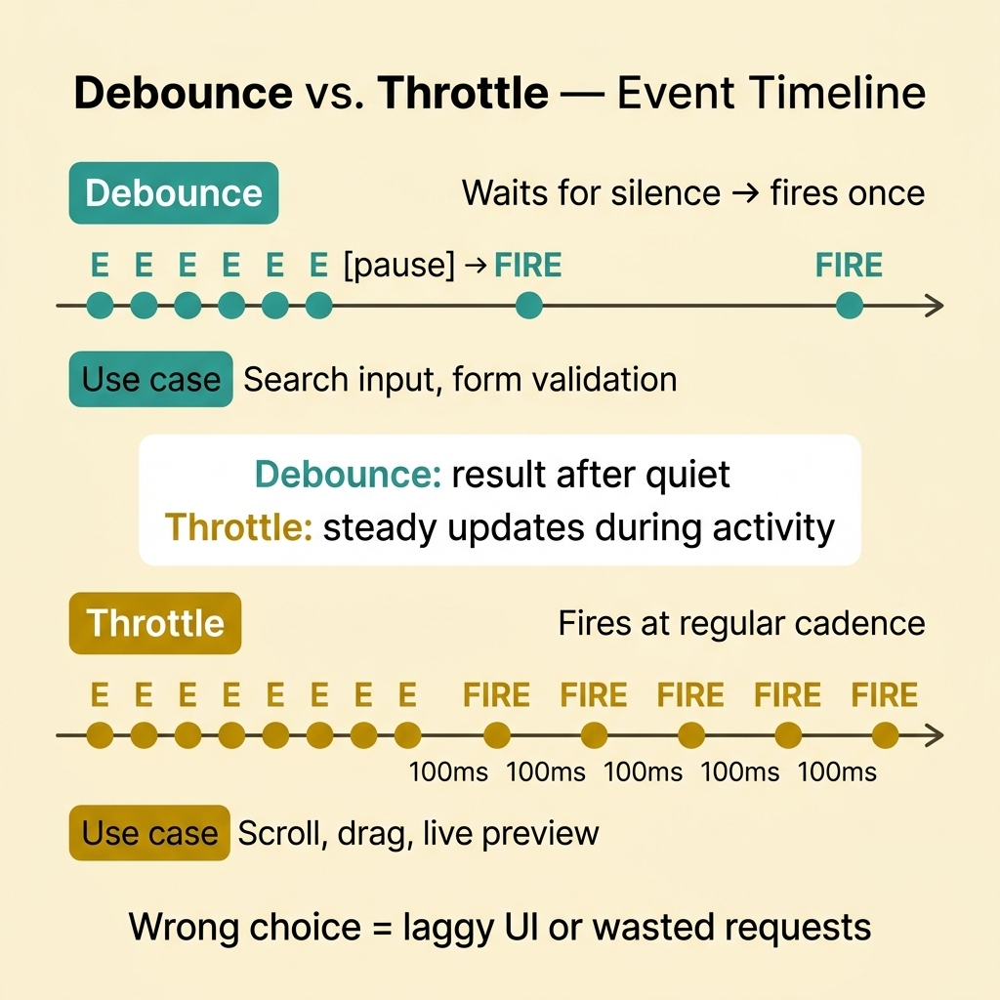
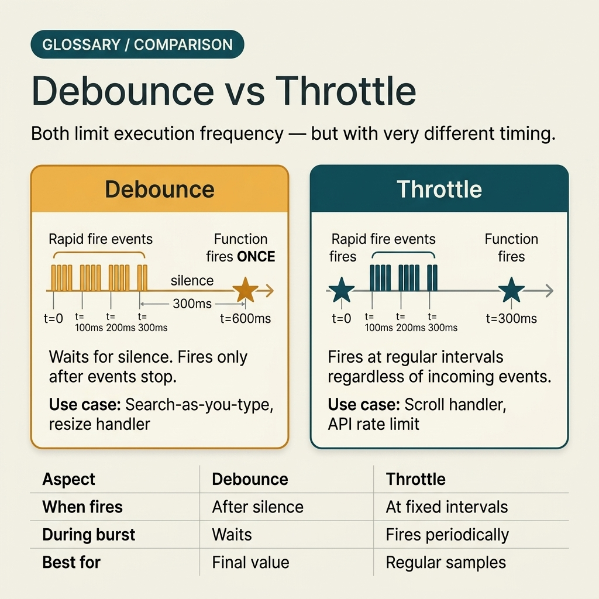

<!-- tags: glossary, reference, system-design-architecture, debounce-vs-throttle -->
# Debounce / Throttle

> A pair of techniques for regulating event processing frequency; debounce waits for quiet before executing, while throttle limits the maximum frequency within a time window.

| Aspect | Detail |
| --- | --- |
| **Concept** | A pair of techniques for regulating event processing frequency; debounce waits for quiet before executing, while throttle limits the maximum frequency within a time window. |
| **Audience** | Frontend engineer, API consumer designer, interaction reviewer |
| **Primary style** | Glossary term |
| **Entry point** | Use when events from UI or client-side logic fire too densely and the team needs to choose between "wait for the user to stop" and "limit the maximum frequency." |

📅 Created: 2026-03-30 · 🔄 Updated: 2026-04-04 · ⏱️ 10 min read

---

## 1. DEFINE

Picture this: a user is typing in a search box. Every character can trigger an event. If you send a request for every keystroke, the backend receives a dense stream of calls and the UI is likely to lag. But the solution is not always the same: sometimes you want to wait until the user finishes typing before running, other times you want continuous updates but with a cap. It is precisely at the point of choosing "wait for quiet" or "run at a steady pace" that the debounce/throttle pair truly matters. That is the boundary of debounce vs throttle.

**Debounce / Throttle** is a pair of techniques for regulating event processing frequency; debounce waits for quiet before executing, while throttle limits the maximum frequency within a time window.

| Variant | Description |
| --- | --- |
| Debounce trailing | Executes after the event stream has been quiet long enough. |
| Debounce leading | Executes immediately on the first event, then waits for the next quiet window. |
| Throttle fixed interval | Allows at most one execution per time interval. |
| Throttle with trailing update | Limits frequency while also ensuring the last event is still processed. |

| Approach | Time | Space | When to choose |
| --- | --- | --- | --- |
| Raw event handling | O(events) | O(1) | Only suitable when event rate is low or processing cost is very cheap. |
| Debounce | O(events, one final execution) | O(timer state) | When only the final result after an input sequence matters. |
| Throttle | O(bounded executions) | O(timer/window state) | When continuous updates are needed but should not be too dense. |
| Hybrid UI + API shaping | O(bounded executions) | O(client state + request budget) | When both smooth UI and backend protection are needed. |

Core insight:

> Debounce is optimized for "wait until the user stops, then act." Throttle is optimized for "keep acting continuously but with a maximum pace." They do not substitute for each other one-to-one.

### 1.1 Invariants & Failure Modes

- Choosing the wrong technique will skew UX: using debounce for scroll can feel too sluggish, using throttle for search input can fire extraneous requests.
- Leading/trailing behavior must be decided explicitly; otherwise teams easily assume "debounce" or "throttle" is a single default function.
- The most common mistake is saying "throttle" for every case of reducing event rate, ignoring the different semantics between the two techniques.

---

## 2. CONTEXT

**Who uses it**: Frontend engineer, API consumer designer, interaction reviewer

**When**: Use when events from UI or client-side logic fire too densely and the team needs to choose between "wait for the user to stop" and "limit the maximum frequency."

**Purpose**: Debounce is optimized for "wait until the user stops, then act." Throttle is optimized for "keep acting continuously but with a maximum pace." They do not substitute for each other one-to-one.

**In the ecosystem**:
- Debounce/throttle here refers to client-side or interaction-side techniques; they differ from throttling at the edge/gateway policy level.
- Debounce is well suited for autocomplete, validation while typing, or resize handlers that do not need continuous updates.
- Throttle is well suited for scroll, drag, mouse move, or live preview that needs steady updates but with a cap.

---

Debounce waits for the user to stop, throttle lets events through at a steady pace — sounds clean. But when to use which, and what goes wrong in the UI and server if you pick the wrong one?

## 3. EXAMPLES

Debounce and throttle surface most clearly when a search box fires an API call on every keystroke, when scroll events trigger rendering 60 times per second, or when a window resize continuously triggers layout recalculations. The examples below place the pattern in exactly those situations.

### Example 1: Basic — Choose debounce for input that only needs to react after the user stops

> **Goal**: Do not fire a request or validate on every single character typed.
> **Approach**: Wait for a period of silence before executing the logic.
> **Example**: Search box only sends the query after 300ms with no new keypress.
> **Complexity**: Basic

```yaml
debounce_basic:
  event: search_input
  wait: 300ms
  execute_when: no_new_input_within_window
```

**Why?** For search boxes or form validation, what the user cares about is usually the final result after they stop typing. Debounce reduces wasted requests and avoids UI jitter without losing the actual value of the interaction.

**Takeaway**: Basic debounce is used when "the final result" matters more than continuous step-by-step updates.

### Example 2: Intermediate — Choose throttle for interaction that needs steady updates without being too dense

> **Goal**: Do not process every scroll pixel or drag event, but still keep the UI feeling responsive and continuous.
> **Approach**: Allow the callback to run at most once per interval.
> **Example**: Scroll listener updates the sticky header every 100ms instead of on every frame event.
> **Complexity**: Intermediate



*Figure: Debounce waits for silence then fires once; throttle fires at a regular cadence. Choosing wrong skews UX or wastes requests.*

```yaml
throttle_basic:
  event: scroll
  interval: 100ms
  execute_at_most: once_per_interval
```

**Why?** For scroll or drag, waiting until the user stops completely is usually too late. Throttle keeps the experience feeling "alive" while capping update frequency so CPU and network are not overwhelmed.

**Takeaway**: Intermediate throttle is suited for interactions that need a steady update cadence — not just one final result.

### Example 3: Advanced — Decide leading/trailing behavior based on actual UX semantics

> **Goal**: Do not generically call debounce/throttle and then have the callback fire at a moment that surprises the user.
> **Approach**: Explicitly decide leading, trailing, or both based on display and side-effect needs.
> **Example**: Debounce trailing for a search query; throttle leading+trailing for a drag preview.
> **Complexity**: Advanced

```yaml
execution_semantics:
  search_query: debounce_trailing
  drag_preview: throttle_leading_and_trailing
```

**Why?** Both techniques reduce event rate, but when the callback fires determines UX feel. A leading call can make the UI feel more responsive, while a trailing call ensures the final state is not lost. Not defining this clearly is a root cause of many bugs that are "correct in code but wrong in feel."

**Takeaway**: Advanced debounce/throttle design is choosing the right execution semantics — not just the right technique name.

### Example 4: Expert — Combine client-side event shaping with backend protection without double-counting policy

> **Goal**: Do not let client debounce/throttle and backend throttling/backpressure conflict with or mask each other.
> **Approach**: Treat client-side shaping as interaction optimization; treat backend rate control as a separate protection boundary.
> **Example**: Search box debounces 300ms for smooth UX; gateway still throttles per-user to guard against real abuse.
> **Complexity**: Expert

```yaml
layered_control:
  client_side: debounce_300ms
  gateway_side: per_user_throttle
  backend_queue: backpressure_enabled
```

**Why?** Client-side debounce/throttle improves interaction but does not replace server protection. If client shaping is considered sufficient, abuse and retries from outside the UI still get through. Conversely, if only server controls exist, the UI can still spam useless events. These two layers must coordinate — not substitute for each other.

**Takeaway**: Expert event shaping is the right coordination between UX optimization at the client and overload protection at the backend.

---

## 4. COMPARE




*Figure: Position of debounce and throttle among server-side throttling, backpressure, and other event shaping techniques.*

Both debounce and throttle reduce event frequency. But debounce waits for quiet before firing, while throttle fires at a steady pace. Choosing wrong means either a jittery UI or too many API calls.

### Level 1

```text
events keep firing
  -> debounce waits for silence
  -> throttle allows periodic execution
```

*Figure: Level 1 states the core difference: debounce waits for quiet, throttle keeps a cadence.*

### Level 2

```text
search input: keypress keypress keypress pause -> one debounced call
scroll event: move move move move -> throttled updates every 100ms
```

*Figure: Level 2 places the two techniques in two very different UI/client interaction patterns.*

### Easy to confuse or cross the boundary

| # | Severity | Mistake | Consequence | Fix |
| --- | --- | --- | --- | --- |
| 1 | 🔴 Fatal | Using debounce for interaction that needs continuous feedback | UX feels sluggish, laggy | Switch to throttle or a requestAnimationFrame pattern. |
| 2 | 🟡 Common | Using throttle for search/input final state | Fires extraneous requests and results jitter | Use debounce trailing. |
| 3 | 🟡 Common | Not specifying leading/trailing behavior | Callback runs at "correct but unexpected" moment | Document execution semantics explicitly in code/design. |
| 4 | 🟡 Common | Confusing client-side throttle with server-side throttling | Protection boundary and UX optimization get blurred | Clearly separate interaction shaping from protection policy. |
| 5 | 🔵 Minor | Not measuring effectiveness after adding debounce/throttle | Unknown whether UX or backend actually improved | Track request count, FPS, or input latency as appropriate. |

### Quick scan

| If you encounter | What to do |
| --- | --- |
| Only the final result after user stops matters | Use debounce |
| Need steady updates but not too dense | Use throttle |
| Callback runs at the right name but wrong UX feel | Review leading/trailing semantics |
| Assuming client-side shaping is enough to protect backend | Add server-side throttling/backpressure separately |

---

## 5. REF

| Resource | Type | Link | Notes |
| --- | --- | --- | --- |
| MDN — Debounce | Reference | https://developer.mozilla.org/en-US/docs/Glossary/Debounce | Concise explanation of debounce semantics. |
| MDN — Throttle | Reference | https://developer.mozilla.org/en-US/docs/Glossary/Throttle | Explanation of the throttle concept on the client side. |
| web.dev — Optimize input responsiveness | Reference | https://web.dev/ | Useful cross-reference for performance-oriented UI handling. |

---

## 6. RECOMMEND

Debounce and throttle solve the problem of "UI events firing too many too fast." The next question: how does the server return a 429, how is downstream saturation handled, and when the client landscape splits apart what does the API contract look like?

| Expand to | When | Why | File/Link |
| --- | --- | --- | --- |
| Edge rate control | When comparing with server-side protection policy | Throttling is the preceding article | [Throttling](./16-throttling.md) |
| Downstream saturation | When event floods choke backend queues | Backpressure is an adjacent concept | [Backpressure](./15-backpressure.md) |
| Client-specific edge facade | When client event shaping is tied to a dedicated API contract | Backend for Frontend is a related article | [Backend for Frontend](./14-backend-for-frontend.md) |

Back to that search box at the beginning — every keystroke an API call, the server hit with 10 requests in 2 seconds. Now you know: debounce 300ms is enough — wait until the user stops typing, then call. And a scroll handler that needs continuous response? Throttle at 16ms for smooth 60fps. Simple — but choosing wrong means a jittery UI or a flooded server.

**Links**: [← Previous](./16-throttling.md) · [→ Next](./README.md)
