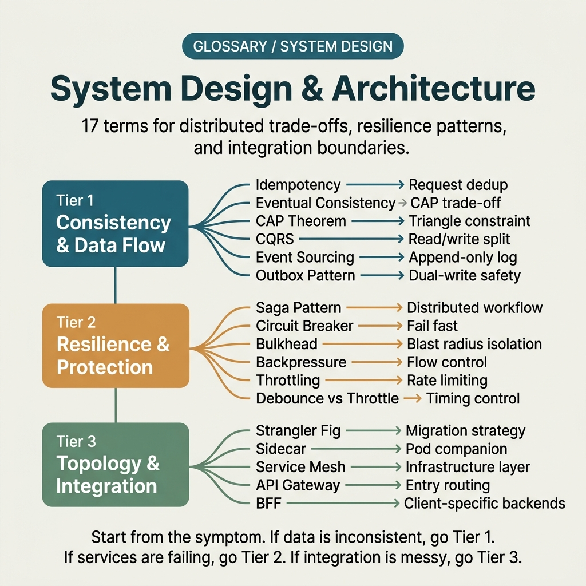

<!-- tags: glossary, reference, system-design-architecture, overview -->
# System Design & Architecture

> A cluster of terms covering distributed consistency, coordination patterns, resilience, and how services communicate under load and failure.

| Aspect | Detail |
| --- | --- |
| **Concept** | A cluster of terms covering distributed consistency, coordination patterns, resilience, and how services communicate under load and failure. |
| **Audience** | Backend engineer, architect, reviewer debating system trade-offs |
| **Primary style** | Glossary hub router |
| **Entry point** | Open when the problem is at the distributed system level but it is not yet clear whether it is a consistency, workflow coordination, resilience, or edge control issue |

📅 Created: 2026-03-30 · 🔄 Updated: 2026-04-04 · ⏱️ 7 min read

---

## 1. DEFINE

Picture this: in a design review, the team quickly drops big words — CQRS, saga, eventual consistency, service mesh, circuit breaker. The problem is these terms live at different layers of a distributed system. This README routes the team to the right trade-off layer before the architecture devolves into a buzzword dictionary.

**System Design & Architecture** is a cluster of terms covering distributed consistency, coordination patterns, resilience, and how services communicate under load and failure.

| Variant | Description |
| --- | --- |
| Consistency & state flow | Idempotency, eventual consistency, CAP, CQRS, event sourcing, and outbox name the shape of state and data flow. |
| Workflow & migration patterns | Saga and Strangler Fig Pattern name coordination and how to change the system in phases. |
| Resilience & traffic control | Circuit breaker, bulkhead, sidecar, service mesh, API gateway, BFF, backpressure, throttling, and debounce/throttle name boundaries for traffic routing and control. |

| Approach | Time | Space | When to choose |
| --- | --- | --- | --- |
| Route by distributed trade-off | O(1) route | O(1) | When the team needs to determine whether the problem is consistency, resilience, or edge control |
| Route by failure mode | O(1) route | O(1) | When the symptom is duplicates, stale state, cascade failure, or overloaded traffic |
| Learn from state flow to control | O(1) route | O(1) | When you want to go from state semantics to production traffic patterns |

Core insight:

> System design vocabulary is only useful when each term is placed at the right trade-off layer; otherwise, the team will swap a resilience pattern to fix a consistency problem and vice versa.

### 1.1 Signals & Boundaries

- Idempotency, eventual consistency, and CAP sit at the state semantics layer.
- Saga, outbox, and event sourcing sit at the workflow/data flow design layer.
- Circuit breaker, bulkhead, mesh, gateway, backpressure, and throttling sit at the resilience and traffic control layer.

### Coverage Map

| Entry | Role | Notes |
| --- | --- | --- |
| [Idempotency](01-idempotency.md) | Canonical term | Primary entry for this branch |
| [Eventual Consistency](02-eventual-consistency.md) | Canonical term | Primary entry for this branch |
| [CAP Theorem](03-cap-theorem.md) | Canonical term | Primary entry for this branch |
| [Saga Pattern](04-saga-pattern.md) | Canonical term | Primary entry for this branch |
| [CQRS](05-cqrs.md) | Canonical term | Primary entry for this branch |
| [Event Sourcing](06-event-sourcing.md) | Canonical term | Primary entry for this branch |
| [Outbox Pattern](07-outbox-pattern.md) | Canonical term | Primary entry for this branch |
| [Strangler Fig Pattern](08-strangler-fig-pattern.md) | Canonical term | Primary entry for this branch |
| [Circuit Breaker](09-circuit-breaker.md) | Canonical term | Primary entry for this branch |
| [Bulkhead Pattern](10-bulkhead-pattern.md) | Canonical term | Primary entry for this branch |
| [Sidecar Pattern](11-sidecar-pattern.md) | Canonical term | Primary entry for this branch |
| [Service Mesh](12-service-mesh.md) | Canonical term | Primary entry for this branch |
| [API Gateway](13-api-gateway.md) | Canonical term | Primary entry for this branch |
| [Backend for Frontend](14-backend-for-frontend.md) | Canonical term | Primary entry for this branch |
| [Backpressure](15-backpressure.md) | Canonical term | Primary entry for this branch |
| [Throttling](16-throttling.md) | Canonical term | Primary entry for this branch |
| [Debounce / Throttle](17-debounce-vs-throttle.md) | Canonical term | Primary entry for this branch |

---

## 2. VISUAL




*Figure: Router map optimized for quick scanning of lanes, entry points, and reading boundaries before diving into detailed prose below.*

DEFINE has locked the main lanes. The visual below expands that taxonomy into a map compact enough for readers to know where to turn first.

### Level 1

```text
Consistency & state flow
Workflow & migration patterns
Resilience & traffic control
```

*Figure: Level 1 divides this hub into the main decision lanes so readers do not have to grope through a flat list of terms.*

### Level 2

```text
If the symptom is...                                   Open which file first
---------------------------------------------------   ------------------------------------------
Retry may create duplicate side effects                Idempotency
State cannot sync immediately but must remain valid    Eventual Consistency
Multi-step distributed workflow needs compensating     Saga Pattern
Traffic and failure start cascading between services   Circuit Breaker
```

*Figure: Level 2 turns the hub into a symptom router: start from the real question, then branch to the specific term.*

---

## 3. CODE

The diagram just laid out this group by consistency, coordination, edge control, and traffic shaping. From here, use the hub as a map table to know which layer the system is hurting at before mentioning a specific pattern.

### Problem 1: Basic — Route the right symptom to the right glossary entry

> **Goal**: Do not let every question about **System Design & Architecture** be thrown into the same bucket.
> **Approach**: Start from the symptom or the reader's question, then open the most fitting first entry.
> **Example**: Input is a review/design question; output is the file to open first, such as `./01-idempotency.md`.
> **Complexity**: Basic

```yaml
router:
  - symptom: Retry may create duplicate side effects
    open_first: ./01-idempotency.md
  - symptom: State cannot sync immediately but must remain valid
    open_first: ./02-eventual-consistency.md
  - symptom: Multi-step distributed workflow needs compensating action
    open_first: ./04-saga-pattern.md
  - symptom: Traffic and failure start cascading between services
    open_first: ./09-circuit-breaker.md
```

**Why?** In system design, getting the wrong lane often leads to the team throwing a big pattern at a small pain. This router helps name the right problem before choosing an architecture that sounds trendy.

**Takeaway**: The first value of this hub is forcing the discussion back to the right system layer — instead of jumping straight to a pattern name.

### Problem 2: Intermediate — Use the hub as an intentional learning path

> **Goal**: Read **System Design & Architecture** in logical clusters instead of jumping across disconnected files.
> **Approach**: Follow the lane from foundations to heavier variants, then loop back to compare adjacent concepts when needed.
> **Example**: A reader building a more durable mental model rather than just looking up a single definition.
> **Complexity**: Intermediate

```yaml
learning_path:
  state_semantics:
    - 01-idempotency.md
    - 02-eventual-consistency.md
    - 03-cap-theorem.md
  workflow_and_data_flow:
    - 04-saga-pattern.md
    - 05-cqrs.md
    - 06-event-sourcing.md
    - 07-outbox-pattern.md
    - 08-strangler-fig-pattern.md
  resilience_and_edge:
    - 09-circuit-breaker.md
    - 10-bulkhead-pattern.md
    - 11-sidecar-pattern.md
    - 12-service-mesh.md
    - 13-api-gateway.md
    - 14-backend-for-frontend.md
    - 15-backpressure.md
    - 16-throttling.md
    - 17-debounce-vs-throttle.md
```

**Why?** Patterns in this cluster only truly shine when the reader sees the chain of relationships between consistency, flow, and resilience. A learning path keeps learning coherent — not a buzzword collection.

**Takeaway**: At the intermediate level, this hub helps readers connect patterns into a chain of architectural trade-offs instead of a buzzword collection.

### Problem 3: Advanced — Use the hub as a governance map for shared vocabulary

> **Goal**: Keep reviews, ADRs, runbooks, and postmortems using the same language within **System Design & Architecture**.
> **Approach**: Group terms by decision lane, then use that lane as a glossary contract for the team.
> **Example**: When two people are saying the same word but actually arguing at two different system layers.
> **Complexity**: Advanced

```yaml
governance_map:
  consistency_state_flow:
    - 01-idempotency.md
    - 02-eventual-consistency.md
    - 03-cap-theorem.md
  workflow_migration_patterns:
    - 04-saga-pattern.md
    - 05-cqrs.md
    - 06-event-sourcing.md
  resilience_traffic_control:
    - 09-circuit-breaker.md
    - 10-bulkhead-pattern.md
    - 11-sidecar-pattern.md
```

**Why?** This is the vocabulary layer that goes directly into ADRs and design reviews. A governance map ensures each pattern is used as a response to a specific system pressure — not as a decorative label.

**Takeaway**: At the advanced level, this hub works as an architectural trade-off dashboard, helping the team speak the same language when balancing the system.

---

## 4. PITFALLS

The taxonomy is clear, but routing correctly is not enough to avoid the common slips when using or interpreting this concept cluster.

| # | Severity | Mistake | Consequence | Fix |
| --- | --- | --- | --- | --- |
| 1 | 🔴 Fatal | Mixing multiple concept layers in the same discussion | Team fixes the wrong layer, debate veers off course | Re-route to the correct lane in this README before opening a specific term |
| 2 | 🟡 Common | Choosing a term by familiar name rather than by symptom | Deep-links to the right file but wrong boundary | Ask the symptom question first, then choose the entry point |
| 3 | 🟡 Common | Reading single terms while skipping the learning path | Understanding stays fragmented, missing adjacent concepts for comparison | Follow the suggested reading clusters in CODE/RECOMMEND |
| 4 | 🔵 Minor | Not linking back to the parent hub or root hub | Reader gets lost and cannot return to the taxonomy | Keep the hub as a router; do not let files become islands |

---

## 5. REF

| Resource | Type | Link | Notes |
| --- | --- | --- | --- |
| Designing Data-Intensive Applications | Book | https://dataintensive.net/ | Very strong source for consistency and data flow |
| Microservices.io | Reference | https://microservices.io/ | Very useful for saga, outbox, and resilience patterns |
| Release It! | Book | https://pragprog.com/titles/mnee2/release-it-second-edition/ | Canon for resilience, circuit breaker, and production failure modes |

---

## 6. RECOMMEND

You have identified the system's pressure layer. Continue to the pattern closest to the trade-off that needs to be locked down — not the one with the most familiar name.

| Expand to | When | Why | File/Link |
| --- | --- | --- | --- |
| Idempotency first | When retry and duplicates are the most visible symptom | An extremely strong entry point for distributed behavior with side effects | [Idempotency](./01-idempotency.md) |
| Saga when workflow has spread across multiple boundaries | When consistency is a multi-step problem, not a single request | Coordination pattern matters more than endpoint detail at this point | [Saga Pattern](./04-saga-pattern.md) |
| Circuit breaker when failure starts propagating | When the symptom is queueing, timeouts, and cascades | Resilience layer needs its own name | [Circuit Breaker](./09-circuit-breaker.md) |

---

## 7. QUICK REF

| If you encounter | Open this |
| --- | --- |
| Retry may create duplicate side effects | [Idempotency](./01-idempotency.md) |
| State cannot sync immediately but must remain valid | [Eventual Consistency](./02-eventual-consistency.md) |
| Multi-step distributed workflow needs compensating action | [Saga Pattern](./04-saga-pattern.md) |
| Traffic and failure start cascading between services | [Circuit Breaker](./09-circuit-breaker.md) |
