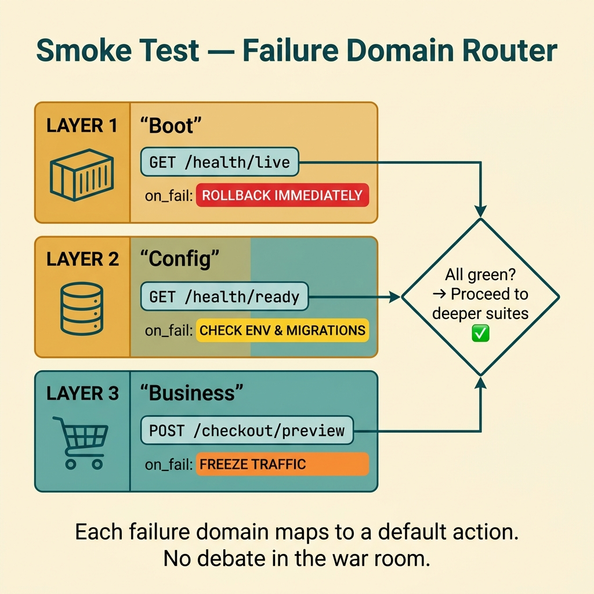
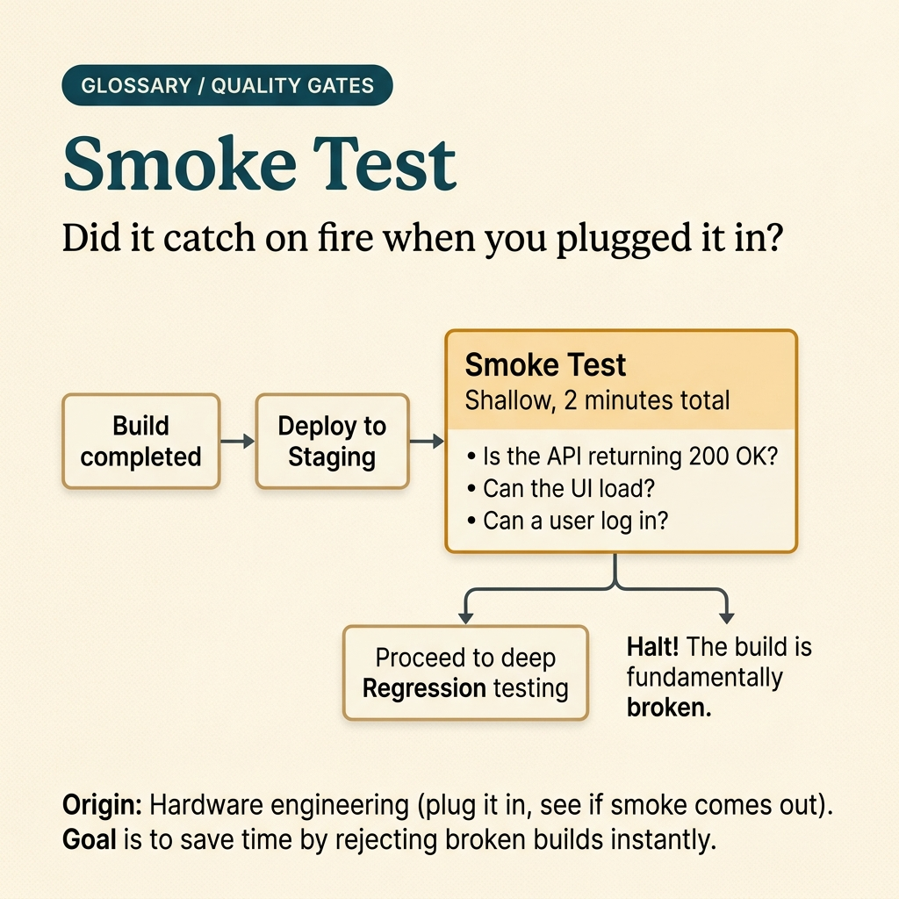

<!-- tags: glossary, reference, testing-quality, smoke-test -->
# Smoke Test

> A very fast test run to confirm that a new build or deployment is not critically broken before running deeper test suites.

| Aspect | Detail |
| --- | --- |
| **Concept** | A very fast test run to confirm that a new build or deployment is not critically broken before running deeper test suites. |
| **Audience** | QA engineer, release engineer, backend engineer |
| **Primary style** | Glossary term |
| **Entry point** | Use when the team needs an ultra-fast release gate to answer: "is this build dead on arrival?" |

📅 Created: 2026-03-30 · 🔄 Updated: 2026-04-11 · ⏱️ 9 min read

---

## 1. DEFINE

Picture this: you just cut a hot release at 23:40. Nobody wants to wait an hour for regression just to discover that login is dead, health check is red, or migration failed the instant the deploy landed. Smoke test exists to answer that very first question in a few minutes: is this build alive enough to proceed?

**Smoke Test** is a very fast test run to confirm that a new build or deployment is not critically broken before running deeper test suites.

| Variant | Description |
| --- | --- |
| Build Smoke Test | Runs immediately after build to confirm the artifact boots and minimum dependencies are alive. |
| Deploy Smoke Test | Runs after rollout to confirm that critical routes or workflows are not broken. |
| Environment Smoke Test | Checks minimum connectivity to DB, queue, cache, or runtime config. |

| Approach | Time | Space | When to choose |
| --- | --- | --- | --- |
| Health endpoint smoke | O(1) | O(1) | When you only need to know if the process boots and critical dependencies respond. |
| Critical path smoke | O(n critical steps) | O(1) | When the release has 1–2 workflows where failure means immediate rollback. |
| Post-deploy smoke bundle | O(n checks) | O(n results) | When you need to gate rollout or promotion between environments. |

Core insight:

> Smoke test does not try to prove the system is fully correct. It answers one question as fast as possible: is this build worth running sanity, regression, or canary against — or should the rollout stop immediately?

### 1.1 Invariants & Failure Modes

The critical invariant is that a smoke test must be fast enough to serve as the first gate. If the suite takes 20–30 minutes, the team will bypass it during urgent releases and it loses its role as the first line of insurance.

---

## 2. CONTEXT

**Who uses it**: QA engineer, release engineer, backend engineer

**When**: Use when the team needs an ultra-fast release gate to answer: "is this build dead on arrival?"

**Purpose**: Smoke test does not try to prove the system is fully correct. It answers one question as fast as possible: is this build worth running sanity, regression, or canary against — or should the rollout stop immediately?

**In the ecosystem**:
- Smoke test is broader than sanity test: it asks "is the build/deploy alive?", not just "is the bug I just fixed actually fixed?"
- Smoke test differs from regression test: regression hunts side effects on old behavior; smoke test hunts critical failure at the outermost layer.
- If a smoke test grows too long or covers too many cases, it is sliding into a miniature regression suite.

---

The first gate is clear. But why do teams still deploy dead builds despite having smoke tests, and where exactly is the boundary between smoke and regression?

## 3. EXAMPLES

Smoke test surfaces most visibly when a deploy boots successfully but users cannot log in, when the suite bloats to 30 minutes and the team starts bypassing it, or when health is green but checkout is dead. The examples below place the pattern into exactly those situations.

### Example 1: Basic — Use smoke test as the first gate of a deployment

> **Goal**: Answer as fast as possible whether the new deploy deserves to proceed or must stop immediately.
> **Approach**: Pick 3–5 most critical checks: boot process, DB readiness, critical route or workflow.
> **Example**: After deploying checkout service, you need to know within 2 minutes whether login and health endpoint are still alive.
> **Complexity**: Basic

```yaml
# Smoke test must be ultra-short: keep only the checks where failure means immediate rollback.
release: checkout-service
stage: post-deploy-smoke
checks:
  - id: process_boot
    # If the container cannot start, every deeper suite is meaningless.
    action: GET /health/live
    expect: 200
  - id: dependency_ready
    # Readiness tells whether the app has reached DB/queue minimum.
    action: GET /health/ready
    expect: 200
  - id: login_route
    # Pick the single most critical user-facing route of this release.
    action: POST /api/login
    expect: 200
    sample_payload: '{"email":"smoke@example.com","password":"***"}'
```

**Why?** Smoke test is effective because it picks exactly the signals with the largest blast radius. If these checks are red, the probability that deeper suites add value is near zero.

**Takeaway**: A basic smoke test should be minimal, survival-focused, and ultra-fast. Use it to decide "proceed or stop" — not to replace regression.

### Example 2: Intermediate — Split smoke test by failure type so the team knows whether to rollback or wait

> **Goal**: Not just fail/pass but also indicate which layer broke: boot, config, or business entry point.
> **Approach**: Group checks by failure domain and attach a default action to each group.
> **Example**: Readiness fail → rollback; route fail → hold traffic and open log trace before rollback.
> **Complexity**: Intermediate



*Figure: Each failure domain maps to a default action. Boot fail = rollback. Config fail = check env. Business fail = freeze traffic.*

```yaml
# Group by failure domain so the runbook is clearer when smoke fails.
smoke_matrix:
  boot:
    action: GET /health/live
    on_fail: rollback_immediately
  config:
    action: GET /health/ready
    on_fail: check_env_and_migrations
  business_entry:
    action: POST /api/checkout/preview
    on_fail: freeze_traffic_and_compare_previous_release
# ⚠️ Do not mix 20 small checks here; each group keeps only 1–2 representative signals.
```

**Why?** When smoke fails, decision speed matters more than analysis depth. Attaching failure domains to default actions reduces debate time in the release war room.

**Takeaway**: At the intermediate level, smoke test starts acting as an operational router: wherever it fails, the team knows the first action to take there.

### Example 3: Advanced — Use smoke bundle to gate canary promotion

> **Goal**: Only increase traffic when the canary passes required smoke conditions.
> **Approach**: Run smoke at a small traffic milestone and use a pass/fail policy to decide promotion.
> **Example**: Canary at 5% traffic only advances to 25% if health, error rate, and checkout preview are all green.
> **Complexity**: Advanced

```yaml
canary_policy:
  traffic_step: 5%
  gate:
    smoke_checks:
      - GET /health/ready == 200
      - POST /api/checkout/preview == 200
      - error_rate_p95 < 1%
  promote_if:
    # ✅ Only increase traffic when both readiness and business entry point are green.
    all_checks_pass_for: 3m
  rollback_if:
    # ⚠️ A single red smoke check is enough to cancel the current step.
    any_check_fails: true
    action: shift_traffic_back
```

**Why?** Smoke test during canary does not just check if the app is alive or dead — it protects each step of increasing blast radius. A broken business entry point at 5% traffic is far cheaper than discovering it at 50%.

**Takeaway**: Advanced smoke test ties directly to rollout policy. It does not replace long-term metrics, but it is the handbrake for each promotion step.

### Example 4: Expert — Design multi-layer smoke strategy for a monorepo with many services

> **Goal**: Keep smoke suite small enough per service while still having a cross-service bundle to prevent failure from spreading.
> **Approach**: Separate service-local smoke from platform smoke and workflow smoke, then run in escalation order.
> **Example**: User service passes local smoke but auth token exchange fails in workflow smoke, so the release is still blocked.
> **Complexity**: Expert

```yaml
smoke_layers:
  service_local:
    # Confirm each service boots with minimum dependencies.
    - user-service: [live, ready]
    - auth-service: [live, ready]
  platform_cross_cutting:
    # Check cache, secrets, migrations, event bus at the platform layer.
    - redis_ping
    - db_schema_version
    - queue_publish_consume
  workflow_smoke:
    # Keep only 1–2 journeys with the highest business value.
    - user_login_then_fetch_profile
    - create_order_then_publish_event
execution_order:
  - service_local
  - platform_cross_cutting
  - workflow_smoke
```

**Why?** In a multi-service system, a flat smoke suite is both slow and hard to reason about. Layering lets the team know whether the failure is in an individual service, in shared platform infrastructure, or in a cross-service workflow.

**Takeaway**: An expert smoke strategy is a multi-layer gate architecture: local small enough to be fast, cross-service sharp enough to catch real blast radius.

---

## 4. COMPARE




*Figure: Position of smoke test between fail-fast release gate, narrower bug check, and broader regression confidence.*

Smoke test sounds like "run a few tests quickly." True, but the question it answers is much narrower: is this build alive enough to proceed, or should rollout stop right now?

### Level 1

```text
release candidate
  -> deploy to target env
  -> run smoke checks on critical paths
  -> pass => allow deeper suites / traffic increase
  -> fail => stop rollout immediately
```

*Figure: Level 1 shows smoke test is the first gate after build or deploy.*

### Level 2

```text
build green but config broken
  -> app boots? yes/no
  -> DB migration reachable? yes/no
  -> login or health path alive? yes/no
  -> any critical check red => rollback or hold promotion
```

*Figure: Level 2 shows smoke test focuses on large blast-radius signals, not full business logic validation.*

### Easy to confuse or cross the boundary

| # | Severity | Mistake | Consequence | Fix |
| --- | --- | --- | --- | --- |
| 1 | 🔴 Fatal | Stuffing regression into the smoke suite | First gate too slow; team skips it during urgent releases | Keep only the checks where failure means immediate rollback. |
| 2 | 🟡 Common | Testing only health endpoint, skipping critical workflow | App looks green but users cannot log in or checkout | Add 1–2 representative business entry points. |
| 3 | 🟡 Common | Smoke fails but no mapping to runbook action | War room debates too long | Attach each smoke group to a default action like rollback or hold traffic. |
| 4 | 🔵 Minor | Running smoke on data that is too clean and ideal | Many config or auth errors stay hidden | Use accounts, secrets, and routes closer to production. |

### Quick scan

| If you encounter | What to do |
| --- | --- |
| Need an ultra-fast gate after deploy | Think smoke test. |
| Suite is bloating and taking too long | Cut every check that does not serve a rollback decision. |
| Health is green but user flow is dead | Add 1–2 business entry points to the smoke bundle. |

---

## 5. REF

| Resource | Type | Link | Notes |
| --- | --- | --- | --- |
| Martin Fowler - SmokeTest | Reference | https://martinfowler.com/bliki/SmokeTest.html | Foundational concept for smoke testing and deployment confidence. |
| Google SRE Workbook | Reference | https://sre.google/workbook/canarying-releases/ | Connection between release gates, canary, and rollback. |
| Testing on the Toilet | Reference | https://testing.googleblog.com/ | Short posts on test suite layering philosophy. |

---

## 6. RECOMMEND

Smoke test solves the problem of "is this deploy worth continuing?" The next question: what do you use when a bugfix needs narrow verification, and what catches side effects across a wider scope?

| Expand to | When | Why | File/Link |
| --- | --- | --- | --- |
| Adjacent concept | When a bugfix has narrowed down to a specific area | Sanity test is smaller than smoke test and stays close to the change just made. | [Sanity Test](./02-sanity-test.md) |
| Topic hub | When you need to see the full testing taxonomy | Return to the learning path of the testing module. | [Testing & Quality](./README.md) |
| Deeper suite | When smoke has passed but you still worry about wide side effects | Regression test is the layer that catches breakage across old behavior. | [Regression Test](./03-regression-test.md) |

Back to that deploy from the beginning — health was green but users could not log in. Now you know: smoke test does not try to prove the system is correct. It answers one question as fast as possible: is this build alive or dead? Two minutes, 3–5 survival checks. Fail means rollback — no further thinking needed.

**Links**: [← Previous](./README.md) · [→ Next](./02-sanity-test.md)
