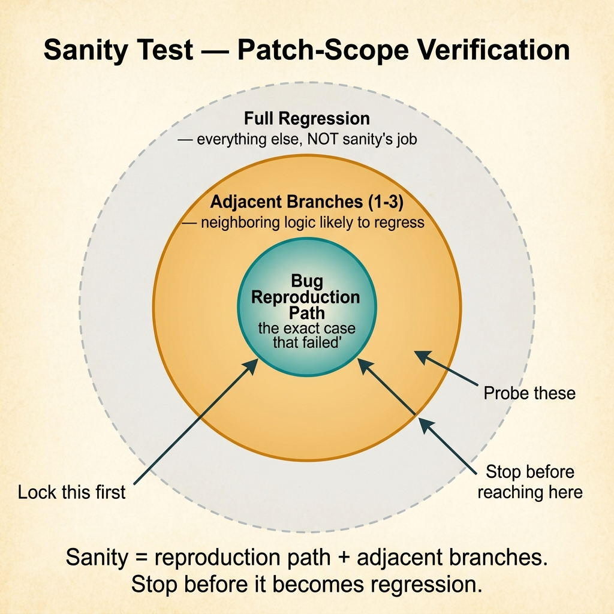
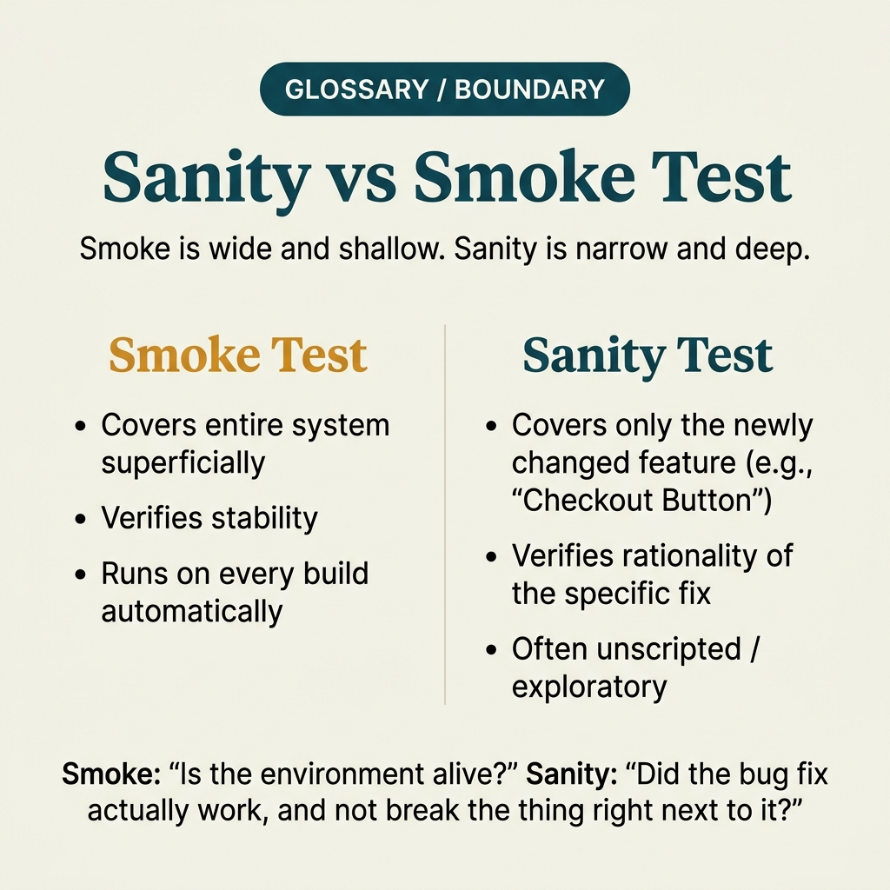

<!-- tags: glossary, reference, testing-quality, sanity-test -->
# Sanity Test

> A narrow check focused on the area just fixed or just added to confirm the core logic of that change works correctly.

| Aspect | Detail |
| --- | --- |
| **Concept** | A narrow check focused on the area just fixed or just added to confirm the core logic of that change works correctly. |
| **Audience** | QA engineer, backend engineer, reviewer |
| **Primary style** | Glossary term |
| **Entry point** | Use when the team has just patched a bug or modified a narrow flow and needs to confirm that exact area is correct before running a broader suite. |

📅 Created: 2026-03-30 · 🔄 Updated: 2026-04-04 · ⏱️ 8 min read

---

## 1. DEFINE

Picture this: you just fixed a bug where a coupon was incorrectly applied to shipping. Running the full regression suite takes 45 minutes, but you do not need that yet. What you need to know first is whether the patch actually fixed the discount logic for that exact case. Sanity test was born for moments this narrow and practical.

**Sanity Test** is a narrow check focused on the area just fixed or just added to confirm the core logic of that change works correctly.

| Variant | Description |
| --- | --- |
| Bugfix Sanity | Confirms the case that just broke is now correct. |
| Feature Sanity | Confirms the new capability works on the main flow. |
| Config Sanity | Confirms a config change did not break logic in the affected area. |

| Approach | Time | Space | When to choose |
| --- | --- | --- | --- |
| Single-scenario sanity | O(1) | O(1) | When the bug has a very clear reproduction path. |
| Patch-scope sanity | O(n impacted cases) | O(n cases) | When the change touches several related logic branches. |
| Post-fix sanity gate | O(n smoke-sized) | O(1) | When you need a quick check before merge or hotfix promotion. |

Core insight:

> Sanity test does not ask whether the system is still globally OK. It asks a smaller but more urgent question: is the part just touched doing what it is supposed to do?

### 1.1 Invariants & Failure Modes

The sanity test invariant is that it must stick very close to the change set and reproduction path. If the test is too generic, it will go green even though the original bug still exists on the specific branch just fixed.

---

## 2. CONTEXT

**Who uses it**: QA engineer, backend engineer, reviewer

**When**: Use when the team has just patched a bug or modified a narrow flow and needs to confirm that exact area is correct before running a broader suite.

**Purpose**: Sanity test does not ask whether the system is still globally OK. It asks a smaller but more urgent question: is the part just touched doing what it is supposed to do?

**In the ecosystem**:
- Sanity test is narrower than smoke test because it sticks to the area just changed, not the overall health of the build.
- Sanity test differs from unit test: it can cross multiple layers as long as it stays close to the patch area.
- If a sanity suite starts covering many areas unrelated to the change, it is sliding into a small regression.

---

Quick-checking the area just fixed is clear. But where does sanity test differ from smoke test, and when does a sanity check become a miniature regression suite?

## 3. EXAMPLES

Sanity test surfaces most visibly when a bugfix is done and you need to verify just that area, when a hotfix has no time for full regression, or when QA needs a small gate before letting the dev continue. The examples below place the pattern into exactly those moments.

### Example 1: Basic — Confirm the bug just fixed is actually gone

> **Goal**: Ensure the original reproduction case no longer fails after the patch.
> **Approach**: Encode the bug report into one minimal sanity checklist or scenario.
> **Example**: A 10% coupon was previously applied to shipping; after the fix it must apply only to subtotal.
> **Complexity**: Basic

```yaml
sanity_case:
  bug_id: discount-214
  scenario: apply_coupon_to_checkout
  steps:
    # Reproduction path must match the original bug report — do not rephrase the problem.
    - cart_subtotal: 100000
    - shipping_fee: 15000
    - coupon: SAVE10
  expect:
    subtotal_discounted: 90000
    shipping_unchanged: 15000
```

**Why?** Without encoding the exact reproduction path, the team can easily test a slightly different case and believe the bug is gone. Sanity test is strongest when it locks down the path that previously failed.

**Takeaway**: Basic sanity should be a faithful translation of the bug report into a short check — without adding too many side cases.

### Example 2: Intermediate — Probe adjacent branches near the logic just fixed

> **Goal**: Avoid fixing one case while breaking a neighboring branch that the broader regression has not caught yet.
> **Approach**: After the main reproduction path, pick 1–2 adjacent branches based on the diff and business rules.
> **Example**: Beyond the percentage coupon, also test a fixed-amount coupon and a cart below minimum spend.
> **Complexity**: Intermediate



*Figure: Sanity = reproduction path + adjacent branches. Stop before it becomes regression.*

```yaml
patch_scope_sanity:
  changed_module: pricing/discount_engine
  must_pass:
    - percent_coupon_on_regular_cart
  adjacent_branches:
    # ✅ Pick only adjacent branches — do not expand into the full pricing suite.
    - fixed_amount_coupon
    - minimum_spend_rejection
  stop_when:
    # ⚠️ If this list grows too long, you are writing regression, not sanity.
    adjacent_branches_gt: 3
```

**Why?** A patch rarely touches only one isolated line of logic. Adjacent branches are where small regressions happen most. A good sanity test touches this zone just enough without turning into a full system suite.

**Takeaway**: Intermediate sanity test adds just the right amount of context to increase confidence in the patch while keeping a fast pace.

### Example 3: Advanced — Use sanity gate for hotfix before promoting to production

> **Goal**: Reduce the risk of promoting a hotfix without time to wait for full regression.
> **Approach**: Combine reproduction path, adjacent branches, and one health check of the related workflow into a small gate.
> **Example**: A hotfix on auth token parsing must pass login sanity + refresh-token sanity + one protected endpoint.
> **Complexity**: Advanced

```yaml
hotfix_sanity_gate:
  release_type: hotfix
  changed_area: auth-token-parser
  checks:
    - reproduce_old_failure: expired_token_with_clock_skew
    - adjacent_case: valid_refresh_token_rotation
    - workflow_ping: GET /api/me == 200
  decision:
    pass: allow_hotfix_promote
    fail: block_promote_and_reopen_incident
```

**Why?** Hotfixes typically run under time pressure. A sanity gate gives the team just enough evidence that the patch hit the right spot before risking a push to production.

**Takeaway**: Advanced sanity test is release control for a narrow patch — not a promise that the entire system is safe.

### Example 4: Expert — Design a sanity library for a bugfix-heavy module

> **Goal**: When a module frequently has bugfixes, standardize sanity templates so each fix does not start from zero.
> **Approach**: Classify bugs by family, then keep a sanity template for each family with an adjacent-branch checklist.
> **Example**: Pricing module has ready-made templates for tax, discount, rounding, and currency conversion.
> **Complexity**: Expert

```yaml
sanity_library:
  pricing:
    discount:
      must_reproduce: true
      adjacent_checks: [threshold_boundary, coupon_type_variant]
    tax:
      must_reproduce: true
      adjacent_checks: [inclusive_tax, exclusive_tax]
    rounding:
      must_reproduce: true
      adjacent_checks: [half_up, half_even]
usage_rule:
  # Template helps speed up review but must still be tied to the specific current bug.
  require_bug_specific_fixture: true
```

**Why?** When bugfixes repeat on the same family of logic, reusing sanity templates keeps quality consistent and reduces time to set up the case. But a template is only useful if it still forces the patch to bind to the specific fixture of the current bug.

**Takeaway**: An expert sanity strategy turns lessons from old bugs into a reusable check library — instead of repeating the same mistakes every fix cycle.

---

## 4. COMPARE




*Figure: Position of sanity test between smoke test, regression test, and quick verification gate.*

Sanity test sounds like a smaller smoke test. Not quite: sanity sticks to the area just changed; smoke covers the entire build — one verifies the fix, the other verifies the deploy.

### Level 1

```text
bug reproduced
  -> patch applied
  -> run sanity on changed area
  -> pass => move to broader suites
  -> fail => patch still not trustworthy
```

*Figure: Level 1 shows sanity test is the first validation loop of the change just made.*

### Level 2

```text
change scope identified
  -> select exact path affected
  -> validate expected fix
  -> probe adjacent branch likely to regress
  -> stop before suite becomes full regression
```

*Figure: Level 2 emphasizes sanity test must be narrow but not blind to adjacent branches likely to break.*

### Easy to confuse or cross the boundary

| # | Severity | Mistake | Consequence | Fix |
| --- | --- | --- | --- | --- |
| 1 | 🔴 Fatal | Sanity test does not reproduce the original bug report | Patch still fails but test is green | Lock down the reproduction path before adding side cases. |
| 2 | 🟡 Common | Expanding sanity into a mini regression suite | Loses speed and focus on the changed area | Limit to 1 reproduction path + 1–3 adjacent branches. |
| 3 | 🟡 Common | Testing only the happy path of the patch | Bug shifts to a neighboring branch | Probe the branches closest to the diff. |
| 4 | 🔵 Minor | Not saving the sanity template for recurring bugs | Each bugfix starts from scratch | Create a library template by bug family. |

### Quick scan

| If you encounter | What to do |
| --- | --- |
| Just patched a narrow bug | Start with sanity test. |
| Test is spreading to many unrelated modules | Narrow it down — you are turning sanity into regression. |
| Hotfix needs to promote urgently | Use a sanity gate before waiting for the deeper suite. |

---

## 5. REF

| Resource | Type | Link | Notes |
| --- | --- | --- | --- |
| Google Testing Blog | Reference | https://testing.googleblog.com/ | Posts on test strategy scoped to changes. |
| Martin Fowler - Test Pyramid | Reference | https://martinfowler.com/articles/practical-test-pyramid.html | Helps place sanity test correctly among test layers. |
| Testing on the Toilet | Reference | https://testing.googleblog.com/search/label/tott | Short posts on building pragmatic test suites. |

---

## 6. RECOMMEND

Sanity test solves the problem of "did this bugfix actually fix the right thing?" The next question: what catches side effects across a wider scope, and how does the overall build deploy gate work?

| Expand to | When | Why | File/Link |
| --- | --- | --- | --- |
| Broader gate | When you need to confirm the entire build/deploy is alive | Smoke test is the layer before sanity if a release just hit a new environment. | [Smoke Test](./01-smoke-test.md) |
| Wider suite | When the patch passed sanity but you still worry about wide side effects | Regression test covers old behavior more broadly. | [Regression Test](./03-regression-test.md) |
| Topic hub | When you need to return to the module's learning path | The hub places sanity test within the wider testing taxonomy. | [Testing & Quality](./README.md) |

Back to that hotfix from the beginning — fixed but unsure if the fix is right. Now you know: sanity test does not need to cover everything. Just verify the area just fixed — fast, narrow, enough to say "this fix is good, let it proceed."

**Links**: [← Previous](./01-smoke-test.md) · [→ Next](./03-regression-test.md)
