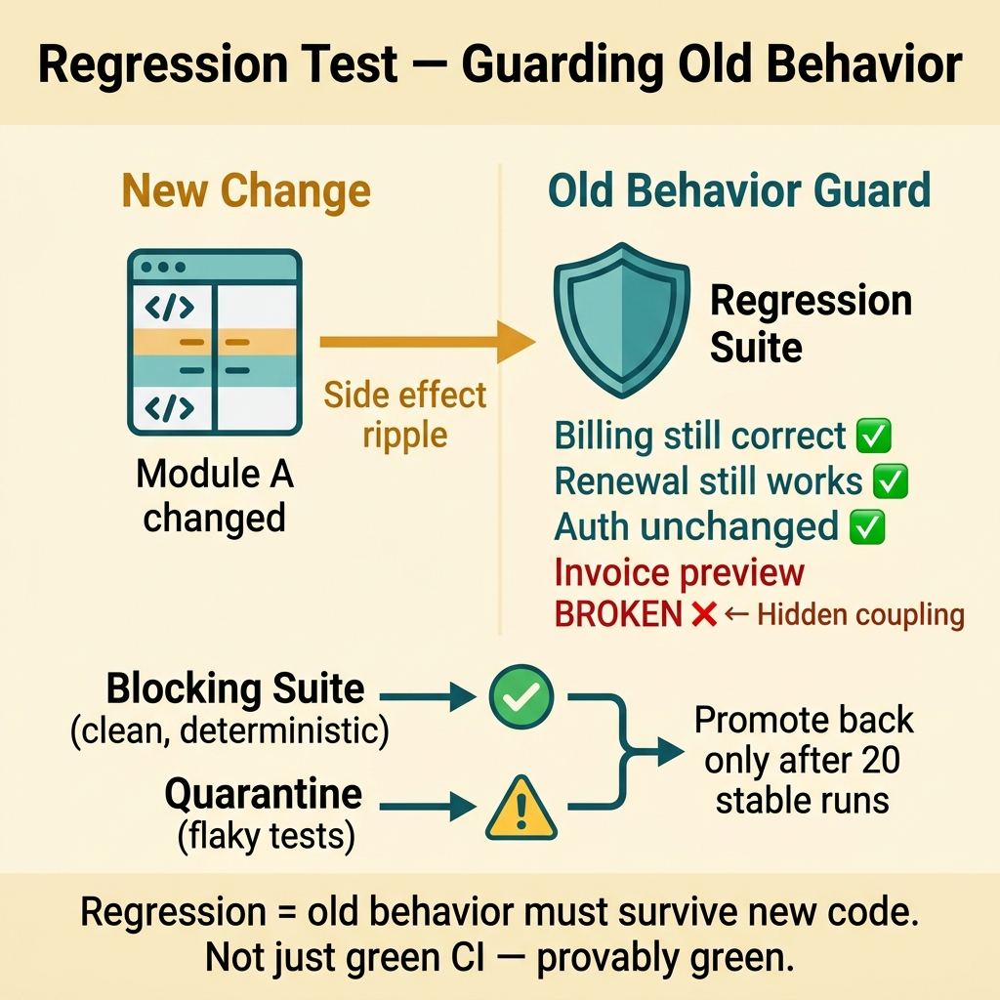
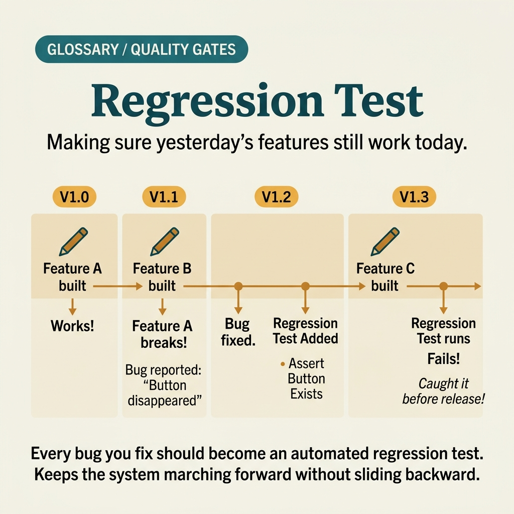

<!-- tags: glossary, reference, testing-quality, regression-test -->
# Regression Test

> Re-running the existing test suite after every change to detect old behavior broken by new code.

| Aspect | Detail |
| --- | --- |
| **Concept** | Re-running the existing test suite after every change to detect old behavior broken by new code. |
| **Audience** | QA engineer, backend engineer, release engineer |
| **Primary style** | Glossary term |
| **Entry point** | Use when the team needs evidence that a new change has not broken old behavior in areas wider than the direct change set. |

📅 Created: 2026-03-30 · 🔄 Updated: 2026-04-04 · ⏱️ 9 min read

---

## 1. DEFINE

Picture a PR that only adds a small condition to the pricing engine, but the next day subscription renewal starts failing in a workflow nobody thought was related. Regression test was born to catch this kind of "unrelated but still broken" side effect.

**Regression Test** is re-running the existing test suite after every change to detect old behavior broken by new code.

| Variant | Description |
| --- | --- |
| Full Regression | Reruns most of the suite for important releases or before major deploys. |
| Risk-based Regression | Selects a subset based on impact area and failure history. |
| Targeted Regression | Follows the dependency graph or modules closest to the change. |

| Approach | Time | Space | When to choose |
| --- | --- | --- | --- |
| Full suite rerun | O(n tests) | O(n results) | When the release is large and the cost of running the full suite is acceptable. |
| Risk-based selection | O(n impacted modules) | O(n mapping) | When the suite is too large to run in full every time. |
| Change-impact regression | O(diff + dependencies) | O(graph) | When there is good mapping between changes and affected systems. |

Core insight:

> Regression test protects old behavior from side effects of new changes. Its value lies in historical coverage and the ability to remind the team: "new code must not only be correct — it must not break what was already working."

### 1.1 Invariants & Failure Modes

Regression suites typically fail in two directions: too small and they miss side effects, or too large and flaky to the point the team ignores red signals. Both destroy the suite's credibility.

---

## 2. CONTEXT

**Who uses it**: QA engineer, backend engineer, release engineer

**When**: Use when the team needs evidence that a new change has not broken old behavior in areas wider than the direct change set.

**Purpose**: Regression test protects old behavior from side effects of new changes. Its value lies in historical coverage and the ability to remind the team: "new code must not only be correct — it must not break what was already working."

**In the ecosystem**:
- Regression test is broader than sanity because it looks beyond the current patch.
- Regression test differs from smoke because it does not just ask whether the system is alive — it asks whether old behavior is still correct.
- If a suite only replays a narrow reproduction path, that is sanity, not regression yet.

---

Catching side effects is clear. But when the regression suite bloats to 2 hours, who runs it, and how much coverage is enough?

## 3. EXAMPLES

Regression test surfaces most visibly when a new feature breaks old billing, when a "safe" refactor silently changes behavior, or when each sprint the suite grows 15 minutes longer and the team starts skipping it. The examples below place the pattern into exactly those situations.

### Example 1: Basic — Keep a regression pack for behavior that has broken before

> **Goal**: Do not let old bugs come back after a few sprints.
> **Approach**: Every important bug, once fixed, must leave behind at least one regression case in the long-lived suite.
> **Example**: A bug where subscription renewal used the wrong timezone must be preserved as a permanent test.
> **Complexity**: Basic

```yaml
regression_inventory:
  incidents:
    - id: renew-timezone-442
      keep_test: true
      area: subscription-renewal
      reason: previously caused silent billing mismatch
  rule:
    # ✅ Every production bug with real blast radius must leave a trace in the suite.
    production_bug_requires_regression: true
```

**Why?** If a bug is fixed and then forgotten, the same failure pattern will return when context shifts. Regression test turns an expensive lesson into a guardrail more durable than the current commit.

**Takeaway**: Basic regression usually starts by not letting old bugs disappear from the suite's memory.

### Example 2: Intermediate — Choose regression subset by risk zone instead of blind full run

> **Goal**: Keep reasonable speed while maintaining good coverage around the change.
> **Approach**: Map the changed module to workflows, past incidents, and nearest dependencies to select a subset.
> **Example**: A pricing diff pulls renewal, coupon, and invoice preview into the regression subset.
> **Complexity**: Intermediate



*Figure: Regression = old behavior must survive new code. Not just green CI — provably green.*

```yaml
risk_based_regression:
  changed_modules: [pricing-engine]
  include:
    # Workflows that have failed before or directly depend on this module.
    - checkout_discount
    - subscription_renewal
    - invoice_preview
  exclude:
    # Do not pull admin export if there is no real dependency.
    - marketing_email_templates
```

**Why?** Full regression can be too expensive to run continuously. Risk-based selection preserves the meaning of regression if selection is driven by coupling and incident history — not gut feeling.

**Takeaway**: Good intermediate regression is intentional: broader than sanity but still tied to real risk.

### Example 3: Advanced — Use change-impact map to auto-suggest regression suite

> **Goal**: Reduce dependence on individual memory when choosing the regression pack.
> **Approach**: Map the change area to a dependency graph, owners, and known-failure history to auto-suggest the suite.
> **Example**: Changing auth middleware suggests login, protected APIs, refresh flow, and audit trail.
> **Complexity**: Advanced

```yaml
change_impact_map:
  auth-middleware:
    workflows: [login, refresh-token, protected-api]
    dependencies: [session-store, audit-log]
    historic_failures: [refresh-loop, stale-role-cache]
regression_selector:
  input: auth-middleware
  output:
    - login_happy_path
    - refresh_rotation
    - role_change_propagation
    - audit_event_written
```

**Why?** The more regression selection depends on human memory, the easier it is to miss things when the team changes or context shifts. A change-impact map turns implicit knowledge into a reusable structure.

**Takeaway**: Advanced regression strategy uses coupling and incident data to choose the suite — instead of relying on intuition.

### Example 4: Expert — Keep regression suite trustworthy with quarantine and promotion policy

> **Goal**: Do not let the regression suite become a collection of noisy red lights that the team learns to ignore.
> **Approach**: Separate flaky tests into quarantine, keep the blocking suite clean, and have a clear policy for when to promote back.
> **Example**: An intermittent test against an external sandbox must not live in the blocking regression gate.
> **Complexity**: Expert

```yaml
regression_governance:
  blocking_suite:
    must_be: deterministic
  quarantine_suite:
    allow_flaky: true
    requires_owner: true
  promotion_rule:
    # ⚠️ Only return to blocking when stable across many consecutive runs.
    passes_required: 20
    failure_rate_max: 0%
```

**Why?** A regression suite is only trustworthy when its red color means something. If too many flaky tests live in the blocking gate, the team will learn to ignore real signals along with the fake noise.

**Takeaway**: Expert regression is not just about test content — it is about governance to keep the suite trusted and used.

---

## 4. COMPARE




*Figure: Position of regression test between smoke test, integration test, and layers protecting old behavior.*

Regression test sounds like "rerun all old tests." Partly true — but it differs from integration test in focus (old behavior breaking vs. boundaries between components), and regression suite bloat is the most common anti-pattern.

### Level 1

```text
new change lands
  -> rerun previously trusted behavior checks
  -> old behavior still green? yes/no
  -> no => side effect found
```

*Figure: Level 1 shows regression test goes back to protect old behavior after every change.*

### Level 2

```text
change in module A
  -> impact analysis picks related modules B/C
  -> rerun historical checks there
  -> failures show hidden coupling or stale assumptions
```

*Figure: Level 2 emphasizes regression test is most valuable when it knows how to select the historical zones at risk of being affected.*

### Easy to confuse or cross the boundary

| # | Severity | Mistake | Consequence | Fix |
| --- | --- | --- | --- | --- |
| 1 | 🔴 Fatal | Not converting production bugs into regression cases | Same failure returns multiple times | Every important bug must leave a durable regression test. |
| 2 | 🟡 Common | Running full suite blindly or choosing by gut feel | Both wastes time and misses risk zones | Use risk-based or change-impact selection. |
| 3 | 🟡 Common | Leaving flaky tests in the blocking regression gate | Team loses trust in the color red | Quarantine noisy tests and set promotion criteria. |
| 4 | 🔵 Minor | Not connecting regression suite with incident history | Suite fails to reflect the system's real pain | Map tests to old bugs and critical workflows. |

### Quick scan

| If you encounter | What to do |
| --- | --- |
| Want to prevent old bugs from returning | Add regression cases to the long-lived suite. |
| Suite is too large to run in full | Switch to risk-based or change-impact selection. |
| Team is ignoring red signals | Clean flaky tests out of the blocking regression gate. |

---

## 5. REF

| Resource | Type | Link | Notes |
| --- | --- | --- | --- |
| Martin Fowler - Regression Testing | Reference | https://martinfowler.com/bliki/RegressionTesting.html | Concept and goals of regression testing. |
| Google Testing Blog | Reference | https://testing.googleblog.com/ | Practices on test selection, flakiness, and suite health. |
| Microsoft Research - Test Impact Analysis | Reference | https://learn.microsoft.com/en-us/azure/devops/pipelines/test/test-impact-analysis | Real-world example of change-impact driven selection. |

---

## 6. RECOMMEND

Regression test solves the problem of "did the new change break old behavior?" The next question: what checks boundaries between services, and how do you verify end-to-end user flows?

| Expand to | When | Why | File/Link |
| --- | --- | --- | --- |
| Patch-scope layer | When you just fixed a specific bug | Sanity test is the narrow layer before regression. | [Sanity Test](./02-sanity-test.md) |
| Interface boundary | When regression needs to protect contracts between services | Contract test locks down interface expectations long-term. | [Contract Test](./04-contract-test.md) |
| Topic hub | When you need to return to the testing taxonomy | Keep context of the full module. | [Testing & Quality](./README.md) |

Back to that new feature from the beginning — merged, CI green, but old billing is dead. Now you know: CI green does not mean old behavior is intact. You need a test layer that specifically asks: "is the old stuff still correct?" That is regression.

**Links**: [← Previous](./02-sanity-test.md) · [→ Next](./04-contract-test.md)
