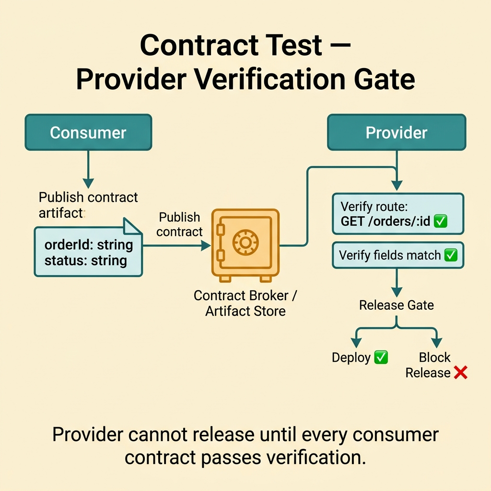
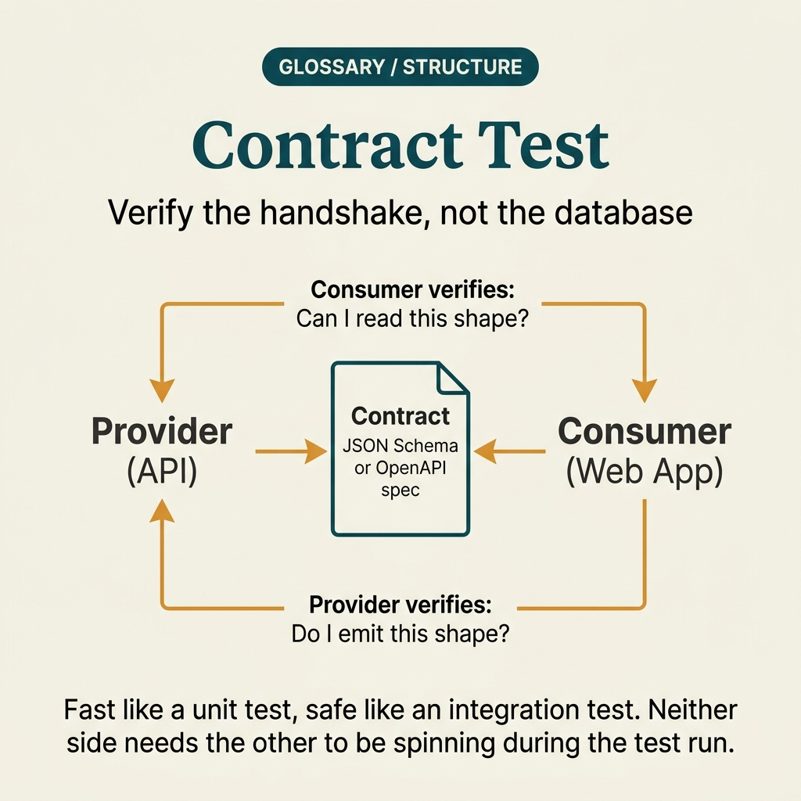

<!-- tags: glossary, reference, testing-quality, contract-test -->
# Contract Test

> Testing the agreement between consumer and provider to ensure that API interfaces, messages, or schemas do not change silently.

| Aspect | Detail |
| --- | --- |
| **Concept** | Testing the agreement between consumer and provider to ensure that API interfaces, messages, or schemas do not change silently. |
| **Audience** | Backend engineer, platform engineer, QA engineer |
| **Primary style** | Glossary term |
| **Entry point** | Use when two sides communicate via HTTP, events, or schemas and the team wants to detect breaking changes before full integration or production reveals them. |

📅 Created: 2026-03-30 · 🔄 Updated: 2026-04-11 · ⏱️ 9 min read

---

## 1. DEFINE

Picture this: Consumer sends a request with a field called `status`, and the provider silently renames it to `state`. Unit tests on both sides are still green, and the integration environment is not always in sync. Contract test exists to lock down exactly that agreement between the two ends before production becomes the discovery mechanism.

**Contract Test** is testing the agreement between consumer and provider to ensure that API interfaces, messages, or schemas do not change silently.

| Variant | Description |
| --- | --- |
| Provider contract test | Provider self-verifies that its response/schema still matches the commitment. |
| Consumer contract test | Consumer stores the minimal expectation it depends on. |
| Event/schema contract test | Applied to messages or schemas instead of HTTP APIs. |

| Approach | Time | Space | When to choose |
| --- | --- | --- | --- |
| Schema assertion | O(fields) | O(schema) | When the contract is fairly static and mostly about data shape. |
| Consumer-provider pact | O(interactions) | O(pacts) | When multiple consumers have clearly distinct expectations. |
| Broker-based verification | O(consumers × versions) | O(history) | When contracts need to be managed by version/release pipeline. |

Core insight:

> Contract test does not try to replace integration or E2E. It protects the communication boundary between two sides by turning expectations into verifiable artifacts before deployment.

### 1.1 Invariants & Failure Modes

The biggest invariant is that a contract should only contain what the consumer actually depends on. When a contract bloats into a full mirror of the provider response, every minor change becomes a false breaking change.

---

## 2. CONTEXT

**Who uses it**: Backend engineer, platform engineer, QA engineer

**When**: Use when two sides communicate via HTTP, events, or schemas and the team wants to detect breaking changes before full integration or production reveals them.

**Purpose**: Contract test does not try to replace integration or E2E. It protects the communication boundary between two sides by turning expectations into verifiable artifacts before deployment.

**In the ecosystem**:
- Contract test differs from integration test: it checks the promise at the interface, without requiring the entire system to run together.
- Contract test differs from static schema docs: a contract must be verified automatically in the pipeline.
- If a contract includes too many implementation details, it locks the provider into unnecessary internal shape.

---

Checking interfaces between services sounds reasonable. But who owns the contract, who runs the test, and what happens when the contract changes?

## 3. EXAMPLES

Contract test surfaces most visibly when a provider changes its response schema and a consumer dies silently, when API versioning is skipped, or when integration tests are too slow to keep up with deploy speed. The examples below place the pattern into exactly those situations.

### Example 1: Basic — Lock down the minimal response shape the consumer needs

> **Goal**: Prevent the provider from changing a field or status code that silently breaks the consumer.
> **Approach**: Create a contract artifact containing only what matters: route, status, required fields.
> **Example**: Consumer needs `orderId` and `status` — not every internal debug field from the provider.
> **Complexity**: Basic

```yaml
contract:
  interaction: get-order
  request:
    method: GET
    path: /orders/42
  response:
    status: 200
    body:
      # ✅ Lock only the fields the consumer actually reads.
      orderId: string
      status: string
```

**Why?** Contract test creates value when it encodes the consumer's real dependency. If a field the consumer uses disappears or changes meaning, the test fails far earlier than waiting for the integration environment.

**Takeaway**: Basic contract test starts with locking minimal expectations — not capturing the full payload.

### Example 2: Intermediate — Have the provider verify the contract before release

> **Goal**: Prevent breaking changes from slipping through because the provider only runs internal unit tests.
> **Approach**: When the provider finishes its build, run verification against the stored contract artifact.
> **Example**: If the provider changes an order status enum, verification must fail if the consumer has not accepted the new enum.
> **Complexity**: Intermediate



*Figure: Provider must prove its current behavior still matches every published contract before release.*

```yaml
provider_verification:
  source_contracts:
    - order-consumer-v3.json
  verify:
    # Provider must prove its current behavior still matches the published contract.
    route: GET /orders/:id
    expected_fields: [orderId, status]
  on_fail: block_release
```

**Why?** A provider often cannot see every assumption the consumer side is relying on. Contract verification pulls those assumptions into the provider pipeline before deploy.

**Takeaway**: Intermediate contract test turns the interface promise into a real release gate for the provider — no longer a passive reference document.

### Example 3: Advanced — Manage multiple consumers with broker and version matrix

> **Goal**: When one provider serves multiple consumers, still know which change is safe for whom.
> **Approach**: Store contracts by consumer/version in a broker, then verify a selective matrix before release.
> **Example**: Billing API serves web app, mobile app, and backoffice with different release cadences.
> **Complexity**: Advanced

```yaml
contract_broker:
  provider: billing-api
  consumers:
    - web-app@v12
    - mobile-app@v8
    - backoffice@v4
release_check:
  # ⚠️ Only release if all supported contracts pass verification.
  verify_against_supported_consumers: true
  deprecate_flow_required: true
```

**Why?** When multiple consumers move at different release cadences, the provider cannot rely on memory to know who a breaking change affects. A broker + version matrix turns the problem into an explicit verification table.

**Takeaway**: Advanced contract testing is compatibility management by consumer/version — not just a few scattered JSON files.

### Example 4: Expert — Use contract policy to separate real breaking changes from implementation noise

> **Goal**: Do not let contracts become something that locks the provider into every internal detail.
> **Approach**: Set a clear policy on which fields are required, which are optional, and which rules count as backward compatible.
> **Example**: Adding a new field is compatible; changing the semantics of an existing field or dropping a required field is breaking.
> **Complexity**: Expert

```yaml
compatibility_policy:
  allowed_without_breaking:
    - add_optional_field
    - widen_enum_if_consumer_tolerates_unknown
  breaking_changes:
    - remove_required_field
    - change_field_semantics
    - change_status_code_meaning
review_rule:
  # ✅ Contract review must focus on semantic dependency, not cosmetic JSON diff.
  compare_by_semantics: true
```

**Why?** Without a compatibility policy, the team will argue over every small diff and confuse "payload changed" with "consumer actually broke." Expert contract practice forces the team to talk about semantic dependency instead of noise.

**Takeaway**: Expert contract test does not just check shape — it also checks the discipline of backward compatibility.

---

## 4. COMPARE




*Figure: Position of contract test between integration behavior, consumer-owned expectation, and raw schema drift.*

Contract test sounds like a lighter integration test. Not quite: its core point is protecting the promise at the boundary before full integration or production has to detect breaking changes on behalf of the team.

### Level 1

```text
consumer expectation
  -> contract artifact
  -> provider verification
  -> pass => interface still safe
  -> fail => breaking change detected early
```

*Figure: Level 1 shows contract test locks interface expectations between consumer and provider.*

### Level 2

```text
consumer A and B publish minimal expectations
  -> broker stores versioned contracts
  -> provider verifies against all relevant contracts
  -> incompatible change blocked before release
```

*Figure: Level 2 emphasizes contract test is most effective when expectations are versioned and verified before deploy.*

### Easy to confuse or cross the boundary

| # | Severity | Mistake | Consequence | Fix |
| --- | --- | --- | --- | --- |
| 1 | 🔴 Fatal | Mirroring the full response into the contract | Every small change becomes a false breaking change | Lock only the fields and behavior the consumer actually depends on. |
| 2 | 🟡 Common | Having contract artifacts but provider does not verify in pipeline | Breaking change only surfaces in integration/prod | Make verification a mandatory release gate. |
| 3 | 🟡 Common | Not managing versions across multiple consumers | Provider release is safe for one consumer but breaks another | Use broker or matrix compatibility. |
| 4 | 🔵 Minor | Contract does not clearly state compatibility policy | Review diffs cause too much debate | Write a clear semantic compatibility policy. |

### Quick scan

| If you encounter | What to do |
| --- | --- |
| Worried about breaking changes at API/message boundary | Use contract test. |
| Provider has many consumers releasing at different cadences | Use broker and version matrix. |
| Contract diffs cause endless arguments | Define compatibility policy by semantics. |

---

## 5. REF

| Resource | Type | Link | Notes |
| --- | --- | --- | --- |
| Pact Docs | Official | https://docs.pact.io/ | Foundational docs for consumer-driven contract and broker. |
| Martin Fowler - Consumer-Driven Contracts | Reference | https://martinfowler.com/articles/consumerDrivenContracts.html | Explains CDC role and boundary with integration tests. |
| Microservices.io - Testing Strategies | Reference | https://microservices.io/patterns/testing/service-integration-contract-test.html | General pattern for service contract testing. |

---

## 6. RECOMMEND

Contract test solves the problem of "provider changed and consumer did not know." The next question: who drives the contract — provider or consumer, and what checks the end-to-end flow?

| Expand to | When | Why | File/Link |
| --- | --- | --- | --- |
| Adjacent variant | When the consumer actively publishes expectations | CDC is a specific branch of contract test. | [Consumer-Driven Contract](./05-consumer-driven-contract.md) |
| Broader test | When you need to confirm multiple modules work together | Integration test looks wider than the interface boundary. | [Integration Test](./07-integration-test.md) |
| Topic hub | When you need to return to the testing glossary | Keep context of the full module. | [Testing & Quality](./README.md) |

Back to that API break from the beginning — provider changed a field, consumer died, nobody knew until production. Now you know: integration test catches it but too slowly. Contract test catches it right in CI, without both services running. Fast, isolated, right at the boundary.

**Links**: [← Previous](./03-regression-test.md) · [→ Next](./05-consumer-driven-contract.md)
