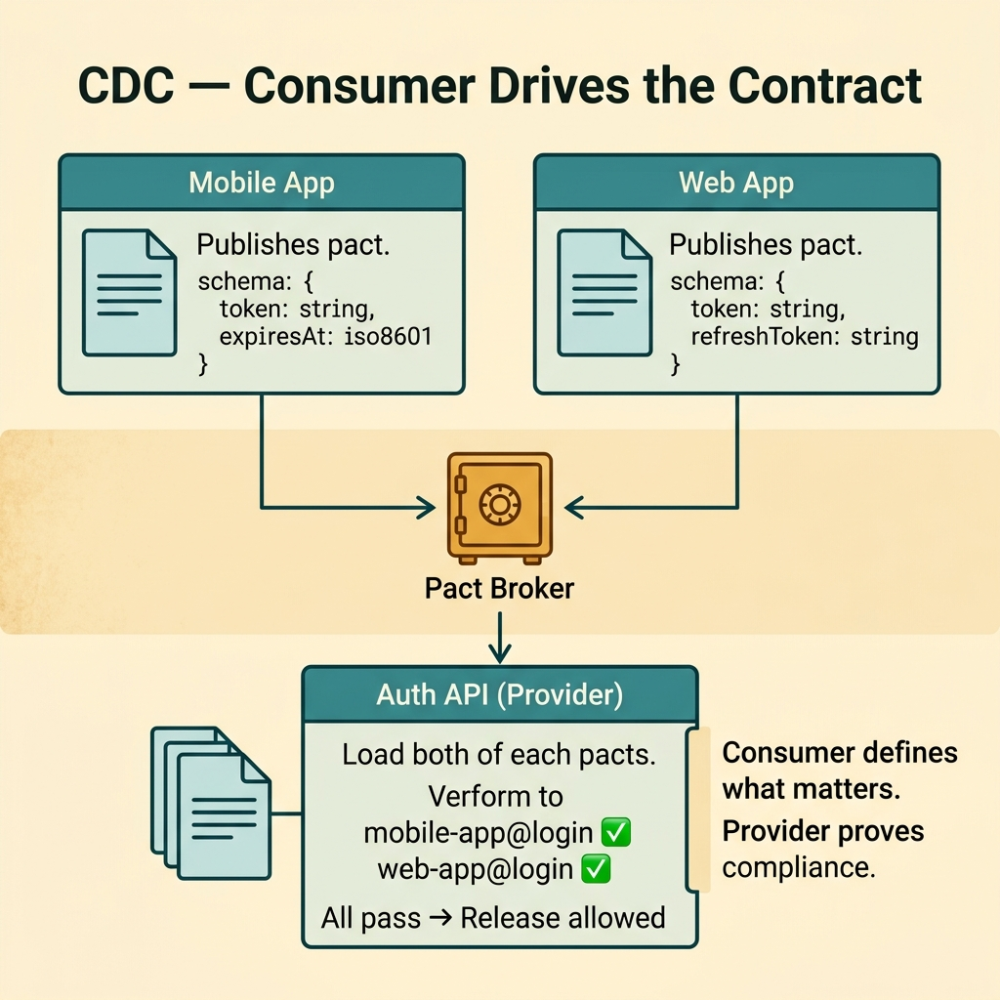
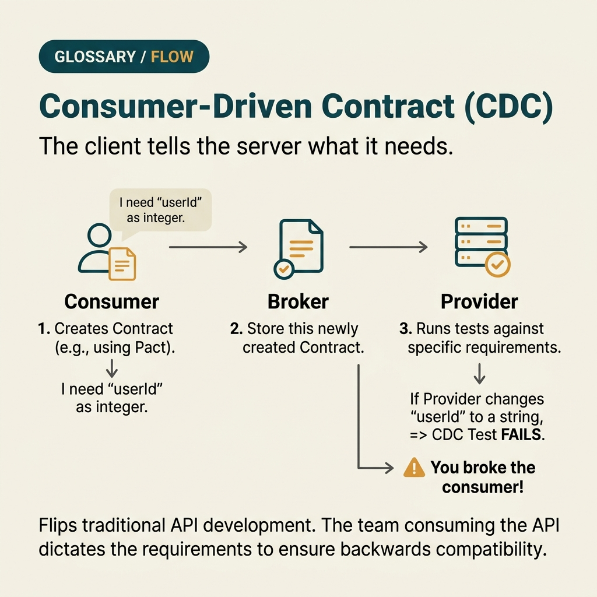

<!-- tags: glossary, reference, testing-quality, consumer-driven-contract -->
# Consumer-Driven Contract

> A variant of contract testing where the consumer defines the expected contract and the provider must prove it still satisfies that contract.

| Aspect | Detail |
| --- | --- |
| **Concept** | A variant of contract testing where the consumer defines the expected contract and the provider must prove it still satisfies that contract. |
| **Audience** | Backend engineer, frontend engineer, platform engineer |
| **Primary style** | Glossary term |
| **Entry point** | Use when the consumer wants to proactively lock down its minimal expectations instead of waiting for the provider to guess what matters. |

📅 Created: 2026-03-30 · 🔄 Updated: 2026-04-04 · ⏱️ 9 min read

---

## 1. DEFINE

Picture this: the provider thinks adding a field and reordering an array is harmless. The consumer is hard-parsing a specific value and crashes on old mobile apps. Consumer-Driven Contract exists to shift the right to define minimal expectations to the side that actually bears the risk of breaking: the consumer.

**Consumer-Driven Contract** is a variant of contract testing where the consumer defines the expected contract and the provider must prove it still satisfies that contract.

| Variant | Description |
| --- | --- |
| Single consumer pact | One consumer publishes contract expectations for one provider. |
| Multi-consumer CDC | Multiple consumers publish expectations for the same provider. |
| Versioned CDC rollout | CDC tied to different release versions of the consumer. |

| Approach | Time | Space | When to choose |
| --- | --- | --- | --- |
| Inline consumer pact | O(interactions) | O(contract file) | When one primary consumer depends heavily on the provider. |
| Broker-backed CDC | O(consumers × interactions) | O(history) | When multiple consumers need to publish expectations independently. |
| CDC + compatibility policy | O(version matrix) | O(policy) | When consumer release cadences differ and a deprecation path is needed. |

Core insight:

> CDC shifts the center of gravity to the consumer: only the consumer knows which fields it truly needs and which behavior is truly breaking. The provider no longer has to guess.

### 1.1 Invariants & Failure Modes

CDC fails when the consumer freezes every payload detail, or when the provider does not verify consistently across supported versions. Both make CDC either too rigid or ineffective.

---

## 2. CONTEXT

**Who uses it**: Backend engineer, frontend engineer, platform engineer

**When**: Use when the consumer wants to proactively lock down its minimal expectations instead of waiting for the provider to guess what matters.

**Purpose**: CDC shifts the center of gravity to the consumer: only the consumer knows which fields it truly needs and which behavior is truly breaking. The provider no longer has to guess.

**In the ecosystem**:
- CDC is a form of contract test, but the source of expectations comes from the consumer — not provider docs.
- CDC does not replace integration tests across multiple modules; it only protects the minimal interface promise.
- If the consumer publishes expectations that are too detailed, CDC becomes excessive coupling to provider internals.

---

Consumer defining the contract sounds backward. But why is it more effective than provider-driven, and what happens when the consumer gets greedy?

## 3. EXAMPLES

CDC surfaces most visibly when a provider deploy breaks 3 different consumers because nobody knew who used which field, when a contract is too broad because the provider guessed, or when the consumer team is blocked waiting for provider updates. The examples below place the pattern into exactly those moments.

### Example 1: Basic — Let the consumer publish its own minimal expectations

> **Goal**: Catch breaking changes exactly where the consumer actually depends.
> **Approach**: Consumer publishes only the route, fields, and semantics it needs to function correctly.
> **Example**: Mobile app only needs `token` and `expiresAt`; other debug fields do not need to be locked.
> **Complexity**: Basic

```yaml
consumer_pact:
  consumer: mobile-app
  provider: auth-api
  interaction: login
  expects:
    status: 200
    body:
      # ✅ Lock only the fields the app truly uses for the login flow.
      token: string
      expiresAt: iso8601
```

**Why?** The consumer knows better than anyone which part of the response is critical. CDC uses that knowledge to prevent the provider from "accidentally" changing the exact spot the consumer relies on.

**Takeaway**: Basic CDC starts from the consumer's minimal expectation — not from the full provider schema.

### Example 2: Intermediate — Have the provider verify each consumer's pact before release

> **Goal**: Ensure the provider does not break any consumer currently alive in production.
> **Approach**: Provider pipeline loads current pacts and verifies all relevant interactions.
> **Example**: Auth API release must pass pacts from both mobile and web app before deploy.
> **Complexity**: Intermediate



*Figure: Provider must pass every active consumer pact before release. One failure = blocked deploy.*

```yaml
provider_cdc_verify:
  contracts:
    - mobile-app@login
    - web-app@login
  release_gate:
    # ⚠️ One consumer failing verification is enough to block release.
    block_on_any_failed_consumer: true
  report:
    show_consumer_version: true
```

**Why?** CDC only creates value when the consumer's pact is actually run against the provider's current build. If the provider does not verify, the contract is just a well-intentioned but useless document.

**Takeaway**: Intermediate CDC turns consumer expectations into a real gate in the provider's pipeline.

### Example 3: Advanced — Manage multiple consumers with different dependency levels

> **Goal**: Do not force all consumers to share one rigid contract.
> **Approach**: Let each consumer publish its own minimal pact and verify by version still supported.
> **Example**: Web app tolerates new fields; old mobile app does not tolerate unknown enums.
> **Complexity**: Advanced

```yaml
cdc_matrix:
  provider: profile-api
  consumers:
    web-app:
      tolerates_unknown_fields: true
    mobile-app-v5:
      tolerates_unknown_fields: false
      required_fields: [avatarUrl, displayName]
  support_window:
    mobile-app-v5: until_2026-06-01
```

**Why?** Multiple consumers do not mean one shared expectation. CDC allows each consumer to declare its real dependency, so the provider knows which change is safe for whom.

**Takeaway**: Advanced CDC is compatibility management per consumer — not one contract for all.

### Example 4: Expert — Design deprecation path based on CDC instead of vague broadcasts

> **Goal**: When the provider wants to change a contract, still have a safe path for living consumers.
> **Approach**: Use CDC history to know which consumers still depend on the old field, then set a clear deprecation policy.
> **Example**: Want to remove `legacyStatus`? Provider can only do so when no active pact requires that field.
> **Complexity**: Expert

```yaml
deprecation_decision:
  target_field: legacyStatus
  remove_only_if:
    # ✅ Only remove when no active consumer pact depends on this field.
    active_consumer_pacts_require_field: false
  announce:
    deprecation_window: 90d
    fallback_strategy: keep_both_fields_temporarily
```

**Why?** Deprecation should not rely on the belief that "probably nobody uses it anymore." CDC history gives the provider real evidence about living dependencies, making the decision to remove a field far safer.

**Takeaway**: Expert CDC is a tool for managing backward compatibility and deprecation lifecycle — not just testing response shape.

---

## 4. COMPARE




*Figure: Position of CDC between basic contract test, integration test, and API versioning.*

CDC sounds like a contract test that the consumer writes. True — but the philosophy differs: consumer declares "this is what I need," and the provider must ensure it does not break that part. Ownership is completely reversed.

### Level 1

```text
consumer knows what it truly needs
  -> publishes pact/expectation
  -> provider verifies pact
  -> compatible release proceeds
```

*Figure: Level 1 shows CDC shifts expectation definition to the consumer side.*

### Level 2

```text
consumer A and B publish different minimal contracts
  -> broker stores both
  -> provider verifies against active consumer versions
  -> unsupported versions get explicit deprecation path
```

*Figure: Level 2 shows CDC is most useful when multiple consumers have different needs but share one provider.*

### Easy to confuse or cross the boundary

| # | Severity | Mistake | Consequence | Fix |
| --- | --- | --- | --- | --- |
| 1 | 🔴 Fatal | Consumer publishes full payload instead of minimal dependency | CDC creates excessive coupling; provider cannot evolve | Lock only the fields/semantics the consumer truly uses. |
| 2 | 🟡 Common | Provider does not verify pacts of all active consumers | One consumer breaks while pipeline stays green | Verify by support window/version matrix. |
| 3 | 🟡 Common | No deprecation policy based on pact history | Remove a field too early or keep old fields forever | Use pact history to decide deprecation. |
| 4 | 🔵 Minor | Consumer version not shown in reports | Hard to debug which consumer is failing | Always include version and owner of consumer pact. |

### Quick scan

| If you encounter | What to do |
| --- | --- |
| Consumer wants to define its own expectations | Use CDC. |
| Provider has many consumers releasing at different cadences | Keep pacts by version and support window. |
| Want to safely remove an old field | Check pact history before deprecating. |

---

## 5. REF

| Resource | Type | Link | Notes |
| --- | --- | --- | --- |
| Pact Docs | Official | https://docs.pact.io/ | Standard source for CDC workflow and broker. |
| Martin Fowler - Consumer Driven Contracts | Reference | https://martinfowler.com/articles/consumerDrivenContracts.html | Classic explainer on CDC. |
| ThoughtWorks Technology Radar | Reference | https://www.thoughtworks.com/radar | Notes on evolution and compatibility in distributed systems. |

---

## 6. RECOMMEND

CDC solves the problem of "provider does not know what consumer uses." The next question: what validates the full end-to-end flow, and how does the integration boundary work?

| Expand to | When | Why | File/Link |
| --- | --- | --- | --- |
| Root concept | When you need the broader view of contract testing | CDC is a specific branch of contract test. | [Contract Test](./04-contract-test.md) |
| Integration layer | When you need to confirm coordination across multiple components, not just an interface promise | Integration test looks wider than CDC. | [Integration Test](./07-integration-test.md) |
| Topic hub | When you need to return to the testing taxonomy | Keep context of the full module. | [Testing & Quality](./README.md) |

Back to that provider deploy from the beginning — broke 3 consumers because nobody knew who used which field. Now you know: let the consumer declare expectations, provider runs CDC in CI. Break before production, not after.

**Links**: [← Previous](./04-contract-test.md) · [→ Next](./06-end-to-end-test.md)
