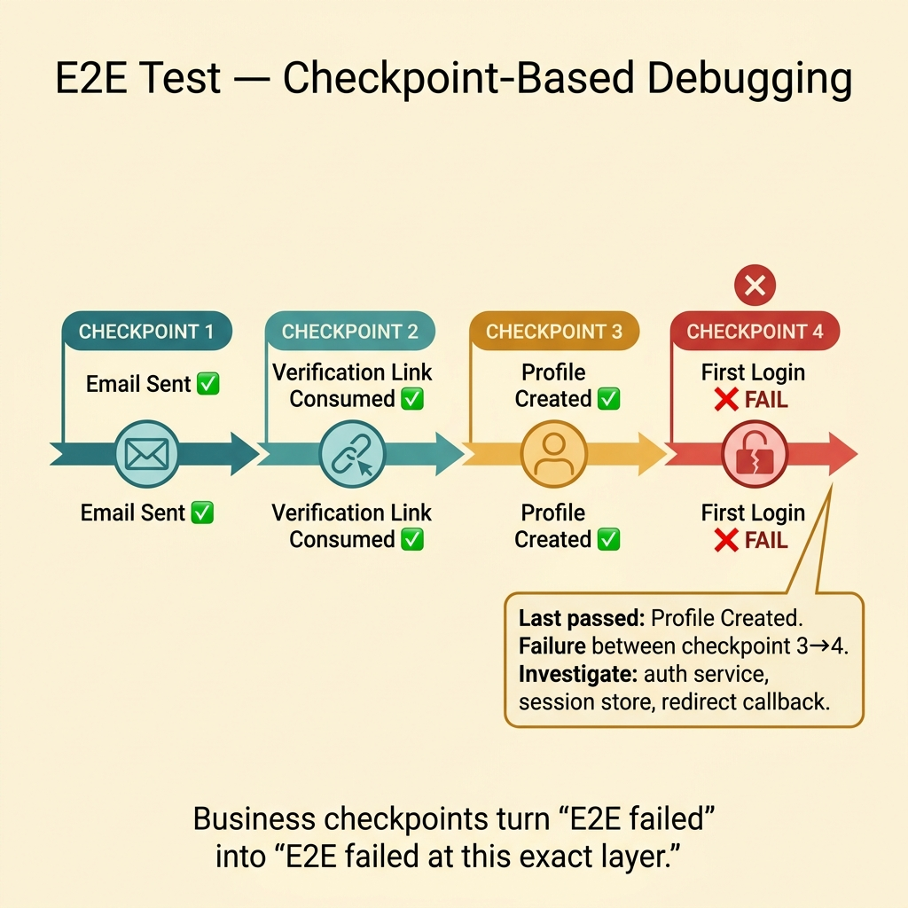
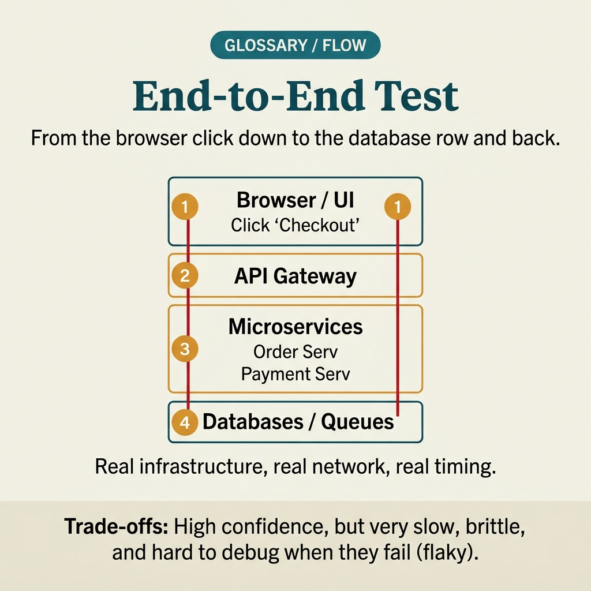

<!-- tags: glossary, reference, testing-quality, end-to-end-test -->
# End-to-End Test

> A test that simulates the user journey or business workflow from start to finish across the entire system.

| Aspect | Detail |
| --- | --- |
| **Concept** | A test that simulates the user journey or business workflow from start to finish across the entire system. |
| **Audience** | QA engineer, frontend engineer, backend engineer |
| **Primary style** | Glossary term |
| **Entry point** | Use when the team needs to confirm that a real user journey still works across multiple layers — UI, API, DB, queue, or payment — not just correctness in each isolated piece. |

📅 Created: 2026-03-30 · 🔄 Updated: 2026-04-04 · ⏱️ 9 min read

---

## 1. DEFINE

Picture this: Login still passes API tests, checkout service still passes integration, but on a real browser the user cannot complete a purchase because the redirect callback and email verification are out of sync. End-to-end test exists to see the experience as the user actually goes through it — not as each individual team imagines it.

**End-to-End Test** is a test that simulates the user journey or business workflow from start to finish across the entire system.

| Variant | Description |
| --- | --- |
| UI-driven E2E | Simulates behavior through browser or app UI. |
| Workflow E2E | Traverses multiple services but may start from an API or job trigger. |
| Synthetic production E2E | Simulated journeys running periodically on a near-production environment. |

| Approach | Time | Space | When to choose |
| --- | --- | --- | --- |
| Single critical journey | O(n steps) | O(n evidence) | When only a few critical journeys need protection. |
| Role-based E2E pack | O(users × journeys) | O(results) | When behavior differs by persona. |
| Layered E2E strategy | O(core + sampled journeys) | O(history) | When you need balance between confidence and speed. |

Core insight:

> E2E test simulates the value the user receives at the very end. It is more expensive than other layers, so it must be reserved for journeys important enough to justify that cost.

### 1.1 Invariants & Failure Modes

The most important invariant is that E2E should only protect the few most critical journeys. If the team tries to encode every business branch into E2E, the suite will be slow, flaky, and ignored.

---

## 2. CONTEXT

**Who uses it**: QA engineer, frontend engineer, backend engineer

**When**: Use when the team needs to confirm that a real user journey still works across multiple layers — UI, API, DB, queue, or payment — not just correctness in each isolated piece.

**Purpose**: E2E test simulates the value the user receives at the very end. It is more expensive than other layers, so it must be reserved for journeys important enough to justify that cost.

**In the ecosystem**:
- E2E test is broader than integration test because it covers the entire user journey or business workflow.
- E2E test should not be used to replace unit/integration for every small piece of logic.
- If the E2E suite has too many small cases, speed and reliability will collapse fast.

---

Testing the full flow sounds comprehensive. But when the E2E suite runs for 45 minutes and is 20% flaky, who maintains it, and how many E2E tests are enough?

## 3. EXAMPLES

E2E test surfaces most visibly when checkout flow works in unit tests but dies when the payment gateway times out, when the E2E suite is so flaky the team ignores results, or when a production bug slips through because nobody tested the full user journey. The examples below place the pattern into exactly those situations.

### Example 1: Basic — Protect one critical user journey from start to finish

> **Goal**: Confirm the real user can complete the most important workflow.
> **Approach**: Pick one journey with clear business impact like signup, login, or checkout.
> **Example**: User adds a product to cart, pays, and sees the order success page.
> **Complexity**: Basic

```yaml
e2e_journey:
  name: checkout_happy_path
  steps:
    - open_product_page
    - add_to_cart
    - submit_shipping
    - confirm_payment
    - see_order_success
  evidence:
    # ✅ Capture checkpoints the user actually sees — not just internal logs.
    - success_url_contains_order_id
    - order_visible_in_history
```

**Why?** The value of E2E lies in answering whether the user receives the final outcome or not. If the journey never reaches user-visible evidence, the test is not truly end-to-end.

**Takeaway**: Basic E2E should focus on the final outcome the user cares about most — not branch into every side path.

### Example 2: Intermediate — Design E2E with clear checkpoints for faster debugging

> **Goal**: When E2E fails, know where it broke instead of just seeing one red final screen.
> **Approach**: Split the journey into major business checkpoints and collect evidence at each point.
> **Example**: Signup flow has checkpoints: verify email, create profile, first login.
> **Complexity**: Intermediate



*Figure: E2E with business checkpoints lets the team pinpoint failure layer — UI, API, async worker, or persistence.*

```yaml
journey_checkpoints:
  signup_and_activation:
    - email_sent
    - verification_link_consumed
    - profile_created
    - first_login_success
failure_report:
  # ⚠️ E2E is only useful when the report tells you failure happened before or after which checkpoint.
  capture_last_passed_checkpoint: true
```

**Why?** E2E is usually harder to debug than narrow tests. Business checkpoints help the team quickly determine whether the failure is in UI state, API contract, async worker, or persistence.

**Takeaway**: Intermediate E2E does not just care about pass/fail — it must produce enough evidence for the on-call engineer or reviewer to trace the broken layer.

### Example 3: Advanced — Keep E2E suite small with layered coverage strategy

> **Goal**: Do not let E2E swallow all the logic that should live in unit/integration.
> **Approach**: Keep only a few core journeys in the blocking suite; push the rest to lower layers or non-blocking suites.
> **Example**: Checkout and login are blocking E2E; admin export runs only nightly.
> **Complexity**: Advanced

```yaml
e2e_strategy:
  blocking:
    - login_core_journey
    - checkout_core_journey
  nightly:
    - admin_export_journey
    - rare_locale_checkout
  delegated_to_lower_layers:
    - tax_rounding_rules
    - retry_policy_edges
```

**Why?** E2E is the most expensive layer in both time and stability. When the team pushes too much behavior here, the suite becomes slow and flaky to the point it loses its power to protect production.

**Takeaway**: Advanced E2E strategy is the problem of choosing which journeys deserve to live at the most expensive layer.

### Example 4: Expert — Use synthetic E2E near production to watch for real user regressions

> **Goal**: Catch failures that only surface in near-real environments — auth callbacks, CDN, email, third-party latency.
> **Approach**: Run a small number of synthetic journeys periodically on a production-like environment with dedicated accounts and data.
> **Example**: Synthetic login + checkout preview runs every 5 minutes on a staging mirror or production safe tenant.
> **Complexity**: Expert

```yaml
synthetic_e2e:
  environment: production-like
  cadence: every_5m
  safe_tenant: synthetic-tenant
  journeys:
    - login_and_fetch_dashboard
    - create_order_preview
  safety_rules:
    # ✅ Only use data/accounts that cause no real side effects for actual customers.
    no_real_money: true
    auto_cleanup: true
```

**Why?** Many failures only appear when going through near-real infrastructure: DNS, callback URLs, secret rotation, browser state, email delivery, or latency from third parties. Synthetic E2E helps see this layer of pain that lower test layers cannot simulate.

**Takeaway**: Expert E2E is a small number of synthetic journeys running in a near-production environment to catch user-visible failures that are genuinely hard to replicate.

---

## 4. COMPARE




*Figure: Position of E2E test between integration test, smoke test, and layers verifying full journeys.*

E2E test sounds like a bigger integration test. Not quite: E2E simulates the entire user journey across every boundary; integration only tests the boundary between 2–3 components — scope and cost are clearly different.

### Level 1

```text
user journey starts
  -> UI/app action
  -> API/service chain
  -> persistence/external systems
  -> final user-visible outcome
```

*Figure: Level 1 shows E2E traverses the entire journey instead of just one isolated interface.*

### Level 2

```text
select 3-5 critical journeys
  -> run on env close to reality
  -> collect evidence at each major checkpoint
  -> fail only on user-visible breakage
```

*Figure: Level 2 emphasizes E2E must select few journeys but with high business value.*

### Easy to confuse or cross the boundary

| # | Severity | Mistake | Consequence | Fix |
| --- | --- | --- | --- | --- |
| 1 | 🔴 Fatal | Stuffing too much small logic into E2E | Suite is slow, flaky, and gets ignored | Keep E2E for a few critical journeys; push the rest to lower layers. |
| 2 | 🟡 Common | No checkpoints or debug evidence | E2E fails but hard to tell where it broke | Add business checkpoints and capture evidence at each stage. |
| 3 | 🟡 Common | Running E2E on an environment too different from reality | Production still breaks despite green suite | Keep at least one synthetic layer on a production-like env. |
| 4 | 🔵 Minor | Missing dedicated data/accounts for E2E | Test hits dirty state or causes real side effects | Create fixtures and dedicated tenants for journeys. |

### Quick scan

| If you encounter | What to do |
| --- | --- |
| Need to know if the user can complete a critical workflow | Use E2E. |
| E2E suite is too large | Trim to a few core journeys and push logic to lower layers. |
| Staging is green but production-like env still breaks | Add synthetic E2E near production. |

---

## 5. REF

| Resource | Type | Link | Notes |
| --- | --- | --- | --- |
| Martin Fowler - End-to-End Testing | Reference | https://martinfowler.com/bliki/EndToEndTest.html | Boundary and tradeoffs of E2E tests. |
| Playwright Docs | Official | https://playwright.dev/docs/intro | Standard tooling for browser-driven E2E. |
| Google Testing Blog | Reference | https://testing.googleblog.com/ | Test layering mindset and synthetic monitoring. |

---

## 6. RECOMMEND

E2E test solves the problem of "does the user journey actually work end-to-end?" The next question: what checks boundaries between services more cheaply, and how does unit isolation work?

| Expand to | When | Why | File/Link |
| --- | --- | --- | --- |
| Smaller layer | When you need to check the interface between a few modules but do not need the full journey | Integration test has a narrower scope than E2E. | [Integration Test](./07-integration-test.md) |
| Contract layer | When failure is at a specific API boundary | Contract test is cheaper and catches breaking changes earlier. | [Contract Test](./04-contract-test.md) |
| Topic hub | When you need to return to the testing taxonomy | Keep context of the full module. | [Testing & Quality](./README.md) |

Back to that checkout flow from the beginning — unit test green but payment gateway timed out in production. Now you know: you need few E2E tests but on the right critical paths. Not 200 flaky E2E tests. Ten to fifteen stable ones, covering exactly the critical journeys.

**Links**: [← Previous](./05-consumer-driven-contract.md) · [→ Next](./07-integration-test.md)
