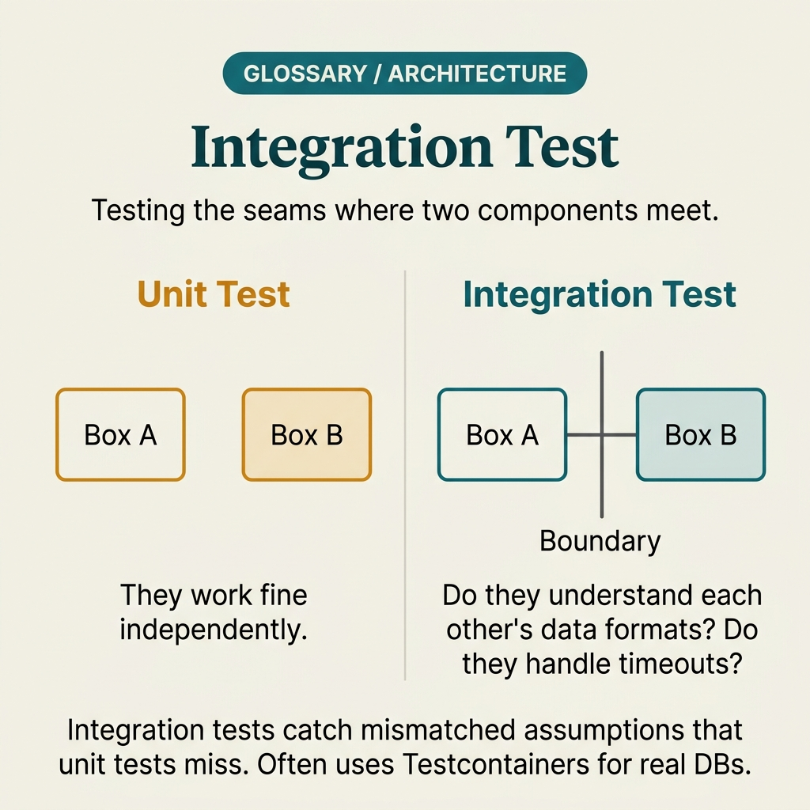

<!-- tags: glossary, reference, testing-quality, integration-test -->
# Integration Test

> A test that confirms multiple modules, services, or resources coordinate correctly, without necessarily traversing the full stack like E2E.

| Aspect | Detail |
| --- | --- |
| **Concept** | A test that confirms multiple modules, services, or resources coordinate correctly, without necessarily traversing the full stack like E2E. |
| **Audience** | Backend engineer, QA engineer, platform engineer |
| **Primary style** | Glossary term |
| **Entry point** | Use when logic is correct in each unit individually, but the real risk lies at the boundary between services, DB, queue, or modules coordinating with each other. |

📅 Created: 2026-03-30 · 🔄 Updated: 2026-04-04 · ⏱️ 9 min read

---

## 1. DEFINE

Picture every module passing its unit tests, but when you wire the repository, service, and transaction together, events do not get published or data commits in the wrong order. Integration test was born to check this "wired together" part before E2E or production discover it instead.

**Integration Test** is a test that confirms multiple modules, services, or resources coordinate correctly, without necessarily traversing the full stack like E2E.

| Variant | Description |
| --- | --- |
| Module integration | Wires multiple layers within the same service, such as controller-service-repository. |
| Resource integration | Checks interaction with DB, cache, queue, or filesystem. |
| Service integration | Checks coordination between a few services or bounded contexts through real or near-real adapters. |

| Approach | Time | Space | When to choose |
| --- | --- | --- | --- |
| In-process integration | O(n calls) | O(test fixtures) | When multiple layers in the same service need to go through real dependencies. |
| Ephemeral dependency integration | O(setup + assertions) | O(dep state) | When you need a real DB/queue/cache in the test. |
| Contracted service integration | O(service interactions) | O(mocks + fixtures) | When some out-of-scope dependencies need intentional stubs. |

Core insight:

> Integration test protects the spots where unit tests are typically blind: wiring configuration, transaction boundaries, serialization, schema mismatch, and interaction between real components.

### 1.1 Invariants & Failure Modes

The integration test invariant is that it must wire exactly the components with real risky boundaries. If dependencies are all over-faked, the test goes green falsely; if the entire system is pulled in, the test becomes slow and loses focus.

---

## 2. CONTEXT

**Who uses it**: Backend engineer, QA engineer, platform engineer

**When**: Use when logic is correct in each unit individually, but the real risk lies at the boundary between services, DB, queue, or modules coordinating with each other.

**Purpose**: Integration test protects the spots where unit tests are typically blind: wiring configuration, transaction boundaries, serialization, schema mismatch, and interaction between real components.

**In the ecosystem**:
- Integration test is broader than unit test but narrower than E2E.
- Integration test differs from contract test because it runs real coordination, not just interface promise verification.
- If an integration test pulls in the browser, auth callback, and a long external workflow, it has already slid into E2E territory.

---

Testing boundaries between components is clear. But which integration test needs real dependencies, which uses mocks, and where is the line with E2E?

## 3. EXAMPLES

Integration test surfaces most visibly when unit tests are green but the service calling a real DB produces wrong queries, when mocks are too good and hide serialization errors, or when the team confuses integration with E2E and the suite bloats uncontrollably. The examples below place the pattern into exactly those situations.

### Example 1: Basic — Check module wired to repository and real DB

> **Goal**: Ensure real wiring, queries, and mapping do not break even though unit tests on each layer are green.
> **Approach**: Run the service through the repository with an ephemeral DB or near-real test schema.
> **Example**: Create user service must persist a record and return the correct generated id.
> **Complexity**: Basic

```yaml
integration_case:
  modules:
    - user-service
    - user-repository
    - postgres-test-db
  assert:
    # ✅ Assert both DB state and service return value.
    row_inserted: true
    response_contains_id: true
```

**Why?** Many bugs live in mapping, transaction, migration, or connection config — not in pure business functions. Integration test catches exactly this coupling layer.

**Takeaway**: Basic integration test should wire the few components with truly fragile boundaries — not fake everything.

### Example 2: Intermediate — Confirm side effects between DB and queue/event

> **Goal**: Ensure coordinated behavior like saving data then publishing an event runs in the right order without losing side effects.
> **Approach**: Test the flow through transaction boundaries and near-real async dependencies.
> **Example**: Create order must commit to DB before the outbox/event is dispatched.
> **Complexity**: Intermediate


*Figure: Integration test catches ordering bugs between persistence and messaging that unit tests cannot see.*

```yaml
side_effect_integration:
  flow: create_order
  dependencies:
    - postgres
    - outbox_table
  assertions:
    # ⚠️ If event is emitted before commit, the consumer may read state that does not exist yet.
    order_committed_before_outbox_dispatch: true
    outbox_row_created: true
```

**Why?** Side effect ordering is where unit tests have the hardest time because each layer individually is "correct." Integration test captures the interaction order between persistence and messaging.

**Takeaway**: Intermediate integration test is especially important when workflows have transactions and side effects crossing dependencies.

### Example 3: Advanced — Use integration suite for anti-corruption boundary with external service

> **Goal**: Reduce the risk that an adapter or mapping with an external system is semantically wrong despite green unit tests.
> **Approach**: Stub or sandbox the external service at real protocol level, then assert mapping/invariants at the internal boundary.
> **Example**: Payment adapter receives `authorized` from PSP and maps correctly to internal payment state.
> **Complexity**: Advanced

```yaml
external_boundary_test:
  boundary: payment-adapter
  external_protocol: sandbox_http_contract
  internal_assertions:
    - authorized_maps_to_pending_capture
    - timeout_maps_to_retryable_error
  rule:
    # ✅ Mock at the network/protocol layer, not the internal semantic mapping.
    keep_internal_mapping_real: true
```

**Why?** At boundaries with external systems, errors usually lie in semantic mapping, not just connectivity. Integration test should keep the protocol fairly real while letting internal business mapping run for real.

**Takeaway**: Good advanced integration test targets the anti-corruption boundary precisely — rather than simulating the entire external world.

### Example 4: Expert — Design integration pyramid to avoid overlap with E2E

> **Goal**: Keep integration strong enough without duplicating the role of E2E or contract test.
> **Approach**: Clearly layer module integration, resource integration, and service boundary integration; each layer handles one type of risk.
> **Example**: DB transactions in integration; browser checkout in E2E; API schema promises in contract.
> **Complexity**: Expert

```yaml
integration_strategy:
  module_integration:
    catches: [wiring, repository_mapping]
  resource_integration:
    catches: [schema, transaction, cache_behavior]
  service_boundary_integration:
    catches: [adapter_mapping, side_effect_order]
  delegated_elsewhere:
    contract: api_schema_promises
    e2e: full_user_journeys
```

**Why?** Without clear boundaries, the team will either write integration tests too thin, or abuse them to check everything. A clear integration pyramid with distinct roles keeps the suite fast and meaningful.

**Takeaway**: Expert integration strategy is a scope design problem: right boundary, right risk, no overlap with other layers.

---

## 4. COMPARE




*Figure: Position of integration test between unit test, E2E test, and contract test.*

Integration test sounds like "test everything together." Not quite: integration focuses on the boundary between 2–3 components (service + DB, service + service), not the full user journey like E2E.

### Level 1

```text
component A + component B + real dependency
  -> interact under realistic wiring
  -> assert boundary behavior
```

*Figure: Level 1 shows integration test focuses on where multiple components coordinate, not an isolated function.*

### Level 2

```text
service + repository + database
  -> transaction
  -> event publish / side effect
  -> assert committed state and interaction order
```

*Figure: Level 2 emphasizes integration test is most useful when the boundary has schema, transaction, or side effects prone to breaking.*

### Easy to confuse or cross the boundary

| # | Severity | Mistake | Consequence | Fix |
| --- | --- | --- | --- | --- |
| 1 | 🔴 Fatal | Faking every dependency and still calling it integration | Suite goes green falsely; real boundary still untested | Keep at least the dependency or protocol real at the risky boundary. |
| 2 | 🟡 Common | Pulling browser/full workflow into integration | Suite gets slow and blurs the line with E2E | Set a clear scope on where integration stops. |
| 3 | 🟡 Common | Not asserting side effect order | Race conditions and inconsistency go uncaught | Assert commit/order of effects in flows with transactions or events. |
| 4 | 🔵 Minor | Not categorizing integration tests by risk | Hard to know which suite protects what | Layer into module/resource/service integration. |

### Quick scan

| If you encounter | What to do |
| --- | --- |
| Logic correct in each module but breaks when wired together | Use integration test. |
| You want to test browser and full workflow | Switch to E2E. |
| Risky boundary is DB/event ordering or adapter mapping | Place integration test right there. |

---

## 5. REF

| Resource | Type | Link | Notes |
| --- | --- | --- | --- |
| Martin Fowler - IntegrationTest | Reference | https://martinfowler.com/bliki/IntegrationTest.html | Boundary and role of integration test. |
| Testcontainers | Official | https://testcontainers.com/ | Practical way to run near-real dependencies in tests. |
| Microservices Patterns | Reference | https://microservices.io/patterns/index.html | Many examples of outbox, saga, and service interaction boundaries. |

---

## 6. RECOMMEND

Integration test solves the problem of "do components actually talk to each other correctly?" The next question: how does unit isolation inside work, and what checks contracts between services?

| Expand to | When | Why | File/Link |
| --- | --- | --- | --- |
| Wider journey | When you need to traverse the full user flow from start to finish | E2E is the full-journey layer. | [End-to-End Test](./06-end-to-end-test.md) |
| Narrower interface | When you only need to lock the promise between consumer and provider | Contract test is cheaper than integration for that boundary. | [Contract Test](./04-contract-test.md) |
| Topic hub | When you need to return to the testing taxonomy | Keep context of the full module. | [Testing & Quality](./README.md) |

Back to that green unit test from the beginning — logic correct but the real query hits the wrong column. Now you know: unit test verifies logic; integration test verifies the boundary. Two different layers — skip either and you lose a perspective.

**Links**: [← Previous](./06-end-to-end-test.md) · [→ Next](./08-unit-test.md)
