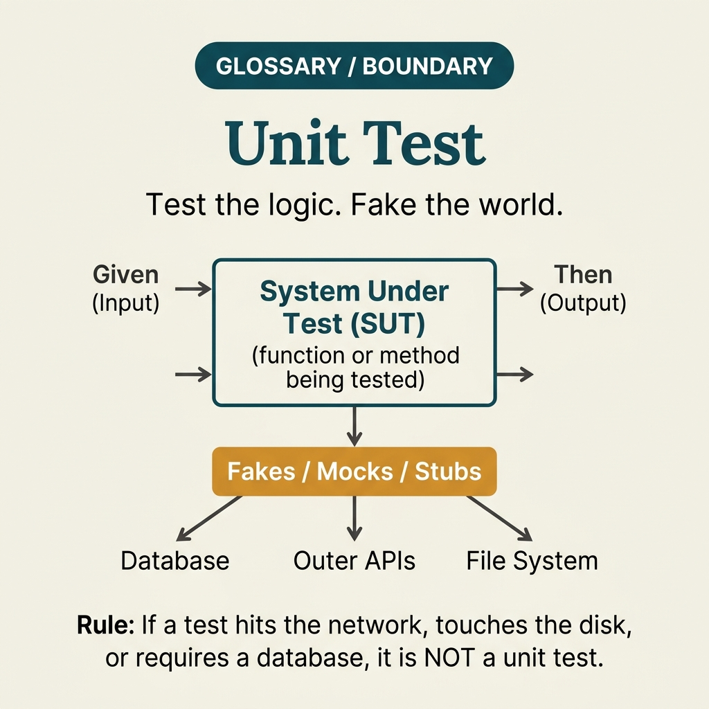

<!-- tags: glossary, reference, testing-quality, unit-test -->
# Unit Test

> A test for the smallest unit of logic, typically isolating dependencies to verify correctness at the function, method, or class level.

| Aspect | Detail |
| --- | --- |
| **Concept** | A test for the smallest unit of logic, typically isolating dependencies to verify correctness at the function, method, or class level. |
| **Audience** | Backend engineer, frontend engineer, reviewer |
| **Primary style** | Glossary term |
| **Entry point** | Use when you need ultra-fast feedback on the smallest piece of logic before pulling in DB, queue, network, or browser. |

📅 Created: 2026-03-30 · 🔄 Updated: 2026-04-04 · ⏱️ 9 min read

---

## 1. DEFINE

Picture this: you change a fee calculation function and want to know in 3 seconds whether the new rounding is correct. No DB needed, no queue, no browser. Unit test exists to protect the smallest logic with the fastest feedback before the cost of testing scales up.

**Unit Test** is a test for the smallest unit of logic, typically isolating dependencies to verify correctness at the function, method, or class level.

| Variant | Description |
| --- | --- |
| Pure function unit test | Tests a pure function with no side effects. |
| Collaborator-isolated unit test | Mocks/fakes dependencies to check only the decision logic of the unit. |
| Property-style unit test | Tests invariants or many input patterns of a single unit. |

| Approach | Time | Space | When to choose |
| --- | --- | --- | --- |
| Deterministic assertions | O(test cases) | O(fixtures) | When logic is pure with clear input/output. |
| Fake/mock collaborators | O(interactions) | O(test doubles) | When the unit depends on external interfaces but you still want fast feedback. |
| Invariant-driven unit testing | O(cases × invariants) | O(fixtures) | When logic has many branches or edge cases like rounding, parsing, or validation. |

Core insight:

> Unit test is optimized for fast feedback and small boundaries. It is strongest when protecting decision logic, but weak when forced to prove wiring or real-dependency behavior.

### 1.1 Invariants & Failure Modes

The invariants of unit test are determinism and speed. When unit tests start depending on real clocks, real randomness, or real network, the suite becomes both slow and untrustworthy.

---

## 2. CONTEXT

**Who uses it**: Backend engineer, frontend engineer, reviewer

**When**: Use when you need ultra-fast feedback on the smallest piece of logic before pulling in DB, queue, network, or browser.

**Purpose**: Unit test is optimized for fast feedback and small boundaries. It is strongest when protecting decision logic, but weak when forced to prove wiring or real-dependency behavior.

**In the ecosystem**:
- Unit test is narrower than integration because it isolates dependencies and only looks at one small logic unit.
- Unit test differs from sanity test: sanity follows the change set; unit test follows the unit boundary.
- If a test boots a DB or goes through real network, it has left unit scope.

---

Test isolation is clear. But which unit is worth testing, which is too trivial, and how much mocking before the test loses value?

## 3. EXAMPLES

Unit test surfaces most visibly when pricing logic is wrong but integration tests do not catch it because mocks are hiding it, when tests are over-coupled to implementation details and every refactor breaks them, or when coverage is 90% but production bugs still slip through. The examples below place the pattern into exactly those situations.

### Example 1: Basic — Protect a pure function with clear input/output

> **Goal**: Get ultra-fast feedback on the smallest logic.
> **Approach**: Pick representative cases and edge cases of a pure function.
> **Example**: `applyDiscount(100000, 10%) -> 90000`, with min 0 and max cap correct.
> **Complexity**: Basic

```yaml
unit_cases:
  function: apply_discount
  cases:
    # ✅ Cover both happy path and nearest boundaries.
    - input: {subtotal: 100000, percent: 10}
      expect: 90000
    - input: {subtotal: 0, percent: 10}
      expect: 0
    - input: {subtotal: 100000, percent: 110}
      expect: 0
```

**Why?** Basic unit test is effective because it isolates pure logic and responds extremely fast. Each time a calculation branch is adjusted, the team knows immediately whether the output changed intentionally or not.

**Takeaway**: Basic unit test should stick to input/output of a small unit and run fast enough that devs want to run it constantly.

### Example 2: Intermediate — Isolate collaborators to check only decision logic

> **Goal**: Test decision branches of the unit without pulling in DB or external services.
> **Approach**: Use fake/mock to return controlled responses so the unit goes through the desired branch.
> **Example**: Auth service receives a fake `userRepo` to test the branch that locks accounts after 5 failures.
> **Complexity**: Intermediate


*Figure: Fake/mock collaborators make the decision logic of the unit testable without booting real infrastructure.*

```yaml
isolated_unit:
  unit: auth-service.login
  fake_dependencies:
    user_repo: returns_locked_user_after_threshold
    clock: fixed_time
  assert:
    # ⚠️ Assert on the unit's decision, not on the fake's internals.
    error: account_locked
    audit_event_emitted: true
```

**Why?** Decision logic usually lies in how the unit reacts to dependencies, not in the dependencies themselves. Fake/mock strips the unit away from the cost of booting external systems while still testing important branches.

**Takeaway**: Intermediate unit test is strong when it isolates collaborators but still lets the unit's decision logic run for real.

### Example 3: Advanced — Use invariants to catch subtle edge cases

> **Goal**: Not just test a few example cases but also preserve general properties of the unit.
> **Approach**: Describe invariants like monotonicity, idempotence, or boundary safety, then build cases around those invariants.
> **Example**: Tax rounding must never produce a negative value, and the rounded invoice total must not deviate by more than the smallest currency unit.
> **Complexity**: Advanced

```yaml
invariant_suite:
  unit: tax_rounding
  invariants:
    - result_never_negative
    - rounded_total_diff_lte_smallest_currency_unit
    - same_input_same_output
  edge_inputs:
    - tiny_amounts
    - half_up_boundaries
    - locale_specific_precision
```

**Why?** Many unit bugs do not appear in a single example but in an invariant broken at a very narrow corner. Writing tests by invariant makes the suite sharper than just adding scattered cases every time a bug appears.

**Takeaway**: Advanced unit test does not just ask "does this case pass?" but also "does the unit still hold its important properties?"

### Example 4: Expert — Design unit suite so it does not confuse its role with integration

> **Goal**: Keep the unit suite ultra-fast, deterministic, and trustworthy as the codebase grows.
> **Approach**: Set clear rules on which dependencies get faked, which must be tested at another layer, and separate suites by speed tiers.
> **Example**: Clock, random, and repository are all injected/faked at unit level; query mapping is deferred to integration.
> **Complexity**: Expert

```yaml
unit_governance:
  allowed_in_unit:
    - pure_logic
    - fake_clock
    - fake_repo_interface
  forbidden_in_unit:
    - real_database
    - network_calls
    - filesystem_side_effects
  suite_goal:
    # ✅ Unit suite must be fast enough to run frequently on every save or every commit.
    median_runtime: sub_minute
```

**Why?** Without governance, the unit suite gradually absorbs real dependencies that are convenient to use. At that point, the suite is both slow and no longer truly unit. Expert practice is protecting this boundary intentionally.

**Takeaway**: Expert unit testing is keeping the boundary small, deterministic, and high-speed so it always remains the team's first feedback layer.

---

## 4. COMPARE




*Figure: Position of unit test between integration test, TDD cycle, and test pyramid.*

Unit test sounds like "test the smallest function." True — but a good unit test tests behavior, not implementation. Too many mocks is a sign the test is verifying code structure, not business logic.

### Level 1

```text
input
  -> single unit of logic
  -> output / decision
(no real network, DB, browser)
```

*Figure: Level 1 shows unit test only looks at one logic unit with dependencies already isolated.*

### Level 2

```text
decision logic
  -> fake/mock collaborators provide controlled responses
  -> unit under test chooses branch
  -> assertions check exact outcome and invariants
```

*Figure: Level 2 emphasizes unit test is strongest at decision logic and edge cases — not real wiring.*

### Easy to confuse or cross the boundary

| # | Severity | Mistake | Consequence | Fix |
| --- | --- | --- | --- | --- |
| 1 | 🔴 Fatal | Unit test touches real DB/network | Suite is slow, flaky, and loses its role as fast feedback | Inject dependencies and fake/mock at the unit layer. |
| 2 | 🟡 Common | Asserting on implementation detail instead of behavior | Harmless refactoring breaks the test | Assert on outcome, decision, and invariant of the unit. |
| 3 | 🟡 Common | Testing only happy path | Important edge cases still slip through | Add boundary cases and invariant-driven cases. |
| 4 | 🔵 Minor | Not clearly separating what belongs to integration | Suites overlap and are hard to reason about | Write clear governance between unit and integration. |

### Quick scan

| If you encounter | What to do |
| --- | --- |
| Need the fastest feedback for small logic | Use unit test. |
| Test is booting real dependencies | You are leaving unit scope. |
| Too few example cases and many edge cases | Add invariant-driven cases. |

---

## 5. REF

| Resource | Type | Link | Notes |
| --- | --- | --- | --- |
| Martin Fowler - UnitTest | Reference | https://martinfowler.com/bliki/UnitTest.html | Boundary and philosophy of unit testing. |
| Google Testing Blog | Reference | https://testing.googleblog.com/ | Posts on small tests and test size strategy. |
| xUnit Test Patterns | Book | https://xunitpatterns.com/ | Practical patterns for isolated tests, fakes, and assertions. |

---

## 6. RECOMMEND

Unit test solves the problem of "is the logic inside correct?" The next question: what checks the boundary outside, and what does writing tests before code bring?

| Expand to | When | Why | File/Link |
| --- | --- | --- | --- |
| Wider layer | When you need to check multiple modules/resources coordinating with each other | Integration test fits better than unit at that boundary. | [Integration Test](./07-integration-test.md) |
| Patch-scope layer | When you just fixed a narrow bug and need to confirm the change set immediately | Sanity test follows the patch better than a pure unit test. | [Sanity Test](./02-sanity-test.md) |
| Topic hub | When you need to return to the testing taxonomy | Keep context of the full module. | [Testing & Quality](./README.md) |

Back to that pricing logic from the beginning — edge case wrong but integration test did not catch it because the mock hid it. Now you know: unit test must test behavior, not "how many times function A calls function B." Test the right behavior and refactoring is free — no tests break.

**Links**: [← Previous](./07-integration-test.md) · [→ Next](./09-load-test.md)
